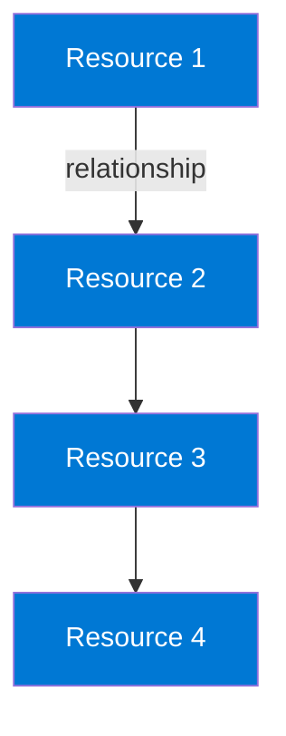

# Hands-on Lab Generator

You are tasked with creating a comprehensive hands-on lab based on an exam question scenario. The lab must follow strict governance standards and produce working, validated infrastructure-as-code.

---

## 🚨 CRITICAL RULES - READ FIRST 🚨

Before creating any lab, understand these **NON-NEGOTIABLE** requirements:

### 1. bicep.ps1 Script (Bicep Labs Only)
**❌ NEVER** create a custom `bicep.ps1` script
**✅ ALWAYS** copy the exact file from `<EXAM>/hands-on-labs/_shared/bicep/bicep.ps1`

```powershell
Copy-Item -Path "<EXAM>/hands-on-labs/_shared/bicep/bicep.ps1" `
          -Destination "<lab-folder>/bicep/bicep.ps1"
```

### 2. README.md Structure
**❌ NEVER** include deployment commands or procedures in README.md
**✅ ALWAYS** use the complete README.md template with ALL required sections

**Forbidden in README:**
- Deployment commands (`terraform apply`, `.\bicep.ps1 apply`)
- Cleanup commands (`terraform destroy`, `az group delete`)
- "Deployment Steps" or "Cleanup" sections
- "Lab Structure" directory trees

**Required in README:**
- Exam Question Scenario
- Scenario Analysis
- Solution Architecture (with diagram if 3+ resources)
- Lab Objectives
- Prerequisites
- Testing the Solution
- Key Learning Points
- Related Exam Objectives
- Additional Resources
- Related Labs

**Reference the README COMPLIANCE CHECKLIST** (in README.md Requirements section) before finalizing.

---

## Exam Context

### Determine Exam

**CRITICAL**: Before starting, determine which exam this lab is for:
1. Check the user's current working directory or file path
2. Look for exam folder in workspace structure (e.g., AZ-104, AI-900, AZ-305)
3. If unclear, ask the user which exam this lab is for

Use the exam identifier throughout (e.g., "AZ-104", "AI-102") and lowercase prefix (e.g., "az104", "ai102").

**Note**: Not all exam folders may have full governance support. Check GOVERNANCE.md for currently supported exams.

### Governance File

**CRITICAL**: Read and strictly follow the governance requirements in:
- `#file:GOVERNANCE.md` (located in workspace root)

The GOVERNANCE.md file is the **single source of truth** for:
- Naming conventions (resource groups, resources, deployment stacks)
- Tagging requirements (all required tags)
- Location policies and allowed regions
- Tool-specific standards (Terraform/Bicep file structure, providers, versions)
- Cost management policies
- Documentation requirements
- Pre-deployment checklist

**Always consult GOVERNANCE.md** for these standards rather than relying on memory or assumptions.

### Exam-Specific Considerations

Different exams focus on different Azure services:

- **AZ-104** (Azure Administrator): Infrastructure resources (VMs, Networks, Storage, Identity)
- **AI-102** (AI Engineer Associate): Azure OpenAI, Cognitive Services, AI solutions, ML models
- **AZ-305** (Azure Solutions Architect): Complex architectures, multi-service integrations
- **DP-203** (Azure Data Engineer): Data Factory, Synapse, Databricks, Storage
- **AZ-400** (DevOps Engineer): Pipelines, Container registries, monitoring, deployment

Adapt resource types and domains accordingly based on the exam context.

---

## Cost Optimization Principles

**CRITICAL**: All labs must use cost-effective resources to minimize Azure spending:

### Virtual Machines
- **Default**: Use `Standard_B2s` (2 vCPU, 4 GB RAM) for general-purpose VMs
- **Minimum**: Use `Standard_B1s` (1 vCPU, 1 GB RAM) for simple scenarios
- **Only use D-series or higher** if the exam question explicitly requires higher performance, memory, or specific capabilities

### Other Resources
- **Storage Accounts**: Use Standard LRS (Locally Redundant Storage) unless redundancy is required
- **Load Balancers**: Use Basic SKU for simple scenarios; Standard SKU only when required
- **Public IPs**: Use Basic SKU unless Standard is required for specific features
- **App Services**: Use Free or Basic tier unless specific features require higher tiers
- **SQL Database**: Use Basic or S0 tier for labs unless performance testing is the objective

### General Guidelines
- Choose the smallest SKU/tier that demonstrates the required functionality
- Use spot instances or reserved capacity only if cost optimization is the learning objective
- Document in README if higher-cost resources are necessary and why

---

## Lab Structure & Coding Standards

### Directory Layout

Create the following structure in `<EXAM>/hands-on-labs/<domain>/lab-<topic>/`:

```
lab-<topic>/
├── README.md
├── terraform/  OR  bicep/
│   ├── main.tf (or main.bicep)           # Orchestration only - calls modules
│   ├── variables.tf (or main.bicepparam)
│   ├── outputs.tf (or outputs.bicep)
│   ├── providers.tf (Terraform only)
│   ├── terraform.tfvars (Terraform - with lab subscription ID)
│   └── modules/                           # Resource modules (when applicable)
│       ├── <resource-group>/              # e.g., networking/, compute/, storage/
│       │   ├── main.tf (or <module>.bicep)
│       │   ├── variables.tf (or parameters in module)
│       │   └── outputs.tf (or outputs in module)
│       └── ...
└── validation/
    └── test-<scenario>.ps1 (optional validation scripts)
```

**Note**: `terraform.tfvars` contains the lab subscription ID and is created for each lab.

### Header Comments

Every file must have a header section:
```
# -------------------------------------------------------------------------
# Program: [filename]
# Description: [what this does]
# Context: <EXAM> Lab - [scenario description]
# Author: Greg Tate
# Date: [YYYY-MM-DD]
# -------------------------------------------------------------------------
```

### Code Style

- Add comments above code blocks separated by blank lines
- Use clear, descriptive names for all resources and variables

---

## Naming & Tagging Standards

**CRITICAL**: Consult `GOVERNANCE.md` for complete naming and tagging specifications.

### Quick Reference

**Resource Group Pattern**: `<exam-prefix>-<domain>-<topic>-<deployment_method>`
- Example: `az104-networking-vnet-peering-tf`

**Resource Naming**: Follow standardized prefixes defined in GOVERNANCE.md
- VNet: `vnet-<name>`, Storage: `st<name>`, VM: `vm-<name>-<instance>`, etc.

**Required Tags**: All resources must include 7 required tags (see GOVERNANCE.md):
- Environment, Project, Domain, Purpose, Owner, DateCreated, DeploymentMethod

**Stack Naming (Bicep)**: `stack-<domain>-<topic>`
- Example: `stack-networking-vnet-peering`

---

## Terraform Requirements

**CRITICAL**: Consult `GOVERNANCE.md` for complete Terraform standards (versions, state management, file structure).

### File Structure Overview

Create these files following GOVERNANCE.md specifications:
- **providers.tf**: Terraform version ≥1.0, azurerm provider ~>4.0, additional providers as needed
- **variables.tf**: Required variables with validation (lab_subscription_id, domain, location, owner)
- **main.tf**: Thin orchestration layer calling modules
- **outputs.tf**: Resource IDs, connection strings, **generated passwords** (sensitive)
- **terraform.tfvars**: Lab subscription ID and overrides (gitignored)
- **modules/**: Logical resource groupings (when ≥3 related resources)

### Key Requirements

**Subscription ID**:
- Always use: `e091f6e7-031a-4924-97bb-8c983ca5d21a`
- Store in `terraform.tfvars` (not committed to git)

**Domain Validation**:
```hcl
variable "domain" {
  description = "<EXAM> exam domain"
  type        = string
  validation {
    condition     = contains([<domain-list>], var.domain)
    error_message = "Domain must be one of valid <EXAM> domains."
  }
}
# Consult GOVERNANCE.md for exam-specific domain lists
```

**Common Tags**:
```hcl
locals {
  common_tags = {
    Environment      = "Lab"
    Project          = "<EXAM>"
    Domain           = title(var.domain)
    Purpose          = replace(title(var.topic), "-", " ")
    Owner            = var.owner
    DateCreated      = formatdate("YYYY-MM-DD", timestamp())
    DeploymentMethod = "Terraform"
  }
}
```

### Credentials and Secrets

**CRITICAL**: For lab environments, automatically generate friendly admin passwords that are easy to type but still meet complexity requirements:

**Terraform**:
- Use `random_integer` to create variation in a friendly password pattern
- Include `random` provider in `required_providers`
- Mark password outputs as `sensitive = true`
- Output passwords so users can access resources

Example:
```hcl
# In providers.tf, add to required_providers:
random = {
  source  = "hashicorp/random"
  version = "~> 3.0"
}

# In main.tf or module:
resource "random_integer" "password_suffix" {
  min = 1000
  max = 9999
}

locals {
  admin_password = "AzureLab${random_integer.password_suffix.result}!"
}

# In outputs.tf:
output "admin_password" {
  description = "Generated admin password for resources (friendly format)"
  value       = local.admin_password
  sensitive   = true
}
```

**Bicep**:
- Use a friendly pattern with minimal variation for easy typing
- Ensure complexity requirements are met (uppercase, lowercase, numbers, special characters)
- Output passwords for user reference

Example:
```bicep
// In main.bicep:
var adminPassword = 'AzureLab${uniqueString(resourceGroup().id, '2026')}!'

// Or for even more friendly:
var adminPassword = 'AzureLab2026!'

// In outputs:
@description('Admin password for resources (friendly format)')
output adminPassword string = adminPassword
```

**Friendly Password Patterns**:
- `AzureLab2026!` - Simple, meets complexity (uppercase, lowercase, numbers, special)
- `LabPassword${variation}!` - Pattern with variation
- `Learning@Azure123` - Descriptive and memorable
- `Demo${year}Pass!` - Year-based variation

**Note**: Since this is a lab environment, these friendly passwords and their outputs are acceptable. In production, use Key Vault and avoid predictable patterns.

### Terraform Modules

**When to create modules**: Use modules when the lab creates **3 or more related resources** within a logical grouping (e.g., networking, compute, storage). For very simple labs with only 1-2 resources total, modules are optional.

**Module structure** — each module in `modules/<group>/`:
- `main.tf` — resource definitions
- `variables.tf` — input variables (tags, location, names, etc.)
- `outputs.tf` — values needed by other modules or root outputs

**Module design principles**:
- Group resources by logical domain: `modules/networking/`, `modules/compute/`, `modules/storage/`, etc.
- Each module should be self-contained — it receives everything it needs via variables
- Pass `common_tags` as a `map(string)` variable and merge with any resource-specific tags
- Keep inter-module dependencies explicit via output references

**Example module call in main.tf**:
```hcl
module "networking" {
  source = "./modules/networking"

  resource_group_name = azurerm_resource_group.lab.name
  location            = var.location
  vnet_name           = "vnet-lab"
  tags                = local.common_tags
}

module "compute" {
  source = "./modules/compute"

  resource_group_name = azurerm_resource_group.lab.name
  location            = var.location
  subnet_id           = module.networking.subnet_id
  vm_size             = "Standard_B2s"
  tags                = local.common_tags
}
```

**Note**: The resource group itself is typically defined in `main.tf` (not in a module) since most modules need its name as an input.

### terraform.tfvars File Structure

Every Terraform lab must include a `terraform.tfvars` file with the lab subscription ID and any overrides:

```hcl
# -------------------------------------------------------------------------
# Program: terraform.tfvars
# Description: Lab-specific variable values for [lab description]
# Context: <EXAM> Lab - [scenario description]
# Author: Greg Tate
# Date: [YYYY-MM-DD]
# -------------------------------------------------------------------------

# Azure lab subscription ID (REQUIRED)
lab_subscription_id = "e091f6e7-031a-4924-97bb-8c983ca5d21a"

# Optional overrides
location = "eastus"
owner    = "Greg Tate"

# Add lab-specific variables as needed
# NOTE: Do NOT add admin passwords - use random_password resource instead
```

### Validation Steps

After generating files, you must run these commands in the terminal and include the output in your response:

```powershell
# CRITICAL: Switch to Lab Azure profile first
Use-AzProfile Lab

# Verify terraform.tfvars exists
Test-Path terraform.tfvars

# Initialize Terraform
terraform init

# Validate configuration
terraform validate

# Format code
terraform fmt

# Show what will be created
terraform plan
```

Confirm these commands succeed before considering the task complete.

**Note**: The terraform.tfvars file should already be created with the lab subscription ID.

---

## Bicep Requirements

**CRITICAL**: Consult `GOVERNANCE.md` for complete Bicep standards (configuration, file structure, parameter files).

**CRITICAL - bicep.ps1 Script**: ALWAYS copy the exact `bicep.ps1` script from `<EXAM>/hands-on-labs/_shared/bicep/bicep.ps1`. DO NOT create a custom version or modify the script. Use the standardized actions: `apply`, `destroy`, `show`, `list`, `validate`, `plan`.

### File Structure Overview

Create these files following GOVERNANCE.md specifications:
- **main.bicep**: Thin orchestration layer with @allowed() decorator for domain, commonTags variable
- **main.bicepparam**: Parameter values (domain, topic, location, owner)
- **modules/*.bicep**: Logical resource groupings (when ≥3 related resources)
- **bicep.ps1**: Deployment wrapper script (**MUST copy exact file from `_shared/bicep/bicep.ps1` - DO NOT create custom version**)

### Key Requirements

**Domain Validation**:
```bicep
@allowed(['identity', 'networking', 'storage', 'compute', 'monitoring'])
param domain string
// Consult GOVERNANCE.md for exam-specific domain lists
```

**Common Tags**:
```bicep
var commonTags = {
  Environment: 'Lab'
  Project: '<EXAM>'
  Domain: toUpper(substring(domain, 0, 1)) + substring(domain, 1)
  Purpose: replace(topic, '-', ' ')
  Owner: owner
  DateCreated: dateCreated
  DeploymentMethod: 'Bicep'
}
```

**Outputs**: Include resource IDs, validation properties, and **generated passwords** (sensitive)

### Module Design

**When to use modules**: ≥3 related resources in logical groupings

**Module principles**:
- Group by domain (networking.bicep, compute.bicep, storage.bicep)
- Self-contained with parameters for all inputs
- Pass commonTags as object parameter, use union() for resource-specific tags
- Explicit dependencies via output references

**Example**:
```bicep
module networking 'modules/networking.bicep' = {
  scope: resourceGroup
  name: 'networking-deployment'
  params: {
    location: location
    vnetName: 'vnet-lab'
    tags: commonTags
  }
}
```

### Deployment Stacks & bicep.ps1

**⚠️ CRITICAL - DO NOT CREATE CUSTOM VERSIONS ⚠️**

**ALWAYS copy the exact bicep.ps1 script** from `<EXAM>/hands-on-labs/_shared/bicep/bicep.ps1` to the lab's `bicep/` folder:

```powershell
Copy-Item -Path "<EXAM>/hands-on-labs/_shared/bicep/bicep.ps1" `
          -Destination "<EXAM>/hands-on-labs/<domain>/lab-<topic>/bicep/bicep.ps1"
```

**DO NOT**:
- ❌ Create a custom version of bicep.ps1
- ❌ Modify the script's action names or behavior
- ❌ Write your own deployment wrapper
- ❌ Use different action names (e.g., 'create'/'delete' instead of 'apply'/'destroy')

**USE ONLY**: The standardized shared script with actions: `apply`, `destroy`, `show`, `list`, `validate`, `plan`

**Stack Naming**: Auto-derived as `stack-<domain>-<topic>` from parameters

**Commands**:
- `.\bicep.ps1 validate` - Validates syntax
- `.\bicep.ps1 plan` - What-if preview
- `.\bicep.ps1 apply` - Deploy stack
- `.\bicep.ps1 destroy` - Remove all resources
- `.\bicep.ps1 show` - Stack details

**Subscription Safety**: Script validates correct lab subscription before operations

### Validation Steps

After generating files, you must run these commands in the terminal and include the output in your response:

```powershell
# CRITICAL: Switch to Lab Azure profile first
Use-AzProfile Lab

# Validate Bicep syntax using bicep.ps1 wrapper
.\bicep.ps1 validate

# Show what will be deployed (what-if/plan)
.\bicep.ps1 plan
```

Confirm these commands succeed before considering the task complete.

---

## README.md Requirements

### ⚠️ CRITICAL README COMPLIANCE CHECKLIST ⚠️

Before finalizing the README.md, verify ALL requirements are met:

#### ✅ MUST INCLUDE (Required Sections):
- [ ] **Exam Question Scenario** - Exact question text with all options (A, B, C, etc.)
- [ ] **Scenario Analysis** - Breakdown of requirements and key concepts
- [ ] **Solution Architecture** - Description of resources and relationships
- [ ] **Architecture Diagram** - Mermaid diagram (if 3+ interconnected resources)
- [ ] **Lab Objectives** - Numbered list of learning objectives (3-5 items)
- [ ] **Prerequisites** - Tools, knowledge, or setup required beyond standard labs
- [ ] **Testing the Solution** - Step-by-step validation procedures
- [ ] **Key Learning Points** - Bullet list of key takeaways (5-8 items)
- [ ] **Related <EXAM> Exam Objectives** - Exam domains/objectives covered
- [ ] **Additional Resources** - Microsoft Learn modules and documentation links
- [ ] **Related Labs** - Links to complementary labs (0-2 labs, ▶ format)

#### ❌ MUST NOT INCLUDE (Forbidden Content):
- [ ] ❌ Deployment commands (`terraform init`, `terraform apply`, `terraform destroy`)
- [ ] ❌ Bicep deployment commands (`.\bicep.ps1 apply`, `.\bicep.ps1 destroy`)
- [ ] ❌ Direct Azure CLI deployment commands (`az deployment group create`)
- [ ] ❌ PowerShell deployment cmdlets (`New-AzResourceGroupDeployment`)
- [ ] ❌ "Cleanup" or "Teardown" sections with deletion commands
- [ ] ❌ "Deployment Steps" sections explaining how to run infrastructure code
- [ ] ❌ "Lab Structure" directory tree diagrams
- [ ] ❌ Step-by-step infrastructure deployment procedures

#### 📋 Why No Deployment Instructions?
- Deployment procedures are **standardized** across all labs
- Fully documented in **GOVERNANCE.md**
- Users familiar with lab structure already know: `.\bicep.ps1 apply` or `terraform apply`
- Keeps README focused on **learning objectives** and **solution architecture**
- Prevents inconsistency across lab documentation

---

## README.md Template

**CRITICAL**: Use this EXACT template structure. Do NOT deviate or create simplified versions.

```markdown
# Lab: [Lab Title]

## Exam Question Scenario

[Paste the original exam question scenario here]

## Scenario Analysis

[Break down what the scenario requires]

## Solution Architecture

[Describe the Azure resources needed and their relationships]

### Architecture Diagram

**When to include**: Add a Mermaid diagram when the lab involves:
- Multiple interconnected Azure resources (3 or more)
- Network topologies (VNets, subnets, peering, NSGs)
- Data flows between services
- Complex dependencies or relationships
- Multi-tier architectures

**When to skip**: Simple labs with 1-2 resources or straightforward single-service scenarios may not need a diagram.



**Example diagram types**:
- `graph TD` (top-down) or `graph LR` (left-right) for resource relationships
- `flowchart` for deployment flows or data pipelines
- `sequenceDiagram` for API interactions or authentication flows

## Lab Objectives

1. [Objective 1]
2. [Objective 2]
3. [Objective 3]

## Prerequisites

[List any prerequisites beyond standard lab setup, such as specific tools, CLI extensions, or prior knowledge required]

## Testing the Solution

[Step-by-step testing procedures to validate the solution works as expected]

## Key Learning Points

- [Learning point 1]
- [Learning point 2]
- [Learning point 3]

## Related <EXAM> Exam Objectives

[List relevant exam objectives this lab covers]

## Additional Resources

- [Relevant Microsoft Learn modules]
- [Azure documentation links]

## Related Labs

**Format for related labs**: Use a simple inline link with a right-pointing triangle (▶) indicator, not an expandable details tab. This keeps the documentation clean and provides quick access to related content.

Example:
```markdown
▶ **Related Lab:** [lab-storage-explorer-permissions](/AZ-104/hands-on-labs/storage/lab-storage-explorer-permissions/README.md)
```

Include related labs where they provide additional context, complementary skills, or demonstrate similar concepts with different resource types. Typically include 0-2 related labs per question/section.
```

---

## Azure Resource Configuration Best Practices

When creating Azure resources, follow these configuration best practices to avoid common deployment errors:

### Load Balancer with Outbound Rules

**CRITICAL**: When configuring Standard Load Balancers with BOTH load balancing rules AND outbound rules that share the same frontend IP configuration:

- **Always set `disableOutboundSnat: true`** on the load balancing rule
- This prevents SNAT port allocation conflicts between the two rule types
- Azure requires this when a frontend IP is referenced by both rule types

Example (Bicep):
```bicep
loadBalancingRules: [
  {
    name: 'my-lb-rule'
    properties: {
      // ... other properties ...
      disableOutboundSnat: true  // REQUIRED when frontend IP is also in outbound rules
    }
  }
]
```

Example (Terraform):
```hcl
resource "azurerm_lb_rule" "example" {
  # ... other properties ...
  disable_outbound_snat = true  # REQUIRED when frontend IP is also in outbound rules
}
```

**Error if omitted**: `LoadBalancingRuleMustDisableSNATSinceSameFrontendIPConfigurationIsReferencedByOutboundRule`

### VMs with Public IPs Cannot Use Load Balancer Outbound Rules

**CRITICAL**: VMs with instance-level public IP addresses **cannot** be in a backend pool that has outbound rules configured.

**Error**: `NicWithPublicIpCannotReferencePoolWithOutboundRule`

**Solution**: Create **two separate backend pools**:
1. **Inbound backend pool**: For load balancing rules (can contain all VMs)
2. **Outbound backend pool**: For outbound rules (only VMs **without** public IPs)

Example (Bicep):
```bicep
backendAddressPools: [
  {
    name: 'backend-inbound'   // All VMs for load balancing
  }
  {
    name: 'backend-outbound'  // Only VMs without public IPs
  }
]

loadBalancingRules: [
  {
    name: 'rule-http'
    properties: {
      backendAddressPool: {
        id: resourceId('...', 'backend-inbound')  // All VMs
      }
      disableOutboundSnat: true
    }
  }
]

outboundRules: [
  {
    name: 'outbound-rule'
    properties: {
      backendAddressPool: {
        id: resourceId('...', 'backend-outbound')  // Only VMs without public IPs
      }
    }
  }
]
```

Example (Terraform):
```hcl
resource "azurerm_lb_backend_address_pool" "inbound" {
  name            = "backend-inbound"
  loadbalancer_id = azurerm_lb.example.id
}

resource "azurerm_lb_backend_address_pool" "outbound" {
  name            = "backend-outbound"
  loadbalancer_id = azurerm_lb.example.id
}

# VM with public IP - only in inbound pool
resource "azurerm_network_interface_backend_address_pool_association" "vm01_inbound" {
  network_interface_id    = azurerm_network_interface.vm01.id
  ip_configuration_name   = "ipconfig1"
  backend_address_pool_id = azurerm_lb_backend_address_pool.inbound.id
}

# VMs without public IPs - in both pools
resource "azurerm_network_interface_backend_address_pool_association" "vm02_inbound" {
  network_interface_id    = azurerm_network_interface.vm02.id
  ip_configuration_name   = "ipconfig1"
  backend_address_pool_id = azurerm_lb_backend_address_pool.inbound.id
}

resource "azurerm_network_interface_backend_address_pool_association" "vm02_outbound" {
  network_interface_id    = azurerm_network_interface.vm02.id
  ip_configuration_name   = "ipconfig1"
  backend_address_pool_id = azurerm_lb_backend_address_pool.outbound.id
}
```

**Why this happens**:
- VMs with public IPs already have a direct path to the internet
- Outbound rules would conflict with this existing route
- Azure prevents this configuration to avoid ambiguity

### Other Common Pitfalls

- **Network Security Groups**: Ensure required ports are open for service functionality (e.g., port 80 for HTTP, 443 for HTTPS)
- **Public IP SKUs**: Standard Load Balancers require Standard SKU public IPs, not Basic
- **Subnet Delegation**: Some services (e.g., Azure Container Instances, Azure Databricks) require subnet delegation
- **Resource Dependencies**: Use explicit `dependsOn` only when implicit dependencies don't capture the relationship

---

## Workflow

1. **Determine exam** from workspace context or prompt user if unclear
2. **Read GOVERNANCE.md** for exam-specific domains, naming conventions, and all compliance requirements
3. **Analyze** the exam question scenario provided
4. **Identify** required Azure resources and their configuration
5. **Create** directory structure under `<EXAM>/hands-on-labs/<domain>/lab-<topic>/`
6. **Copy bicep.ps1** (Bicep labs only) - Use `Copy-Item` to copy the exact shared script from `<EXAM>/hands-on-labs/_shared/bicep/bicep.ps1` to lab's `bicep/` folder. DO NOT create a custom version.
7. **Generate** infrastructure code (Terraform OR Bicep as specified)
   - Apply naming conventions from GOVERNANCE.md
   - Include required tags from GOVERNANCE.md
   - Follow tool-specific standards from GOVERNANCE.md
8. **Create terraform.tfvars** (Terraform only) with lab subscription ID: `e091f6e7-031a-4924-97bb-8c983ca5d21a`
9. **Validate** the code using appropriate tool commands
   - **Terraform**: Run `terraform init`, `terraform validate`, `terraform plan`
   - **Bicep**: Run `.\bicep.ps1 validate`, `.\bicep.ps1 plan`
10. **Create README.md** - Use the EXACT template structure with ALL required sections
   - ✅ Verify against the README COMPLIANCE CHECKLIST (see README.md Requirements section)
   - ✅ Include ALL required sections: Exam Question Scenario, Scenario Analysis, Solution Architecture, Architecture Diagram (if applicable), Lab Objectives, Prerequisites, Testing the Solution, Key Learning Points, Related Exam Objectives, Additional Resources, Related Labs
   - ❌ DO NOT include deployment commands or procedures
   - ❌ DO NOT include cleanup/teardown sections
   - ❌ DO NOT include "Lab Structure" directory trees
11. **Include** validation/testing scripts if complex verification is needed
12. **Verify** all GOVERNANCE.md standards are met - consult the pre-deployment checklist in GOVERNANCE.md

---

## Output Format

After creating the lab, provide:

1. **Lab Summary**: Brief description of what was created
2. **File List**: All files created with their paths
3. **Validation Results**: Output from validation commands
4. **README Compliance**: Confirm all required sections present and forbidden content excluded (reference the README COMPLIANCE CHECKLIST)
5. **Governance Compliance**: Confirm alignment with GOVERNANCE.md standards
6. **Quick Start**: Condensed deployment steps
7. **Next Steps**: Suggestions for additional learning or variations

---

## Example Invocations

```
Create a Terraform hands-on lab for the following AZ-104 exam question:

[Paste exam question here]
```

```
Create a Bicep hands-on lab for the following AI-102 exam question:

[Paste exam question here]
```

### With Context-Based Exam Detection
```
[User is in AZ-104/hands-on-labs/ directory]

Create a Terraform hands-on lab for the following exam question:

[Paste exam question here]
```

### When Exam Cannot Be Determined
If you cannot determine the exam from context or the user's request, ask:

```
Which exam is this lab for? (e.g., AZ-104, AI-102, AZ-305)
```

Then proceed with the appropriate exam-specific configuration.

[Paste exam question here]
```
