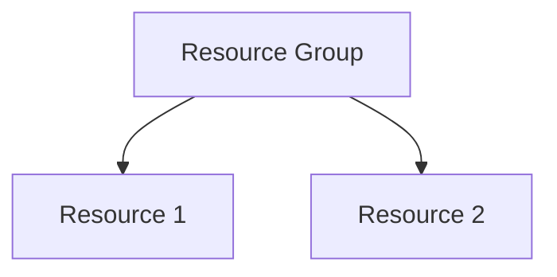

# Lab: [Title]

## Exam Question

> **Exam**: [EXAM] — [Domain]

[Paste verbatim exam question here with all answer options. Do not reveal the correct answer.]

---

## Solution Architecture

[Brief description of the architecture and design decisions.]

---

## Architecture Diagram



> Include Mermaid diagram when 2+ interconnected resources are deployed.

---

## Lab Objectives

1. [Objective 1]
2. [Objective 2]
3. [Objective 3]

---

## Lab Structure

```
lab-<topic>/
├── README.md
├── terraform/
│   ├── main.tf
│   ├── variables.tf
│   ├── outputs.tf
│   ├── providers.tf
│   ├── terraform.tfvars
│   └── modules/
└── validation/
```

---

## Prerequisites

- Azure subscription with required permissions
- Azure CLI installed and authenticated
- Terraform >= 1.0 installed
- PowerShell 7+ with Az module

---

## Deployment

```bash
cd terraform
terraform init
terraform validate
terraform plan
terraform apply
```

---

## Testing the Solution

[Step-by-step validation instructions.]

---

## Cleanup

```bash
terraform destroy -auto-approve
```

> Destroy within 7 days per governance policy.

---

## Scenario Analysis

### Correct Answer: [Letter]

[Explain why this is correct.]

### Why Other Options Are Incorrect

- **[Option]**: [Reasoning]
- **[Option]**: [Reasoning]
- **[Option]**: [Reasoning]

---

## Key Learning Points

1. [Point 1]
2. [Point 2]
3. [Point 3]
4. [Point 4]
5. [Point 5]

---

## Related [EXAM] Objectives

- [Objective reference 1]
- [Objective reference 2]

---

## Additional Resources

- [Resource 1](URL)
- [Resource 2](URL)

---

## Related Labs

- [Related Lab 1](relative-path) — Brief description
