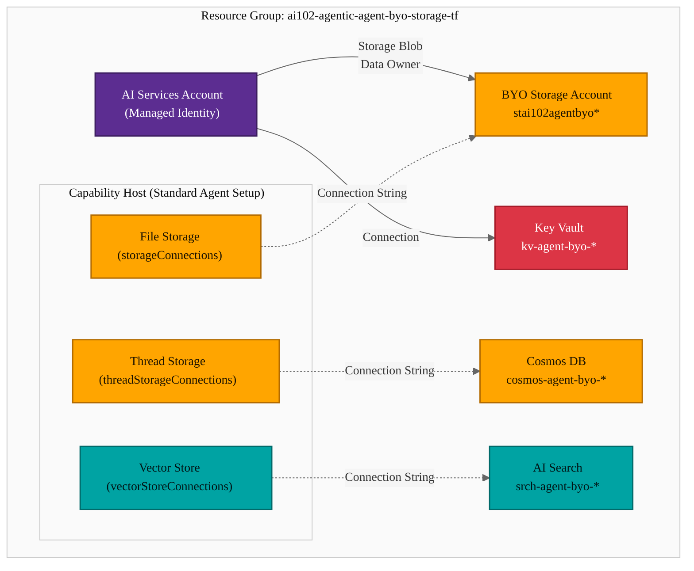
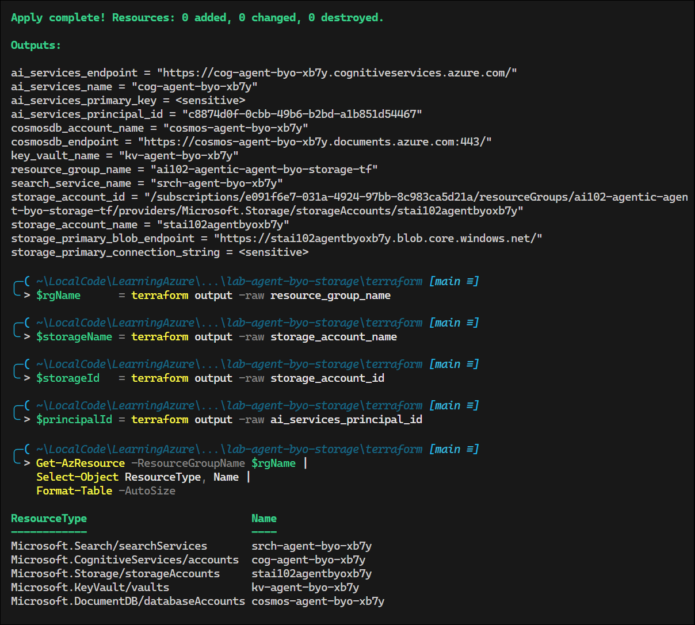

# Azure AI Agent Service — BYO Storage Configuration and RBAC

## Exam Question Scenario

You are investigating an issue where user file uploads to an Azure AI Agent Service are failing after implementing a standard agent setup that uses your own storage account resource. You have confirmed that the Azure Storage account exists and has sufficient capacity. You need to identify the configurations that are causing the upload failure.

**Which two configurations should you identify? Each correct answer presents a complete solution.**

- A. The project-managed identity lacks the Storage Blob Data Owner role on the `<workspaceId>-agents-blobstore` container.
- B. The project-managed identity is assigned the Storage Account Contributor role at the subscription level instead of the storage account.
- C. The Azure AI Search resource assigned to the project's capability host has an incorrect connection string to Azure Storage.
- D. The Azure Storage account connected to the project's capability host is missing a manually created container named `uploaded-files`.
- E. The project's capability host was set with an incorrect connection string to the Azure Storage resource.

---

## Solution Architecture

This lab deploys the infrastructure required for an Azure AI Agent Service **standard agent setup** with bring-your-own (BYO) resources. The standard setup stores all agent data — file uploads, conversation threads, and vector embeddings — in customer-owned Azure resources instead of Microsoft-managed storage.

| Component | Resource | Purpose |
|-----------|----------|---------|
| AI Services | `cog-agent-byo-*` | Foundry account with managed identity for agent operations |
| BYO Storage | `stai102agentbyo*` | File uploads and blob storage for agent files |
| Key Vault | `kv-agent-byo-*` | Secrets management for Foundry account |
| AI Search | `srch-agent-byo-*` | Vector store for agent knowledge retrieval |
| Cosmos DB | `cosmos-agent-byo-*` | Thread storage for conversations and agent metadata |
| RBAC | Storage Blob Data Owner | Data plane access for the managed identity on BYO storage |

---

## Architecture Diagram



---

## Lab Objectives

1. Deploy the BYO infrastructure required for Azure AI Agent Service standard setup
2. Configure the correct RBAC role (Storage Blob Data Owner) for the managed identity
3. Understand the difference between management plane and data plane roles in Azure Storage
4. Verify data plane access to the BYO storage account
5. Identify common misconfigurations that cause agent file upload failures

---

## Lab Structure

```
lab-agent-byo-storage/
├── README.md
├── terraform/
│   ├── main.tf              # All resources: AI Services, Storage, Key Vault, Search, Cosmos DB, RBAC
│   ├── variables.tf          # Input variable declarations
│   ├── outputs.tf            # Resource names, endpoints, connection info
│   ├── providers.tf          # AzureRM + Random providers
│   └── terraform.tfvars      # Lab subscription ID and defaults
└── validation/
    └── validate-agent-storage.ps1  # RBAC and data plane access validation
```

---

## Prerequisites

- Azure subscription with Contributor access
- Azure CLI installed and authenticated
- Terraform >= 1.0 installed
- PowerShell 7+ (for validation script)
- `Az` PowerShell module with `Use-AzProfile` configured

---

## Deployment

```bash
cd AI-102/hands-on-labs/agentic/lab-agent-byo-storage/terraform
Use-AzProfile Lab
terraform init
terraform plan
terraform apply -auto-approve
```

---

## Testing the Solution

Each step below maps to one of the five exam answer options (A–E). You will prove which configurations actually cause file upload failures and which do not.

### Setup — Collect Resource Identifiers

All subsequent steps reference these variables. Run this block first from the Terraform directory:

```powershell
cd AI-102/hands-on-labs/agentic/lab-agent-byo-storage/terraform

# Retrieve resource identifiers from Terraform outputs
$rgName      = terraform output -raw resource_group_name
$storageName = terraform output -raw storage_account_name
$storageId   = terraform output -raw storage_account_id
$principalId = terraform output -raw ai_services_principal_id

# Confirm all resources are deployed
Get-AzResource -ResourceGroupName $rgName |
    Select-Object ResourceType, Name |
    Format-Table -AutoSize
```

<!-- Screenshot -->


---

### 1. Test Answer A (Correct) — Data Plane Access Requires Storage Blob Data Owner

The exam states that file uploads fail when the managed identity lacks `Storage Blob Data Owner`. This step proves that data plane operations — creating containers, uploading blobs, reading them back — require this specific role.

**1a. Confirm the role is assigned:**

```powershell
# Verify Storage Blob Data Owner on the managed identity
Get-AzRoleAssignment -Scope $storageId -PrincipalId $principalId |
    Select-Object RoleDefinitionName, Scope |
    Format-Table -AutoSize
```

<!-- Screenshot -->


**1b. Perform a full data plane roundtrip (create → upload → read → list):**

```powershell
# Create a storage context using Entra ID authentication (data plane)
$ctx = New-AzStorageContext -StorageAccountName $storageName -UseConnectedAccount

# Create a test container (simulates agent auto-creating <workspaceId>-agents-blobstore)
New-AzStorageContainer -Name "test-agent-blobstore" -Context $ctx -Permission Off

# Upload a test blob (simulates a user uploading a file to the agent)
"Agent file upload test — validates data plane access" |
    Out-File -FilePath "test-upload.txt" -Encoding utf8

Set-AzStorageBlobContent -Container "test-agent-blobstore" `
    -File "test-upload.txt" -Blob "test-upload.txt" `
    -Context $ctx -Force

# Read back the blob (simulates the agent retrieving an uploaded file)
Get-AzStorageBlobContent -Container "test-agent-blobstore" `
    -Blob "test-upload.txt" -Destination "test-download.txt" `
    -Context $ctx -Force

Get-Content "test-download.txt"

# List container contents
Get-AzStorageBlob -Container "test-agent-blobstore" -Context $ctx |
    Select-Object Name, Length, LastModified |
    Format-Table -AutoSize
```

<!-- Screenshot -->


All operations succeed because `Storage Blob Data Owner` grants full data plane access. Without this role, every blob operation fails with `AuthorizationPermissionMismatch`, which is exactly the file upload failure described in the exam scenario.

> **Conclusion:** Answer A is **correct**. The managed identity must have `Storage Blob Data Owner` for file uploads to work.

---

### 2. Test Answer B (Wrong) — Storage Account Contributor Has Zero Data Plane Permissions

The exam suggests `Storage Account Contributor` at the wrong scope is the problem. This step proves that **scope is irrelevant** — the role itself has no data plane permissions at any scope.

**2a. Compare the two roles by inspecting their permission sets:**

```powershell
# Retrieve both role definitions
$dataOwner   = Get-AzRoleDefinition "Storage Blob Data Owner"
$contributor = Get-AzRoleDefinition "Storage Account Contributor"

# Storage Account Contributor — management plane actions only
Write-Host "`n--- Storage Account Contributor ---" -ForegroundColor Yellow
Write-Host "Actions (Management Plane):" -ForegroundColor Cyan
$contributor.Actions |
    Where-Object { $_ -like '*storage*' } |
    ForEach-Object { Write-Host "  $_" }

Write-Host "`nDataActions (Data Plane):" -ForegroundColor Cyan
if ($contributor.DataActions.Count -eq 0) {
    Write-Host "  (none — cannot read, write, or delete blobs)" -ForegroundColor Red
}

# Storage Blob Data Owner — data plane actions
Write-Host "`n--- Storage Blob Data Owner ---" -ForegroundColor Green
Write-Host "Actions (Management Plane):" -ForegroundColor Cyan
$dataOwner.Actions | ForEach-Object { Write-Host "  $_" }

Write-Host "`nDataActions (Data Plane):" -ForegroundColor Cyan
$dataOwner.DataActions | ForEach-Object { Write-Host "  $_" }
```

<!-- Screenshot -->


**2b. Demonstrate that management plane operations work but data plane operations require a different role:**

```powershell
# Management plane: reading storage account properties works with Contributor
$storage = Get-AzStorageAccount -ResourceGroupName $rgName -Name $storageName
Write-Host "Account Kind:  $($storage.Kind)"
Write-Host "SKU:           $($storage.Sku.Name)"
Write-Host "Access Tier:   $($storage.AccessTier)"
Write-Host "Blob Endpoint: $($storage.PrimaryEndpoints.Blob)"

# These are management plane reads — they work because we have subscription-level access.
# But blob operations (create/upload/read/delete) require DataActions, which
# Storage Account Contributor does not have.
```

<!-- Screenshot -->


The `DataActions` list for `Storage Account Contributor` is empty. It cannot perform any blob operations — no reads, no writes, no deletes — regardless of whether it is scoped to the subscription or the storage account.

> **Conclusion:** Answer B is **wrong**. The issue is not scope (subscription vs. storage account). The issue is that `Storage Account Contributor` is a management plane role with zero data plane permissions.

---

### 3. Test Answer C (Wrong) — AI Search Connection Is Independent of File Uploads

The exam suggests an incorrect AI Search connection string causes file uploads to fail. This step proves that the AI Search connection (`vectorStoreConnections`) is independent of the storage connection (`storageConnections`).

```powershell
# Show each BYO resource and its role in the capability host
$storageEndpoint = terraform output -raw storage_primary_blob_endpoint
$cosmosEndpoint  = terraform output -raw cosmosdb_endpoint
$searchName      = terraform output -raw search_service_name

Write-Host "`n--- Capability Host Connection Mapping ---" -ForegroundColor Cyan

Write-Host "`n  storageConnections → BYO Storage (file uploads)" -ForegroundColor Green
Write-Host "    Endpoint: $storageEndpoint"
Write-Host "    Failure:  Wrong value breaks file uploads (Answer E)"

Write-Host "`n  threadStorageConnections → Cosmos DB (conversations)" -ForegroundColor Green
Write-Host "    Endpoint: $cosmosEndpoint"
Write-Host "    Failure:  Wrong value breaks thread storage (not in question)"

Write-Host "`n  vectorStoreConnections → AI Search (knowledge retrieval)" -ForegroundColor Green
Write-Host "    Endpoint: https://$searchName.search.windows.net"
Write-Host "    Failure:  Wrong value breaks vector search, NOT file uploads"
```

<!-- Screenshot -->


Each BYO resource connects to the capability host through a separate property. The storage connection handles file uploads; the AI Search connection handles vector store operations. A misconfigured AI Search connection would cause vector search failures, not file upload failures.

> **Conclusion:** Answer C is **wrong**. AI Search misconfigurations affect vector operations, not file uploads. These are independent failure domains.

---

### 4. Test Answer D (Wrong) — Agent Service Auto-Creates Containers

The exam suggests that a missing manually created `uploaded-files` container causes failures. This step proves that the agent service creates its own containers automatically — no manual creation is required.

```powershell
# List all containers in the BYO storage account
$ctx = New-AzStorageContext -StorageAccountName $storageName -UseConnectedAccount
$containers = Get-AzStorageContainer -Context $ctx

if ($containers.Count -eq 0) {
    Write-Host "No pre-created containers exist — this is expected." -ForegroundColor Gray
    Write-Host "The agent service was never told to create 'uploaded-files'."
}
else {
    Write-Host "Existing containers:" -ForegroundColor Cyan
    $containers | Select-Object Name, LastModified | Format-Table -AutoSize
}

# The only container is "test-agent-blobstore" from our Step 1 test.
# The agent service auto-creates a container named <workspaceId>-agents-blobstore.
# No manual container creation is needed — the service manages this internally
# as long as the managed identity has Storage Blob Data Owner (data plane access).
```

<!-- Screenshot -->


> **Conclusion:** Answer D is **wrong**. The agent service automatically provisions containers following the pattern `<workspaceId>-agents-blobstore`. There is no requirement to manually create an `uploaded-files` container.

---

### 5. Test Answer E (Correct) — Wrong Storage Connection String Prevents All File Operations

The exam states that an incorrect connection string to the storage resource in the capability host causes failures. This step shows why the storage endpoint must be exact.

```powershell
# The capability host's storageConnections property must point to the correct endpoint.
$correctEndpoint = terraform output -raw storage_primary_blob_endpoint
Write-Host "Correct storage blob endpoint:" -ForegroundColor Green
Write-Host "  $correctEndpoint"

# Demonstrate what happens with a wrong endpoint — the context cannot connect.
# This simulates what the agent service experiences with a misconfigured connection.
try {
    $badCtx = New-AzStorageContext -StorageAccountName "nonexiststorage99999" -UseConnectedAccount
    New-AzStorageContainer -Name "will-fail" -Context $badCtx -Permission Off -ErrorAction Stop
    Write-Host "[UNEXPECTED] Operation succeeded — check your test" -ForegroundColor Red
}
catch {
    Write-Host "`nExpected failure with wrong storage endpoint:" -ForegroundColor Yellow
    Write-Host "  $($_.Exception.Message)" -ForegroundColor Red
}

# With the correct connection, operations work
Write-Host "`nCorrect connection — operations succeed:" -ForegroundColor Green
$goodCtx = New-AzStorageContext -StorageAccountName $storageName -UseConnectedAccount
Get-AzStorageContainer -Context $goodCtx |
    Select-Object Name, LastModified |
    Format-Table -AutoSize
```

<!-- Screenshot -->


When the capability host references the wrong storage account (or a malformed connection), the agent service cannot resolve the endpoint. All file operations — uploads, reads, container creation — fail immediately.

> **Conclusion:** Answer E is **correct**. The capability host's `storageConnections` must point to the correct BYO storage account. A wrong connection string prevents all file operations.

---

### 6. Clean Up Test Resources

```powershell
# Remove the test container and downloaded files from the earlier steps
$ctx = New-AzStorageContext -StorageAccountName $storageName -UseConnectedAccount
Remove-AzStorageContainer -Name "test-agent-blobstore" -Context $ctx -Force
Remove-Item "test-upload.txt", "test-download.txt" -ErrorAction SilentlyContinue
```

### 7. Run Validation Script

```powershell
cd ../validation
.\validate-agent-storage.ps1
```

<!-- Screenshot -->


---

## Cleanup

```bash
cd AI-102/hands-on-labs/agentic/lab-agent-byo-storage/terraform
terraform destroy -auto-approve
```

---

## Scenario Analysis

### Correct Answers: A and E

**A. The project-managed identity lacks the Storage Blob Data Owner role on the `<workspaceId>-agents-blobstore` container.**

The AI Agent Service performs file upload operations through the Azure Storage data plane. The managed identity needs **Storage Blob Data Owner** (a data plane role) to read, write, and manage blobs. Without this role, the identity cannot create containers or upload files, causing upload failures. The agent service automatically creates a container named `<workspaceId>-agents-blobstore` — this requires data plane write access.

**E. The project's capability host was set with an incorrect connection string to the Azure Storage resource.**

The capability host configuration stores the connection to each BYO resource. The `storageConnections` property in the project-level capability host must reference a valid connection name that points to the correct BYO storage account. An incorrect or mismatched connection string means the agent service cannot locate the storage account, causing all file operations to fail.

### Why Other Options Are Wrong

| Option | Why It's Wrong |
|--------|---------------|
| **B. Storage Account Contributor at subscription level** | Storage Account Contributor is a **management plane** role. It allows managing the storage account resource itself (configuration, keys, policies) but does **not** grant data plane access to read or write blob data. Even at the correct scope (storage account instead of subscription), this role cannot perform blob operations. The correct role is **Storage Blob Data Owner** (data plane). |
| **C. AI Search has incorrect connection string to Azure Storage** | Azure AI Search handles **vector storage for retrieval and search**, not file uploads. The AI Search `vectorStoreConnections` property in the capability host is independent of the `storageConnections` property. An incorrect AI Search connection would affect vector search operations, not file uploads. |
| **D. Missing manually created `uploaded-files` container** | The agent service **automatically provisions** two blob storage containers in the BYO storage account — one for files and one for intermediate system data (chunks, embeddings). There is no requirement to manually create a container named `uploaded-files`. The auto-created container follows the pattern `<workspaceId>-agents-blobstore`. |

---

## Key Learning Points

1. **Standard agent setup** stores all agent data in customer-owned resources: Azure Storage (files), Cosmos DB (threads), and AI Search (vectors)
2. **Storage Blob Data Owner** is required for file uploads — this is a **data plane** role that grants read/write/delete access to blob data
3. **Storage Account Contributor** is a **management plane** role that cannot perform blob operations, regardless of scope level
4. **Capability hosts** are configured at both the account and project levels, referencing connection names that must point to the correct BYO resources
5. The agent service **auto-creates** containers (`<workspaceId>-agents-blobstore`) — manual container creation is not required
6. **Connection strings** in the capability host must precisely reference the correct storage account; a wrong connection string prevents all file operations
7. Each BYO resource type serves a distinct purpose: Storage (files), Cosmos DB (threads), AI Search (vectors) — they are independent failure domains
8. Capability hosts cannot be updated in-place; changes require delete and recreate

---

## Related AI-102 Exam Objectives

- **Build an Azure AI Agent Service solution (15-20%)**
  - Configure standard agent setup with BYO resources
  - Assign correct RBAC roles for agent service operations
  - Configure capability hosts at account and project levels
  - Troubleshoot agent file upload and storage connectivity issues
- **Implement Azure AI services (15-20%)**
  - Create and configure Azure AI Services resources with managed identities
  - Configure data plane vs management plane access

---

## Additional Resources

- [Built-in enterprise readiness with standard agent setup](https://learn.microsoft.com/azure/ai-foundry/agents/concepts/standard-agent-setup)
- [Capability hosts concept](https://learn.microsoft.com/azure/ai-foundry/agents/concepts/capability-hosts)
- [Connect to your own storage](https://learn.microsoft.com/azure/ai-foundry/how-to/bring-your-own-azure-storage-foundry)
- [Use Terraform to manage Microsoft Foundry resources](https://learn.microsoft.com/azure/ai-foundry/how-to/create-resource-terraform)
- [Azure Storage RBAC roles](https://learn.microsoft.com/azure/storage/blobs/authorize-access-azure-active-directory)
- [Foundry Terraform samples (GitHub)](https://github.com/azure-ai-foundry/foundry-samples/tree/main/infrastructure/infrastructure-setup-terraform)

---

## Related Labs

- **[Azure AI Agent Service - Essentials: Threads, Files, and Vector Stores](../lab-agent-essentials/README.md)** - Learn core agent service concepts with Microsoft-managed infrastructure

### ▶ Related Labs

- ▶ Related Lab: [lab-agent-essentials](../lab-agent-essentials/README.md)

### ▶ Related Practice Exam Questions

- ▶ Practice Question: [Azure AI Agent Service - RBAC](../../../../practice-exams/ai-102/agent-rbac.md)
- ▶ Practice Question: [Azure AI Agent Service - BYO Storage](../../../../practice-exams/ai-102/byo-storage.md)
