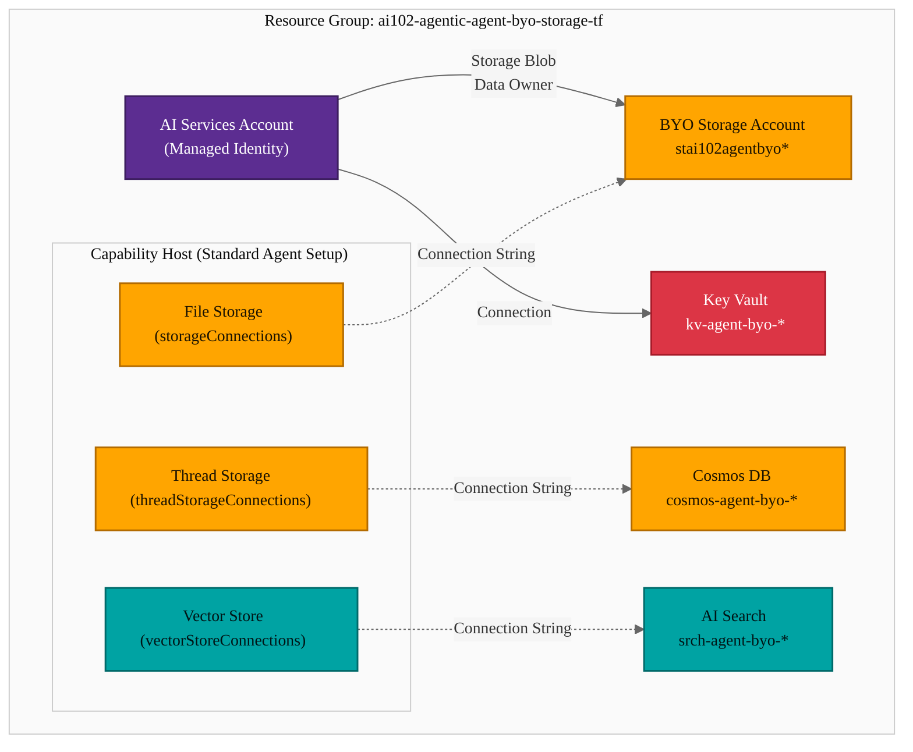

# Azure AI Agent Service — BYO Storage Configuration and RBAC

## Exam Question Scenario

You are investigating an issue where user file uploads to an Azure AI Agent Service are failing after implementing a standard agent setup that uses your own storage account resource. You have confirmed that the Azure Storage account exists and has sufficient capacity. You need to identify the configurations that are causing the upload failure.

**Which two configurations should you identify? Each correct answer presents a complete solution.**

- A. The project-managed identity lacks the Storage Blob Data Owner role on the `<workspaceId>-agents-blobstore` container.
- B. The Azure Storage account connected to the project's capability host is missing a manually created container named `uploaded-files`.
- C. The Azure AI Search resource assigned to the project's capability host has an incorrect connection string to Azure Storage.
- D. The project-managed identity is assigned the Storage Account Contributor role at the subscription level instead of the storage account.
- E. The project's capability host was set with an incorrect connection string to the Azure Storage resource.

---

## Solution Architecture

This lab deploys the infrastructure required for an Azure AI Agent Service **standard agent setup** with bring-your-own (BYO) resources. The standard setup stores all agent data — file uploads, conversation threads, and vector embeddings — in customer-owned Azure resources instead of Microsoft-managed storage.

| Component | Resource | Purpose |
|-----------|----------|---------|
| AI Services | `cog-agent-byo-*` | Foundry account with managed identity for agent operations |
| BYO Storage | `stai102agentbyo*` | File uploads and blob storage for agent files |
| Key Vault | `kv-agent-byo-*` | Secrets management for Foundry account |
| AI Search | `srch-agent-byo-*` | Vector store for agent knowledge retrieval |
| Cosmos DB | `cosmos-agent-byo-*` | Thread storage for conversations and agent metadata |
| RBAC | Storage Blob Data Owner | Data plane access for the managed identity on BYO storage |

---

## Architecture Diagram



---

## Lab Objectives

1. Deploy the BYO infrastructure required for Azure AI Agent Service standard setup
2. Configure the correct RBAC role (Storage Blob Data Owner) for the managed identity
3. Understand the difference between management plane and data plane roles in Azure Storage
4. Verify data plane access to the BYO storage account
5. Identify common misconfigurations that cause agent file upload failures

---

## Lab Structure

```
lab-agent-byo-storage/
├── README.md
├── terraform/
│   ├── main.tf              # All resources: AI Services, Storage, Key Vault, Search, Cosmos DB, RBAC
│   ├── variables.tf          # Input variable declarations
│   ├── outputs.tf            # Resource names, endpoints, connection info
│   ├── providers.tf          # AzureRM + Random providers
│   └── terraform.tfvars      # Lab subscription ID and defaults
└── validation/
    └── validate-agent-storage.ps1  # RBAC and data plane access validation
```

---

## Prerequisites

- Azure subscription with Contributor access
- Azure CLI installed and authenticated
- Terraform >= 1.0 installed
- PowerShell 7+ (for validation script)
- `Az` PowerShell module with `Use-AzProfile` configured

---

## Deployment

```bash
cd AI-102/hands-on-labs/agentic/lab-agent-byo-storage/terraform
Use-AzProfile Lab
terraform init
terraform plan
terraform apply -auto-approve
```

---

## Testing the Solution

### 1. Verify RBAC Role Assignment

Check that Storage Blob Data Owner is assigned to the AI Services managed identity:

```powershell
# Get the managed identity principal ID
$principalId = terraform output -raw ai_services_principal_id
$storageId = terraform output -raw storage_account_id

# List role assignments on the storage account
Get-AzRoleAssignment -Scope $storageId -PrincipalId $principalId |
    Select-Object RoleDefinitionName, Scope |
    Format-Table -AutoSize
```

<!-- Screenshot -->


### 2. Demonstrate Management Plane vs Data Plane

Show that Storage Account Contributor does NOT grant blob access:

```powershell
# Storage Account Contributor = management plane only
# These management operations WOULD work:
$storage = Get-AzStorageAccount -ResourceGroupName (terraform output -raw resource_group_name) `
    -Name (terraform output -raw storage_account_name)
$storage.Sku  # Can read account properties
```

<!-- Screenshot -->


```powershell
# Storage Blob Data Owner = data plane access
# These data plane operations WILL work because the correct role is assigned:
$ctx = New-AzStorageContext -StorageAccountName (terraform output -raw storage_account_name) `
    -UseConnectedAccount

# Create a test container (simulates agent blobstore auto-creation)
New-AzStorageContainer -Name "test-agent-blobstore" -Context $ctx -Permission Off
Get-AzStorageContainer -Context $ctx | Format-Table Name, LastModified
```

<!-- Screenshot -->


### 3. Verify BYO Resource Connections

Confirm all BYO resources are deployed and accessible for capability host connections:

```powershell
$rgName = terraform output -raw resource_group_name

# Storage endpoint (used in storageConnections)
$storageEndpoint = terraform output -raw storage_primary_blob_endpoint
Write-Host "Storage Blob Endpoint: $storageEndpoint"

# Cosmos DB endpoint (used in threadStorageConnections)
$cosmosEndpoint = terraform output -raw cosmosdb_endpoint
Write-Host "Cosmos DB Endpoint: $cosmosEndpoint"

# AI Search name (used in vectorStoreConnections)
$searchName = terraform output -raw search_service_name
Write-Host "AI Search Service: $searchName"
```

<!-- Screenshot -->


### 4. Clean Up Test Container

```powershell
$ctx = New-AzStorageContext -StorageAccountName (terraform output -raw storage_account_name) `
    -UseConnectedAccount
Remove-AzStorageContainer -Name "test-agent-blobstore" -Context $ctx -Force
```

### 5. Run Validation Script

```powershell
cd ../validation
.\validate-agent-storage.ps1
```

<!-- Screenshot -->


---

## Cleanup

```bash
cd AI-102/hands-on-labs/agentic/lab-agent-byo-storage/terraform
terraform destroy -auto-approve
```

---

## Scenario Analysis

### Correct Answers: A and E

**A. The project-managed identity lacks the Storage Blob Data Owner role on the `<workspaceId>-agents-blobstore` container.**

The AI Agent Service performs file upload operations through the Azure Storage data plane. The managed identity needs **Storage Blob Data Owner** (a data plane role) to read, write, and manage blobs. Without this role, the identity cannot create containers or upload files, causing upload failures. The agent service automatically creates a container named `<workspaceId>-agents-blobstore` — this requires data plane write access.

**E. The project's capability host was set with an incorrect connection string to the Azure Storage resource.**

The capability host configuration stores the connection to each BYO resource. The `storageConnections` property in the project-level capability host must reference a valid connection name that points to the correct BYO storage account. An incorrect or mismatched connection string means the agent service cannot locate the storage account, causing all file operations to fail.

### Why Other Options Are Wrong

| Option | Why It's Wrong |
|--------|---------------|
| **B. Missing manually created `uploaded-files` container** | The agent service **automatically provisions** two blob storage containers in the BYO storage account — one for files and one for intermediate system data (chunks, embeddings). There is no requirement to manually create a container named `uploaded-files`. The auto-created container follows the pattern `<workspaceId>-agents-blobstore`. |
| **C. AI Search has incorrect connection string to Azure Storage** | Azure AI Search handles **vector storage for retrieval and search**, not file uploads. The AI Search `vectorStoreConnections` property in the capability host is independent of the `storageConnections` property. An incorrect AI Search connection would affect vector search operations, not file uploads. |
| **D. Storage Account Contributor at subscription level** | Storage Account Contributor is a **management plane** role. It allows managing the storage account resource itself (configuration, keys, policies) but does **not** grant data plane access to read or write blob data. Even at the correct scope (storage account instead of subscription), this role cannot perform blob operations. The correct role is **Storage Blob Data Owner** (data plane). |

---

## Key Learning Points

1. **Standard agent setup** stores all agent data in customer-owned resources: Azure Storage (files), Cosmos DB (threads), and AI Search (vectors)
2. **Storage Blob Data Owner** is required for file uploads — this is a **data plane** role that grants read/write/delete access to blob data
3. **Storage Account Contributor** is a **management plane** role that cannot perform blob operations, regardless of scope level
4. **Capability hosts** are configured at both the account and project levels, referencing connection names that must point to the correct BYO resources
5. The agent service **auto-creates** containers (`<workspaceId>-agents-blobstore`) — manual container creation is not required
6. **Connection strings** in the capability host must precisely reference the correct storage account; a wrong connection string prevents all file operations
7. Each BYO resource type serves a distinct purpose: Storage (files), Cosmos DB (threads), AI Search (vectors) — they are independent failure domains
8. Capability hosts cannot be updated in-place; changes require delete and recreate

---

## Related AI-102 Exam Objectives

- **Build an Azure AI Agent Service solution (15-20%)**
  - Configure standard agent setup with BYO resources
  - Assign correct RBAC roles for agent service operations
  - Configure capability hosts at account and project levels
  - Troubleshoot agent file upload and storage connectivity issues
- **Implement Azure AI services (15-20%)**
  - Create and configure Azure AI Services resources with managed identities
  - Configure data plane vs management plane access

---

## Additional Resources

- [Built-in enterprise readiness with standard agent setup](https://learn.microsoft.com/azure/ai-foundry/agents/concepts/standard-agent-setup)
- [Capability hosts concept](https://learn.microsoft.com/azure/ai-foundry/agents/concepts/capability-hosts)
- [Connect to your own storage](https://learn.microsoft.com/azure/ai-foundry/how-to/bring-your-own-azure-storage-foundry)
- [Use Terraform to manage Microsoft Foundry resources](https://learn.microsoft.com/azure/ai-foundry/how-to/create-resource-terraform)
- [Azure Storage RBAC roles](https://learn.microsoft.com/azure/storage/blobs/authorize-access-azure-active-directory)
- [Foundry Terraform samples (GitHub)](https://github.com/azure-ai-foundry/foundry-samples/tree/main/infrastructure/infrastructure-setup-terraform)

---

## Related Labs

- [Azure AI Content Safety](../ai-services/lab-content-safety/) — Deploys a Cognitive Services account with managed identity, similar RBAC patterns
