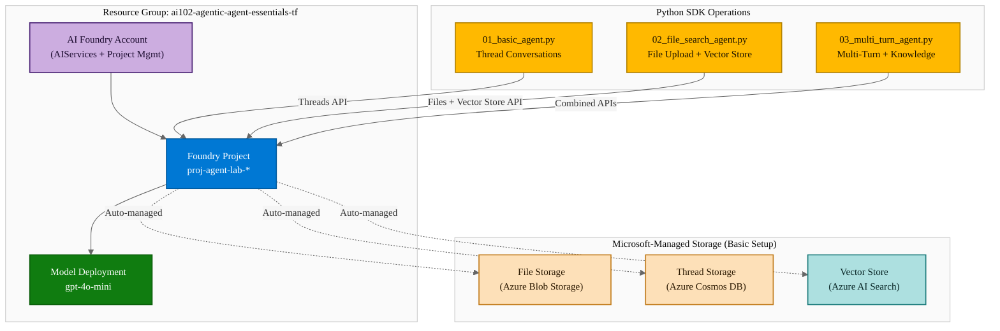
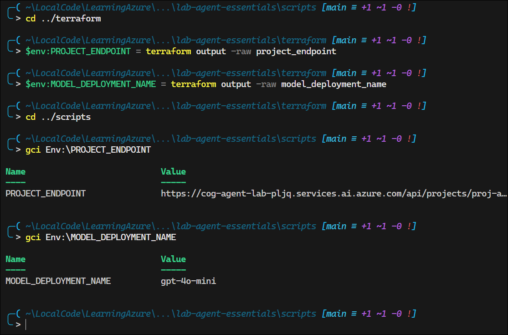
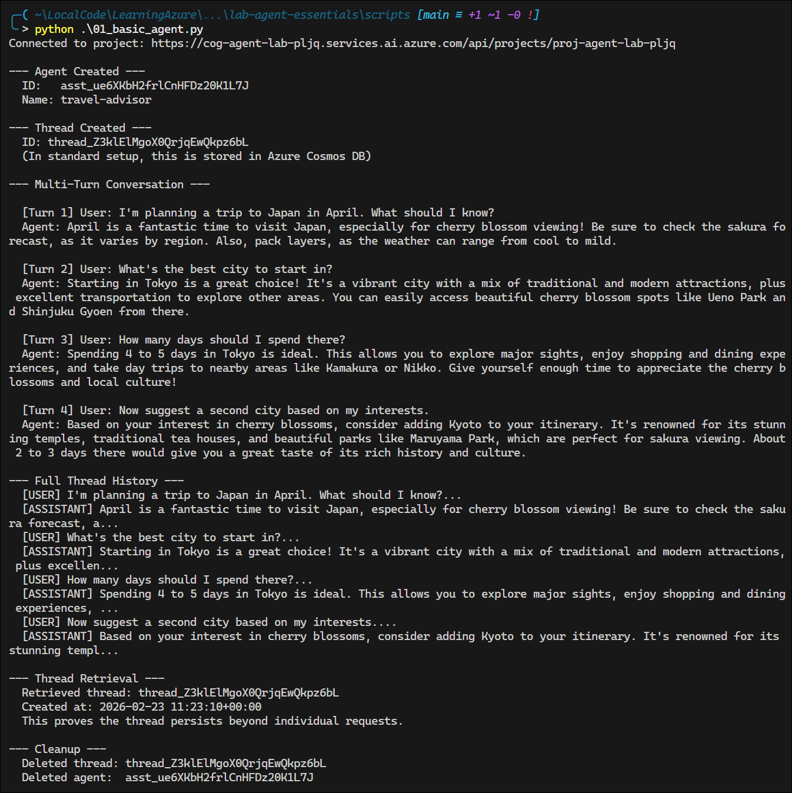
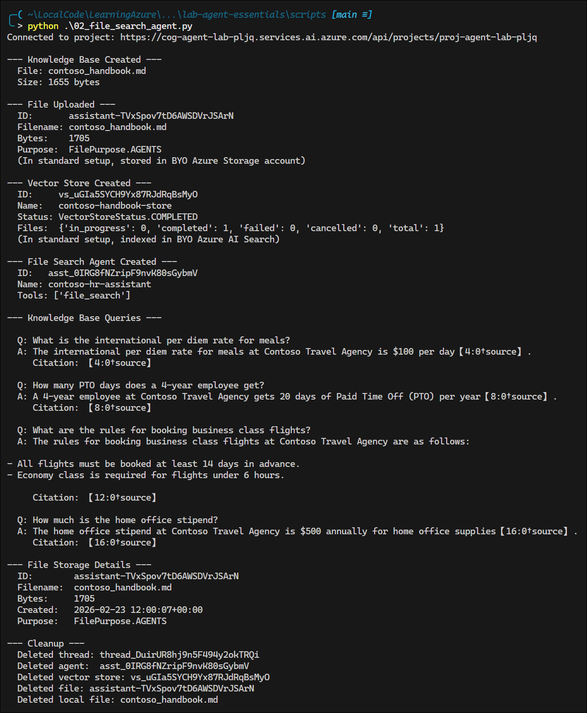
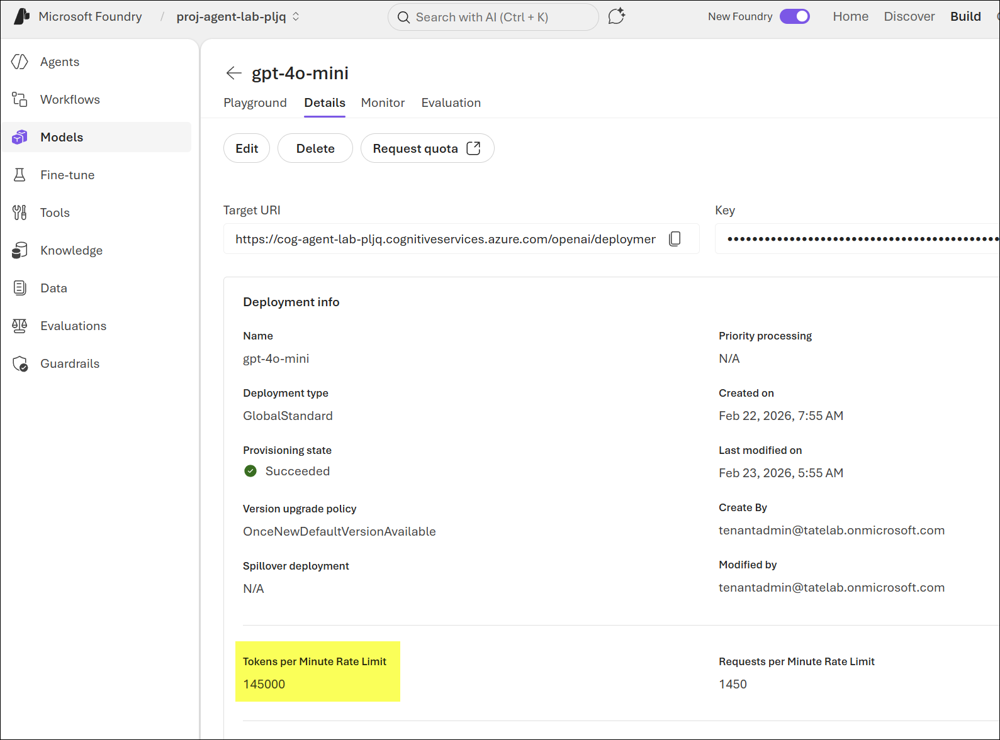

# Azure AI Agent Service — Essentials: Threads, Files, and Vector Stores

## Exam Question Scenario

You are designing an Azure AI Agent Service solution that helps employees search company policies using uploaded documents. The solution must maintain conversation history across multiple interactions and use a vector store for semantic document retrieval.

**Which three Azure resources correspond to the agent service's file storage, thread storage, and vector store components in a standard agent setup?**

- A. Azure Blob Storage, Azure Cosmos DB, Azure AI Search
- B. Azure File Storage, Azure SQL Database, Azure Cognitive Search
- C. Azure Data Lake Storage, Azure Table Storage, Azure AI Search
- D. Azure Blob Storage, Azure Redis Cache, Azure AI Search

---

## Solution Architecture

This lab deploys a **basic agent setup** using Azure AI Foundry to teach core agent service concepts hands-on. The basic setup uses Microsoft-managed infrastructure for file storage, threads, and vector stores — the same SDK operations as a standard setup but without the complexity of BYO resource configuration. Three progressive Python scripts demonstrate threads (conversation state), file upload with vector store search, and multi-turn knowledge retrieval.

| Component | Resource | Purpose |
|-----------|----------|---------|
| AI Foundry Account | `cog-agent-lab-*` | Cognitive Services with project management enabled |
| Foundry Project | `proj-agent-lab-*` | Organizational container for agents, threads, and files |
| Model Deployment | `gpt-4o-mini` | Language model for agent inference (GlobalStandard SKU) |
| RBAC | Cognitive Services User + Contributor | Data plane and management access for the deployer |

---

## Architecture Diagram



---

## Lab Objectives

1. Deploy an Azure AI Foundry account with project management and a model deployment
2. Create an agent and demonstrate threaded conversations that maintain context
3. Upload files to the agent service and create a vector store for semantic search
4. Use the FileSearchTool to enable agents to answer questions from uploaded documents
5. Run a multi-turn conversation combining thread context with knowledge retrieval

---

## Lab Structure

```
lab-agent-essentials/
├── README.md
├── terraform/
│   ├── main.tf              # Foundry account, project, model deployment, RBAC
│   ├── variables.tf          # Input variable declarations
│   ├── outputs.tf            # Resource names, endpoints, model deployment name
│   ├── providers.tf          # AzureRM + Random providers
│   └── terraform.tfvars      # Lab subscription ID and defaults
├── scripts/
│   ├── requirements.txt      # Python SDK dependencies
│   ├── 01_basic_agent.py     # Thread-based conversations
│   ├── 02_file_search_agent.py  # File upload + vector store search
│   └── 03_multi_turn_agent.py   # Multi-turn with knowledge retrieval
└── validation/
    └── validate-agent-essentials.ps1  # Infrastructure validation
```

---

## Prerequisites

- Azure subscription with Contributor access
- Azure CLI installed and authenticated (`az login`)
- Terraform >= 1.0 installed
- Python 3.9+ with pip
- PowerShell 7+ with `Az` module (for validation)

---

## Deployment

```bash
cd AI-102/hands-on-labs/agentic/lab-agent-essentials/terraform
terraform init
terraform plan
terraform apply -auto-approve
```


After deployment, install the Python SDK dependencies:

```bash
cd ../scripts
pip install -r requirements.txt
```

Set environment variables for the Python scripts:

```powershell
cd ../terraform
$env:PROJECT_ENDPOINT = terraform output -raw project_endpoint
$env:MODEL_DEPLOYMENT_NAME = terraform output -raw model_deployment_name
cd ../scripts
```



---

## Testing the Solution

This lab is structured as three progressive exercises. Each script builds on concepts from the previous one.

### Script 1: Thread-Based Conversations (`01_basic_agent.py`)

**Concept**: Threads are persistent conversation sessions that maintain context across messages. In a standard setup, thread state is stored in Azure Cosmos DB.

```powershell
python 01_basic_agent.py
```



**What to observe**:

- The agent is created with specific instructions (travel advisor persona)
- A thread is created — this is a conversation session with a unique ID
- Multiple messages are sent in the same thread, each building on the previous
- The agent's responses reference earlier messages, proving thread context is maintained
- Thread history is retrieved, showing the complete conversation stored in the service

**Key takeaways**:

- Threads persist independently of the agent — the same thread can be reused with different agents
- Each message in a thread is timestamped and attributed to a role (`user` or `assistant`)
- The run operation processes the latest user message against the agent's instructions plus the full thread history

---

### Script 2: File Upload and Vector Store Search (`02_file_search_agent.py`)

**Concept**: Files can be uploaded to the agent service and indexed into vector stores. The FileSearchTool enables agents to retrieve information from uploaded documents. In a standard setup, files are stored in Azure Blob Storage and vector indices live in Azure AI Search.

```powershell
python 02_file_search_agent.py
```



**What to observe**:

- A synthetic "Contoso Employee Handbook" is created and uploaded to the agent service
- A vector store is created from the uploaded file — this chunks the document, generates embeddings, and builds a searchable index
- An agent is created with the `FileSearchTool` attached to the vector store
- Questions targeting specific handbook sections (expense rates, PTO days, flight booking rules) are answered with precise details from the document
- File search annotations (citations) show which parts of the document were retrieved

**Key takeaways**:

- File upload stores raw content; vector store creation processes it for search
- The FileSearchTool automatically performs semantic search during the agent's run
- The agent can cite specific numbers, policies, and details from the uploaded document
- Vector stores can contain multiple files — the search spans all indexed content

**Note**: I initially received an error regarding token rate limits. The default limit for the gpt-4o-mini deployment is 1000 tokens per minute, which is not sufficient for the file processing step. I increased the limit to 145,000, and that resolved the issue.




---

### Script 3: Multi-Turn Conversation with Knowledge Retrieval (`03_multi_turn_agent.py`)

**Concept**: The full agent workflow combines thread context (conversation memory) with file search (knowledge retrieval). The agent must use both thread history and vector store search to answer questions correctly.

```powershell
python 03_multi_turn_agent.py
```


**What to observe**:

- A "Contoso Product FAQ" is uploaded and vectorized
- A multi-turn conversation unfolds with 5 progressive questions:
  1. **"What products does Contoso offer for security?"** — Requires **file search** to find CSS product info
  2. **"What does the Standard tier include?"** — Requires **thread context** (which product) + **file search** (pricing)
  3. **"How does that compare to Premium?"** — Requires **thread context** (Standard tier of CSS) + **file search** (Premium details)
  4. **"We also need data analytics. What do you have?"** — Requires **file search** for CDAP
  5. **"Enterprise on both — total monthly cost?"** — Requires **thread context** (CSS + CDAP) + **file search** (Enterprise pricing)
- The full conversation history is displayed, showing all messages stored in thread storage

**Key takeaways**:

- Thread context and file search work together — the agent resolves ambiguous references ("that product") using thread history, then retrieves facts from the vector store
- Without thread context, the agent would not know which product "Standard tier" refers to
- Without file search, the agent would not know the actual pricing numbers
- This is the pattern most real-world agents use: conversational memory + grounded knowledge

---

### Validation Script

After running the scripts, validate the infrastructure:

```powershell
cd ../validation
.\validate-agent-essentials.ps1
```

The validation script confirms:

- Resource group exists with required tags
- AI Foundry account is provisioned with correct kind (AIServices)
- Foundry project exists under the account
- gpt-4o-mini model deployment is active
- RBAC roles are assigned for the deployer
- Project endpoint is reachable


---

## Cleanup

> Destroy within 7 days per governance policy.

```bash
cd AI-102/hands-on-labs/agentic/lab-agent-essentials/terraform
terraform destroy -auto-approve
```

> **Note**: The AI Foundry account supports soft-delete. If `terraform destroy` fails because the account name is taken on re-deploy, wait for the soft-delete retention period or purge via the Azure portal.

---

## Scenario Analysis

### Correct Answer: A

**A. Azure Blob Storage, Azure Cosmos DB, Azure AI Search**

In a standard agent setup, the three BYO resource types map directly to agent service features:

| Agent Feature | Azure Resource | SDK Operations |
|--------------|----------------|----------------|
| **File Storage** | Azure Blob Storage | `files.upload_and_poll()`, `files.get()`, `files.delete()` |
| **Thread Storage** | Azure Cosmos DB | `threads.create()`, `messages.create()`, `messages.list()` |
| **Vector Store** | Azure AI Search | `vector_stores.create_and_poll()`, FileSearchTool |

The capability host in a standard setup references connections to each of these three resource types: `storageConnections` (Blob Storage), `threadStorageConnections` (Cosmos DB), and `vectorStoreConnections` (AI Search).

### Why Other Options Are Incorrect

| Option | Why It's Wrong |
|--------|---------------|
| **B. Azure File Storage, Azure SQL Database, Azure Cognitive Search** | Azure File Storage (SMB shares) is not used — the agent service uses **Blob Storage** for file operations. Azure SQL Database is not supported for thread storage — Azure **Cosmos DB** is required for its global distribution and low-latency NoSQL capabilities. "Azure Cognitive Search" was the former name; the service is now **Azure AI Search**. |
| **C. Azure Data Lake Storage, Azure Table Storage, Azure AI Search** | Azure Data Lake Storage Gen2 is built on Blob Storage but is designed for big data analytics, not agent file operations. Azure Table Storage is a simple key-value store that lacks the document model, indexing, and global distribution needed for thread storage (Cosmos DB). |
| **D. Azure Blob Storage, Azure Redis Cache, Azure AI Search** | Azure Redis Cache is an in-memory cache, not a durable document store. Thread storage requires persistence, document-oriented storage, and global distribution — capabilities provided by Cosmos DB, not Redis. |

---

## Key Learning Points

1. **Basic vs. standard setup**: Basic setup uses Microsoft-managed storage (no BYO resources); standard setup stores data in your own Azure Blob Storage, Cosmos DB, and AI Search. The Python SDK code is identical for both.
2. **Threads** are persistent conversation sessions that store message history, enabling multi-turn interactions where the agent maintains context across messages.
3. **File storage** in the agent service holds uploaded documents. Files are uploaded via the SDK and stored in Azure Blob Storage (standard setup) or Microsoft-managed storage (basic setup).
4. **Vector stores** process uploaded files by chunking them, generating embeddings, and building a searchable index. This enables semantic retrieval through the FileSearchTool.
5. **FileSearchTool** is attached to an agent at creation time, linking one or more vector stores. The agent automatically performs vector search during runs when answering questions.
6. **Thread context + file search** work together: threads provide conversational memory while file search provides grounded knowledge. Real-world agents typically need both.
7. **RBAC requirements**: The deployer needs Cognitive Services User (data plane) and Cognitive Services Contributor (management) roles on the Foundry account to use the Agent SDK.
8. Each agent resource (agents, threads, files, vector stores) has its own lifecycle and can be created, listed, and deleted independently.

---

## Related AI-102 Exam Objectives

- **Build an Azure AI Agent Service solution (15-20%)**
  - Create and configure agents with tools (FileSearchTool)
  - Manage agent threads and conversation history
  - Upload files and create vector stores for knowledge retrieval
  - Understand basic vs. standard agent setup resource mapping
- **Implement Azure AI services (15-20%)**
  - Create and configure Azure AI Services resources with managed identities
  - Deploy models to Azure AI Foundry

---

## Additional Resources

- [Quickstart: Create an agent](https://learn.microsoft.com/azure/ai-foundry/agents/quickstart)
- [How file search works in Azure AI Agent Service](https://learn.microsoft.com/azure/ai-foundry/agents/concepts/file-search)
- [Standard agent setup with BYO resources](https://learn.microsoft.com/azure/ai-foundry/agents/concepts/standard-agent-setup)
- [Azure AI Agent Service SDK reference](https://learn.microsoft.com/python/api/overview/azure/ai-projects-readme)
- [Use Terraform to manage Microsoft Foundry resources](https://learn.microsoft.com/azure/ai-foundry/how-to/create-resource-terraform)
- [Foundry Terraform samples (GitHub)](https://github.com/azure-ai-foundry/foundry-samples/tree/main/infrastructure/infrastructure-setup-terraform)

---

## Related Labs

- [Azure AI Agent Service — BYO Storage Configuration and RBAC](../lab-agent-byo-storage/README.md) — Deploys the standard agent setup with BYO Azure Storage, Cosmos DB, and AI Search; covers the infrastructure side that this lab abstracts away
