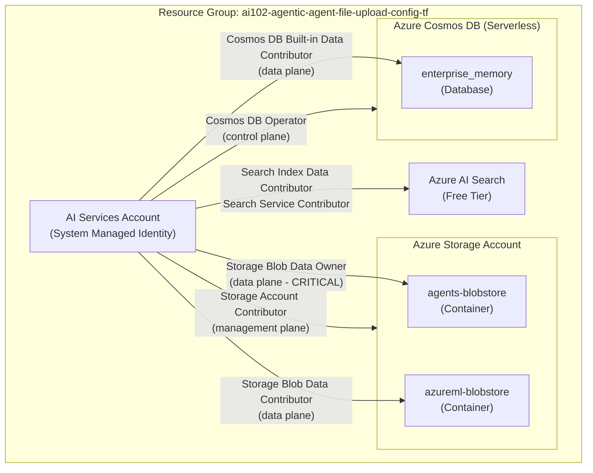

# Azure AI Agent Service File Upload Configuration

## Exam Question Scenario

You are investigating an issue where user file uploads to an Azure AI Agent Service are failing after implementing a standard agent setup that uses your own storage account resource. You have confirmed that the Azure Storage account exists and has sufficient capacity.

You need to identify the configurations that are causing the upload failure.

Which two configurations should you identify? Each correct answer presents a complete solution.

| Statement | Yes | No |
|-----------|-----|----|
| The Azure AI Search resource assigned to the project's capability host has an incorrect connection string to Azure Storage. | ☐ | ☐ |
| The project-managed identity is assigned the Storage Account Contributor role at the subscription level instead of the storage account. | ☐ | ☐ |
| The Azure Storage account connected to the project's capability host is missing a manually created container named uploaded-files. | ☐ | ☐ |
| The project-managed identity lacks the Storage Blob Data Owner role on the -agents-blobstore container. | ☐ | ☐ |
| The project's capability host was set with an incorrect connection string to the Azure Storage resource. | ☐ | ☐ |

---

## Solution Architecture

This lab deploys the complete **standard agent setup** infrastructure for Azure AI Agent Service. The standard setup uses customer-owned Azure resources (Bring Your Own) for storing agent data — including file uploads, conversation threads, and vector stores. The lab demonstrates the correct RBAC role assignments and connection configuration required for agent file uploads to succeed.

| Component | Resource | Purpose |
|-----------|----------|---------|
| AI Services Account | `cog-agent-upload-*` | AI Foundry account with managed identity for agent service |
| Storage Account | `stai102agentupload*` | BYO file storage with agents-blobstore and azureml-blobstore containers |
| Cosmos DB | `cosmos-agent-upload-*` | BYO conversation thread storage (serverless, NoSQL API) |
| AI Search | `srch-agent-upload-*` | BYO vector store for retrieval and search |

---

## Architecture Diagram



---

## Lab Objectives

1. Deploy the standard agent setup infrastructure (Storage, Cosmos DB, AI Search, AI Services)
2. Configure correct RBAC role assignments — including Storage Blob Data Owner on the agents-blobstore container
3. Understand why missing data-plane RBAC roles cause file upload failures
4. Validate that all required role assignments exist using a PowerShell validation script
5. Differentiate between management-plane and data-plane roles for Azure Storage

---

## Lab Structure

```
lab-agent-file-upload-config/
├── README.md
├── terraform/
│   ├── main.tf              # Resource group + module orchestration
│   ├── variables.tf          # Input variable declarations
│   ├── outputs.tf            # Output values
│   ├── providers.tf          # AzureRM + Random providers
│   ├── terraform.tfvars      # Lab subscription ID and defaults
│   └── modules/
│       ├── storage/          # Storage Account + containers + RBAC
│       │   ├── main.tf
│       │   ├── variables.tf
│       │   └── outputs.tf
│       ├── ai-services/      # AI Services account + managed identity
│       │   ├── main.tf
│       │   ├── variables.tf
│       │   └── outputs.tf
│       ├── cosmos-db/        # Cosmos DB for NoSQL + RBAC
│       │   ├── main.tf
│       │   ├── variables.tf
│       │   └── outputs.tf
│       └── ai-search/        # AI Search + RBAC
│           ├── main.tf
│           ├── variables.tf
│           └── outputs.tf
└── validation/
    └── test-agent-file-upload.ps1  # RBAC validation script
```

---

## Prerequisites

- Azure subscription with Contributor access
- Azure CLI installed and authenticated
- Terraform >= 1.0 installed
- PowerShell 7+ (for validation script)
- `Az` PowerShell module with `Use-AzProfile` configured

---

## Deployment

```bash
cd AI-102/hands-on-labs/agentic/lab-agent-file-upload-config/terraform
Use-AzProfile Lab
terraform init
terraform validate
terraform plan
terraform apply -auto-approve
```

---

## Testing the Solution

### 1. Verify RBAC Role Assignments

After deployment, confirm that the AI Services managed identity has the correct RBAC roles:

```powershell
# Get the principal ID from Terraform outputs
$principalId = terraform output -raw ai_services_principal_id
$storageAccountName = terraform output -raw storage_account_name
$rgName = terraform output -raw resource_group_name

# List role assignments for the managed identity
Get-AzRoleAssignment -ObjectId $principalId | Format-Table RoleDefinitionName, Scope -AutoSize
```

### 2. Verify Storage Blob Data Owner on agents-blobstore

This is the **critical** role that the exam question tests. Without it, file uploads fail:

```powershell
$agentsContainer = terraform output -raw agents_blobstore_container
$storageAccount = Get-AzStorageAccount -ResourceGroupName $rgName -Name $storageAccountName
$containerScope = "$($storageAccount.Id)/blobServices/default/containers/$agentsContainer"

# Check for Storage Blob Data Owner at container scope
Get-AzRoleAssignment -ObjectId $principalId -Scope $containerScope |
    Where-Object { $_.RoleDefinitionName -eq 'Storage Blob Data Owner' }
```

### 3. Verify Cosmos DB Roles

```powershell
$cosmosDbName = terraform output -raw cosmos_db_name

# Check Cosmos DB Operator (control plane)
Get-AzRoleAssignment -ObjectId $principalId |
    Where-Object { $_.RoleDefinitionName -eq 'Cosmos DB Operator' }

# Check Cosmos DB Data Contributor (data plane)
Get-AzCosmosDBSqlRoleAssignment -ResourceGroupName $rgName -AccountName $cosmosDbName
```

### 4. Run Validation Script (Optional)

```powershell
cd ../validation
.\test-agent-file-upload.ps1
```

---

## Cleanup

```bash
cd AI-102/hands-on-labs/agentic/lab-agent-file-upload-config/terraform
terraform destroy -auto-approve
```

> **Note:** If Cosmos DB soft-delete is enabled, purge the account manually:
>
> ```bash
> az cosmosdb delete --name <cosmos-name> --resource-group <rg-name>
> ```

---

## Scenario Analysis

### Correct Answers

**Statement 4 — Yes: The project-managed identity lacks the Storage Blob Data Owner role on the -agents-blobstore container.**

The standard agent setup requires specific **data-plane** RBAC roles scoped to individual blob containers. Per Microsoft documentation, the project's managed identity must have:

- **Storage Blob Data Owner** on the `<workspaceId>-agents-blobstore` container — for file uploads and blob data
- **Storage Blob Data Contributor** on the `<workspaceId>-azureml-blobstore` container — for intermediate system data

Without Storage Blob Data Owner on the agents-blobstore container, the managed identity cannot write blob data, and file uploads fail. This is a data-plane role — it provides access to the actual blob data, not just the management of the storage account.

**Statement 5 — Yes: The project's capability host was set with an incorrect connection string to the Azure Storage resource.**

The project-level capability host must reference a valid `storageConnections` property that points to a correctly configured connection to the Azure Storage account. If the connection string or connection name is wrong, the capability host cannot route file upload operations to the storage account, causing all file uploads to fail. This is a configuration issue at the capability host level, not an RBAC issue.

### Incorrect Answers

**Statement 1 — No: Azure AI Search has an incorrect connection string to Azure Storage.**

Azure AI Search's connection string to Azure Storage is relevant for **search indexer data sources** — when AI Search needs to index data from blob storage. This is completely separate from the Agent Service file upload path. File uploads go through the capability host's `storageConnections`, not through AI Search. AI Search handles vector store operations (`vectorStoreConnections`), which is a different data flow than file uploads.

**Statement 2 — No: Storage Account Contributor at subscription level instead of storage account.**

This statement describes a **broader scope** (subscription level), which **includes** the storage account scope. A role assigned at the subscription level applies to all resources within that subscription. This would actually provide **more** access than needed, not less. Additionally, Storage Account Contributor is a **management-plane** role — it manages the storage account configuration but does not grant access to the blob data itself. The actual issue is about the **data-plane** Storage Blob Data Owner role, not the management-plane Storage Account Contributor role.

**Statement 3 — No: Missing a manually created container named uploaded-files.**

The Azure AI Agent Service **automatically provisions** two blob containers when the capability host is created:

- `<workspaceId>-agents-blobstore` — for file uploads and blob data
- `<workspaceId>-azureml-blobstore` — for intermediate system data (chunks, embeddings)

There is no requirement to manually create a container named `uploaded-files`. The container names follow a specific convention using the workspace (project) ID, and they are auto-provisioned by the service.

---

## Key Learning Points

1. **Data-plane vs. management-plane roles** — Storage Account Contributor (management plane) manages the account but does NOT grant access to blob data; Storage Blob Data Owner (data plane) grants actual blob read/write access
2. **Container-scoped RBAC** — The agents-blobstore container specifically requires Storage Blob Data Owner, not just account-level roles
3. **Capability host connections** — The project capability host must reference correct `storageConnections`, `vectorStoreConnections`, and `threadStorageConnections` connection names
4. **Auto-provisioned containers** — The Agent Service creates containers with `<workspaceId>-agents-blobstore` naming; no manual container creation is needed
5. **Broader RBAC scope includes narrower** — Subscription-level role assignments include all resources within that subscription (more permissive, not less)
6. **Standard setup requires BYO resources** — Azure Storage (files), Cosmos DB (threads), and AI Search (vectors) must all be configured with proper RBAC for the project's managed identity
7. **Both control-plane and data-plane roles needed** — Cosmos DB requires both Cosmos DB Operator (control plane) and Cosmos DB Built-in Data Contributor (data plane) for the capability host to function

---

## Related AI-102 Exam Objectives

- **Implement Foundry Agent Service** — Configure agents to use custom storage resources (standard setup)
- **Manage Azure AI Service Resources** — Understand RBAC roles for AI Foundry accounts and projects
- **Implement solutions with Azure AI Search** — Configure search services for agent vector stores
- **Plan and manage Azure AI solutions** — Understand managed identities and role-based access control for AI services

---

## Additional Resources

- [Built-in enterprise readiness with standard agent setup](https://learn.microsoft.com/azure/ai-foundry/agents/concepts/standard-agent-setup)
- [Capability hosts](https://learn.microsoft.com/azure/ai-foundry/agents/concepts/capability-hosts)
- [Use your own resources](https://learn.microsoft.com/azure/ai-foundry/agents/how-to/use-your-own-resources)
- [Set up your environment](https://learn.microsoft.com/azure/ai-foundry/agents/environment-setup)
- [Connect to your own storage](https://learn.microsoft.com/azure/ai-foundry/how-to/bring-your-own-azure-storage-foundry)
- [Azure built-in roles for Storage](https://learn.microsoft.com/azure/role-based-access-control/built-in-roles/storage)
- [Assign an Azure role for access to blob data](https://learn.microsoft.com/azure/storage/blobs/assign-azure-role-data-access)

---

## Related Labs

- None currently available
