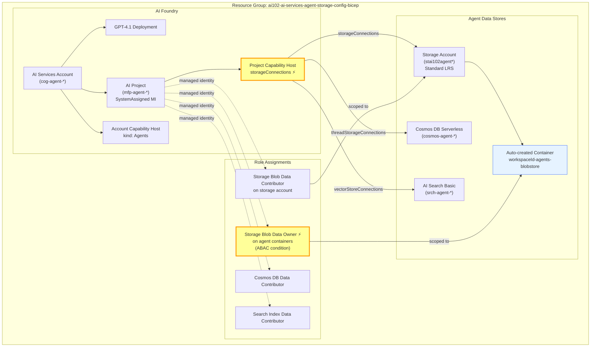

# Azure AI Agent Service - Storage Configuration for File Uploads

## Exam Question Scenario

You are investigating an issue where user file uploads to an Azure AI Agent Service are failing after implementing a standard agent setup that uses your own storage account resource. You have confirmed that the Azure Storage account exists and has sufficient capacity.

You need to identify the configurations that are causing the upload failure.

**Which two configurations should you identify? Each correct answer presents a complete solution.**

- A. The Azure AI Search resource assigned to the project's capability host has an incorrect connection string to Azure Storage.
- B. The project-managed identity is assigned the Storage Account Contributor role at the subscription level instead of the storage account.
- C. The Azure Storage account connected to the project's capability host is missing a manually created container named uploaded-files.
- D. The project-managed identity lacks the Storage Blob Data Owner role on the \<workspaceId\>-agents-blobstore container.
- E. The project's capability host was set with an incorrect connection string to the Azure Storage resource.

---

## Solution Architecture

This lab deploys a complete **Azure AI Agent Service standard setup** with bring-your-own-storage (BYOS) to demonstrate the two critical configurations that enable file uploads: the **Storage Blob Data Owner** role assignment and the **capability host storage connection**.

In a standard agent setup, the AI Agent Service stores all data in customer-owned resources instead of Microsoft-managed storage. Three resource connections are required on the project capability host:

| Component | Resource | Purpose |
|-----------|----------|---------|
| File Storage | Azure Storage Account | Stores user-uploaded files and agent-generated content |
| Thread Storage | Azure Cosmos DB (NoSQL) | Stores conversation history and agent definitions |
| Vector Store | Azure AI Search | Handles embeddings and retrieval for agent search |
| AI Account | Azure AI Services (S0) | Foundry account with project management enabled |
| AI Project | Foundry Project | Workspace with system-assigned managed identity |
| Capability Host | Account + Project scoped | Connects agent service to storage resources |
| RBAC | Role Assignments | Storage Blob Data Owner on agent containers |

---

## Architecture Diagram



> ⚡ Items marked with ⚡ are the two critical configurations tested in the exam question.

---

## Lab Objectives

1. Deploy an Azure AI Agent Service standard setup with bring-your-own-storage (BYOS)
2. Understand how capability host `storageConnections` links the project to the storage account
3. Verify the Storage Blob Data Owner role assignment on agent-specific containers
4. Differentiate between management plane roles (Storage Account Contributor) and data plane roles (Storage Blob Data Owner)
5. Validate the complete agent storage configuration using the test script

---

## Lab Structure

```
lab-agent-storage-config/
├── README.md
├── bicep/
│   ├── main.bicep                         # Subscription-scoped orchestration
│   ├── main.bicepparam                    # Deployment parameters
│   ├── bicep.ps1                          # Deployment wrapper (shared)
│   └── modules/
│       ├── agent-dependencies.bicep       # Storage, Cosmos DB, AI Search
│       ├── ai-foundry.bicep               # AI Account, Model, Project, Connections
│       ├── capability-host.bicep          # Account + Project capability hosts
│       └── role-assignments.bicep         # RBAC (Storage Blob Data Owner + others)
└── validation/
    └── test-agent-storage.ps1             # Validates storage config + roles
```

---

## Prerequisites

- Azure subscription with **Owner** or **Azure AI Account Owner** + **Role Based Access Administrator** permissions
- Azure CLI installed and authenticated (`az login`)
- Bicep CLI (bundled with Azure CLI)
- PowerShell 7+ (for wrapper script and validation)
- `Use-AzProfile` configured with Lab profile targeting subscription `e091f6e7-031a-4924-97bb-8c983ca5d21a`

---

## Deployment

```powershell
cd AI-102/hands-on-labs/ai-services/lab-agent-storage-config/bicep
Use-AzProfile Lab
.\bicep.ps1 validate
.\bicep.ps1 plan
.\bicep.ps1 apply
```

---

## Testing the Solution

### 1. Run the Validation Script

```powershell
cd ../validation
.\test-agent-storage.ps1
```

The script checks:

- Storage account exists with correct configuration (shared key access disabled)
- Storage Blob Data Owner role is assigned to the project's managed identity
- Storage Blob Data Contributor role is assigned at the account level
- Capability host has the correct storage connection configured

### 2. Verify Role Assignments Manually

```powershell
# Get the storage account ID
$storageId = az storage account show `
    --name (az storage account list -g ai102-ai-services-agent-storage-config-bicep --query "[0].name" -o tsv) `
    --resource-group ai102-ai-services-agent-storage-config-bicep `
    --query id -o tsv

# List role assignments on the storage account
az role assignment list --scope $storageId -o table
```

Look for:

- **Storage Blob Data Owner** — the critical role for file uploads (with ABAC condition)
- **Storage Blob Data Contributor** — account-level blob access

### 3. Inspect the Capability Host Configuration

```powershell
# Get account and project names
$rg = 'ai102-ai-services-agent-storage-config-bicep'
$account = az cognitiveservices account list -g $rg --query "[?kind=='AIServices'].name" -o tsv
$project = az rest --method get `
    --url "https://management.azure.com/subscriptions/e091f6e7-031a-4924-97bb-8c983ca5d21a/resourceGroups/$rg/providers/Microsoft.CognitiveServices/accounts/$account/projects?api-version=2025-04-01-preview" `
    --query "value[0].name" -o tsv

# View the project capability host
az rest --method get `
    --url "https://management.azure.com/subscriptions/e091f6e7-031a-4924-97bb-8c983ca5d21a/resourceGroups/$rg/providers/Microsoft.CognitiveServices/accounts/$account/projects/$project/capabilityHosts/caphost-project?api-version=2025-04-01-preview" | ConvertFrom-Json | Select-Object -ExpandProperty properties
```

Verify that `storageConnections` contains the correct storage account connection name.

---

## Cleanup

```powershell
cd AI-102/hands-on-labs/ai-services/lab-agent-storage-config/bicep
.\bicep.ps1 destroy
```

---

## Scenario Analysis

**Correct answers: D and E**

### D. The project-managed identity lacks the Storage Blob Data Owner role on the \<workspaceId\>-agents-blobstore container ✅

When you configure a standard agent setup with BYOS, the AI Agent Service automatically provisions containers in your storage account. These containers follow the naming pattern `<workspaceId>-agents-blobstore` (for files) and `<workspaceId>-agents-intermediate` (for system data). The project's system-assigned managed identity must have the **Storage Blob Data Owner** role on these containers to read and write uploaded files.

In the official Microsoft Bicep template, this role is assigned with an ABAC (Attribute-Based Access Control) condition that restricts the scope to containers whose names start with the project's workspace ID and end with `-azureml-agent`. Without this data plane role, the managed identity cannot perform blob operations, causing file uploads to fail.

### E. The project's capability host was set with an incorrect connection string to the Azure Storage resource ✅

The project-level capability host has a `storageConnections` property that references a named connection to the Azure Storage account. This connection object contains the storage account's blob endpoint URL and resource ID. If this connection string is incorrect (wrong endpoint, wrong storage account, or misconfigured connection), the agent service cannot locate the storage account for file operations, causing uploads to fail.

### Why other options are wrong

**A. The Azure AI Search resource assigned to the project's capability host has an incorrect connection string to Azure Storage.**
Azure AI Search's connection to storage is used for vector store operations (indexing, embeddings, retrieval), not for user file uploads. The AI Search service has its own connection to storage for knowledge mining scenarios, but this is completely separate from the agent service's file upload mechanism. An incorrect AI Search connection would affect search/retrieval functionality, not file uploads.

**B. The project-managed identity is assigned the Storage Account Contributor role at the subscription level instead of the storage account.**
Storage Account Contributor is a **management plane** role that allows managing storage account settings (keys, networking, lifecycle policies). It does **not** grant **data plane** access to read or write blobs. Even if correctly scoped to the storage account (not subscription), this role would not enable file uploads. The required role is **Storage Blob Data Owner** (a data plane role) which grants read/write/delete access to blob data.

**C. The Azure Storage account connected to the project's capability host is missing a manually created container named uploaded-files.**
The Azure AI Agent Service does **not** require a manually created container named `uploaded-files`. Instead, the service **automatically provisions** its own containers following the naming pattern `<workspaceId>-agents-blobstore` and `<workspaceId>-agents-intermediate`. These containers are created by the capability host during setup. No manual container creation is needed.

---

## Key Learning Points

1. **Standard agent setup** uses customer-owned resources (Storage, Cosmos DB, AI Search) instead of Microsoft-managed storage, giving full data sovereignty
2. **Capability hosts** are sub-resources at both account and project scopes that connect the agent service to your Azure resources via named connections
3. The **storageConnections** property on the project capability host must reference a valid connection with the correct storage account endpoint
4. **Storage Blob Data Owner** (data plane role) is required for file uploads, not **Storage Account Contributor** (management plane role)
5. Agent containers (`<workspaceId>-agents-blobstore`) are **auto-provisioned** — no manual container creation is needed
6. ABAC conditions can restrict the Storage Blob Data Owner role to only the agent-specific containers, following least-privilege principles
7. The project's **system-assigned managed identity** is the security principal used for all data plane operations with the storage account
8. Capability host configuration is **immutable** — to change connections, you must delete and recreate the capability host

---

## Related AI-102 Exam Objectives

- **Develop AI agents (15–20%)** — Configure Azure AI Agent Service environments
- **Develop AI agents (15–20%)** — Implement standard agent setup with bring-your-own resources
- **Implement generative AI solutions (30–35%)** — Configure Azure AI Foundry projects and connections

---

## Additional Resources

- [Standard Agent Setup Concept](https://learn.microsoft.com/azure/ai-foundry/agents/concepts/standard-agent-setup)
- [Capability Hosts](https://learn.microsoft.com/azure/ai-foundry/agents/concepts/capability-hosts)
- [Connect to Your Own Storage](https://learn.microsoft.com/azure/ai-foundry/how-to/bring-your-own-azure-storage-foundry)
- [Agent Service Environment Setup](https://learn.microsoft.com/azure/ai-foundry/agents/environment-setup)
- [Official Standard Agent Setup Bicep Template](https://github.com/azure-ai-foundry/foundry-samples/tree/main/infrastructure/infrastructure-setup-bicep/41-standard-agent-setup)
- [RBAC in Microsoft Foundry](https://learn.microsoft.com/azure/ai-foundry/concepts/rbac-foundry)

---

## Related Labs

*(No related labs currently available)*
