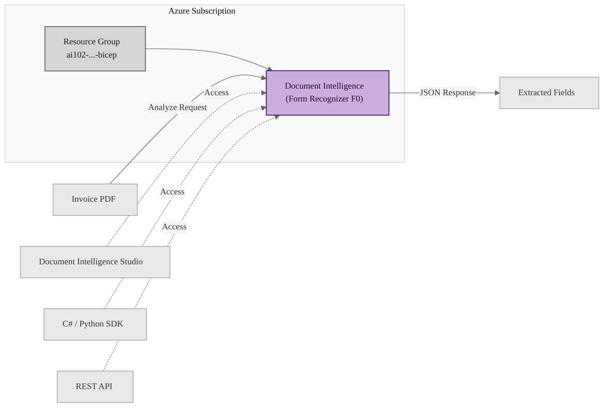

# Lab: Document Intelligence Prebuilt Invoice Model

## Exam Question

> **Exam**: AI-102 — AI Services

### Document Intelligence Invoice Analysis

*Yes / No*

Your company wants to automate the processing of incoming invoices using Azure AI Document Intelligence.

You test the prebuilt invoice model of Azure AI Document Intelligence with a sample invoice.

For each of the following statements, select Yes if the statement is true. Otherwise, select No.

| STATEMENT | YES | NO |
|---|:---:|:---:|
| The results of the invoice analysis can be downloaded in XML format. | ○ | ○ |
| You can access prebuilt invoice model from Document Intelligence Studio. | ○ | ○ |
| You can access prebuilt invoice model from C# Software Development Kit (SDK). | ○ | ○ |

---

## Solution Architecture

This lab deploys an Azure AI Document Intelligence (formerly Form Recognizer) resource using Bicep. Document Intelligence provides prebuilt models — including the invoice model — that extract key fields such as vendor name, invoice total, due date, and line items from invoice documents. The lab demonstrates accessing the prebuilt invoice model via the REST API and verifies that analysis results are returned in JSON format, not XML. Access methods including Document Intelligence Studio and language SDKs are explored through the validation script.

---

## Architecture Diagram



---

## Lab Objectives

1. Deploy Azure AI Document Intelligence (Form Recognizer) using Bicep with governance-compliant naming and tagging
2. Test the prebuilt invoice model by analyzing a sample invoice via the REST API
3. Verify that analysis results are returned in JSON format (not XML)
4. Understand the multiple access methods: Document Intelligence Studio, language SDKs, and REST API

---

## Lab Structure

```
lab-doc-intel-invoice/
├── README.md
├── bicep/
│   ├── main.bicep
│   ├── main.bicepparam
│   ├── document-intelligence.bicep
│   ├── bicep.ps1
│   └── bicepconfig.json
└── validation/
    └── Test-DocumentIntelligence.ps1
```

---

## Prerequisites

- Azure subscription with required permissions
- Azure CLI installed and authenticated
- Bicep CLI installed (bundled with Azure CLI)
- PowerShell 7+ with Az module
- Access to the lab subscription (`e091f6e7-031a-4924-97bb-8c983ca5d21a`)

---

## Deployment

### 1. Navigate to the Bicep directory

```powershell
cd AI-102/hands-on-labs/ai-services/lab-doc-intel-invoice/bicep
```

### 2. Verify subscription context

```powershell
Use-AzProfile Lab
```

### 3. Validate the template

```powershell
.\bicep.ps1 validate
```

### 4. Regional capacity test (Cognitive Services)

```powershell
az provider show --namespace Microsoft.CognitiveServices `
    --query "resourceTypes[?resourceType=='accounts'].locations[]" `
    -o tsv | Select-String 'East US'
```

### 5. Preview the deployment

```powershell
.\bicep.ps1 plan
```

### 6. Deploy

```powershell
.\bicep.ps1 apply
```

---

## Testing the Solution

### Step 1: Verify the Document Intelligence resource exists

```powershell
$outputs = .\bicep.ps1 output
$outputs
```

<!-- Screenshot -->


### Step 2: Verify the resource in the portal

```powershell
# List Cognitive Services accounts in the resource group
Get-AzCognitiveServicesAccount -ResourceGroupName $outputs.resourceGroupName |
    Select-Object AccountName, Kind, Sku, Endpoint
```

<!-- Screenshot -->


### Step 3: Test the prebuilt invoice model via REST API

```powershell
# Retrieve the access key
$key = (Get-AzCognitiveServicesAccountKey `
    -ResourceGroupName $outputs.resourceGroupName `
    -Name $outputs.documentIntelligenceName).Key1

# Submit a sample invoice for analysis
$headers = @{
    'Ocp-Apim-Subscription-Key' = $key
    'Content-Type'               = 'application/json'
}

$body = @{
    urlSource = 'https://raw.githubusercontent.com/Azure-Samples/cognitive-services-REST-api-samples/master/curl/form-recognizer/sample-invoice.pdf'
} | ConvertTo-Json

$endpoint = $outputs.documentIntelligenceEndpoint
$analyzeUri = "${endpoint}documentintelligence/documentModels/prebuilt-invoice:analyze?api-version=2024-11-30"

$response = Invoke-WebRequest -Uri $analyzeUri -Method Post -Headers $headers -Body $body
$operationLocation = $response.Headers['Operation-Location'] | Select-Object -First 1
$operationLocation
```

<!-- Screenshot -->


### Step 4: Retrieve and verify JSON results

```powershell
# Wait for analysis to complete
Start-Sleep -Seconds 5

# Retrieve results (JSON format)
$resultHeaders = @{ 'Ocp-Apim-Subscription-Key' = $key }
$result = Invoke-RestMethod -Uri $operationLocation -Method Get -Headers $resultHeaders
$result.status  # Expected: succeeded
```

<!-- Screenshot -->


```powershell
# Display extracted invoice fields (JSON output)
$result.analyzeResult.documents[0].fields | Format-List
```

<!-- Screenshot -->


### Step 5: Run the full validation script

```powershell
cd ../validation
.\Test-DocumentIntelligence.ps1
```

<!-- Screenshot -->


---

## Cleanup

```powershell
cd ../bicep
.\bicep.ps1 destroy
```

> Destroy within 7 days per governance policy.

**Note:** Azure AI Document Intelligence (Cognitive Services) has a 48-hour soft-delete retention period. If you need to redeploy with the same name, purge the soft-deleted resource first:

```powershell
# List soft-deleted Cognitive Services resources
Get-AzCognitiveServicesAccount -InRemovedState

# Purge a specific resource (if needed)
Remove-AzCognitiveServicesAccount -InRemovedState `
    -Name '<account-name>' `
    -ResourceGroupName '<rg-name>' `
    -Location 'eastus' `
    -Force
```

---

## Scenario Analysis

### Correct Answers

| STATEMENT | ANSWER |
|---|:---:|
| The results of the invoice analysis can be downloaded in XML format. | **No** |
| You can access prebuilt invoice model from Document Intelligence Studio. | **Yes** |
| You can access prebuilt invoice model from C# Software Development Kit (SDK). | **Yes** |

### Statement 1: XML Format — No

Azure AI Document Intelligence returns analysis results exclusively in **JSON format**, not XML. The REST API responds with `Content-Type: application/json`. There is no built-in option to download results in XML format. The JSON response includes structured data with extracted fields, confidence scores, bounding regions, and document metadata.

### Statement 2: Document Intelligence Studio — Yes

Document Intelligence Studio is a web-based portal that provides a no-code interface for testing prebuilt models, including the invoice model. Users can upload documents directly in the browser and see extracted fields with confidence scores. The Studio is accessible at [Document Intelligence Studio](https://documentintelligence.ai.azure.com/).

### Statement 3: C# SDK — Yes

The prebuilt invoice model is accessible through the C# SDK (`Azure.AI.FormRecognizer` or the newer `Azure.AI.DocumentIntelligence` package). The SDK provides strongly-typed classes for invoice fields and supports both synchronous and asynchronous analysis. SDKs are also available for Python, Java, and JavaScript.

---

## Key Learning Points

1. **Azure AI Document Intelligence** (formerly Form Recognizer) provides prebuilt models for common document types including invoices, receipts, ID documents, and business cards
2. **JSON is the only output format** — Document Intelligence does not support XML output; all API responses use JSON
3. **Document Intelligence Studio** provides a no-code web interface for testing prebuilt and custom models without writing code
4. **Multiple SDK support** — Prebuilt models are accessible via C#, Python, Java, and JavaScript SDKs, plus the REST API
5. **F0 (free) tier** is available for Document Intelligence, supporting 500 free pages per month for testing and development
6. **Cognitive Services soft-delete** applies — deleted resources are retained for 48 hours and require unique names or explicit purging before reuse
7. **Prebuilt vs. custom models** — Prebuilt models require no training and work out of the box; custom models require labeled training data for domain-specific documents

---

## Related AI-102 Objectives

- Plan and manage an Azure AI service solution
- Implement and consume Azure AI services
- Process and extract insights from forms and documents using Azure AI Document Intelligence

---

## Additional Resources

- [Azure AI Document Intelligence documentation](https://learn.microsoft.com/azure/ai-services/document-intelligence/overview)
- [Prebuilt invoice model](https://learn.microsoft.com/azure/ai-services/document-intelligence/prebuilt/invoice)
- [Document Intelligence Studio](https://documentintelligence.ai.azure.com/)
- [Document Intelligence C# SDK](https://learn.microsoft.com/dotnet/api/overview/azure/ai.documentintelligence-readme)
- [Document Intelligence REST API](https://learn.microsoft.com/rest/api/aiservices/document-intelligence)

---

## Related Labs

*No related labs at this time.*
