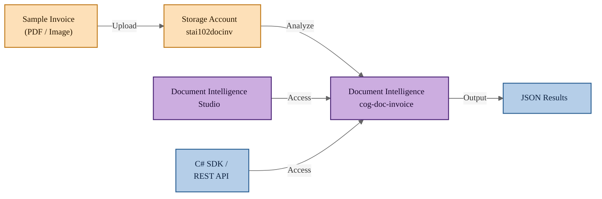

# Lab: Document Intelligence Invoice Model Capabilities

## Exam Question

> **Exam**: AI-102 — Implement knowledge mining and document intelligence solutions

### Document Intelligence Invoice Model Capabilities

*Yes / No*

Your company wants to automate the processing of incoming invoices using Azure AI Document Intelligence.

You test the prebuilt invoice model of Azure AI Document Intelligence with a sample invoice.

For each of the following statements, select Yes if the statement is true. Otherwise, select No.

| Statement | Yes | No |
|-----------|-----|----|
| The results of the invoice analysis can be downloaded in XML format. | ☐ | ☐ |
| You can access prebuilt invoice model from Document Intelligence Studio. | ☐ | ☐ |
| You can access prebuilt invoice model from C# Software Development Kit (SDK). | ☐ | ☐ |

---

## Solution Architecture

This lab deploys an Azure AI Document Intelligence (Form Recognizer) resource to test the prebuilt invoice model. A storage account is provisioned to hold sample invoice documents. The lab demonstrates how to invoke the prebuilt invoice model via the REST API, confirms that results are returned in JSON format (not XML), and validates the available access methods including Document Intelligence Studio and the C# SDK.

---

## Architecture Diagram



---

## Lab Objectives

1. Deploy an Azure AI Document Intelligence (Form Recognizer) resource using Terraform
2. Provision a storage account for storing sample invoice documents
3. Analyze a sample invoice using the prebuilt invoice model via the REST API
4. Verify that analysis results are returned in JSON format (not XML)
5. Confirm available access methods: Document Intelligence Studio, SDK, and REST API

---

## Lab Structure

```
lab-doc-intelligence-invoice/
├── README.md
├── terraform/
│   ├── main.tf
│   ├── variables.tf
│   ├── outputs.tf
│   ├── providers.tf
│   ├── terraform.tfvars
│   └── modules/
│       ├── cognitive/
│       │   ├── main.tf
│       │   ├── variables.tf
│       │   └── outputs.tf
│       └── storage/
│           ├── main.tf
│           ├── variables.tf
│           └── outputs.tf
└── validation/
    └── validate-doc-intelligence.ps1
```

---

## Prerequisites

- Azure subscription with required permissions
- Azure CLI installed and authenticated
- Terraform >= 1.0 installed
- PowerShell 7+ with Az module

---

## Deployment

```powershell
# Switch to the lab subscription
Use-AzProfile Lab
```

```powershell
# Navigate to the terraform directory
cd terraform
```

```powershell
# Verify terraform.tfvars exists
Test-Path terraform.tfvars
```

```powershell
# Initialize Terraform
terraform init
```

```powershell
# Validate configuration syntax
terraform validate
```

```powershell
# Format check
terraform fmt
```

```powershell
# Verify Cognitive Services provider is available in the target region
az provider show --namespace Microsoft.CognitiveServices `
    --query "resourceTypes[?resourceType=='accounts'].locations[]" `
    --output table
```

```powershell
# Review the execution plan
terraform plan
```

```powershell
# Deploy resources
terraform apply
```

---

## Testing the Solution

### Step 1: Verify the Document Intelligence Resource

```powershell
# Get the resource details
$rgName = terraform output -raw resource_group_name
$cogName = terraform output -raw cognitive_account_name
$account = Get-AzCognitiveServicesAccount -ResourceGroupName $rgName -Name $cogName
$account | Format-List Name, Kind, Sku, Endpoint
# Expected: Kind = FormRecognizer, Sku = F0
```

<!-- Screenshot -->

### Step 2: Verify the Storage Account

```powershell
# Get the storage account details
$stName = terraform output -raw storage_account_name
$storage = Get-AzStorageAccount -ResourceGroupName $rgName -Name $stName
$storage | Format-List StorageAccountName, Sku, Location
# Expected: Sku = Standard_LRS
```

<!-- Screenshot -->

### Step 3: Analyze a Sample Invoice via REST API

```powershell
# Get endpoint and key
$endpoint = terraform output -raw cognitive_account_endpoint
$key = terraform output -raw cognitive_account_key

# Use a public sample invoice
$sampleUrl = "https://raw.githubusercontent.com/Azure-Samples/cognitive-services-REST-api-samples/master/curl/form-recognizer/sample-invoice.pdf"

# Build the request
$analyzeUrl = "${endpoint}formrecognizer/documentModels/prebuilt-invoice:analyze?api-version=2023-07-31"
$headers = @{
    'Ocp-Apim-Subscription-Key' = $key
    'Content-Type'              = 'application/json'
}
$body = @{ urlSource = $sampleUrl } | ConvertTo-Json

# Submit the analysis request
$response = Invoke-WebRequest -Uri $analyzeUrl -Method Post -Headers $headers -Body $body
$operationUrl = $response.Headers['Operation-Location']
Write-Host "Operation URL: $operationUrl"
```

<!-- Screenshot -->

### Step 4: Retrieve and Verify JSON Results

```powershell
# Wait for processing to complete
Start-Sleep -Seconds 10

# Get the analysis results
$resultHeaders = @{ 'Ocp-Apim-Subscription-Key' = $key }
$result = Invoke-RestMethod -Uri $operationUrl -Method Get -Headers $resultHeaders

# Verify the response is JSON (not XML)
Write-Host "Response type: $($result.GetType().Name)"
Write-Host "Status: $($result.status)"

# Display extracted invoice fields
$result.analyzeResult.documents[0].fields | Format-List
```

<!-- Screenshot -->

### Step 5: Confirm the Output Format is JSON

```powershell
# Convert result to JSON string to confirm format
$jsonOutput = $result | ConvertTo-Json -Depth 10
Write-Host "Output format: JSON"
Write-Host "First 500 chars of output:"
$jsonOutput.Substring(0, [Math]::Min(500, $jsonOutput.Length))
# Note: There is NO option to download results in XML format
```

<!-- Screenshot -->

### Step 6: Verify Document Intelligence Studio Access

```powershell
# Display the Document Intelligence Studio URL
Write-Host "Document Intelligence Studio URL:"
Write-Host "https://documentintelligence.ai.azure.com/"
Write-Host ""
Write-Host "You CAN access the prebuilt invoice model from Document Intelligence Studio."
Write-Host "Navigate to the URL above, sign in, and select 'Invoices' under Prebuilt models."
```

<!-- Screenshot -->

### Step 7: Run the Validation Script

```powershell
# Run the full validation
cd ../validation
.\validate-doc-intelligence.ps1
```

<!-- Screenshot -->

---

## Cleanup

```powershell
cd ../terraform
terraform destroy -auto-approve
```

> Destroy within 7 days per governance policy.

> **Note:** Cognitive Services resources enter a 48-hour soft-delete state after deletion. The random suffix in the resource name ensures a fresh name on redeployment.

---

## Scenario Analysis

### Correct Answers

| Statement | Answer |
|-----------|--------|
| The results of the invoice analysis can be downloaded in XML format. | **No** |
| You can access prebuilt invoice model from Document Intelligence Studio. | **Yes** |
| You can access prebuilt invoice model from C# Software Development Kit (SDK). | **Yes** |

### Statement 1: XML Format — No

Azure AI Document Intelligence returns analysis results exclusively in **JSON format**. The REST API, SDKs, and Document Intelligence Studio all return JSON responses. There is no native option to export or download results in XML format. If XML output is needed, you would need to write custom code to convert the JSON response to XML.

### Statement 2: Document Intelligence Studio — Yes

**Document Intelligence Studio** (https://documentintelligence.ai.azure.com/) is the web-based interface for Azure AI Document Intelligence. It provides access to all prebuilt models including the invoice model. Users can upload sample documents, test models interactively, and view extracted fields — all without writing code.

### Statement 3: C# SDK — Yes

The **Azure.AI.FormRecognizer** NuGet package provides the C# SDK for Azure AI Document Intelligence. The `DocumentAnalysisClient` class enables programmatic access to all prebuilt models including the invoice model. The SDK is available for multiple languages including C#, Python, Java, and JavaScript.

---

## Key Learning Points

1. Azure AI Document Intelligence returns results in **JSON format only** — XML is not a supported output format
2. **Document Intelligence Studio** provides a no-code web interface for testing prebuilt models including invoices
3. Prebuilt models are accessible via **REST API**, **SDKs** (C#, Python, Java, JavaScript), and **Document Intelligence Studio**
4. The prebuilt invoice model extracts fields like vendor name, invoice date, total amount, and line items automatically
5. Document Intelligence (formerly Form Recognizer) is a Cognitive Services resource of kind `FormRecognizer`
6. The F0 (free) tier supports up to 500 pages per month for testing and development
7. Custom subdomain names are required for token-based authentication and Document Intelligence Studio access
8. Results are returned asynchronously — submit an analysis request, then poll the operation URL for completion

---

## Related AI-102 Objectives

- **Implement knowledge mining and document intelligence solutions**: Plan and implement a Document Intelligence solution
- **Extract data from forms by using Azure AI Document Intelligence**: Use prebuilt models to extract data from documents
- **Implement an Azure AI Document Intelligence solution**: Configure and test prebuilt models

---

## Additional Resources

- [What is Azure AI Document Intelligence?](https://learn.microsoft.com/azure/ai-services/document-intelligence/overview)
- [Prebuilt invoice model](https://learn.microsoft.com/azure/ai-services/document-intelligence/prebuilt/invoice)
- [Document Intelligence Studio](https://documentintelligence.ai.azure.com/)
- [Document Intelligence C# SDK quickstart](https://learn.microsoft.com/azure/ai-services/document-intelligence/quickstarts/get-started-sdks-rest-api)
- [Document Intelligence REST API reference](https://learn.microsoft.com/rest/api/aiservices/document-models/analyze-document)

---

## Related Labs

- [lab-content-safety](../lab-content-safety/README.md) — Azure AI Content Safety text and image moderation
