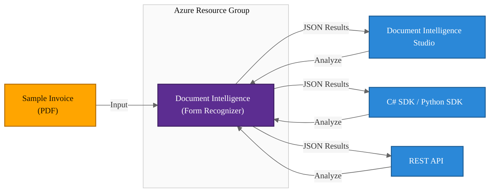

# Azure AI Document Intelligence - Prebuilt Invoice Model

## Exam Question Scenario

Your company wants to automate the processing of incoming invoices using Azure AI Document Intelligence. You test the prebuilt invoice model of Azure AI Document Intelligence with a sample invoice.

**For each of the following statements, select Yes if the statement is true. Otherwise, select No.**

| Statement | Yes / No |
|-----------|----------|
| The results of the invoice analysis can be downloaded in XML format. | |
| You can access prebuilt invoice model from Document Intelligence Studio. | |
| You can access prebuilt invoice model from C# Software Development Kit (SDK). | |

---

## Solution Architecture

This lab deploys an Azure AI Document Intelligence resource to explore the **prebuilt invoice model** capabilities. The prebuilt model extracts key invoice fields (vendor, total, line items, dates) without any training required. You will validate the output format and access methods through the REST API and Document Intelligence Studio.

| Component | Resource | Purpose |
|-----------|----------|---------|
| Document Intelligence | `cog-doc-intelligence-*` | Prebuilt invoice model for document extraction |
| Document Intelligence Studio | Web UI | Interactive portal for testing prebuilt models |

---

## Architecture Diagram



---

## Lab Objectives

1. Deploy an Azure AI Document Intelligence resource using Terraform
2. Analyze a sample invoice using the prebuilt invoice model via REST API
3. Verify that analysis results are returned in **JSON format** (not XML)
4. Explore the prebuilt invoice model in Document Intelligence Studio
5. Understand the access methods available for prebuilt models (Studio, SDKs, REST API)

---

## Lab Structure

```
lab-doc-intelligence-invoice/
├── README.md
├── terraform/
│   ├── main.tf              # Resource group + Document Intelligence account
│   ├── variables.tf          # Input variable declarations
│   ├── outputs.tf            # Endpoint, keys, studio URL
│   ├── providers.tf          # AzureRM + Random providers
│   └── terraform.tfvars      # Lab subscription ID and defaults
└── validation/
    └── test-doc-intelligence-invoice.ps1  # API validation script
```

---

## Prerequisites

- Azure subscription with Contributor access
- Azure CLI installed and authenticated
- Terraform >= 1.0 installed
- PowerShell 7+ (for validation script)
- `Az` PowerShell module with `Use-AzProfile` configured

---

## Deployment

```bash
cd AI-102/hands-on-labs/ai-services/lab-doc-intelligence-invoice/terraform
Use-AzProfile Lab
terraform init
terraform plan
terraform apply -auto-approve
```

---

## Testing the Solution

### 1. Verify Resource Deployment

```powershell
# 1. Confirm the Document Intelligence resource exists
$rgName = terraform output -raw resource_group_name
$diName = terraform output -raw doc_intelligence_name
Get-AzCognitiveServicesAccount -ResourceGroupName $rgName -Name $diName | Format-List AccountName, Kind, Sku, Endpoint
```
<!-- Screenshot -->

### 2. Analyze Invoice via REST API

Retrieve the endpoint and key:

```powershell
# 2. Get endpoint and key from Terraform outputs
$endpoint = terraform output -raw doc_intelligence_endpoint
$key = terraform output -raw doc_intelligence_primary_key
Write-Host "Endpoint: $endpoint"
```
<!-- Screenshot -->

Submit a sample invoice for analysis:

```powershell
# 3. Submit sample invoice to the prebuilt invoice model
$analyzeUri = "${endpoint}/formrecognizer/documentModels/prebuilt-invoice:analyze?api-version=2023-07-31"
$sampleUrl = "https://raw.githubusercontent.com/Azure-Samples/cognitive-services-REST-api-samples/master/curl/form-recognizer/sample-invoice.pdf"

$headers = @{
    'Ocp-Apim-Subscription-Key' = $key
    'Content-Type'              = 'application/json'
}
$body = @{ urlSource = $sampleUrl } | ConvertTo-Json

$response = Invoke-WebRequest -Uri $analyzeUri -Method Post -Headers $headers -Body $body
$operationLocation = $response.Headers['Operation-Location']
Write-Host "Operation submitted. Location: $operationLocation"
```
<!-- Screenshot -->

Poll for results:

```powershell
# 4. Poll for analysis results (JSON format)
Start-Sleep -Seconds 5
$pollHeaders = @{ 'Ocp-Apim-Subscription-Key' = $key }
$result = Invoke-RestMethod -Uri $operationLocation -Method Get -Headers $pollHeaders

# Display the status and output format
Write-Host "Status: $($result.status)"
Write-Host "Output format: JSON (verify - not XML)"
$result | ConvertTo-Json -Depth 2 | Select-Object -First 30
```
<!-- Screenshot -->

### 3. Inspect Extracted Invoice Fields

```powershell
# 5. View extracted invoice fields from the JSON response
$invoice = $result.analyzeResult.documents[0].fields

[PSCustomObject]@{
    VendorName = $invoice.VendorName.content
    InvoiceId  = $invoice.InvoiceId.content
    InvoiceDate = $invoice.InvoiceDate.content
    InvoiceTotal = $invoice.InvoiceTotal.content
    CustomerName = $invoice.CustomerName.content
}
```
<!-- Screenshot -->

### 4. Open Document Intelligence Studio

1. Navigate to [Document Intelligence Studio](https://documentintelligence.ai.azure.com/studio)
2. Sign in with your Azure credentials
3. Under **Prebuilt models**, select **Invoice**
4. Connect your deployed Document Intelligence resource
5. Upload a sample invoice or use the provided samples
6. Click **Analyze** and review the extracted fields
7. Note that results are displayed and downloadable in **JSON format only**

<!-- Screenshot -->

### 5. Run Validation Script (Optional)

```powershell
cd ../validation
.\test-doc-intelligence-invoice.ps1
```
<!-- Screenshot -->

---

## Cleanup

```bash
cd AI-102/hands-on-labs/ai-services/lab-doc-intelligence-invoice/terraform
terraform destroy -auto-approve
```

> **Note:** Document Intelligence (Cognitive Services) has a 48-hour soft-delete retention period. The resource name will be unavailable for reuse during this period. Use `az cognitiveservices account purge` to purge immediately if needed.

---

## Scenario Analysis

### Correct Answers

| Statement | Answer | Explanation |
|-----------|--------|-------------|
| The results of the invoice analysis can be downloaded in XML format. | **No** | Document Intelligence returns results exclusively in **JSON format**. There is no XML output option. The REST API response, SDK return objects, and Studio export all use JSON. |
| You can access prebuilt invoice model from Document Intelligence Studio. | **Yes** | Document Intelligence Studio provides a web-based interface to test all prebuilt models, including the invoice model. You can upload documents, analyze them, and view extracted fields interactively. |
| You can access prebuilt invoice model from C# Software Development Kit (SDK). | **Yes** | The `Azure.AI.DocumentIntelligence` NuGet package (formerly `Azure.AI.FormRecognizer`) provides full C# SDK support for all prebuilt models, including the invoice model. |

### Why XML Is Not Supported

Azure AI Document Intelligence was designed from the ground up to use JSON as its response format. The REST API returns `application/json` content type, and all SDKs (C#, Python, Java, JavaScript) deserialize JSON responses into typed objects. There has never been an XML output option for Document Intelligence.

---

## Key Learning Points

1. **Azure AI Document Intelligence** (formerly Form Recognizer) provides prebuilt models that extract structured data from documents without custom training
2. The **prebuilt invoice model** extracts key fields including vendor name, invoice total, line items, dates, billing/shipping addresses, and tax amounts
3. Analysis results are returned exclusively in **JSON format** — XML is not a supported output format
4. **Document Intelligence Studio** provides an interactive web interface to test all prebuilt models including invoices, receipts, ID documents, and business cards
5. Prebuilt models are accessible via **REST API**, **C# SDK** (`Azure.AI.DocumentIntelligence`), **Python SDK** (`azure-ai-documentintelligence`), **Java SDK**, and **JavaScript SDK**
6. The service is provisioned as a Cognitive Services account with `kind = "FormRecognizer"` and supports F0 (free) and S0 (standard) tiers
7. Document Intelligence uses an **asynchronous analysis pattern**: submit a document, receive an operation URL, then poll for results
8. Cognitive Services accounts are subject to **48-hour soft-delete** retention, requiring unique resource names with random suffixes

---

## Related AI-102 Exam Objectives

- **Implement Azure AI Document Intelligence solutions (10-15%)**
  - Use prebuilt models to extract data from documents
  - Analyze invoices, receipts, ID documents, and business cards
  - Understand supported input formats and output schema
- **Implement Azure AI services (15-20%)**
  - Create and configure Azure AI service resources
  - Manage authentication keys and endpoints

---

## Additional Resources

- [What is Azure AI Document Intelligence?](https://learn.microsoft.com/azure/ai-services/document-intelligence/overview)
- [Document Intelligence Studio](https://documentintelligence.ai.azure.com/studio)
- [Prebuilt invoice model](https://learn.microsoft.com/azure/ai-services/document-intelligence/prebuilt/invoice)
- [Quickstart: Document Intelligence C# SDK](https://learn.microsoft.com/azure/ai-services/document-intelligence/quickstarts/get-started-sdks-rest-api)
- [REST API reference](https://learn.microsoft.com/rest/api/aiservices/document-models/analyze-document)
- [Azure.AI.DocumentIntelligence NuGet](https://www.nuget.org/packages/Azure.AI.DocumentIntelligence)

---

## Related Labs

- **[Azure AI Content Safety - Text and Image Moderation](../lab-content-safety/README.md)** - AI-powered text and image content moderation for sexual content, violence, hate, and self-harm detection

### ▶ Related Labs

- ▶ Related Lab: [lab-content-safety](../lab-content-safety/README.md)

### ▶ Related Practice Exam Questions

- ▶ Practice Question: [Azure AI Document Intelligence - Prebuilt Invoice](../../../../practice-exams/ai-102/doc-intelligence-invoice.md)
- ▶ Practice Question: [Azure AI Document Intelligence - Key Field Extraction](../../../../practice-exams/ai-102/key-field-extraction.md)
