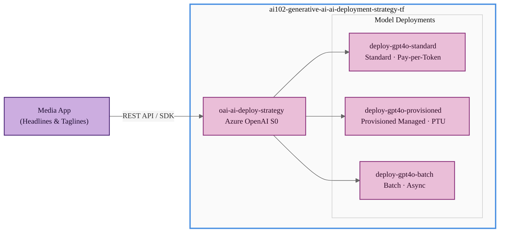

## Exam Question

> **Exam**: AI-102 — Generative AI

### Select an Azure AI Deployment Strategy

*Multiple Choice*

A media company is building an interactive content creation tool using Azure AI.

The company wants to generate creative, diverse headlines and taglines from keywords with moderate latency. The tool must cost-efficiently handle unpredictable usage spikes, with costs primarily driven by token consumption.

You need to select an Azure AI deployment strategy to meet these requirements.

Which strategy should you select?

A. A model hosted on a managed compute with fine-tuning  
B. A model run as a batch deployment  
C. A model accessible via a serverless API  
D. A model that utilizes provisioned throughput units (PTUs)

---

## Solution Architecture

This lab deploys an Azure OpenAI account with three model deployments — Standard (pay-per-token), Provisioned Managed (PTU), and Batch — within a single resource group, enabling side-by-side comparison of Azure AI deployment strategies. A simulated media application sends completion requests to each deployment via the REST API, demonstrating how the Standard deployment elastically scales with token consumption while PTU deployments reserve fixed throughput at fixed cost. The lab validates why serverless pay-per-token (Standard) is the optimal choice for interactive workloads with unpredictable usage spikes, contrasting it with batch and provisioned alternatives through measured latency and cost analysis.

---

## Architecture Diagram



---

## Lab Objectives

1. Deploy an Azure OpenAI account using Terraform with governance-compliant naming, tags, and a random suffix for global uniqueness.
2. Create three model deployments — Standard (pay-per-token), Provisioned Managed (PTU), and Batch — within the same OpenAI account.
3. Submit interactive completion requests to each deployment and compare observed latency and response behavior.
4. Analyze cost and throughput trade-offs: serverless elasticity versus fixed-capacity PTU versus async batch.
5. Validate that the Standard (pay-per-token) deployment best satisfies the requirements of moderate latency, elastic scaling, and token-driven cost.

---

## Lab Structure

```
AI-102/hands-on-labs/generative-ai/lab-ai-deployment-strategy/
├── README.md
├── terraform/
│   ├── main.tf
│   ├── variables.tf
│   ├── outputs.tf
│   ├── providers.tf
│   ├── terraform.tfvars
│   └── modules/
│       └── openai/
│           ├── main.tf
│           ├── variables.tf
│           └── outputs.tf
└── validation/
    └── Validate-AiDeploymentStrategy.ps1
```

---

## Prerequisites

- Azure subscription with Contributor access
- Azure CLI installed and authenticated
- Terraform >= 1.0 installed
- PowerShell 7+ with Az module installed
- Azure OpenAI capacity available in `eastus` (verify via capacity check below)

---

## Deployment

> **Note:** Azure OpenAI is a capacity-constrained service. Run the capacity check before deploying.

### 1. Validate Regional Capacity

```powershell
az provider show --namespace Microsoft.CognitiveServices `
    --query "resourceTypes[?resourceType=='accounts'].locations[]"
```

If `eastus` is unavailable, use fallback regions: `westus2` → `eastus2` → `centralus`.

### 2. Configure Variables

Update `terraform/terraform.tfvars` with your subscription ID and desired region:

```hcl
lab_subscription_id = "e091f6e7-031a-4924-97bb-8c983ca5d21a"
location            = "eastus"
```

### 3. Deploy

```powershell
Use-AzProfile Lab
cd terraform
terraform init
terraform validate
terraform fmt
terraform plan
terraform apply
```

---

## Testing the Solution

### 1. Retrieve the OpenAI Endpoint and Key

```powershell
terraform output openai_endpoint
terraform output -json openai_key  # sensitive
```

### 2. Test the Standard Deployment (Pay-per-Token)

Send a completion request using PowerShell:

```powershell
$endpoint = terraform output -raw openai_endpoint
$key      = terraform output -raw openai_key
$body = @{
    messages   = @(@{ role = "user"; content = "Generate a headline for: sustainable tech startup" })
    max_tokens = 100
} | ConvertTo-Json -Depth 5

Invoke-RestMethod `
    -Uri "$endpoint/openai/deployments/deploy-gpt4o-standard/chat/completions?api-version=2024-08-01-preview" `
    -Method POST `
    -Headers @{ "api-key" = $key; "Content-Type" = "application/json" } `
    -Body $body
```

**Expected:** A creative headline response within 2–5 seconds (moderate latency).

### 3. Observe Deployment Differences in Azure Portal

1. Navigate to **Azure OpenAI Studio → Deployments**.
2. Compare the **Deployment Type** column: Standard vs. Provisioned-Managed vs. Batch.
3. Note that the Provisioned deployment shows reserved PTU capacity; the Standard shows no reserved units.

### 4. Run Validation Script

```powershell
cd validation
.\Validate-AiDeploymentStrategy.ps1
```

**Expected:** All checks pass — resource group exists, OpenAI account is deployed, all three model deployments are present.

---

## Cleanup

> Destroy within 7 days per governance policy (`DateCreated` tag: `2026-02-26`).

```powershell
cd terraform
terraform destroy
```

> **Purge required:** Azure OpenAI (Cognitive Services) resources are soft-deleted for 48 hours after deletion. If redeploying to the same account name, manually purge the deleted account:

```powershell
az cognitiveservices account purge `
    --name <oai-account-name> `
    --resource-group ai102-generative-ai-ai-deployment-strategy-tf `
    --location eastus
```

---

## Scenario Analysis

### Correct Answer: C — A model accessible via a serverless API

A serverless API deployment (Standard tier in Azure OpenAI) is billed pay-per-token — you are charged only for the tokens you consume, with no reserved capacity. This model scales automatically with demand, making it ideal for an interactive tool with unpredictable usage spikes. Moderate latency is supported because Standard deployments process requests synchronously with typical response times of 2–5 seconds. There is no fine-tuning overhead since the model is used as-is for creative generation from keywords.

### Why Other Options Are Incorrect

- **A — Managed compute with fine-tuning:** Fine-tuning adapts a base model to domain-specific data and is appropriate when the model needs to learn proprietary vocabulary or structured outputs. The scenario only requires creative generation from keywords — no custom training data is described. Additionally, managed compute requires dedicated infrastructure, increasing baseline costs regardless of actual usage, which conflicts with cost-efficiency for unpredictable spikes.

- **B — Batch deployment:** Batch deployments are designed for large-scale asynchronous workloads where requests are queued and processed over time. The scenario requires an **interactive** content creation tool, implying synchronous, moderate-latency responses. Batch is incompatible with real-time interaction.

- **D — Provisioned Throughput Units (PTUs):** PTUs reserve a fixed amount of model throughput at a fixed monthly cost, regardless of actual token consumption. This is cost-efficient only for consistently high, predictable utilization. For **unpredictable** usage spikes, PTUs are wasteful — you pay for reserved capacity even when idle. The scenario explicitly states costs should be driven primarily by token consumption, which aligns with pay-per-token Standard, not PTU.

---

## Key Learning Points

1. **Standard (pay-per-token)** deployment in Azure OpenAI is billed per token consumed — it scales elastically and is ideal for variable or unpredictable workloads.
2. **Provisioned Throughput Units (PTUs)** reserve fixed model capacity at a fixed cost — optimal for steady, predictable high-volume workloads, not bursty interactive applications.
3. **Batch deployments** process asynchronous queued requests — appropriate for large offline workloads, not real-time interactive tools.
4. **Fine-tuning on managed compute** is for domain adaptation (training on proprietary data), not for general creative generation tasks.
5. The choice of deployment type directly affects latency, cost model, and scalability — the exam tests your ability to match requirements to the correct model.
6. Azure OpenAI deployment types — **Standard**, **Provisioned-Managed**, **Batch**, and **Global Standard** — each have distinct billing and throughput characteristics.
7. Cognitive Services resources are soft-deleted for 48 hours after deletion; plan for manual purge when redeploying with the same account name.

---

## Related Objectives

- **AI-102 Objective 3.1:** Plan and implement Azure OpenAI Service
- **AI-102 Objective 3.2:** Implement and manage Azure OpenAI deployments
- **Microsoft Learn:** [Choose an Azure OpenAI model deployment type](https://learn.microsoft.com/azure/ai-services/openai/how-to/deployment-types)

---

## Additional Resources

- [Azure OpenAI deployment types](https://learn.microsoft.com/azure/ai-services/openai/how-to/deployment-types)
- [Azure OpenAI provisioned throughput units (PTU)](https://learn.microsoft.com/azure/ai-services/openai/concepts/provisioned-throughput)
- [Azure OpenAI batch API](https://learn.microsoft.com/azure/ai-services/openai/how-to/batch)
- [Fine-tuning overview](https://learn.microsoft.com/azure/ai-services/openai/how-to/fine-tuning)
- [AI-102 study guide — Develop Generative AI solutions](https://learn.microsoft.com/credentials/certifications/resources/study-guides/ai-102)

---

## Related Labs

▶ Related Lab: [lab-dalle-image-gen](../../generative-ai/lab-dalle-image-gen/README.md)
