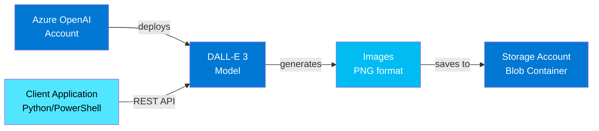
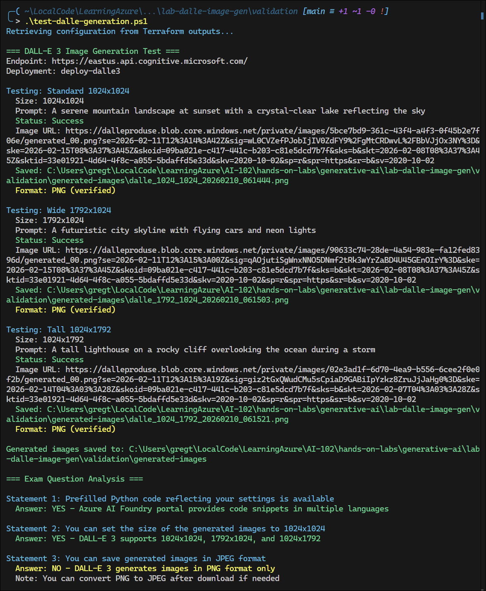
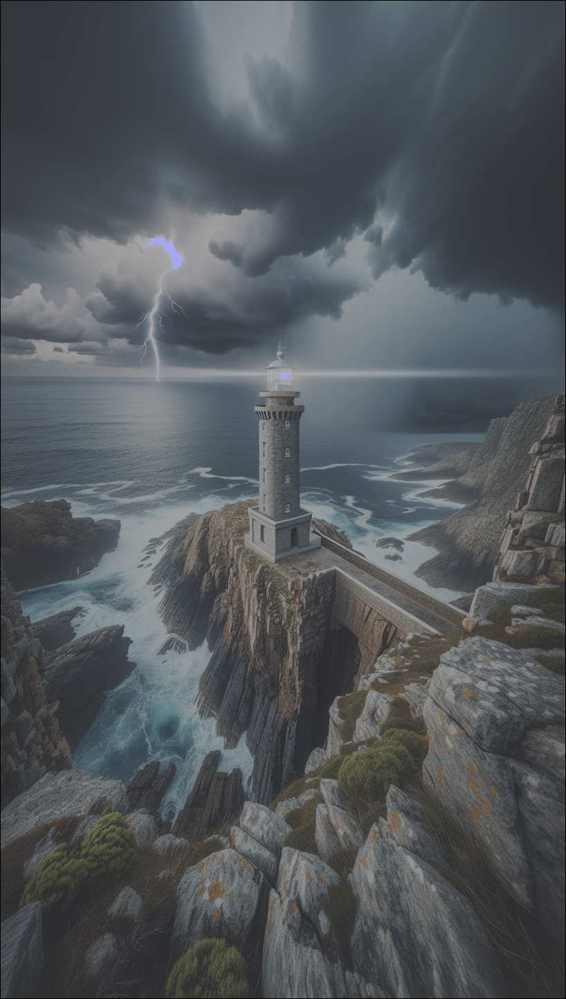
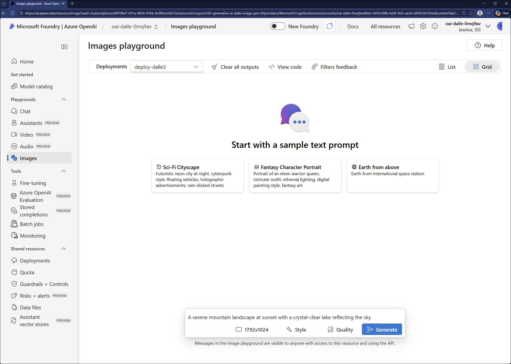
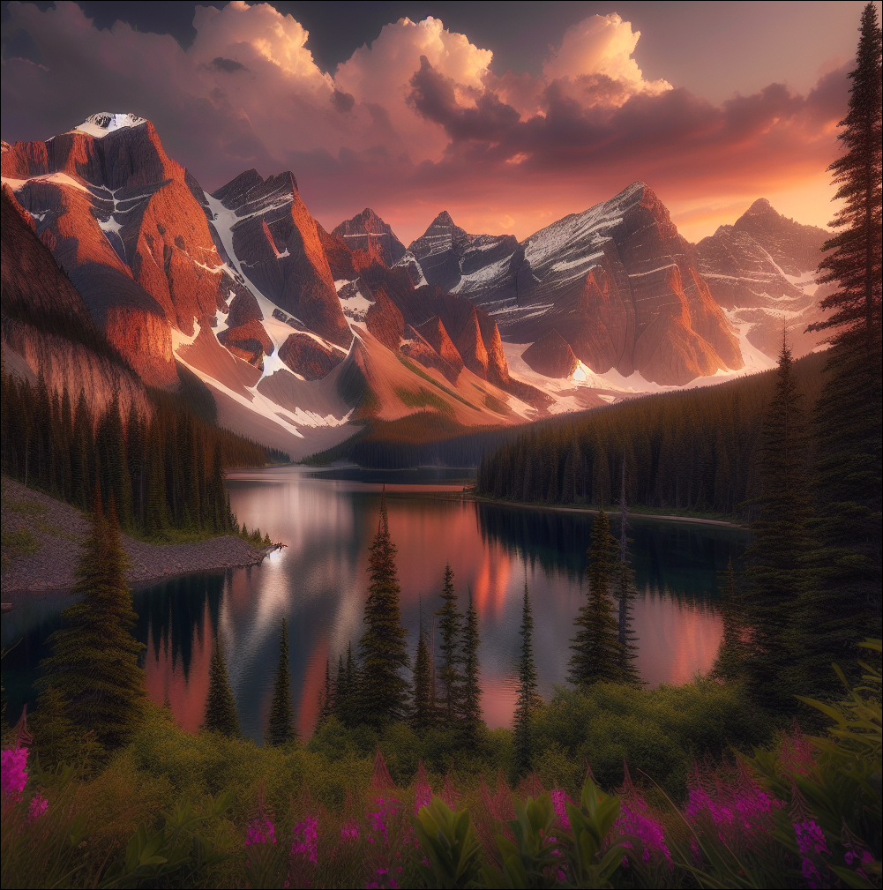

# Lab: DALL-E Image Generation with Azure OpenAI

## Exam Question Scenario

You are an AI Engineer. You are developing an application that uses Azure OpenAI to generate images from natural language prompts.

You test the functionality of the DALL-E model in Azure AI Foundry as shown in the exhibit.

For each of the following statements, select Yes if the statement is true. Otherwise, select No.

| Statement | YES | NO |
|-----------|-----|-----|
| Prefilled Python code reflecting your settings is available | ☐ | ☐ |
| You can set the size of the generated images to 1024x1024 | ☐ | ☐ |
| You can save generated images in JPEG format | ☐ | ☐ |

## Scenario Analysis

This exam scenario tests knowledge of:

1. **Azure AI Foundry Portal Features**: Understanding what code generation and testing capabilities are available in the portal
2. **DALL-E 3 Model Capabilities**: Knowing the supported image sizes and generation parameters
3. **Image Format Specifications**: Understanding what formats DALL-E 3 generates images in

The scenario requires deploying an Azure OpenAI resource with DALL-E 3 model deployment and testing the image generation capabilities.

## Solution Architecture

This lab deploys:

- **Azure OpenAI Account** (Cognitive Services): S0 SKU with public network access enabled
- **DALL-E 3 Model Deployment**: Standard scale type for image generation
- **Storage Account**: For storing generated images (Standard LRS)
- **Blob Container**: Private container for image outputs

### Architecture Diagram



## Lab Objectives

1. Deploy an Azure OpenAI account with DALL-E 3 model
2. Test image generation with multiple size options (1024x1024, 1792x1024, 1024x1792)
3. Verify the image format returned by DALL-E 3
4. Store generated images in Azure Blob Storage
5. Understand Azure AI Foundry portal capabilities for code generation

## Prerequisites

- Azure subscription with Azure OpenAI access enabled
- Azure CLI or PowerShell Az module installed
- Terraform >= 1.0 installed
- Python 3.8+ (optional, for Python testing script)
- Contributor role on the subscription

**Note**: Azure OpenAI access requires approval. Ensure your subscription has access to Azure OpenAI services in the East US region.

## Deployment

Navigate to the terraform directory and run:

```powershell
# Switch to Lab Azure profile
Use-AzProfile Lab

# Verify terraform.tfvars exists
Test-Path terraform.tfvars

# Initialize Terraform
terraform init

# Validate configuration
terraform validate

# Preview changes
terraform plan

# Deploy resources
terraform apply
```

After deployment, note the outputs - you'll need them for testing.

## Testing the Solution

### Option 1: PowerShell Testing Script

The PowerShell script automatically retrieves endpoint and keys from Terraform outputs:

```powershell
cd ..\validation
.\test-dalle-generation.ps1
```

Or specify parameters manually:

```powershell
.\test-dalle-generation.ps1 `
    -Endpoint "https://oai-dalle-abc123.openai.azure.com/" `
    -ApiKey "your-api-key" `
    -DeploymentName "deploy-dalle3"
```







### Option 2: Python Testing Script

First, set environment variables with your deployment details:

```bash
# Get values from Terraform
cd terraform
export AZURE_OPENAI_ENDPOINT=$(terraform output -raw openai_endpoint)
export AZURE_OPENAI_API_KEY=$(terraform output -raw openai_primary_key)
export DALLE_DEPLOYMENT_NAME=$(terraform output -raw image_deployment_name)

# Run Python script
cd ../validation
python test-dalle-python.py
```


### Option 3: Azure AI Foundry Portal

1. Navigate to [Azure AI Foundry](https://ai.azure.com)
2. Select your Azure OpenAI resource
3. Go to **Deployments** → Select your DALL-E 3 deployment
4. Click **Open in playground**
5. In the playground:
   - Enter a text prompt
   - Select size (1024x1024, 1792x1024, or 1024x1792)
   - Click **Generate**
   - Observe the **View code** button for Python/C#/JavaScript examples




### Option 4: Manual REST API Testing

```powershell
# Get outputs
cd terraform
$endpoint = terraform output -raw openai_endpoint
$apiKey = terraform output -raw openai_primary_key
$deployment = terraform output -raw image_deployment_name

# Build API URL
$apiUrl = "$endpoint/openai/deployments/$deployment/images/generations?api-version=2024-02-15-preview"

# Request body
$body = @{
    prompt = "A serene mountain landscape at sunset"
    size = "1024x1024"
    n = 1
    quality = "standard"
} | ConvertTo-Json

# Call API
$response = Invoke-RestMethod -Method Post -Uri $apiUrl `
    -Headers @{"api-key"=$apiKey; "Content-Type"="application/json"} `
    -Body $body

# Display image URL
$response.data[0].url
```




### Expected Results

The tests will demonstrate:

1. ✅ **Python code is available** - Azure AI Foundry provides code snippets in Python, C#, and JavaScript
2. ✅ **1024x1024 size is supported** - DALL-E 3 supports three sizes:
   - 1024x1024 (square)
   - 1792x1024 (wide landscape)
   - 1024x1792 (tall portrait)
3. ❌ **Images are NOT in JPEG format** - DALL-E 3 generates PNG format only
   - Generated images are PNG format (verified by file header)
   - You can convert to JPEG after download if needed for your application

### Exam Question Answers

| Statement | Answer | Explanation |
|-----------|--------|-------------|
| Prefilled Python code reflecting your settings is available | **YES** | Azure AI Foundry portal provides "View code" functionality with Python, C#, and JavaScript examples |
| You can set the size of the generated images to 1024x1024 | **YES** | DALL-E 3 supports 1024x1024, 1792x1024, and 1024x1792 |
| You can save generated images in JPEG format | **NO** | DALL-E 3 generates PNG format only (you can convert afterward) |

## Key Learning Points

- **Azure OpenAI DALL-E 3** supports text-to-image generation with three resolution options
- **Image sizes**: 1024x1024 (square), 1792x1024 (wide), 1024x1792 (tall)
- **Output format**: DALL-E 3 only generates PNG format images (not JPEG)
- **Azure AI Foundry** provides code generation and testing playground for all Azure OpenAI models
- **API access**: Use REST API with API key authentication or managed identity for production
- **Rate limits**: DALL-E 3 has token-based throttling; implement retry logic for production apps
- **Cost management**: Image generation is billed per image; use appropriate quality settings

## Related AI-102 Exam Objectives

This lab aligns with the following AI-102 exam objectives:

- **Implement generative AI solutions (30-35%)**
  - Integrate Azure OpenAI Service into applications
  - Use Azure OpenAI Studio/Foundry for model testing and development
  - Generate images from natural language with DALL-E models
  - Manage model deployments and versioning

- **Develop solutions with Azure AI Services (20-25%)**
  - Authenticate with key-based and managed identity methods
  - Configure service endpoints and API versions
  - Handle API responses and error conditions

## Cleanup

To avoid ongoing charges:

```powershell
cd terraform
terraform destroy
```

Or remove the entire resource group:

```powershell
az group delete --name ai102-generative-ai-dalle-image-gen-tf --yes --no-wait
```

## Additional Resources

- [Azure OpenAI DALL-E 3 Documentation](https://learn.microsoft.com/azure/ai-services/openai/dall-e-quickstart)
- [Image Generation API Reference](https://learn.microsoft.com/azure/ai-services/openai/reference#image-generation)
- [Azure AI Foundry Portal](https://ai.azure.com)
- [DALL-E 3 Model Overview](https://learn.microsoft.com/azure/ai-services/openai/concepts/models#dall-e-models)
- [Responsible AI for Image Generation](https://learn.microsoft.com/azure/ai-services/openai/concepts/dall-e-safety)
- [Azure OpenAI Service Quotas and Limits](https://learn.microsoft.com/azure/ai-services/openai/quotas-limits)

## Related Labs

### ▶ Related Labs

- ▶ Related Lab: [lab-search-query-perf](../knowledge-mining/lab-search-query-perf/README.md)

### ▶ Related Practice Exam Questions

- ▶ Practice Question: [Azure OpenAI - DALL-E Image Generation](../../../../practice-exams/ai-102/dalle-image-gen.md)
- ▶ Practice Question: [Azure OpenAI - Model Parameters](../../../../practice-exams/ai-102/model-parameters.md)
