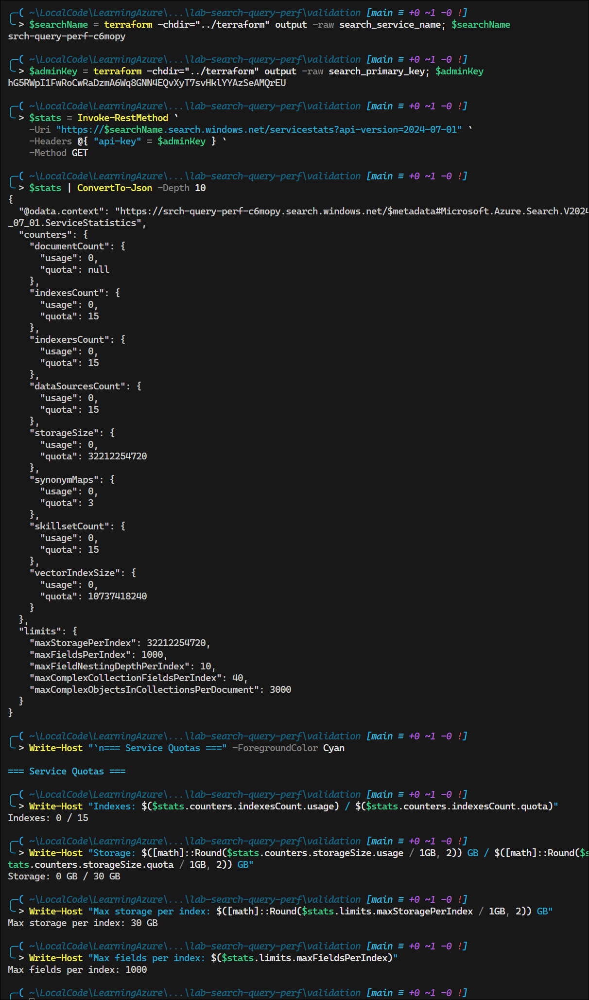
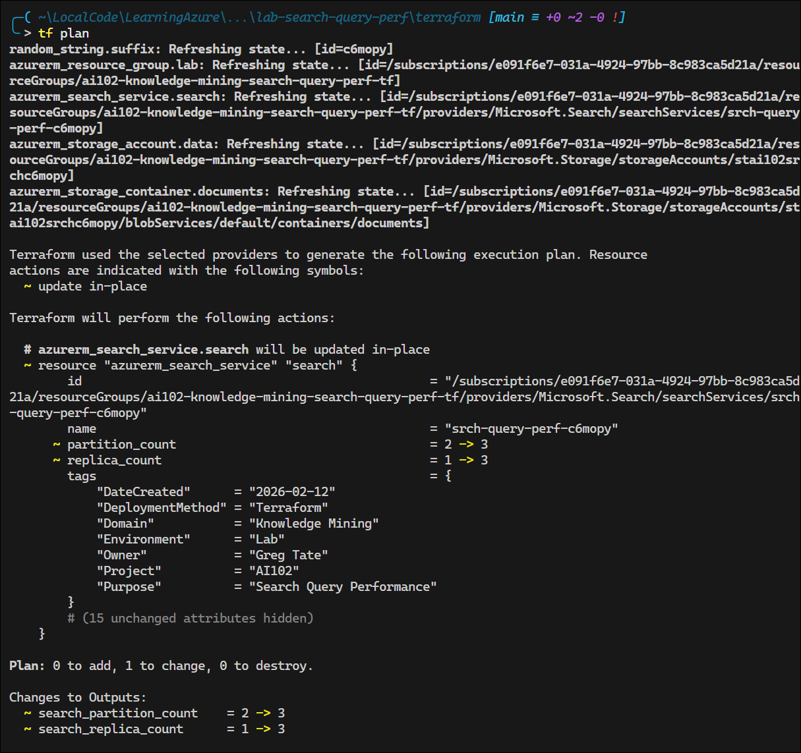
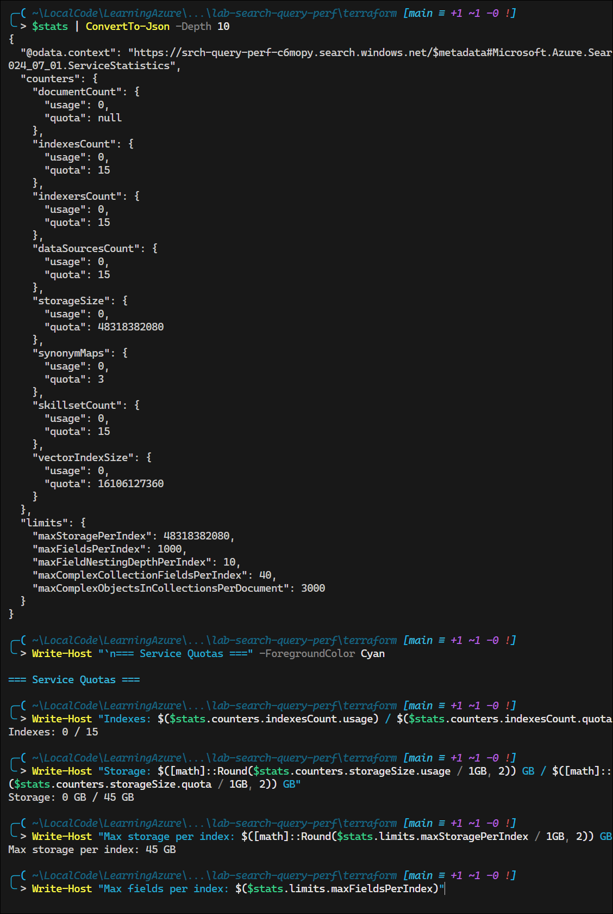

# Lab: Azure AI Search — Improve Query Performance with Partitions

## Exam Question Scenario

You use Azure AI Search to index your organization's documents and data.

Users report that some queries are slow. You repeat the users' queries when there is no load on the service and the queries are still slow.

What should you do to improve performance of slow-running queries?

- Add fields to the index.
- Add replicas.
- Add partitions.
- Convert fields to complex types.

---

## Solution Architecture

This lab deploys an Azure AI Search service with the **Basic** SKU configured with multiple partitions to demonstrate query performance optimization. A storage account provides a data source for populating the search index.

- **Azure AI Search (Basic)** — Supports up to 3 partitions and 3 replicas; deployed with 2 partitions to demonstrate the performance improvement concept
- **Storage Account** — Holds sample documents in a blob container for use as a search indexer data source

---

## Lab Objectives

1. Understand the difference between **partitions** (query speed) and **replicas** (query throughput)
2. Deploy an Azure AI Search service with multiple partitions
3. Verify partition and replica configuration via the Azure portal and REST API
4. Observe how partition count relates to index distribution
5. Learn when to scale partitions vs. replicas based on performance symptoms

---

## Prerequisites

- Azure subscription with Contributor access
- Azure CLI or Azure PowerShell installed
- Terraform >= 1.0 installed
- PowerShell 7+ (for validation script)

---

## Testing the Solution

### 1. Verify Search Service Configuration

After deployment, confirm the partition and replica counts:

```powershell
# Run the validation script from the validation/ folder
.\Test-SearchPartitions.ps1 `
    -ResourceGroupName "ai102-knowledge-mining-search-query-perf-tf" `
    -SearchServiceName (terraform -chdir="../terraform" output -raw search_service_name)
```


### 2. Check Partition Count via Azure Portal

1. Navigate to the Azure AI Search service in the Azure portal
2. Go to **Settings** → **Scale**
3. Verify **Partitions** is set to **2** and **Replicas** is set to **1**
4. Note that the Basic tier allows scaling up to 3 partitions


### 3. Query the Search REST API

Retrieve the service statistics to verify resource quotas and limits:

```powershell
$searchName = terraform -chdir="../terraform" output -raw search_service_name; $searchName
$adminKey = terraform -chdir="../terraform" output -raw search_primary_key; $adminKey

# Get service statistics
$stats = Invoke-RestMethod `
    -Uri "https://$searchName.search.windows.net/servicestats?api-version=2024-07-01" `
    -Headers @{ "api-key" = $adminKey } `
    -Method GET

# Display formatted statistics
$stats | ConvertTo-Json -Depth 10

# Display key metrics
Write-Host "`n=== Service Quotas ===" -ForegroundColor Cyan
Write-Host "Indexes: $($stats.counters.indexesCount.usage) / $($stats.counters.indexesCount.quota)"
Write-Host "Storage: $([math]::Round($stats.counters.storageSize.usage / 1GB, 2)) GB / $([math]::Round($stats.counters.storageSize.quota / 1GB, 2)) GB"
Write-Host "Max storage per index: $([math]::Round($stats.limits.maxStoragePerIndex / 1GB, 2)) GB"
Write-Host "Max fields per index: $($stats.limits.maxFieldsPerIndex)"
```



**Key Metrics Explained:**

- **counters.storageSize.quota**: Total storage available (Basic tier = ~30 GB)
- **counters.indexesCount.quota**: Maximum number of indexes (Basic tier = 15)
- **limits.maxStoragePerIndex**: Maximum storage per individual index
- **limits.maxFieldsPerIndex**: Maximum searchable fields per index

### 4. Compare Partition Configurations

Modify `partition_count` in `terraform.tfvars` and redeploy to observe the scaling behavior:

- **1 partition**: Index on a single shard (original slow scenario)
- **2 partitions**: Index split across 2 shards (improved query parallelism)
- **3 partitions**: Index split across 3 shards (maximum for Basic SKU)



**Note:** It took around 30 minutes for the service to scale.


Updated statistics:



| Metric                      | 1 replica / 2 partitions      | 3 replicas / 3 partitions     | Change    |
| --------------------------- | ----------------------------- | ----------------------------- | --------- |
| Index quota                 | 15                            | 15                            | No change |
| Indexer quota               | 15                            | 15                   | No change |
| Data source quota           | 15                            | 15                            | No change |
| Skillset quota              | 15                            | 15                            | No change |
| Synonym maps                | 3                             | 3                             | No change |
| **Storage quota (service)** | 32,212,254,720 bytes (~30 GB) | 48,318,382,080 bytes (~45 GB) | **+50%**  |
| **Vector index quota**      | 10,737,418,240 bytes (~10 GB) | 16,106,127,360 bytes (~15 GB) | **+50%**  |
| **Max storage per index**   | ~30 GB                        | ~45 GB                        | **+50%**  |
| Max fields per index        | 1000                          | 1000                          | No change |
| Field nesting depth         | 10                            | 10                            | No change |
| Complex collection fields   | 40                            | 40                            | No change |

---

## Scenario Analysis

The critical detail is that queries remain slow **even with no load** on the service. This eliminates concurrent query volume as the root cause and rules out replicas (which handle query throughput by adding copies of the index to serve more simultaneous requests).

**Why each option is correct or incorrect:**

| Option | Verdict | Reasoning |
|--------|---------|--------|
| **Add fields to the index** | ❌ | Adding more fields increases index size and can make queries slower, not faster |
| **Add replicas** | ❌ | Replicas add copies of the index to handle more concurrent queries. Since queries are slow even with no load, throughput is not the issue |
| **Add partitions** | ✅ | Partitions split the index across physical shards, enabling parallel query processing. This directly improves individual query latency |
| **Convert fields to complex types** | ❌ | Complex types restructure data but don't inherently improve query speed; they can add overhead |

**Partitions** distribute index data across multiple physical storage units. When a query runs, Azure AI Search can process it in parallel across all partitions, reducing the time needed to scan and return results. This is the correct approach when individual queries are intrinsically slow regardless of load.

---

## Key Learning Points

1. **Partitions improve individual query speed** by splitting the index across physical shards for parallel processing
2. **Replicas improve query throughput** by adding copies of the index to handle more concurrent requests — they do not speed up individual queries
3. The Basic SKU supports up to **3 partitions and 3 replicas**; Standard supports up to **12 each**
4. When queries are slow under **no load**, the bottleneck is per-query processing time — partitions address this
5. When queries are slow under **heavy load**, the bottleneck is concurrent capacity — replicas address this
6. **Search Units** = partitions × replicas; scaling either dimension increases cost proportionally
7. Adding fields or converting to complex types affects index schema, not query parallelism
8. Partition scaling is a non-disruptive operation — Azure redistributes the index automatically

---

## Related AI-102 Exam Objectives

- **Implement knowledge mining and document intelligence solutions (10–15%)**
  - Implement an Azure AI Search solution
  - Manage indexing
  - Manage a search index

---

## Additional Resources

- [Azure AI Search — Scale for performance](https://learn.microsoft.com/en-us/azure/search/search-capacity-planning)
- [Partitions and replicas in Azure AI Search](https://learn.microsoft.com/en-us/azure/search/search-manage#scale-replicas-and-partitions)
- [Performance tips for Azure AI Search](https://learn.microsoft.com/en-us/azure/search/search-performance-tips)
- [Azure AI Search pricing](https://azure.microsoft.com/en-us/pricing/details/search/)

---

## Related Labs

*No related labs exist yet in this domain.*
