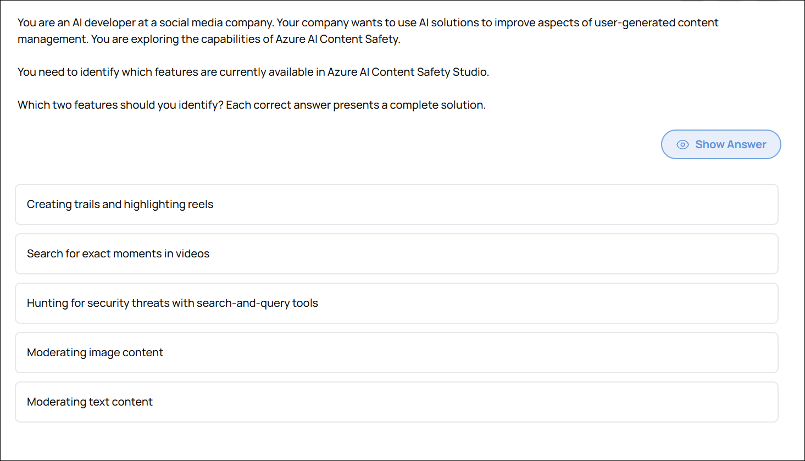
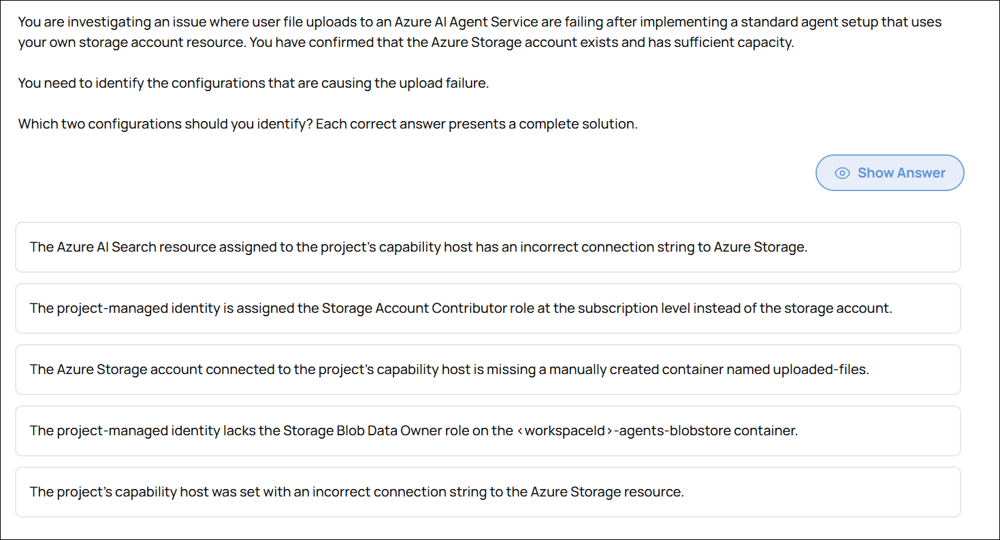

# Practice Exam Questions - AI-102

This section documents my progress through AI-102 practice exams with explanations and hands-on labs.

---

## 📖 Learning Strategy

For learning, I approach each question with a **lab-first mindset**. Based on the question scenario, I generate labs specific to the question, with each lab defined by **Infrastructure as Code (Terraform or Bicep)**.

From there, I generate a **Lab Guide** that offers step-by-step instructions for addressing the scenario in question. Steps could involve **Azure CLI**, **Azure portal**, or **custom code**.

I **complete the lab first**, gaining hands-on experience with the scenario. After completing the lab, I answer the practice exam questions based on what I learned. I then **research the correct answers** and provide detailed explanations in the expandable sections for future reference.

This hands-on approach transforms exam scenarios into tangible, practical experience. It bridges the gap between certification study and real-world Azure AI engineering skills.

---

## 🧪 MeasureUp Practice Exam for AI-102

### Azure OpenAI Image Generation and DALL-E Configuration

You are an AI Engineer. You are developing an application that uses Azure OpenAI to generate images from natural language prompts.

You test the functionality of the DALL-E model in Azure AI Foundry as shown in the exhibit.

For each of the following statements, select Yes if the statement is true. Otherwise, select No.

| Statement | Yes | No |
|----------|-----|----|
| Prefilled Python code reflecting your settings is available | ☐ | ☐ |
| You can set the size of the generated images to 1024x1024. | ☐ | ☐ |
| You can save generated images in JPEG format. | ☐ | ☐ |

📸 Click to expand screenshot

💡 Click to expand explanation

**Why the statements are correct**

**Prefilled Python code reflecting your settings is available — Yes**

The Azure AI Foundry DALL·E playground generates prefilled Python code based on the configuration you select in the UI. This allows you to copy code that already includes your prompt, image size, and other generation settings. This is designed to simplify moving from testing in the playground to application integration.

**You can set the size of the generated images to 1024x1024 — Yes**

The DALL·E model supports specific image sizes, including 1024x1024. The explanation confirms that the model supports 1024x1024, 1024x1792, and 1792x1024. These can be configured in the playground settings.

**You can save generated images in JPEG format — No**

At the time described, DALL·E in Azure AI Foundry supports only PNG output. JPEG is not supported directly from the model output, so this statement is false.

**Key takeaway**

The question tests knowledge of:

* Playground-to-code integration capability
* Supported image sizes
* Supported output formats

For exam purposes, remember:

* Prefilled SDK code is available in Azure AI Foundry.
* 1024x1024 is a valid supported size.
* PNG is supported; JPEG is not.

**References**

* [https://learn.microsoft.com/en-us/azure/ai-services/openai/how-to/dall-e](https://learn.microsoft.com/en-us/azure/ai-services/openai/how-to/dall-e)
* [https://learn.microsoft.com/en-us/azure/ai-services/openai/quickstart?pivots=programming-language-python&tabs=command-line%2Cpython-new](https://learn.microsoft.com/en-us/azure/ai-services/openai/quickstart?pivots=programming-language-python&tabs=command-line%2Cpython-new)

▶ Related Lab: [lab-dalle-image-gen](/AI-102/hands-on-labs/generative-ai/lab-dalle-image-gen/README.md)

---

### Azure AI Search Query Performance Optimization

You use Azure AI Search to index your organization's documents and data.

Users report that some queries are slow. You repeat the users' queries when there is no load on the service and the queries are still slow.

What should you do to improve performance of slow-running queries?

| Statement | Yes | No |
|----------|-----|----|
| Add fields to the index. | ☐ | ☐ |
| Add replicas. | ☐ | ☐ |
| Add partitions. | ☐ | ☐ |
| Convert fields to complex types. | ☐ | ☐ |

📸 Click to expand screenshot

💡 Click to expand explanation

**Why the selected answer is correct (Add partitions)**

Partitions in Azure AI Search split the index across multiple physical storage and compute resources. When a single query is slow even with no load on the service, the issue is not concurrency — it is the amount of data being processed per query.

Adding partitions increases the data processing capacity for each query because the index is distributed and searched in parallel across more compute resources. This improves performance for large indexes and complex queries.

In exam terms:

* **Partitions = scale for data volume and query performance**
* **Replicas = scale for concurrency and availability**

Since the queries are slow even without load, the correct action is to increase partitions.

---

**Why the other options are incorrect**

**Add replicas**
Replicas help handle more simultaneous users and provide high availability. They do not make a single query execute faster. Since there is no load on the service, replicas will not solve the problem.

**Add fields to the index**
Adding fields increases index size and can negatively impact performance. If anything, reducing unnecessary fields can improve performance.

**Convert fields to complex types**
Complex types increase index size and storage requirements. This can degrade performance rather than improve it.

---

**Key takeaway**

* Slow queries under no load → add partitions
* Slow queries under heavy load → add replicas
* Larger index size generally reduces performance

---

**References**

* [https://learn.microsoft.com/en-us/azure/search/search-performance-tips](https://learn.microsoft.com/en-us/azure/search/search-performance-tips)
* [https://learn.microsoft.com/en-us/azure/search/search-capacity-planning](https://learn.microsoft.com/en-us/azure/search/search-capacity-planning)

▶ Related Lab: [lab-search-query-perf](../hands-on-labs/knowledge-mining/lab-search-query-perf/README.md)

---

### Azure AI Content Safety Features Available

You are an AI developer at a social media company. Your company wants to use AI solutions to improve aspects of user-generated content management. You are exploring the capabilities of Azure AI Content Safety.

You need to identify which features are currently available in Azure AI Content Safety Studio.

Which two features should you identify? Each correct answer presents a complete solution.

| Statement | Yes | No |
|----------|-----|----|
| Creating traits and highlighting reels | ☐ | ☐ |
| Search for exact moments in videos | ☐ | ☐ |
| Hunting for security threats with search-and-query tools | ☐ | ☐ |
| Moderating image content | ☐ | ☐ |
| Moderating text content | ☐ | ☐ |

📸 Click to expand screenshot

💡 Click to expand explanation

**Why the selected answers are correct**

Azure AI Content Safety Studio currently supports:

* **Moderating image content**
* **Moderating text content**

These are core capabilities of Azure AI Content Safety. The studio allows you to test and configure filters for harmful categories (such as violence, hate, sexual content, and self-harm) across both text and images. You can adjust sensitivity thresholds and export configurations for implementation in your applications. This aligns directly with improving user-generated content management.

**Why the other options are incorrect**

* **Hunting for security threats with search-and-query tools**
  This is a capability of Azure Sentinel (SIEM/SOAR), not Azure AI Content Safety. Content Safety focuses on moderation, not threat hunting or security analytics.

* **Creating trails and highlighting reels**
  This is a feature of Azure AI Video Indexer, which analyzes video content and can generate highlights. It is unrelated to content moderation in Content Safety Studio.

* **Search for exact moments in videos**
  This is also a Video Indexer capability. Azure AI Content Safety does not analyze video timelines or enable moment-level video search.

**Key takeaway**

Azure AI Content Safety Studio is designed specifically for **text and image moderation**. Video analysis, highlight generation, and security threat hunting belong to other Azure services.

▶ Related Lab: [lab-content-safety](../hands-on-labs/ai-services/lab-content-safety/README.md)

---

### Azure AI Agent Service File Upload Configuration Issues

You are investigating an issue where user file uploads to an Azure AI Agent Service are failing after implementing a standard agent setup that uses your own storage account resource. You have confirmed that the Azure Storage account exists and has sufficient capacity.

You need to identify the configurations that are causing the upload failure.

Which two configurations should you identify? Each correct answer presents a complete solution.

| Statement | Yes | No |
|----------|-----|----|
| The Azure AI Search resource assigned to the project's capability host has an incorrect connection string to Azure Storage. | ☐ | ☐ |
| The project-managed identity is assigned the Storage Account Contributor role at the subscription level instead of the storage account. | ☐ | ☐ |
| The Azure Storage account connected to the project's capability host is missing a manually created container named uploaded-files. | ☐ | ☐ |
| The project-managed identity lacks the Storage Blob Data Owner role on the <workspaceid>-agents-blobstore container. | ☐ | ☐ |
| The project's capability host was set with an incorrect connection string to the Azure Storage resource. | ☐ | ☐ |

📸 Click to expand screenshot

💡 Click to expand explanation

▶ Related Labs:

* [lab-agent-essentials](../hands-on-labs/agentic/lab-agent-essentials/README.md)
* [lab-agent-storage-config](../hands-on-labs/ai-services/lab-agent-storage-config/README.md)

---
