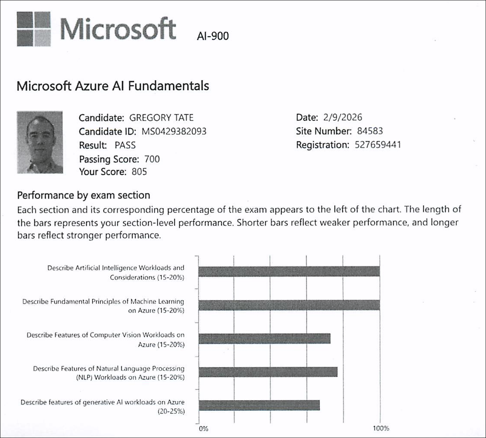

# AI-900: Microsoft Azure AI Fundamentals — Exam

**Date:** February 9, 2026  
**Status:** ✅ Passed

---

## Exam Details

- **Score:** 805 (Passing Score: 700)
- **Number of Questions:** 43
- **Duration:** ~30 minutes
- **Questions Marked for Review:** 4

---

## Exam Experience

### Overall Difficulty

Most questions were straightforward, but there were some challenging areas that required deeper knowledge.

### Challenging Topics

**Conversational Language Understanding (3-4 questions)**

- Got tripped up on several questions related to conversational language understanding
- This was one of the more difficult areas on the exam

**Microsoft AI Foundry Interface**

- Some questions went into specifics of using the Microsoft AI Foundry interface
- Required detailed knowledge of the platform's features and capabilities

### Preparation Notes

- Completed Microsoft Learning Paths (7 days)
- Watched John Savill's training videos (3 days)
- Practiced with multiple practice exams (9 days)
- Total preparation time: ~19 days

---

## Performance by Section

Based on the exam results:

1. **Describe Artificial Intelligence Workloads and Considerations (15-20%)** - Strong performance
2. **Describe Fundamental Principles of Machine Learning on Azure (15-20%)** - Strong performance
3. **Describe Features of Computer Vision Workloads on Azure (15-20%)** - Moderate performance
4. **Describe Features of Natural Language Processing (NLP) Workloads on Azure (15-20%)** - Moderate performance
5. **Describe Features of Generative AI Workloads on Azure (20-25%)** - Moderate performance

---
