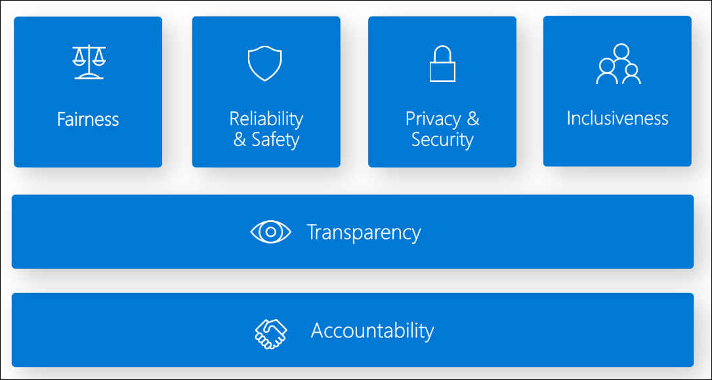

# Lab 01: AI Workloads and Responsible AI

**Duration:** 45–60 minutes  
**Difficulty:** Beginner

---

## 🎯 Objectives

By the end of this lab, you will be able to:

- Identify common AI workload scenarios (computer vision, NLP, document processing, generative AI)
- Understand and apply the six responsible AI principles
- Analyze real-world case studies demonstrating responsible AI implementation
- Recognize ethical considerations when designing AI solutions

---

## 📋 Prerequisites

- Azure subscription (free trial is sufficient)
- Basic understanding of cloud computing concepts
- Access to the Azure Portal

---

## 🧪 Lab Exercises

### Exercise 1: Explore AI Workload Types

**Objective:** Understand the four main categories of AI workloads.

1. **Computer Vision Workloads:**
    - Navigate to Azure AI Vision service in the portal
    - Review sample scenarios: image classification, object detection, OCR, facial analysis
    - Identify use cases (e.g., retail inventory, security cameras, document processing)

    **What It Does:**
    Azure AI Vision analyzes images and videos to extract insights, detect objects and faces, perform OCR, and generate image descriptions. It combines deep learning models with pre-trained capabilities for common vision tasks.

    **Common Use Cases:**
    Retail shelf monitoring, manufacturing quality inspection, security surveillance, medical imaging analysis, accessibility tools, and document digitization.

    [Azure AI Vision Studio](https://portal.vision.cognitive.azure.com/gallery/featured)

    **References:**  
    - [What is Azure AI Vision?](https://learn.microsoft.com/en-us/azure/ai-services/computer-vision/overview)

2. **Natural Language Processing (NLP) Workloads:**

    - Explore Azure AI Language service capabilities
    - Review scenarios: sentiment analysis, entity recognition, key phrase extraction
    - Identify use cases (e.g., customer feedback analysis, chatbots, content moderation)

    **What It Does:**
    Azure AI Language provides NLP capabilities for understanding and analyzing text, including sentiment analysis, entity extraction, language detection, PII detection, and conversational AI.

    **Key Features:**
    Named Entity Recognition, Key Phrase Extraction, Sentiment Analysis, Language Detection, PII Detection, Question Answering, Text Summarization, and Custom Text Classification.

    **Common Use Cases:**
    Customer feedback analysis, chatbot development, email routing, call center analytics, content moderation, and document summarization.

    [Azure AI Language Studio](https://language.cognitive.azure.com/)

    **References:**  
    - [What is Azure AI Language?](https://learn.microsoft.com/en-us/azure/ai-services/language-service/overview)

3. **Document Processing Workloads:**

    - Review Azure AI Document Intelligence (formerly Form Recognizer)
    - Explore prebuilt models for invoices, receipts, business cards
    - Identify use cases (e.g., invoice automation, receipt scanning)

    **What It Does:**
    Azure AI Document Intelligence uses machine learning to extract text, tables, and structured data from documents. It provides prebuilt models for common document types and custom model training capabilities.

    **Key Features:**
    - Prebuilt models: Invoices, receipts, IDs, tax forms (W-2, 1099), business cards, health insurance cards
    - Custom models: Neural and template models for organization-specific documents
    - Advanced OCR with table extraction and selection mark recognition

    **Common Use Cases:**
    Invoice processing, receipt scanning, mortgage document analysis, identity verification, tax form extraction, and medical records digitization.

    [Azure AI Document Intelligence Studio](https://documentintelligence.ai.azure.com/studio)

    **References:**  
    - [What is Azure AI Document Intelligence?](https://learn.microsoft.com/en-us/azure/ai-services/document-intelligence/overview?view=doc-intel-4.0.0)

4. **Generative AI Workloads:**

    - Explore Azure OpenAI Service overview
    - Review capabilities: text generation, code generation, image generation
    - Identify use cases (e.g., content creation, code assistance, virtual assistants)

    **What It Does:**
    Azure OpenAI Service provides access to advanced generative AI models (GPT-4, GPT-4o, DALL-E) that can generate text, code, and images, as well as analyze and understand multimodal content.

    **Key Capabilities:**
    - Text generation and conversational AI
    - Code generation and assistance
    - Image generation (DALL-E)
    - Vision capabilities (image understanding)
    - Embeddings for semantic search

    **Common Use Cases:**
    Content creation, customer service chatbots, code generation, document summarization, language translation, image generation, and knowledge base Q&A.

    [Azure OpenAI Studio](https://oai.azure.com/)

    **References:**  
    - [What is Azure OpenAI Service?](https://learn.microsoft.com/en-us/azure/ai-services/openai/overview)
    - [Introduction to Generative AI](https://learn.microsoft.com/en-us/training/modules/fundamentals-generative-ai/)

**Deliverables:**

- Document at least 2 use cases for each workload type using the table below:

| Workload Type | Use Case | Description | Industry |
|---------------|----------|-------------|----------|
| **Computer Vision** | Retail Shelf Monitoring | Automatically detect out-of-stock items and planogram compliance using cameras and object detection | Retail |
| **Computer Vision** | Medical Imaging Analysis | Assist radiologists in detecting tumors, fractures, and abnormalities in X-rays, CT scans, and MRIs | Healthcare |
| **NLP** | Customer Feedback Analysis | Analyze customer reviews, surveys, and social media posts to extract sentiment and identify trending issues | Customer Service |
| **NLP** | Intelligent Chatbots | Build conversational AI assistants that understand user intent and provide contextual responses | Customer Service |
| **Document Processing** | Invoice Automation | Extract vendor details, line items, totals, and payment information from invoices to automate accounts payable workflows | Finance |
| **Document Processing** | Identity Verification | Extract information from driver's licenses, passports, and ID cards to verify customer identities during onboarding | Banking/Insurance |
| **Generative AI** | Content Creation for Marketing | Generate blog posts, product descriptions, social media content, and advertising copy at scale | Marketing |
| **Generative AI** | Code Generation and Assistance | Help developers write code faster by generating functions, classes, and complete programs from natural language descriptions | Software Development |

- Create a comparison table showing differences between workload types

| Criteria | Computer Vision | NLP | Document Processing | Generative AI |
|----------|----------------|-----|---------------------|---------------|
| **Primary Input** | Images, videos | Text, speech | Documents (PDFs, forms) | Text prompts, images |
| **Primary Output** | Labels, objects, OCR text | Entities, sentiment, summaries | Structured data (key-value pairs) | Original content (text, code, images) |
| **Key Technology** | CNNs, object detection | Transformers (BERT, GPT) | OCR + ML, layout analysis | Large Language Models, diffusion models |
| **Azure Services** | Azure AI Vision | Azure AI Language | Azure AI Document Intelligence | Azure OpenAI Service |
| **Common Use Cases** | Object detection, facial recognition | Sentiment analysis, chatbots | Invoice processing, form extraction | Content creation, virtual assistants |
| **Responsible AI Concerns** | Bias in facial recognition, privacy | Bias in language models, fairness | Data privacy (PII in documents) | Content safety, misinformation |

---

### Exercise 2: Understand Responsible AI Principles

**Objective:** Learn the six core principles of responsible AI.

[What is Responsible AI?](https://learn.microsoft.com/en-us/azure/machine-learning/concept-responsible-ai?view=azureml-api-2)
[Responsible AI Standard](https://msblogs.thesourcemediaassets.com/sites/5/2022/06/Microsoft-Responsible-AI-Standard-v2-General-Requirements-3.pdf)

**The Six Principles:**

1. **Fairness**
   - AI systems should treat all people fairly
   - Avoid reinforcing unfair bias
   - Example: A hiring AI should not discriminate based on gender or race

2. **Reliability and Safety**
   - AI should perform reliably and safely
   - Handle unexpected situations gracefully
   - Example: An autonomous vehicle must safely handle edge cases

3. **Privacy and Security**
   - AI should secure data and respect privacy
   - Implement data protection and access controls
   - Example: A health AI must comply with HIPAA regulations

4. **Inclusiveness**
   - AI should empower everyone and engage people
   - Consider diverse user needs (accessibility, cultural sensitivity)
   - Example: Voice assistants should understand diverse accents

5. **Transparency**
   - AI should be understandable (explainable AI)
   - Users should understand how decisions are made
   - Example: A loan approval AI should explain rejection reasons
   - [Responsible AI Scorecard](https://learn.microsoft.com/en-us/azure/machine-learning/how-to-responsible-ai-scorecard?view=azureml-api-2)

6. **Accountability**
   - People should be accountable for AI systems
   - Clear governance and oversight
   - Example: Designate responsible parties for AI system outcomes

**Activity:**

- For each principle, identify a real-world AI scenario where it applies

    1. **Fairness:** Credit scoring AI that assesses loan applications must treat all applicants equally regardless of race, gender, or age, avoiding bias from historical discriminatory lending data.

    2. **Reliability and Safety:** Autonomous vehicles must make safe decisions in all conditions—weather, lighting, unexpected obstacles—with fail-safe mechanisms to prevent accidents.

    3. **Privacy and Security:** Healthcare diagnosis AI processes sensitive patient data (PHI) and must implement encryption, access controls, and HIPAA compliance to protect information.

    4. **Inclusiveness:** Voice assistants must understand diverse accents, dialects, languages, and accommodate users with disabilities through alternative input methods.

    5. **Transparency:** Loan rejection AI must provide clear, explainable reasons for decisions (e.g., "insufficient income") rather than unexplained "black box" outcomes.

    6. **Accountability:** Social media content moderation AI requires human oversight, appeals processes, and designated teams responsible for model decisions and policy enforcement.

- Discuss potential consequences of violating each principle

    1. **Fairness Violation:** Discriminatory outcomes (e.g., denying loans to qualified minorities), legal liability under anti-discrimination laws, loss of customer trust, reputational damage, and perpetuation of systemic inequalities.

    2. **Reliability and Safety Violation:** System failures causing harm (accidents, injuries, deaths), financial losses, product recalls, lawsuits, regulatory penalties, and erosion of public confidence in AI technology.

    3. **Privacy and Security Violation:** Data breaches exposing sensitive information, identity theft, regulatory fines (GDPR, HIPAA), lawsuits, loss of customer trust, and potential misuse of personal data for malicious purposes.

    4. **Inclusiveness Violation:** Excluding vulnerable populations (elderly, disabled, non-native speakers), creating digital divides, limiting market reach, missing business opportunities, and reinforcing societal marginalization.

    5. **Transparency Violation:** Loss of user trust, inability to debug or improve systems, regulatory non-compliance, difficulty identifying bias or errors, and users unable to contest unfair decisions or understand their rights.

    6. **Accountability Violation:** No clear ownership when failures occur, inability to address systemic issues, lack of recourse for affected individuals, regulatory sanctions, and organizational chaos in crisis response.

---

### Exercise 3: Case Study Analysis

**Objective:** Apply responsible AI principles to real-world scenarios.

**Case Study 1: Healthcare Diagnosis AI**  

A hospital wants to deploy an AI system to assist doctors in diagnosing diseases from medical images.

**Questions:**

1. Which responsible AI principles are most critical for this scenario?
2. What could go wrong if the AI is biased or unreliable?
3. How can transparency be achieved in this context?
4. Who should be accountable if the AI makes an incorrect diagnosis?

Source [@Mayhem4Markets](https://x.com/Mayhem4Markets/status/1980001528464175463)

**Answers:**

1. **Most Critical Principles:**
   - **Reliability and Safety:** The AI must consistently provide accurate diagnoses across all patient populations and medical conditions. Lives depend on correct identification of diseases.
   - **Privacy and Security:** Medical images contain Protected Health Information (PHI) requiring HIPAA compliance, encryption, access controls, and secure storage.
   - **Fairness:** The AI must perform equally well across diverse patient demographics (age, gender, race, ethnicity) to avoid health disparities.
   - **Transparency:** Doctors need to understand how the AI reaches conclusions to validate findings and maintain clinical judgment.

2. **Potential Problems from Bias or Unreliability:**
   - **Misdiagnosis:** False negatives (missing cancer, infections) lead to delayed treatment and worse patient outcomes; false positives cause unnecessary treatments, anxiety, and costs.
   - **Demographic Bias:** If trained primarily on one demographic, the AI may underperform on underrepresented groups (e.g., missing skin conditions in darker skin tones, or misinterpreting images from different body types).
   - **Legal Liability:** Medical malpractice lawsuits, loss of medical licenses, and regulatory sanctions.
   - **Lost Trust:** Doctors may stop using the AI, or patients may refuse care, undermining the technology's benefits.
   - **Health Inequities:** Perpetuating or worsening existing healthcare disparities for marginalized communities.

3. **Achieving Transparency:**
   - **Explainable AI (XAI):** Use techniques like attention maps or heat maps showing which image regions influenced the diagnosis.
   - **Confidence Scores:** Provide probability scores for each diagnosis to help doctors assess reliability.
   - **Clinical Decision Support:** Present supporting evidence (similar cases, relevant research) alongside AI recommendations.
   - **Documentation:** Maintain clear records of model training data, validation results, and performance metrics across patient demographics.
   - **Audit Trails:** Log all AI recommendations and outcomes for quality assurance and continuous improvement.

4. **Accountability:**
   - **Primary Accountability:** The licensed physician remains ultimately responsible for patient care and final diagnosis—AI is an assistive tool, not a replacement.
   - **Hospital Leadership:** Responsible for proper AI implementation, validation, training, and monitoring protocols.
   - **AI Development Team:** Accountable for model accuracy, bias testing, ongoing performance monitoring, and addressing identified issues.
   - **Regulatory Oversight:** FDA approval and compliance for medical devices/software; adherence to clinical standards.
   - **Clear Governance:** Establish AI oversight committees, incident reporting procedures, and continuous monitoring systems.

---

**Case Study 2: Hiring Recommendation System**

A company builds an AI to screen job applications and recommend candidates for interviews.

**Questions:**

1. What fairness concerns exist in this scenario?
2. How can the company ensure the AI doesn't discriminate?
3. What data privacy considerations apply?
4. Should candidates be informed that AI is used in screening?

**Answers:**

1. **Fairness Concerns:**
   - **Historical Bias:** Training data from past hiring decisions may reflect historical discrimination (e.g., fewer women in tech roles, racial bias in hiring).
   - **Proxy Discrimination:** AI may use proxies for protected characteristics (e.g., zip codes correlating with race, university names correlating with socioeconomic status, gaps in employment history correlating with gender/caregiving).
   - **Homogeneous Patterns:** AI may favor candidates similar to current employees, perpetuating lack of diversity.
   - **Language Bias:** Resume parsing may disadvantage non-native speakers, international candidates, or those with different communication styles.
   - **Legal Violations:** Discrimination based on protected classes (race, gender, age, disability, religion) violates employment laws (Title VII, EEOC regulations).

2. **Ensuring Non-Discrimination:**
   - **Diverse Training Data:** Use balanced datasets representing diverse demographics, backgrounds, and career paths.
   - **Remove Sensitive Features:** Exclude names, photos, addresses, age, gender markers, and other protected attributes from AI inputs.
   - **Bias Testing:** Regularly audit AI recommendations across demographic groups to detect disparate impact.
   - **Fairness Metrics:** Measure and monitor selection rates, false positive/negative rates across protected groups.
   - **Human Oversight:** Require human recruiters to review AI recommendations and make final decisions.
   - **Alternative Pathways:** Provide multiple routes to interviews (employee referrals, direct applications, appeals process).
   - **Skills-Based Assessment:** Focus on objective qualifications, skills tests, and job-relevant criteria rather than pedigree.
   - **Regular Updates:** Continuously retrain models and adjust for emerging biases.

3. **Data Privacy Considerations:**
   - **Consent:** Inform candidates that their data will be processed and obtain necessary consent.
   - **Data Minimization:** Collect only job-relevant information; avoid requesting unnecessary personal details.
   - **Secure Storage:** Encrypt candidate data, implement access controls, and protect against breaches.
   - **Retention Policies:** Define how long candidate data is stored and ensure proper deletion after the hiring process.
   - **Third-Party Sharing:** Clearly disclose if candidate data is shared with external vendors or AI service providers.
   - **Compliance:** Adhere to privacy regulations (GDPR, CCPA, local employment data protection laws).
   - **Sensitive Information:** Protect PII (personally identifiable information) such as SSN, contact details, and employment history.

4. **Should Candidates Be Informed?**
   - **Yes - Transparency is Essential:**
     - **Legal Requirements:** Many jurisdictions require disclosure of automated decision-making (EU GDPR Article 22, Illinois AI Video Interview Act, NYC Local Law 144).
     - **Ethical Obligation:** Candidates have the right to know how their applications are evaluated.
     - **Trust Building:** Transparency builds trust in the company's hiring process.
     - **Right to Explanation:** Candidates should understand why they were rejected and have appeal mechanisms.
   - **How to Inform:**
     - Disclose AI use in job postings and application confirmations.
     - Explain how the AI evaluates applications and what criteria it uses.
     - Provide contact information for questions or concerns.
     - Offer opt-out options or alternative application methods where legally required.

---

**Case Study 3: Content Moderation AI**

A social media platform uses AI to detect and remove harmful content.

**Questions:**

1. How can the AI balance safety with freedom of expression?
2. What inclusiveness considerations exist (cultural differences, languages)?
3. How should the platform handle false positives (legitimate content flagged as harmful)?
4. Who is accountable for moderation decisions?

**Answers:**

1. **Balancing Safety with Freedom of Expression:**
   - **Clear Community Guidelines:** Establish transparent, well-defined policies on what constitutes harmful content (hate speech, violence, harassment, misinformation) vs. legitimate expression.
   - **Context-Aware Moderation:** Train AI to understand context—satire, news reporting, educational content, and political discourse may contain sensitive topics but serve legitimate purposes.
   - **Tiered Response System:** Use graduated actions (warnings, content labels, reduced visibility, removal) rather than immediate deletion for borderline cases.
   - **Human Review for Complex Cases:** Escalate nuanced decisions to human moderators who can assess cultural context, intent, and newsworthiness.
   - **Regional Customization:** Adapt policies to local laws and cultural norms while maintaining core safety standards.
   - **User Controls:** Empower users with content filters, blocking tools, and reporting mechanisms.
   - **Transparency Reports:** Publish regular reports on moderation decisions and appeals outcomes.

2. **Inclusiveness Considerations:**
   - **Multilingual Support:** Train models on diverse languages, dialects, and scripts—not just English. Recognize that hate speech patterns differ across languages.
   - **Cultural Context:** Understand that gestures, symbols, phrases, and humor vary by culture. What's offensive in one culture may be acceptable in another.
   - **Low-Resource Languages:** Invest in moderation capabilities for languages with limited training data to avoid disadvantaging those communities.
   - **Script and Writing Systems:** Support various writing systems (Arabic, Chinese, Cyrillic, etc.) and text directions.
   - **Slang and Evolving Language:** Continuously update models to recognize new slang, coded language, and evolving hate speech tactics.
   - **Disability Accessibility:** Ensure moderation systems work with assistive technologies and alternative content formats.
   - **Underrepresented Communities:** Protect vulnerable groups from targeted harassment while avoiding over-policing of minority voices discussing their own experiences.

3. **Handling False Positives:**
   - **Appeals Process:** Provide easy-to-use mechanisms for users to appeal moderation decisions with reasonable response times.
   - **Human Review:** Route appeals to trained human moderators who can reverse incorrect AI decisions.
   - **Transparent Explanation:** Inform users which policy was violated and provide specific examples when content is removed.
   - **Rapid Restoration:** Quickly reinstate wrongly removed content and notify the user.
   - **Learn from Mistakes:** Use false positives as training data to improve model accuracy and reduce future errors.
   - **Context Preservation:** Allow users to provide additional context explaining why content should be allowed.
   - **Public Accountability:** Track and report false positive rates, particularly for content from marginalized communities who may be disproportionately affected.
   - **Content Labels:** For borderline cases, consider content warnings or labels instead of removal.

4. **Accountability:**
   - **Platform Responsibility:** The social media company is ultimately accountable for moderation policies, AI deployment, and outcomes.
   - **Executive Leadership:** C-suite and board oversight for content policy decisions and major moderation incidents.
   - **Trust and Safety Teams:** Dedicated teams responsible for developing policies, training moderators, and monitoring AI performance.
   - **AI Development Teams:** Accountable for model accuracy, bias testing, fairness across demographics, and continuous improvement.
   - **Human Moderators:** Responsible for reviewing escalated cases, appeals, and providing quality control.
   - **External Oversight:** Independent audits, oversight boards (like Meta's Oversight Board), and academic researchers to review contentious decisions.
   - **Legal Compliance:** Adherence to platform liability laws (Section 230 in US, DSA in EU, NetzDG in Germany).
   - **User Accountability:** Users are responsible for their content, but platforms must provide clear guidelines and fair enforcement.
   - **Incident Response:** Established protocols for addressing systemic errors, security breaches, or coordinated harassment campaigns.

---

## 🧠 Knowledge Check

Test your understanding:

1. What are the six responsible AI principles?

    **Answer:** ✅ Correct!
    1. Fairness
    2. Reliability and Safety
    3. Privacy and Security
    4. Inclusiveness
    5. Transparency
    6. Accountability

2. Which AI workload type would you use to extract text from scanned documents?

    **Answer:** ✅ Correct! **Document Processing** using Azure AI Document Intelligence (formerly Form Recognizer). This service uses OCR and machine learning to extract text, tables, and structured data from scanned documents, PDFs, and forms.

3. What is the difference between computer vision and NLP?

    **Answer:**  
    - **Computer Vision** analyzes visual data (images and videos) to detect objects, faces, text (OCR), and scenes. It processes pixel data using convolutional neural networks (CNNs).
    - **NLP (Natural Language Processing)** analyzes text and language data to understand meaning, sentiment, entities, and intent. It processes words and sentences using transformer models.
    - **Key Difference:** Computer vision works with visual/spatial data, while NLP works with linguistic/textual data.

4. Why is transparency important in AI systems?

    **Answer:**  
    - **Trust:** Users need to understand how AI makes decisions to trust the technology.
    - **Accountability:** Transparency enables identifying and fixing errors, bias, or unfair outcomes.
    - **Regulatory Compliance:** Many laws require explainability for automated decisions (GDPR, fair lending laws).
    - **Debugging and Improvement:** Developers can improve systems when they understand how models reach conclusions.
    - **User Rights:** People have the right to understand and contest decisions that affect them (loan denials, hiring, healthcare).

5. What does "fairness" mean in the context of AI?

    **Answer:**  
    - AI systems should treat all people and groups equitably without discrimination.
    - Models should not exhibit bias based on protected characteristics (race, gender, age, religion, disability).
    - Performance should be consistent across different demographic groups.
    - AI should not perpetuate or amplify existing societal biases from historical data.
    - **Example:** A hiring AI should evaluate candidates based on qualifications, not gender or ethnicity.

6. Name three examples of generative AI capabilities.

    **Answer:**
    1. **Text Generation:** Creating articles, summaries, emails, code, and conversational responses (GPT-4, ChatGPT)
    2. **Image Generation:** Creating original images from text descriptions (DALL-E, Stable Diffusion)
    3. **Code Generation:** Writing functions, classes, and complete programs from natural language descriptions (GitHub Copilot, GPT-4)

    **Additional examples:** Language translation, content summarization, music composition, video generation, and synthetic data creation.

---

## 📚 Additional Resources

- [Microsoft Responsible AI Principles](https://learn.microsoft.com/en-us/azure/machine-learning/concept-responsible-ai)
- [Azure AI Services Overview](https://learn.microsoft.com/en-us/azure/ai-services/)
- [Responsible AI Transparency Note Examples](tbd)

---

## ✅ Lab Completion

You have successfully completed Lab 01. You should now understand:

- The four main types of AI workloads
- The six responsible AI principles
- How to apply responsible AI thinking to real-world scenarios
- Ethical considerations when designing AI solutions

**Next Steps:** Proceed to [Lab 02: Machine Learning Fundamentals](../lab02-machine-learning-fundamentals/)

---

**Last updated:** 2025-10-16
