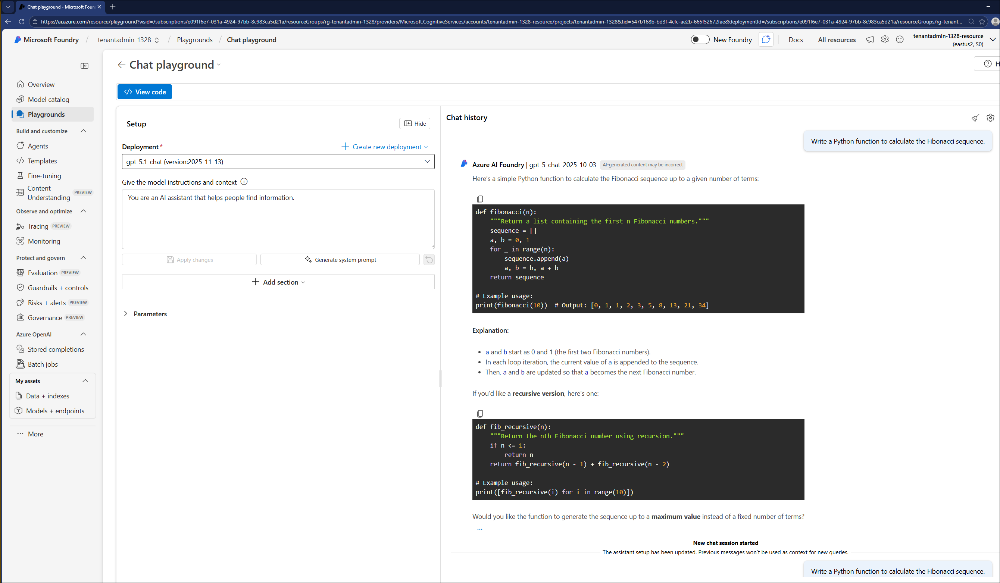

# Lab 05: Generative AI with Azure OpenAI

**Duration:** 75–90 minutes  
**Difficulty:** Intermediate to Advanced

---

## 🎯 Objectives

By the end of this lab, you will be able to:

- Understand Azure OpenAI Service capabilities (GPT, DALL-E, Whisper)
- Use Microsoft Foundry to build and test generative AI solutions
- Explore the Microsoft Foundry model catalog
- Apply responsible AI principles to generative AI workloads
- Build a simple chatbot or content generation application

---

## 📋 Prerequisites

- Azure subscription with Azure OpenAI Service access (requires application approval)
- Completion of previous labs (recommended)
- Basic understanding of APIs and JSON (helpful for advanced exercises)

**Note:** Azure OpenAI Service requires approval. If you don't have access, you can still complete the conceptual exercises and review the documentation.

---

## 🧪 Lab Exercises

### Exercise 1: Explore Azure OpenAI Service Models

**Objective:** Understand the capabilities of different Azure OpenAI models.

[Explore Microsoft Foundry Models](https://learn.microsoft.com/en-us/azure/ai-foundry/concepts/foundry-models-overview?view=foundry-classic&viewFallbackFrom=foundry)

**Available Models:**

1. **GPT-4 and GPT-4 Turbo:**
   - Most capable language model
   - Excellent for complex reasoning, content creation, code generation
   - Supports large context windows (up to 128K tokens)
   - Higher cost, slower than GPT-3.5

2. **GPT-3.5 Turbo:**
   - Fast and cost-effective
   - Good for most common tasks (chatbots, summarization, simple Q&A)
   - Smaller context window (4K-16K tokens)

3. **DALL-E 3:**
   - Image generation from text descriptions
   - Creates photorealistic or artistic images
   - Example prompt: "A futuristic cityscape at sunset with flying cars"

4. **Whisper:**
   - Speech-to-text (transcription)
   - Highly accurate, supports multiple languages
   - Can handle noisy audio

5. **Embeddings (text-embedding-ada-002):**
   - Convert text to vector representations
   - Used for semantic search, recommendations, clustering
   - Enable finding similar documents or passages

**Activity:**

For each scenario, choose the best model:

1. Build a customer support chatbot
2. Generate marketing images for a product launch
3. Transcribe a podcast episode
4. Write complex technical documentation
5. Search through thousands of support tickets to find similar issues

---

### Exercise 2: Use Microsoft Foundry (Prompt Engineering)

**Objective:** Learn to build and test generative AI solutions using Microsoft Foundry.

**Steps:**

1. **Navigate to Microsoft Foundry:**
   - Go to [Microsoft Foundry portal](https://ai.azure.com)
   - Sign in with your Azure account
   - Create a new project

2. **Access the Playground:**
   - Navigate to the "Playground" section
   - Select a deployed GPT model (GPT-4 or GPT-3.5)
   - Configure system message and parameters

3. **System Message (Prompt Engineering):**
   - The system message sets the AI's behavior and role
   - Example: "You are a helpful AI assistant for a customer support team. Be professional, concise, and friendly."

4. **Test Different Prompts:**

   **Example 1: Content Generation**
   - Prompt: "Write a professional email to a customer explaining a product delay."
   - Adjust tone, length, formality

   **Example 2: Code Generation**
   - Prompt: "Write a Python function to calculate the Fibonacci sequence."
   - Test with different languages (JavaScript, C#)

        

   **Example 3: Data Extraction**
   - Prompt: "Extract the name, email, and phone number from this text: [sample unstructured text]"
   - Review JSON output

        

   **Example 4: Summarization**
   - Prompt: "Summarize this article in 3 bullet points: [paste long article]"
   - Test with different lengths

5. **Adjust Parameters:**
   - **Temperature (0-2):** Higher = more creative/random, Lower = more focused/deterministic
   - **Top P (0-1):** Alternative to temperature for controlling randomness
   - **Max tokens:** Limits response length
   - **Frequency penalty:** Reduces repetition

**Deliverables:**

- Screenshots of 3-4 different prompt results
- Discussion: How did changing temperature affect the output?
- Best practices for writing effective prompts

---

### Exercise 3: Explore Microsoft Foundry Model Catalog

**Objective:** Understand the variety of models available beyond Azure OpenAI.

**Steps:**

1. **Navigate to Model Catalog:**
   - In Microsoft Foundry, go to "Model catalog"
   - Browse available models from:
     - Microsoft (Phi-3, Florence)
     - OpenAI (GPT, DALL-E)
     - Meta (Llama)
     - Hugging Face (various open-source models)
     - Mistral, Cohere, and others

2. **Compare Models:**
   - Review model cards with capabilities, limitations, and use cases
   - Compare:
     - Model size (parameters)
     - Context window
     - Supported tasks (chat, completion, embeddings)
     - Pricing

3. **Deploy a Model (Optional):**
   - Select a model and deploy as a managed endpoint
   - Test the endpoint with sample prompts

**Deliverables:**

- Comparison table of 3 models
- Discussion: When would you choose Llama 3 over GPT-4?

---

### Exercise 4: Apply Responsible AI to Generative AI

**Objective:** Implement responsible AI practices for generative AI solutions.

**Responsible AI Considerations for Generative AI:**

1. **Content Filters:**
   - Azure OpenAI includes built-in filters for harmful content
   - Categories: hate, violence, sexual, self-harm
   - Configure filter severity (low, medium, high)

2. **Grounding with Data:**
   - Connect GPT to your own data (Retrieval-Augmented Generation - RAG)
   - Reduces hallucinations (made-up information)
   - Example: Ground chatbot answers in company documentation

3. **Bias and Fairness:**
   - LLMs can amplify biases in training data
   - Test for biased responses across demographics
   - Implement review processes

4. **Misinformation:**
   - LLMs can generate false or misleading information
   - Add disclaimers ("AI-generated content, verify facts")
   - Implement fact-checking processes

5. **Security:**
   - Prompt injection attacks (malicious prompts)
   - Data leakage (exposing training data or sensitive info)
   - Input validation and output monitoring

**Activity:**

1. **Test Content Filters:**
   - Try prompts that might trigger content filters
   - Review how the filters work

2. **Design a Responsible AI Framework:**
   - For a customer-facing chatbot, what safeguards would you implement?
   - How would you monitor for issues?
   - Who is accountable for AI-generated responses?

**Deliverables:**

- Responsible AI framework document
- List of potential risks and mitigation strategies

---

### Exercise 5: Build a Simple Chatbot (Optional)

**Objective:** Create a functional chatbot using Azure OpenAI and Microsoft Foundry.

**Steps:**

1. **Design the Chatbot:**
   - Define the chatbot's purpose (e.g., IT helpdesk, product recommendations)
   - Write a system message
   - Prepare sample questions

2. **Implement in Microsoft Foundry:**
   - Use the Chat playground
   - Configure system message and parameters
   - Test with sample conversations

3. **Add Context (RAG - Optional):**
   - Upload documents (FAQs, product manuals)
   - Enable "Add your data" feature
   - Test how the chatbot uses your data to answer questions

4. **Deploy (Optional):**
   - Deploy the chatbot as a web app
   - Test the deployed endpoint

**Deliverables:**

- System message and configuration
- Sample conversation logs
- Screenshot of chatbot responses

---

## 🧠 Knowledge Check

1. What is the difference between GPT-4 and GPT-3.5?
2. What is DALL-E used for?
3. What does "temperature" control in GPT models?
4. What is grounding and why is it important?
5. Name three responsible AI considerations for generative AI.
6. What is the Microsoft Foundry model catalog?
7. What is prompt engineering?

---

## 📚 Additional Resources

- [Azure OpenAI Service Documentation](https://learn.microsoft.com/en-us/azure/ai-services/openai/)
- [Microsoft Foundry Documentation](https://learn.microsoft.com/en-us/azure/ai-studio/)
- [Prompt Engineering Guide](https://learn.microsoft.com/en-us/azure/ai-services/openai/concepts/prompt-engineering)
- [Responsible AI for Azure OpenAI](https://learn.microsoft.com/en-us/azure/ai-services/openai/concepts/system-message)

---

## ✅ Lab Completion

You have successfully completed Lab 05 and the entire AI-900 lab series! You should now understand:

- Azure OpenAI Service capabilities (GPT, DALL-E, Whisper, embeddings)
- How to use Microsoft Foundry for building generative AI solutions
- Prompt engineering techniques
- The Microsoft Foundry model catalog
- Responsible AI practices for generative AI

**Next Steps:**

- Complete the [official practice assessment](https://learn.microsoft.com/en-us/credentials/certifications/exams/ai-900/practice/assessment?assessment-type=practice&assessmentId=26)
- Review the [Exam Readiness Guide](../../Exam-Readiness.md)
- Schedule your AI-900 exam!

---

**Last updated:** 2025-10-16
