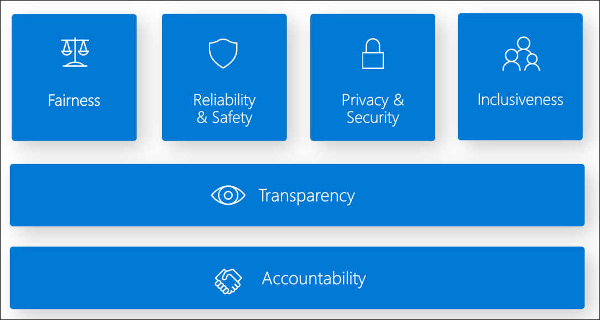

# Lab 01: AI Workloads and Responsible AI

**Duration:** 45–60 minutes  
**Difficulty:** Beginner

---

## 🎯 Objectives

By the end of this lab, you will be able to:

- Identify common AI workload scenarios (computer vision, NLP, document processing, generative AI)
- Understand and apply the six responsible AI principles
- Analyze real-world case studies demonstrating responsible AI implementation
- Recognize ethical considerations when designing AI solutions

---

## 📋 Prerequisites

- Azure subscription (free trial is sufficient)
- Basic understanding of cloud computing concepts
- Access to the Azure Portal

---

## 🧪 Lab Exercises

### Exercise 1: Explore AI Workload Types

**Objective:** Understand the four main categories of AI workloads.

1. **Computer Vision Workloads:**
    - Navigate to Azure AI Vision service in the portal
    - Review sample scenarios: image classification, object detection, OCR, facial analysis
    - Identify use cases (e.g., retail inventory, security cameras, document processing)

    **What It Does:**
    Azure AI Vision analyzes images and videos to extract insights, detect objects and faces, perform OCR, and generate image descriptions. It combines deep learning models with pre-trained capabilities for common vision tasks.

    **Common Use Cases:**
    Retail shelf monitoring, manufacturing quality inspection, security surveillance, medical imaging analysis, accessibility tools, and document digitization.

    [Azure AI Vision Studio](https://portal.vision.cognitive.azure.com/gallery/featured)

    **References:**  
    - [What is Azure AI Vision?](https://learn.microsoft.com/en-us/azure/ai-services/computer-vision/overview)

2. **Natural Language Processing (NLP) Workloads:**

    - Explore Azure AI Language service capabilities
    - Review scenarios: sentiment analysis, entity recognition, key phrase extraction
    - Identify use cases (e.g., customer feedback analysis, chatbots, content moderation)

    **What It Does:**
    Azure AI Language provides NLP capabilities for understanding and analyzing text, including sentiment analysis, entity extraction, language detection, PII detection, and conversational AI.

    **Key Features:**
    Named Entity Recognition, Key Phrase Extraction, Sentiment Analysis, Language Detection, PII Detection, Question Answering, Text Summarization, and Custom Text Classification.

    **Common Use Cases:**
    Customer feedback analysis, chatbot development, email routing, call center analytics, content moderation, and document summarization.

    [Azure AI Language Studio](https://language.cognitive.azure.com/)

    **References:**  
    - [What is Azure AI Language?](https://learn.microsoft.com/en-us/azure/ai-services/language-service/overview)

3. **Document Processing Workloads:**

    - Review Azure AI Document Intelligence (formerly Form Recognizer)
    - Explore prebuilt models for invoices, receipts, business cards
    - Identify use cases (e.g., invoice automation, receipt scanning)

    **What It Does:**
    Azure AI Document Intelligence uses machine learning to extract text, tables, and structured data from documents. It provides prebuilt models for common document types and custom model training capabilities.

    **Key Features:**
    - Prebuilt models: Invoices, receipts, IDs, tax forms (W-2, 1099), business cards, health insurance cards
    - Custom models: Neural and template models for organization-specific documents
    - Advanced OCR with table extraction and selection mark recognition

    **Common Use Cases:**
    Invoice processing, receipt scanning, mortgage document analysis, identity verification, tax form extraction, and medical records digitization.

    [Azure AI Document Intelligence Studio](https://documentintelligence.ai.azure.com/studio)

    **References:**  
    - [What is Azure AI Document Intelligence?](https://learn.microsoft.com/en-us/azure/ai-services/document-intelligence/overview?view=doc-intel-4.0.0)

4. **Generative AI Workloads:**

    - Explore Azure OpenAI Service overview
    - Review capabilities: text generation, code generation, image generation
    - Identify use cases (e.g., content creation, code assistance, virtual assistants)

    **What It Does:**
    Azure OpenAI Service provides access to advanced generative AI models (GPT-4, GPT-4o, DALL-E) that can generate text, code, and images, as well as analyze and understand multimodal content.

    **Key Capabilities:**
    - Text generation and conversational AI
    - Code generation and assistance
    - Image generation (DALL-E)
    - Vision capabilities (image understanding)
    - Embeddings for semantic search

    **Common Use Cases:**
    Content creation, customer service chatbots, code generation, document summarization, language translation, image generation, and knowledge base Q&A.

    [Azure OpenAI Studio](https://oai.azure.com/)

    **References:**  
    - [What is Azure OpenAI Service?](https://learn.microsoft.com/en-us/azure/ai-services/openai/overview)
    - [Introduction to Generative AI](https://learn.microsoft.com/en-us/training/modules/fundamentals-generative-ai/)

**Deliverables:**

- Document at least 2 use cases for each workload type using the table below:

| Workload Type | Use Case | Description | Industry |
|---------------|----------|-------------|----------|
| **Computer Vision** | Retail Shelf Monitoring | Automatically detect out-of-stock items and planogram compliance using cameras and object detection | Retail |
| **Computer Vision** | Medical Imaging Analysis | Assist radiologists in detecting tumors, fractures, and abnormalities in X-rays, CT scans, and MRIs | Healthcare |
| **NLP** | Customer Feedback Analysis | Analyze customer reviews, surveys, and social media posts to extract sentiment and identify trending issues | Customer Service |
| **NLP** | Intelligent Chatbots | Build conversational AI assistants that understand user intent and provide contextual responses | Customer Service |
| **Document Processing** | Invoice Automation | Extract vendor details, line items, totals, and payment information from invoices to automate accounts payable workflows | Finance |
| **Document Processing** | Identity Verification | Extract information from driver's licenses, passports, and ID cards to verify customer identities during onboarding | Banking/Insurance |
| **Generative AI** | Content Creation for Marketing | Generate blog posts, product descriptions, social media content, and advertising copy at scale | Marketing |
| **Generative AI** | Code Generation and Assistance | Help developers write code faster by generating functions, classes, and complete programs from natural language descriptions | Software Development |

- Create a comparison table showing differences between workload types

| Criteria | Computer Vision | NLP | Document Processing | Generative AI |
|----------|----------------|-----|---------------------|---------------|
| **Primary Input** | Images, videos | Text, speech | Documents (PDFs, forms) | Text prompts, images |
| **Primary Output** | Labels, objects, OCR text | Entities, sentiment, summaries | Structured data (key-value pairs) | Original content (text, code, images) |
| **Key Technology** | CNNs, object detection | Transformers (BERT, GPT) | OCR + ML, layout analysis | Large Language Models, diffusion models |
| **Azure Services** | Azure AI Vision | Azure AI Language | Azure AI Document Intelligence | Azure OpenAI Service |
| **Common Use Cases** | Object detection, facial recognition | Sentiment analysis, chatbots | Invoice processing, form extraction | Content creation, virtual assistants |
| **Responsible AI Concerns** | Bias in facial recognition, privacy | Bias in language models, fairness | Data privacy (PII in documents) | Content safety, misinformation |

---

### Exercise 2: Understand Responsible AI Principles

**Objective:** Learn the six core principles of responsible AI.

[What is Responsible AI?](https://learn.microsoft.com/en-us/azure/machine-learning/concept-responsible-ai?view=azureml-api-2)
[Responsible AI Standard](https://msblogs.thesourcemediaassets.com/sites/5/2022/06/Microsoft-Responsible-AI-Standard-v2-General-Requirements-3.pdf)

**The Six Principles:**

1. **Fairness**
   - AI systems should treat all people fairly
   - Avoid reinforcing unfair bias
   - Example: A hiring AI should not discriminate based on gender or race

2. **Reliability and Safety**
   - AI should perform reliably and safely
   - Handle unexpected situations gracefully
   - Example: An autonomous vehicle must safely handle edge cases

3. **Privacy and Security**
   - AI should secure data and respect privacy
   - Implement data protection and access controls
   - Example: A health AI must comply with HIPAA regulations

4. **Inclusiveness**
   - AI should empower everyone and engage people
   - Consider diverse user needs (accessibility, cultural sensitivity)
   - Example: Voice assistants should understand diverse accents

5. **Transparency**
   - AI should be understandable (explainable AI)
   - Users should understand how decisions are made
   - Example: A loan approval AI should explain rejection reasons

6. **Accountability**
   - People should be accountable for AI systems
   - Clear governance and oversight
   - Example: Designate responsible parties for AI system outcomes

**Activity:**

- For each principle, identify a real-world AI scenario where it applies
- Discuss potential consequences of violating each principle

---

### Exercise 3: Case Study Analysis

**Objective:** Apply responsible AI principles to real-world scenarios.

**Case Study 1: Healthcare Diagnosis AI**

A hospital wants to deploy an AI system to assist doctors in diagnosing diseases from medical images.

**Questions:**

1. Which responsible AI principles are most critical for this scenario?
2. What could go wrong if the AI is biased or unreliable?
3. How can transparency be achieved in this context?
4. Who should be accountable if the AI makes an incorrect diagnosis?

**Case Study 2: Hiring Recommendation System**

A company builds an AI to screen job applications and recommend candidates for interviews.

**Questions:**

1. What fairness concerns exist in this scenario?
2. How can the company ensure the AI doesn't discriminate?
3. What data privacy considerations apply?
4. Should candidates be informed that AI is used in screening?

**Case Study 3: Content Moderation AI**

A social media platform uses AI to detect and remove harmful content.

**Questions:**

1. How can the AI balance safety with freedom of expression?
2. What inclusiveness considerations exist (cultural differences, languages)?
3. How should the platform handle false positives (legitimate content flagged as harmful)?
4. Who is accountable for moderation decisions?

**Deliverables:**

- Written analysis for each case study
- Proposed mitigation strategies for identified risks
- Recommended governance framework

---

## 🧠 Knowledge Check

Test your understanding:

1. What are the six responsible AI principles?
2. Which AI workload type would you use to extract text from scanned documents?
3. What is the difference between computer vision and NLP?
4. Why is transparency important in AI systems?
5. What does "fairness" mean in the context of AI?
6. Name three examples of generative AI capabilities.

---

## 📚 Additional Resources

- [Microsoft Responsible AI Principles](https://learn.microsoft.com/en-us/azure/machine-learning/concept-responsible-ai)
- [Azure AI Services Overview](https://learn.microsoft.com/en-us/azure/ai-services/)
- [Responsible AI Transparency Note Examples](tbd)

---

## ✅ Lab Completion

You have successfully completed Lab 01. You should now understand:

- The four main types of AI workloads
- The six responsible AI principles
- How to apply responsible AI thinking to real-world scenarios
- Ethical considerations when designing AI solutions

**Next Steps:** Proceed to [Lab 02: Machine Learning Fundamentals](../lab02-machine-learning-fundamentals/)

---

**Last updated:** 2025-10-16
