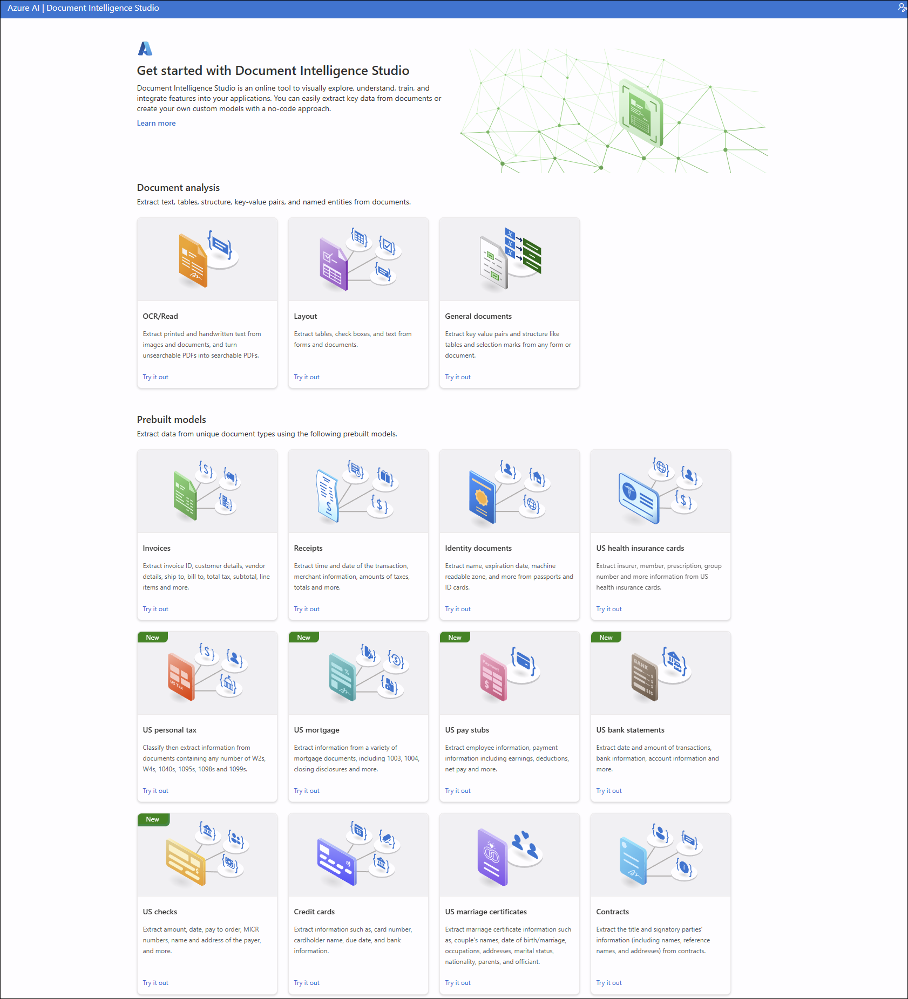

# Lab 01: AI Workloads and Responsible AI

**Duration:** 45–60 minutes  
**Difficulty:** Beginner

---

## 🎯 Objectives

By the end of this lab, you will be able to:

- Identify common AI workload scenarios (computer vision, NLP, document processing, generative AI)
- Understand and apply the six responsible AI principles
- Analyze real-world case studies demonstrating responsible AI implementation
- Recognize ethical considerations when designing AI solutions

---

## 📋 Prerequisites

- Azure subscription (free trial is sufficient)
- Basic understanding of cloud computing concepts
- Access to the Azure Portal

---

## 🧪 Lab Exercises

### Exercise 1: Explore AI Workload Types

**Objective:** Understand the four main categories of AI workloads.

1. **Computer Vision Workloads:**
    - Navigate to Azure AI Vision service in the portal
    - Review sample scenarios: image classification, object detection, OCR, facial analysis
    - Identify use cases (e.g., retail inventory, security cameras, document processing)

    **Description:**

    Azure AI Vision is a cloud-based Azure AI service that provides advanced algorithms for processing images and extracting information from visual content. It enables developers to build intelligent applications that can understand and interpret the visual world through computer vision capabilities.

    **Key Information:**

    - Service Renamed: Part of Azure AI Services (formerly Azure Cognitive Services)
    - Original Name: Computer Vision API / Azure Cognitive Services Vision
    - Current Version: API v4.0 (GA) as of 2024
    - Part of Azure AI Services unified platform

    **What It Does:**

    The service enables organizations to:

    - Analyze images and videos to extract insights and detect objects, people, and activities
    - Extract printed and handwritten text from images using industry-leading OCR technology
    - Detect and analyze faces with attributes like age, emotion, and facial features
    - Generate captions and tags for images automatically
    - Moderate content to detect inappropriate or unsafe visual content
    - Build custom vision models for specialized image classification and object detection scenarios

    **Technology:**

    Azure AI Vision combines:

    - Deep learning models trained on millions of images for robust visual understanding
    - Pre-trained models for common computer vision tasks (object detection, OCR, face analysis)
    - Custom Vision capabilities for training domain-specific models without deep ML expertise
    - Spatial analysis for real-time people tracking and zone monitoring
    - Video analysis capabilities for scene detection and activity recognition

    **Use Cases:**

    Common scenarios include retail shelf monitoring, manufacturing quality inspection, security and surveillance, accessibility tools for visually impaired users, document digitization, and automated image tagging for content management systems.

    [Azure AI Vision Studio](https://portal.vision.cognitive.azure.com/gallery/featured):  

    

    **Features:**

    - **Image Analysis**

        - Object detection and classification
        - Tag generation for images
        - Image captioning and descriptions
        - Scene and activity detection

    **References:**  

    - [What is Image Analysis?](https://learn.microsoft.com/en-us/azure/ai-services/computer-vision/overview-image-analysis?tabs=4-0)

2. **Natural Language Processing (NLP) Workloads:**

    - Explore Azure AI Language service capabilities
    - Review scenarios: sentiment analysis, entity recognition, key phrase extraction
    - Identify use cases (e.g., customer feedback analysis, chatbots, content moderation)

    **Description:**

    Azure AI Language is a cloud-based Azure AI service that provides Natural Language Processing (NLP) capabilities for understanding and analyzing text. It enables developers to build intelligent applications that can extract meaning, identify entities, analyze sentiment, and understand the intent behind human language.

    **Key Information:**

    - Service Renamed: Part of Azure AI Services (formerly Azure Cognitive Services Text Analytics)
    - Original Name: Text Analytics API / Azure Cognitive Services Language Understanding (LUIS)
    - Current Version: API v2024-11-01 (GA) as of 2024
    - Part of Azure AI Services unified platform

    **What It Does:**

    The service enables organizations to:

    - Analyze sentiment and opinions expressed in customer feedback, reviews, and social media
    - Extract key information such as entities, key phrases, and important concepts from unstructured text
    - Detect and redact personally identifiable information (PII) for compliance and privacy protection
    - Build conversational AI applications with natural language understanding capabilities
    - Create question answering systems from knowledge bases and documents
    - Summarize long documents automatically to extract key points
    - Classify text into custom categories for content organization and routing
    - Process medical and healthcare documents to extract clinical information

    **Technology:**

    Azure AI Language combines:

    - Advanced transformer-based models (including BERT-like architectures) for deep language understanding
    - Pre-trained models for common NLP tasks (sentiment analysis, entity recognition, language detection)
    - Custom model training capabilities for domain-specific language understanding without deep ML expertise
    - Multi-lingual support for processing text in 100+ languages
    - Conversational AI frameworks for building intelligent chatbots and virtual assistants

    **Use Cases:**

    Common scenarios include customer feedback analysis, social media monitoring, content moderation, intelligent search, chatbot development, document summarization, call center analytics, and automated email routing.

    [Azure AI Language Studio](https://language.cognitive.azure.com/):  

    

    **Features:**

    - *Named Entity Recognition (NER)* — Identifies and categorizes named entities in text (people, organizations, locations, dates, quantities).
    - *Key Phrase Extraction* — Extracts main concepts and topics from unstructured text to summarize subject matter.
    - *Sentiment Analysis* — Determines overall sentiment of text (positive, negative, neutral, mixed) and returns confidence scores.
    - *Language Detection* — Automatically detects the language of input text from supported languages.
    - *Entity Linking* — Disambiguates entities by linking them to entries in knowledge bases (provides contextual references).
    - *Personally Identifiable Information (PII) Detection* — Identifies and redacts sensitive data (credit cards, SSNs, emails, phone numbers).
    - *Text Analytics for Health* — Extracts clinical and medical entities (medications, diagnoses, symptoms, treatments) from health documents.
    - *Conversational Language Understanding (CLU)* — Builds custom NLU models to extract intents and entities for chatbots and voice assistants.
    - *Question Answering* — Creates knowledge bases from documents/FAQs to answer user questions (QA and retrieval-augmented scenarios).
    - *Custom Named Entity Recognition (Custom NER)* — Trains domain-specific entity extractors for business- or industry-specific entities.
    - *Custom Text Classification* — Builds models to categorize text into user-defined labels for routing or organization.
    - *Text Summarization* — Generates concise summaries from long documents (extractive or abstractive approaches).
    - *Opinion Mining* — Analyzes sentiment at a granular level by identifying aspects (targets) and opinions expressed about them.

    **References:**  

    - [What is Azure AI Language?](https://learn.microsoft.com/en-us/azure/ai-services/language-service/overview)
    - [AI Language Feautures](https://learn.microsoft.com/en-us/azure/ai-services/language-service/concepts/developer-guide?tabs=language-studio)

3. **Document Processing Workloads:**

    - Review Azure AI Document Intelligence (formerly Form Recognizer)
    - Explore prebuilt models for invoices, receipts, business cards
    - Identify use cases (e.g., invoice automation, receipt scanning)

    **Description:**

    Azure AI Document Intelligence (formerly known as Azure Form Recognizer) is a cloud-based Azure AI service that uses machine learning to automatically extract and analyze text, key-value pairs, tables, and structured data from documents.

    **Key Information:**  

    - Service Renamed: July 2023 (from "Azure Form Recognizer" to "Azure AI Document Intelligence")
    - Original Name: Azure Cognitive Services Form Recognizer / Azure Form Recognizer
    - Current Version: v4.0 (GA) as of 2024

    **What It Does:**  
    The service enables organizations to:

    - Automate document processing at scale using industry-leading OCR (Optical Character Recognition)
    - Extract structured data from forms, invoices, receipts, contracts, tax documents, and other business documents
    - Build custom models trained on your specific document types without requiring deep machine learning expertise
    - Classify documents automatically to route them to appropriate workflows
    - Process both structured and unstructured documents including handwritten and printed text

    **Technology:**  
    Document Intelligence combines:

    - Advanced OCR technology for text extraction
    - Machine learning models for understanding document structure
    - Pre-trained models for common document types (invoices, receipts, IDs, tax forms)
    - Custom model training capabilities for organization-specific documents

    **Use Cases:**  
    Common scenarios include accounts payable automation, mortgage document processing, tax form extraction, identity verification, and robotic process automation (RPA) workflows.

    [Azure AI Document Intelligence Studio](https://documentintelligence.ai.azure.com/studio):

    

    **Features:**  

    - **Document Analysis Models**

        - **Read Model** — Extracts printed and handwritten text from documents with industry-leading OCR
        - **Layout Model** — Extracts text, tables, selection marks, document structure, paragraphs, sections, and figures with markdown output support
        - **General Document Model** — Extracts text, structure, and key-value pairs from documents (deprecated in newer versions)

    - **Prebuilt Models for Financial Services & Legal**

        - Invoice processing — Extracts customer and vendor details, line items, totals, and payment information
        - Receipt processing — Extracts merchant details, transaction amounts, dates, and tax information
        - Bank statement analysis — Extracts account information, transactions, and balance details
        - Check processing — Extracts routing numbers, account numbers, check amounts, and payee information
        - Contract analysis — Extracts agreement details, party information, and key clauses
        - Credit card extraction — Extracts payment card information and details
        - Pay stub processing — Extracts employee compensation details, deductions, and employer information

    - **Prebuilt Models for US Tax Forms**

        - Unified US Tax processing — Extracts data from any supported US tax form
        - W-2 forms — Extracts taxable compensation details
        - 1098 forms (and variations) — Extracts mortgage interest, tuition, and other 1098 form data
        - 1099 forms (and variations) — Extracts income reporting details from various 1099 forms
        - 1040 forms (and variations) — Extracts individual income tax return information

    - **Prebuilt Models for US Mortgage Documents**

        - Form 1003 (URLA) — Extracts loan application details
        - Form 1004 (URAR) — Extracts property appraisal information
        - Form 1005 — Extracts verification of employment details
        - Form 1008 — Extracts underwriting and transmittal summary data
        - Closing Disclosure — Extracts final mortgage loan terms and closing details

    - **Prebuilt Models for Personal Identification**

        - Identity document (ID) processing — Extracts information from passports, driver's licenses, and ID cards with support for endorsements and restrictions
        - Health insurance card — Extracts insurance coverage details, policy numbers, group numbers, and Medicare/Medicaid information
        - Marriage certificate — Extracts certified marriage information and party details
        - Business card — Extracts contact information, company details, and communication data

    - **Custom Models**

        - **Custom Neural Model** — Extracts data from mixed-type documents (structured, semi-structured, and unstructured) using deep learning
        - **Custom Template Model** — Extracts labeled fields from documents with consistent layouts
        - **Custom Composed Model** — Combines multiple custom models to handle various document types in a single workflow
        - **Custom Classification Model** — Identifies and classifies document types before extraction

    - **Add-on Capabilities**

        - High-resolution OCR — Enhanced extraction for high-resolution documents
        - Formula extraction — Detects and extracts mathematical formulas
        - Font property extraction — Identifies font styles and properties
        - Barcode extraction — Detects and extracts barcode information
        - Language detection — Identifies languages in multilingual documents
        - Searchable PDF generation — Creates searchable PDFs from scanned documents
        - Query fields — Extracts specific fields using natural language queries
        - Key-value pair extraction — Identifies and extracts key-value relationships

    - **Document Structure Analysis**

        - Table extraction with row and cell confidence scores
        - Paragraph detection and role identification
        - Selection mark recognition (checkboxes and radio buttons)
        - Section and subsection hierarchical analysis
        - Figure detection and extraction
        - Document page and region analysis

    **References:**  

    - [What is Azure AI Document Intelligence?](https://learn.microsoft.com/en-us/azure/ai-services/document-intelligence/overview?view=doc-intel-4.0.0)
    - [Azure AI Document Intelligence Studio](https://documentintelligence.ai.azure.com/studio)

4. **Generative AI Workloads:**

- Explore Azure OpenAI Service overview
- Review capabilities: text generation, code generation, image generation
- Identify use cases (e.g., content creation, code assistance, virtual assistants)

**Deliverables:**

- Document at least 2 use cases for each workload type
- Create a comparison table showing differences between workload types

**References:**  

- [Microsoft Learn Module: Introduction to AI concepts](https://learn.microsoft.com/en-us/training/modules/get-started-ai-fundamentals/)
- [AI Foundry](https://ai.azure.com/)
  
---

### Exercise 2: Understand Responsible AI Principles

**Objective:** Learn the six core principles of responsible AI.

**The Six Principles:**

1. **Fairness**
   - AI systems should treat all people fairly
   - Avoid reinforcing unfair bias
   - Example: A hiring AI should not discriminate based on gender or race

2. **Reliability and Safety**
   - AI should perform reliably and safely
   - Handle unexpected situations gracefully
   - Example: An autonomous vehicle must safely handle edge cases

3. **Privacy and Security**
   - AI should secure data and respect privacy
   - Implement data protection and access controls
   - Example: A health AI must comply with HIPAA regulations

4. **Inclusiveness**
   - AI should empower everyone and engage people
   - Consider diverse user needs (accessibility, cultural sensitivity)
   - Example: Voice assistants should understand diverse accents

5. **Transparency**
   - AI should be understandable (explainable AI)
   - Users should understand how decisions are made
   - Example: A loan approval AI should explain rejection reasons

6. **Accountability**
   - People should be accountable for AI systems
   - Clear governance and oversight
   - Example: Designate responsible parties for AI system outcomes

**Activity:**

- For each principle, identify a real-world AI scenario where it applies
- Discuss potential consequences of violating each principle

---

### Exercise 3: Case Study Analysis

**Objective:** Apply responsible AI principles to real-world scenarios.

**Case Study 1: Healthcare Diagnosis AI**

A hospital wants to deploy an AI system to assist doctors in diagnosing diseases from medical images.

**Questions:**

1. Which responsible AI principles are most critical for this scenario?
2. What could go wrong if the AI is biased or unreliable?
3. How can transparency be achieved in this context?
4. Who should be accountable if the AI makes an incorrect diagnosis?

**Case Study 2: Hiring Recommendation System**

A company builds an AI to screen job applications and recommend candidates for interviews.

**Questions:**

1. What fairness concerns exist in this scenario?
2. How can the company ensure the AI doesn't discriminate?
3. What data privacy considerations apply?
4. Should candidates be informed that AI is used in screening?

**Case Study 3: Content Moderation AI**

A social media platform uses AI to detect and remove harmful content.

**Questions:**

1. How can the AI balance safety with freedom of expression?
2. What inclusiveness considerations exist (cultural differences, languages)?
3. How should the platform handle false positives (legitimate content flagged as harmful)?
4. Who is accountable for moderation decisions?

**Deliverables:**

- Written analysis for each case study
- Proposed mitigation strategies for identified risks
- Recommended governance framework

---

## 🧠 Knowledge Check

Test your understanding:

1. What are the six responsible AI principles?
2. Which AI workload type would you use to extract text from scanned documents?
3. What is the difference between computer vision and NLP?
4. Why is transparency important in AI systems?
5. What does "fairness" mean in the context of AI?
6. Name three examples of generative AI capabilities.

---

## 📚 Additional Resources

- [Microsoft Responsible AI Principles](https://learn.microsoft.com/en-us/azure/machine-learning/concept-responsible-ai)
- [Azure AI Services Overview](https://learn.microsoft.com/en-us/azure/ai-services/)
- [Responsible AI Transparency Note Examples](https://learn.microsoft.com/en-us/azure/ai-services/openai/concepts/transparency-note)

---

## ✅ Lab Completion

You have successfully completed Lab 01. You should now understand:

- The four main types of AI workloads
- The six responsible AI principles
- How to apply responsible AI thinking to real-world scenarios
- Ethical considerations when designing AI solutions

**Next Steps:** Proceed to [Lab 02: Machine Learning Fundamentals](../lab02-machine-learning-fundamentals/)

---

**Last updated:** 2025-10-16
