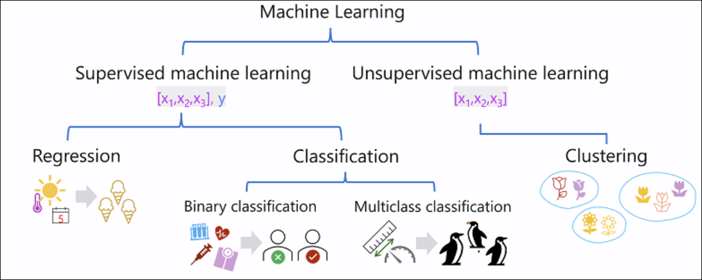
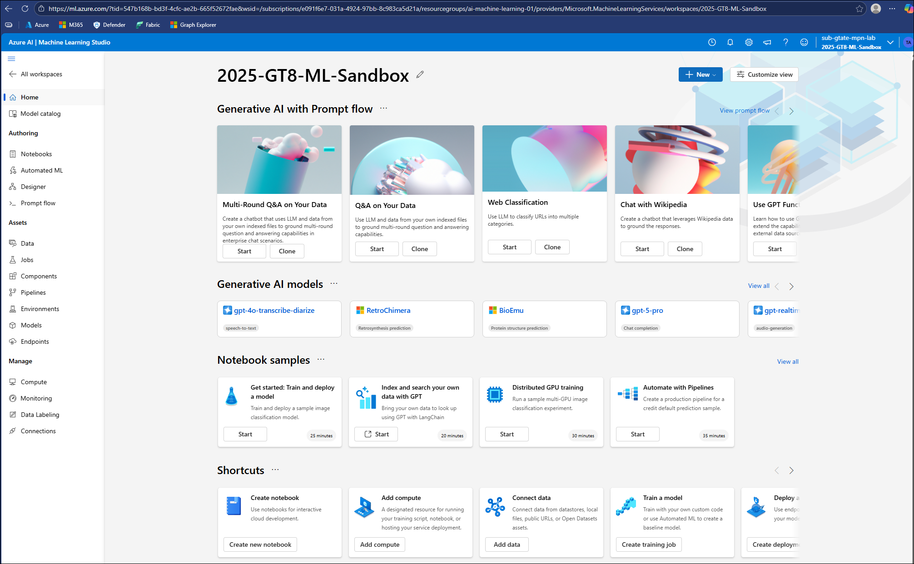
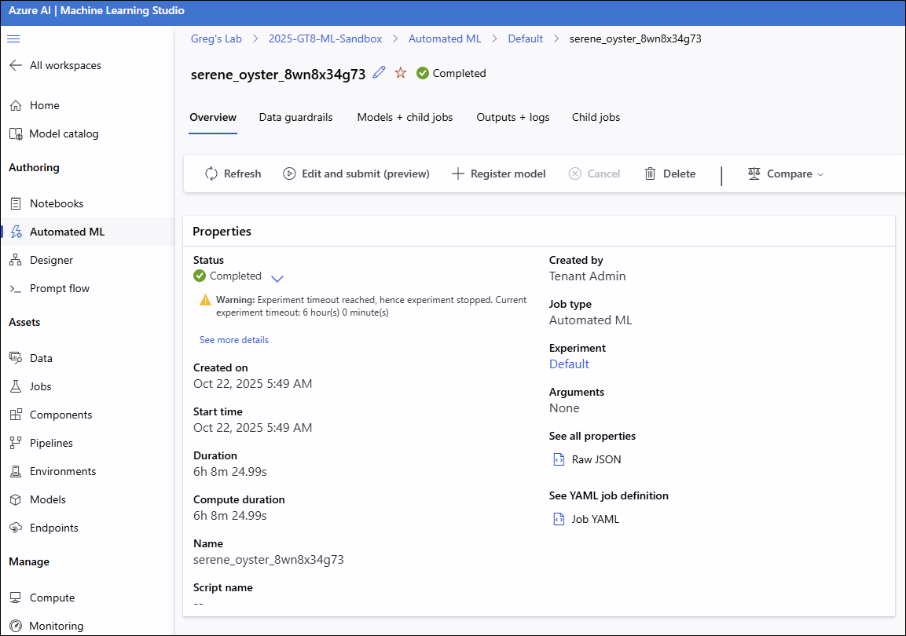
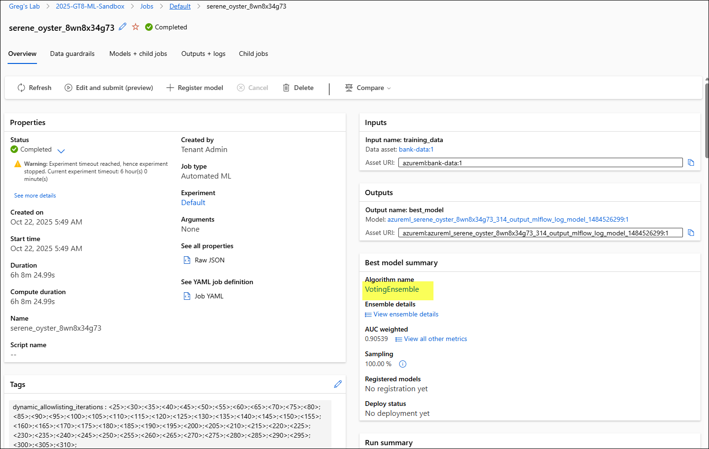
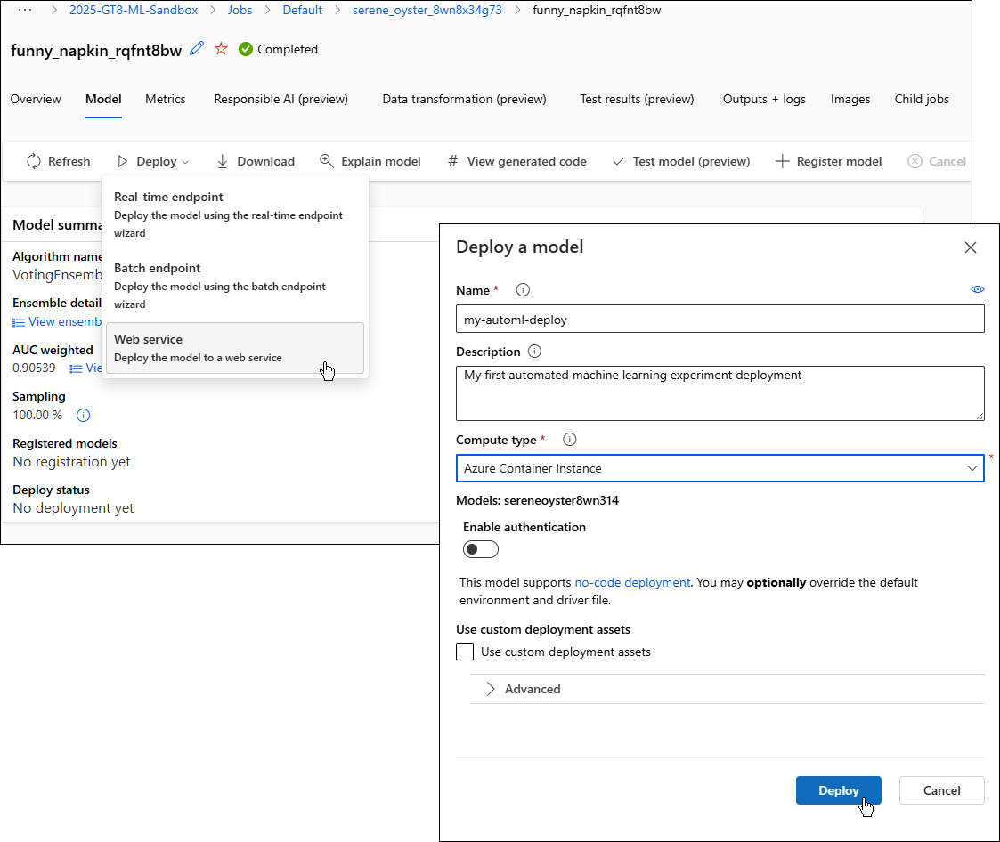

# Lab 02: Machine Learning Fundamentals

**Duration:** 60–90 minutes  
**Difficulty:** Beginner to Intermediate

---

## 🎯 Objectives

By the end of this lab, you will be able to:

- Identify regression, classification, and clustering scenarios
- Understand core machine learning concepts (features, labels, training, validation)
- Use Azure Machine Learning automated ML to train and deploy a model
- Understand deep learning and Transformer architecture concepts

---

## 📋 Prerequisites

- Azure subscription with access to create Azure Machine Learning workspaces
- Completion of Lab 01 (recommended)
- Basic understanding of data and statistics (helpful but not required)

---

## 🧪 Lab Exercises

### Exercise 1: Understand Machine Learning Techniques

**Objective:** Learn to identify different types of machine learning problems.

Types of machine learning models:

**Overview of Machine Learning Types:**

- **Supervised Learning:** The model learns from labeled data where both input features and correct outputs (labels) are provided. The algorithm learns patterns to map inputs to outputs. Used for regression and classification tasks.

- **Unsupervised Learning:** The model finds patterns and structure in unlabeled data without predefined outputs. The algorithm discovers hidden relationships on its own. Used for clustering and dimensionality reduction.

- **Reinforcement Learning:** The model learns through trial and error by interacting with an environment. It receives rewards or penalties for actions and learns to maximize cumulative rewards. Used in robotics, game AI, and autonomous systems.

**1. Regression (Predict a Numeric Value)**  

- **Goal:** Predict a continuous numeric value
- **Examples:**
  - Predict house prices based on size, location, bedrooms
  - Forecast sales revenue based on marketing spend
  - Estimate patient recovery time based on treatment and demographics
- **Output:** A number (e.g., $250,000, 15 days, 42.5 units)

**2. Classification (Predict a Category)**  

- **Goal:** Predict which category or class something belongs to
- **Examples:**
  - Is this email spam or not spam? (binary classification)
  - Which animal is in this image: cat, dog, or bird? (multi-class classification)
  - Will a customer churn? (yes/no)
- **Output:** A category or label (e.g., "spam", "cat", "yes")
  
- **Goal:** Find groups of similar items without predefined labels (unsupervised learning)
- **Examples:**
  - Customer segmentation based on purchase behavior
  - Group similar articles or documents
  - Anomaly detection (items that don't fit any cluster)
- **Output:** Cluster assignments (e.g., Cluster 1, Cluster 2, Cluster 3)

**🔍 Key Difference: Clustering vs. Multiclass Classification**

While both clustering and multiclass classification group items into categories, they differ fundamentally:

- **Multiclass Classification (Supervised):**
  - You already know the classes/categories beforehand (e.g., cat, dog, bird)
  - Training data includes labeled examples showing which class each item belongs to
  - The algorithm learns the relationship between features and known labels
  - Used to predict which predefined class a new item belongs to

- **Clustering (Unsupervised):**
  - No predefined classes or labels exist
  - The algorithm discovers natural groupings based purely on similarity of features
  - Groups are formed without prior knowledge of what the groups should be
  - Often used to discover what categories exist before building a classification model

**Example:** If you have photos labeled as "cat," "dog," or "bird," you'd use **classification**. If you have unlabeled photos and want to discover natural groupings (without knowing what those groups are), you'd use **clustering**.

**Activity:**

For each scenario below, identify if it's regression, classification, or clustering:

1. Predict tomorrow's temperature - **regression** ✅
   - *Correct! Temperature is a continuous numeric value (e.g., 72.5°F). Regression predicts numbers.*

2. Group customers by purchasing patterns - **clustering** ✅
   - *Correct! This is unsupervised learning discovering natural groupings without predefined categories.*

3. Determine if a transaction is fraudulent - **classification** ✅
   - *Correct! Binary classification with two categories: fraudulent or not fraudulent (yes/no).*

4. Estimate delivery time for a package - **regression** ✅
   - *Correct! Delivery time is a numeric value (e.g., 2.5 days, 48 hours). Regression predicts continuous values.*

5. Segment website visitors into personas - **clustering** ✅
   - *Correct! Unsupervised learning discovering visitor segments based on behavior without predefined personas.*

**📚 Related Documentation:**

- [Introduction to Machine Learning Concepts](https://learn.microsoft.com/en-us/training/modules/fundamentals-machine-learning/) - Main learning module covering all ML techniques
- [Types of Machine Learning](https://learn.microsoft.com/en-us/training/modules/fundamentals-machine-learning/3-types-of-machine-learning) - Supervised vs. unsupervised learning
- [Regression](https://learn.microsoft.com/en-us/training/modules/fundamentals-machine-learning/4-regression) - Predicting numeric values
- [Binary Classification](https://learn.microsoft.com/en-us/training/modules/fundamentals-machine-learning/5-binary-classification) - Two-class classification problems
- [Multiclass Classification](https://learn.microsoft.com/en-us/training/modules/fundamentals-machine-learning/6-multiclass-classification) - Multiple category predictions
- [Clustering](https://learn.microsoft.com/en-us/training/modules/fundamentals-machine-learning/7-clustering) - Grouping similar items
- [AI-900 Study Guide](https://learn.microsoft.com/en-us/credentials/certifications/resources/study-guides/ai-900) - Official exam study guide
- [Machine Learning Algorithm Cheat Sheet](https://learn.microsoft.com/en-us/azure/machine-learning/algorithm-cheat-sheet) - Supervised vs. unsupervised learning explained

---

### Exercise 2: Core Machine Learning Concepts

**Objective:** Understand the fundamental concepts used in machine learning.

**Key Concepts:**

- **Features:** Input variables (columns) used to make predictions (e.g., square footage, bedrooms, location)
- **Labels:** The target variable you want to predict (e.g., house price) — only in supervised learning
- **Training dataset:** Data used to teach the model (typically 70-80% of total data)
- **Validation dataset:** Data used to tune and evaluate the model during training (10-15%)
- **Test dataset:** Held-out data used for final performance evaluation (10-15%)
- **Model:** The mathematical representation learned from data
- **Inference:** Using the trained model to make predictions on new data

**Activity:**

Given a dataset of house sales with columns: `SquareFeet`, `Bedrooms`, `Bathrooms`, `Location`, `YearBuilt`, `SalePrice`:

1. **Which columns are features?** - `SquareFeet`, `Bedrooms`, `Bathrooms`, `Location`, `YearBuilt` ✅
   - *Correct! Features are the input variables (independent variables) used to make predictions. They provide information about each house that helps the model learn patterns.*

2. **Which column is the label?** - `SalePrice` ✅
   - *Correct! The label (also called target variable or dependent variable) is what you're trying to predict. In supervised learning, this is the "answer" that the model learns to predict based on the features.*

3. **Is this a regression or classification problem?** - Regression ✅
   - *Correct! Since `SalePrice` is a continuous numeric value (like $250,000 or $375,500), this is a regression problem. Classification would be used if you were predicting categories (like "affordable," "moderate," "expensive").*

4. **How would you split the data for training, validation, and testing?** - Use a **70/15/15 split**:
   - **Training Set (70%):** Used to train the model and learn patterns between features and sale prices
   - **Validation Set (15%):** Used to tune the model, compare different algorithms, and select the best performing model during training
   - **Test Set (15%):** Held completely separate until the end to evaluate final model performance on unseen data
   - **Important:** Shuffle the data randomly before splitting to avoid any ordering bias in the original dataset

   *Alternative common splits: 80/10/10 or 60/20/20 (for smaller datasets). The key principle is to reserve separate data for validation (model tuning) and testing (final evaluation) to ensure the model generalizes well to new, unseen data.*

**📚 Related Documentation:**

- [Machine learning model](https://learn.microsoft.com/en-us/dotnet/machine-learning/mldotnet-api#machine-learning-model) - Features and labels explanation
- [Learn Module: Build Classical ML Models with Supervised Learning](https://learn.microsoft.com/en-us/training/modules/introduction-to-classical-machine-learning/) - Define supervised learning and model training concepts
- [What is Machine Learning?](https://learn.microsoft.com/en-us/training/modules/fundamentals-machine-learning/2-what-is-machine-learning) - Core ML concepts including features and labels
- [Configure Training, Validation, and Test Data in Automated ML](https://learn.microsoft.com/en-us/azure/machine-learning/how-to-configure-cross-validation-data-splits) - Data splits and cross-validation
- [Training, Validation, and Test Data Overview](https://learn.microsoft.com/en-us/azure/machine-learning/concept-automated-ml#training-validation-and-test-data) - Understanding data partitioning
- [Model Training and Inference](https://learn.microsoft.com/en-us/azure/machine-learning/concept-automl-forecasting-evaluation#inference-scenarios) - Using trained models to make predictions

---

### Exercise 3: Use Azure Machine Learning Automated ML

**Objective:** Train a machine learning model using Azure ML's no-code automated ML capability.

[Tutorial: Train a classification model with no-code AutoML in the Azure Machine Learning studio](https://learn.microsoft.com/en-us/azure/machine-learning/tutorial-first-experiment-automated-ml?view=azureml-api-2)

**Steps:**

1. **Create an Azure Machine Learning Workspace:**
   - Navigate to Azure Portal
   - Create a new resource: "Machine Learning"
   - Fill in resource group, workspace name, region
   - Create the workspace (takes a few minutes)

2. **Launch Azure ML Studio:**
   - Once created, click "Launch studio"
   - This opens the Azure ML Studio web interface

    

3. **Create a Dataset:**
   - Navigate to "Data" → "Create" ([Create and load a dataset as a data asset](https://learn.microsoft.com/en-us/azure/machine-learning/tutorial-first-experiment-automated-ml?view=azureml-api-2#create-and-load-a-dataset-as-a-data-asset))
   - Upload a sample dataset ([Bank Marketing Dataset](https://archive.ics.uci.edu/dataset/222/bank+marketing))

4. **Run Automated ML:**
   - Navigate to "Automated ML" → "New Automated ML job"
   - Select your dataset
   - Choose task type: Regression, Classification, or Time Series Forecasting
   - Select target column (label)
   - Configure settings:
     - Primary metric (e.g., accuracy for classification, R² for regression)
     - Training time limit (shorter for labs, e.g., 15 minutes)
   - Submit the job

        

5. **Review Results:**
   - Once complete, review the best model
   - Examine metrics (accuracy, precision, recall, F1 score, etc.)
   - Review feature importance

        

6. **Deploy the Model (Optional):**
   - Deploy the best model as a web service endpoint ([Deploy the best model](https://learn.microsoft.com/en-us/azure/machine-learning/tutorial-first-experiment-automated-ml?view=azureml-api-2#deploy-the-best-model))

        

        

   - Test the endpoint with sample data

**Deliverables:**

- Screenshot of best model and metrics
- Description of which algorithm performed best
- Explanation of top 3 most important features

**References:**  

- [Tutorial: Train a classification model with no-code AutoML in the Azure Machine Learning studio](https://learn.microsoft.com/en-us/azure/machine-learning/tutorial-first-experiment-automated-ml?view=azureml-api-2)
- [Bank Marketing Dataset](https://archive.ics.uci.edu/dataset/222/bank+marketing)

---

### Exercise 4: Understand Deep Learning and Transformers

**Objective:** Learn about advanced machine learning techniques.

[Deep learning vs machine learning in Azure Machine Learning](https://learn.microsoft.com/en-us/azure/machine-learning/concept-deep-learning-vs-machine-learning?view=azureml-api-2)

**AI, Machine Learning, and Deep Learning — Relationship (per Microsoft docs):**

- Artificial Intelligence (AI) is the broad field of building systems that perform tasks requiring human-like intelligence (reasoning, perception, decision-making).
- Machine Learning (ML) is a subset of AI where systems learn patterns from data instead of relying only on hand-crafted rules.
- Deep Learning (DL) is a subset of ML that uses deep neural networks to automatically learn representations, excelling with large amounts of data and unstructured inputs (images, audio, text).
- Inclusion relationship: AI ⊃ ML ⊃ DL. Not every AI solution uses ML, and not every ML problem needs DL. DL often provides higher accuracy on unstructured data but typically requires more data, compute, and may be less interpretable.

**Generative AI — Where it fits (per Microsoft docs):**

- Generative AI is an application area within AI that focuses on creating new content (text, images, code, audio).
- It is typically powered by deep learning–based generative models (e.g., Transformers for LLMs, diffusion models, GANs, VAEs), so it largely sits inside DL ⊂ ML ⊂ AI.
- Not all DL is generative; many DL models are discriminative. Generative AI emphasizes content creation, while discriminative models focus on prediction/classification.
- In Azure, services like Azure OpenAI provide generative models built on Transformer architectures.

**Deep Learning:**

- Uses neural networks with multiple layers (hence "deep")
- Excels at image, speech, and text processing
- **Convolutional Neural Networks (CNNs):** Specialized for images
- **Recurrent Neural Networks (RNNs):** Specialized for sequences (text, time series)
- Requires large amounts of data and computational power

**Transfer Learning (per Microsoft docs):**

- Reuse a model pre-trained on a large dataset and adapt it to a new, related task instead of training from scratch.
- Two common approaches:
  - Feature extraction: freeze earlier layers as generic feature extractors, train a new classifier head.
  - Fine-tuning: unfreeze some/all layers and continue training on your task data.
- Benefits: requires less labeled data and compute, converges faster, and often improves accuracy when data is limited.
- Typical use cases: computer vision (e.g., adapting ImageNet-trained CNNs), NLP (e.g., adapting BERT/GPT), and speech.
- In Azure Machine Learning, you can build transfer learning workflows using pre-trained models and fine-tuning within your training pipelines.

**Types of Artificial Neural Networks (per Microsoft docs):**

- Feedforward (DNN/MLP): stacked fully connected layers; strong baseline for tabular data; no recurrence or convolution.
- Convolutional Neural Networks (CNNs): use convolutions/pooling to learn spatial features; excel on images and video.
- Recurrent Neural Networks (RNNs): model sequences and time dependencies; LSTM/GRU variants mitigate vanishing gradients.
- Autoencoders/VAEs: encoder–decoder nets that learn compact representations; used for denoising, compression, anomaly detection.
- Generative Adversarial Networks (GANs): generator vs discriminator setup for content synthesis (e.g., images), data augmentation.
- Transformers: attention-based sequence models that scale well; foundation for LLMs and many generative AI workloads.

**CNNs vs RNNs — Key Differences (exam)**

- Data structure and inductive bias:
  - CNNs: exploit spatial locality with shared kernels and pooling; translation invariance on grid-like data (images/video).
  - RNNs: exploit temporal order with recurrent connections; model dependencies across time steps.
- Parallelism and training:
  - CNNs: highly parallelizable across spatial dimensions; typically faster to train on modern hardware.
  - RNNs: inherently sequential across time steps; slower and harder to parallelize.
- Context modeling:
  - CNNs: strong at local patterns via receptive fields; use depth/dilation to expand context.
  - RNNs: better for sequence dependencies; LSTM/GRU mitigate vanishing gradients for longer-range context.
- Variable-length handling:
  - CNNs: usually require fixed-size windows/padding or global pooling.
  - RNNs: naturally handle variable-length sequences.
- Typical use cases:
  - CNNs: image classification, object detection, segmentation, video tasks.
  - RNNs: language modeling, sequence labeling (NER), time-series forecasting, speech.
- Outputs:
  - CNNs: produce feature maps; add fully connected head for classification/regression.
  - RNNs: produce hidden states per step or a final summary state; suited for seq-to-seq and sequence tagging.
- Note: 1D CNNs can work on sequences, and Transformers increasingly replace RNNs for many NLP tasks.

**Transformer Architecture:**

- Modern architecture that revolutionized NLP
- Uses "attention mechanisms" to understand context
- Foundation for models like BERT, GPT, T5
- Powers Azure OpenAI Service models

**Activity:**

1. Research one real-world application of CNNs
2. Research one real-world application of Transformers
3. Explain why Transformers are well-suited for language understanding

---

## 🧠 Knowledge Check

1. What is the difference between regression and classification?
2. Is clustering supervised or unsupervised learning?
3. What is the purpose of a validation dataset?
4. What does AutoML do?
5. Name two types of deep learning architectures.
6. What is the Transformer architecture used for?

---

## 📚 Additional Resources

- [Azure Machine Learning Documentation](https://learn.microsoft.com/en-us/azure/machine-learning/)
- [Automated ML Overview](https://learn.microsoft.com/en-us/azure/machine-learning/concept-automated-ml)
- [Deep Learning Fundamentals](https://learn.microsoft.com/en-us/training/modules/intro-to-deep-learning/)
- [Machine Learning Algorithm Cheat Sheet](https://learn.microsoft.com/en-us/azure/machine-learning/algorithm-cheat-sheet?view=azureml-api-1&viewFallbackFrom=azureml-api-2&WT.mc_id=docs-article-lazzeri)

---

## ✅ Lab Completion

You have successfully completed Lab 02. You should now understand:

- The difference between regression, classification, and clustering
- Core ML concepts: features, labels, training/validation/test datasets
- How to use Azure ML Automated ML
- Deep learning and Transformer architecture basics

**Next Steps:** Proceed to [Lab 03: Computer Vision on Azure](../lab03-computer-vision/)

---

**Last updated:** 2025-10-16
