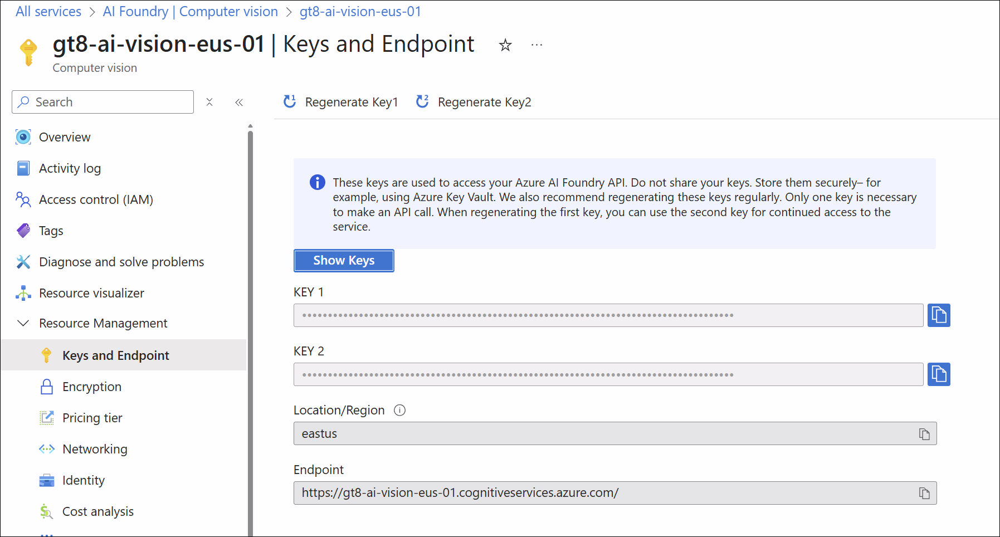

# Lab 03: Computer Vision on Azure

**Duration:** 60–75 minutes  
**Difficulty:** Intermediate

**Aligned with Microsoft Learn:**  
This lab aligns with the [Microsoft Azure AI Fundamentals: Computer Vision](https://learn.microsoft.com/en-us/training/paths/explore-computer-vision-microsoft-azure/) learning path and prepares you for the [AI-900: Microsoft Azure AI Fundamentals](https://learn.microsoft.com/en-us/credentials/certifications/azure-ai-fundamentals/) certification exam.

---

## 🎯 Objectives

By the end of this lab, you will be able to:

- Use Azure AI Vision service for image analysis and object detection
- Perform optical character recognition (OCR) on documents
- Use Azure AI Face service for facial detection and analysis
- Understand when to use each computer vision service

---

## 📋 Prerequisites

- Azure subscription with ability to create AI services ([Create a free account](https://azure.microsoft.com/pricing/purchase-options/azure-account))
- Completion of Lab 01 and Lab 02 (recommended)
- Sample images for testing (or use provided URLs)
- [Azure Portal access](https://portal.azure.com)

---

## 🧪 Lab Exercises

### Exercise 1: Image Analysis with Azure AI Vision

**Objective:** Analyze images to extract tags, captions, and objects.

**Microsoft Learn Module:** [Analyze images with the Azure AI Vision service](https://learn.microsoft.com/en-us/training/modules/analyze-images/)

**Reference Documentation:**

- [What is Azure AI Vision Image Analysis?](https://learn.microsoft.com/en-us/azure/ai-services/computer-vision/overview-image-analysis)
- [Object detection concepts](https://learn.microsoft.com/en-us/azure/ai-services/computer-vision/concept-object-detection)
- [Quickstart: Image Analysis](https://learn.microsoft.com/en-us/azure/ai-services/computer-vision/quickstarts-sdk/image-analysis-client-library-40)

**Steps:**

1. **Create Azure AI Vision Resource:**
   - Navigate to Azure Portal
   - Create resource: "Computer Vision" or "Azure AI services"
   - Note the endpoint URL and API key

        

   - [Learn more: Create a Computer Vision resource](https://learn.microsoft.com/en-us/azure/ai-services/computer-vision/quickstarts-sdk/image-analysis-client-library#prerequisites)

2. **Test Image Analysis (Portal):**
   - In the resource overview, click "Try it out" or "Quick start"
   - Upload a sample image or use a URL
   - Review detected:
     - Tags (keywords describing the image)
     - Captions (generated descriptions)
     - Objects (detected items with bounding boxes)
     - Colors, brands, faces
   - [Tutorial: Analyze an image in Vision Studio](https://learn.microsoft.com/en-us/azure/ai-services/computer-vision/quickstarts-sdk/image-analysis-client-library-40#analyze-an-image)

3. **Test via REST API or SDK (Optional):**
   - Use Python SDK or cURL to call the Analyze Image API
   - Extract tags, captions, and objects programmatically
   - [Code samples: Analyze Image API](https://learn.microsoft.com/en-us/azure/ai-services/computer-vision/how-to/call-analyze-image)

**Sample Images to Try:**

- Street scene with cars and pedestrians
- Retail store with products on shelves
- Landscape with mountains and trees
- Food on a plate

**Deliverables:**

- Screenshot of analysis results for 2-3 images
- List of detected tags and objects
- Discussion: How accurate were the results?

---

### Exercise 2: Optical Character Recognition (OCR)

**Objective:** Extract text from images and documents using the Read API.

**Microsoft Learn Module:** [Read text in images and documents with the Computer Vision service](https://learn.microsoft.com/en-us/training/modules/read-text-images-documents-with-computer-vision-service/)

**Reference Documentation:**

- [What is OCR (Optical Character Recognition)?](https://learn.microsoft.com/en-us/azure/ai-services/computer-vision/overview-ocr)
- [OCR for images (version 4.0)](https://learn.microsoft.com/en-us/azure/ai-services/computer-vision/concept-ocr)
- [Call the Read API](https://learn.microsoft.com/en-us/azure/ai-services/computer-vision/how-to/call-read-api)

**Steps:**

1. **Use the Read API:**
   - In the Azure AI Vision resource, navigate to OCR features
   - Test the Read API with a sample document image
   - Try different types of documents:
     - Scanned book page
     - Handwritten note
     - Receipt or invoice
     - Street sign
   - [Learn more: Read printed and handwritten text](https://learn.microsoft.com/en-us/azure/ai-services/computer-vision/quickstarts-sdk/client-library#read-printed-and-handwritten-text)

2. **Review Extracted Text:**
   - Examine the extracted text
   - Note confidence scores
   - Check for errors or misreads
   - [Language support for OCR](https://learn.microsoft.com/en-us/azure/ai-services/computer-vision/language-support#optical-character-recognition-ocr)

3. **Test via SDK (Optional):**
   - Use Python or C# SDK to extract text programmatically
   - Process the results (e.g., search for specific keywords)
   - [Quickstart: Azure AI Vision OCR SDK](https://learn.microsoft.com/en-us/azure/ai-services/computer-vision/quickstarts-sdk/client-library)

**Deliverables:**

- Screenshot of OCR results
- Accuracy assessment (were there any errors?)
- Discussion: When would OCR be useful in a business context?

---

### Exercise 3: Facial Detection and Analysis with Azure AI Face

**Objective:** Detect faces and analyze facial attributes.

**Microsoft Learn Module:** [Detect, analyze, and recognize faces](https://learn.microsoft.com/en-us/training/modules/detect-analyze-recognize-faces/)

**Reference Documentation:**

- [What is Azure AI Face service?](https://learn.microsoft.com/en-us/azure/ai-services/computer-vision/overview-identity)
- [Face detection and attributes](https://learn.microsoft.com/en-us/azure/ai-services/computer-vision/concept-face-detection)
- [Call the Detect API](https://learn.microsoft.com/en-us/azure/ai-services/computer-vision/how-to/identity-detect-faces)

**Steps:**

**Steps:**

1. **Create Azure AI Face Resource:**
   - Navigate to Azure Portal
   - Create resource: "Face" service
   - Note the endpoint URL and API key
   - [Learn more: Face API prerequisites](https://learn.microsoft.com/en-us/azure/ai-services/computer-vision/quickstarts-sdk/identity-client-library)

2. **Test Face Detection (Portal):**
   - Use the Face API test interface
   - Upload an image with one or more faces
   - Review detected:
     - Face bounding boxes
     - Landmarks (eyes, nose, mouth)
     - Attributes (age estimate, emotion, glasses, facial hair, etc.)

3. **Experiment with Different Images:**
   - Single person
   - Group photo
   - Profile view vs. frontal view
   - Different lighting conditions

**Important Note:**

- Face identification (recognizing specific individuals) requires additional setup and has strict usage policies
- This lab focuses on detection and attribute analysis only
- [Responsible AI considerations for Face](https://learn.microsoft.com/en-us/azure/ai-foundry/responsible-ai/face/transparency-note)

**Deliverables:**

- Screenshot of face detection results
- List of detected attributes for each face
- Discussion: What are ethical considerations when using facial analysis?

---

### Exercise 4: Understand When to Use Each Service

**Objective:** Learn which Azure computer vision service to use for different scenarios.

**Microsoft Learn Resources:**

- [Get started with computer vision in Azure](https://learn.microsoft.com/en-us/training/modules/get-started-computer-vision-azure/)
- [Fundamentals of Computer Vision](https://learn.microsoft.com/en-us/training/modules/analyze-images-computer-vision/)

**Reference Documentation:**

- [What is Azure AI Vision?](https://learn.microsoft.com/en-us/azure/ai-services/computer-vision/overview)
- [Choose an Azure AI image and video processing technology](https://learn.microsoft.com/en-us/azure/architecture/data-guide/ai-services/image-video-processing)

**Service Comparison:**

| Scenario | Service | Feature |
|----------|---------|---------|
| Categorize images into predefined classes | Azure AI Vision | Image Classification |
| Detect and locate multiple objects in an image | Azure AI Vision | Object Detection |
| Extract text from scanned documents | Azure AI Vision | Read API (OCR) |
| Detect faces in a photo | Azure AI Face | Face Detection |
| Estimate age and emotion from faces | Azure AI Face | Face Attributes |
| Recognize specific individuals | Azure AI Face | Face Identification |
| Train a custom image classifier | Azure AI Vision | [Custom Vision](https://learn.microsoft.com/en-us/azure/ai-services/custom-vision-service/overview) |

**Activity:**

For each scenario, choose the correct service and feature:

1. A retail store wants to count customers entering the store
2. A library wants to digitize old books
3. A security system needs to verify employee identity
4. A social media app wants to tag objects in user photos
5. A research study needs to analyze emotional expressions

---

## 🧠 Knowledge Check

1. What is the difference between image classification and object detection?
2. Which Azure service would you use to extract text from a PDF?
3. What attributes can Azure AI Face detect?
4. When would you use Custom Vision instead of the standard Azure AI Vision service?
5. What are ethical considerations when using facial analysis technology?

---

## 📚 Additional Resources

### Microsoft Learn Paths & Modules

- **[Microsoft Azure AI Fundamentals: Computer Vision](https://learn.microsoft.com/en-us/training/paths/explore-computer-vision-microsoft-azure/)** - Complete learning path for AI-900 computer vision topics
- **[Develop computer vision solutions in Azure](https://learn.microsoft.com/en-us/training/paths/create-computer-vision-solutions-azure-ai/)** - Intermediate-level learning path
- **[Analyze images](https://learn.microsoft.com/en-us/training/modules/analyze-images/)** - Hands-on module for Azure AI Vision
- **[Read text in images](https://learn.microsoft.com/en-us/training/modules/read-text-images-documents-with-computer-vision-service/)** - OCR module
- **[Detect, analyze, and recognize faces](https://learn.microsoft.com/en-us/training/modules/detect-analyze-recognize-faces/)** - Face detection module

### Documentation & API References

- [Azure AI Vision Documentation](https://learn.microsoft.com/en-us/azure/ai-services/computer-vision/)
- [Azure AI Face Documentation](https://learn.microsoft.com/en-us/azure/ai-services/computer-vision/overview-identity)
- [Custom Vision Service](https://learn.microsoft.com/en-us/azure/ai-services/custom-vision-service/)
- [Image Analysis REST API Reference](https://learn.microsoft.com/en-us/rest/api/computervision/analyze-image/analyze-image)
- [Face Detection REST API Reference](https://learn.microsoft.com/en-us/rest/api/face/face-detection-operations/detect)

### Additional Learning Resources

- [AI-900 Study Guide](https://learn.microsoft.com/en-us/credentials/certifications/resources/study-guides/ai-900)
- [Azure AI Vision Studio](https://portal.vision.cognitive.azure.com/) - Try out features in the browser
- [Responsible AI for Computer Vision](https://learn.microsoft.com/en-us/azure/ai-foundry/responsible-ai/computer-vision/ocr-transparency-note)

---

## ✅ Lab Completion

You have successfully completed Lab 03. You should now understand:

- How to use Azure AI Vision for image analysis and OCR
- How to use Azure AI Face for facial detection and analysis
- The difference between image classification and object detection
- When to use each Azure computer vision service

**Next Steps:** Proceed to [Lab 04: Natural Language Processing](../lab04-natural-language-processing/)

---

**Last updated:** 2025-10-26
