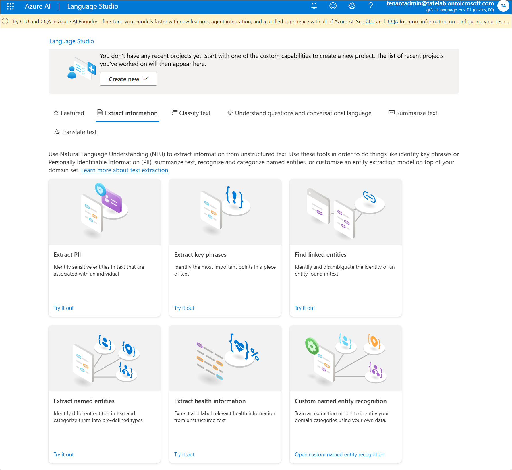

# Lab 04: Natural Language Processing

**Duration:** 60–75 minutes  
**Difficulty:** Intermediate

---

## 📊 Exercise Progress

- 🔄  Exercise 1: Text Analysis with Azure AI Language - In Progress
- ⬜ Exercise 2: Speech Recognition and Synthesis - Not Started
- ⬜ Exercise 3: Language Translation - Not Started
- ⬜ Exercise 4: Conversational Language Understanding (CLU) - Not Started

---

## 🎯 Objectives

By the end of this lab, you will be able to:

- Use Azure AI Language service for text analysis (sentiment, entities, key phrases)
- Implement speech recognition and synthesis with Azure AI Speech service
- Perform language translation
- Understand conversational language understanding (CLU) concepts

---

## 📋 Prerequisites

- Azure subscription with ability to create AI services
- Completion of previous labs (recommended)
- Sample text and audio files for testing (or use provided samples)

---

## 🧪 Lab Exercises

### Exercise 1: Text Analysis with Azure AI Language

**Objective:** Analyze text to extract insights (sentiment, entities, key phrases).

**📚 Related Documentation:**

- [What is Azure AI Language?](https://learn.microsoft.com/en-us/azure/ai-services/language-service/overview)
- [Sentiment Analysis](https://learn.microsoft.com/en-us/azure/ai-services/language-service/sentiment-opinion-mining/overview)
- [Named Entity Recognition (NER)](https://learn.microsoft.com/en-us/azure/ai-services/language-service/named-entity-recognition/overview)
- [Key Phrase Extraction](https://learn.microsoft.com/en-us/azure/ai-services/language-service/key-phrase-extraction/overview)
- [Quickstart: Use Language Studio](https://learn.microsoft.com/en-us/azure/ai-services/language-service/language-studio)

**Steps:**

1. **Create Azure AI Language Resource:**
   - Navigate to Azure Portal
   - Create resource: "Language" or "Azure AI services"
   - Note the endpoint URL and API key

    

    [Language Studio](https://language.cognitive.azure.com/home)

     

2. **Test Sentiment Analysis:**
   - Use Language Studio or REST API
   - Analyze sample text:
     - Positive review: "This product is amazing! Highly recommended."
     - Negative review: "Terrible experience. Would not buy again."
     - Neutral statement: "The package arrived on Tuesday."
   - Review sentiment scores (positive, negative, neutral)

3. **Test Entity Recognition (NER):**
   - Analyze text to extract named entities:
     - People: "John Smith works at Microsoft."
     - Organizations: "Apple announced a new iPhone."
     - Locations: "I'm traveling to Paris next month."
     - Dates: "The meeting is on October 20, 2025."
   - Review entity types and confidence scores

4. **Test Key Phrase Extraction:**
   - Extract main topics from longer text:
     - News article
     - Customer review
     - Email or document
   - Identify key phrases that summarize the content

**Sample Text to Analyze:**

> "Microsoft announced the release of Azure OpenAI Service in November 2023. The service provides access to powerful language models like GPT-4 and DALL-E 3. Customers can deploy these models in their own Azure subscriptions for enhanced security and compliance. Early feedback has been overwhelmingly positive."

**Deliverables:**

- Screenshot of sentiment analysis results
- List of extracted entities with types
- Key phrases identified
- Discussion: How could this be used in a customer service context?

---

### Exercise 2: Speech Recognition and Synthesis

**Objective:** Convert speech to text and text to speech using Azure AI Speech.

**📚 Related Documentation:**

- [What is Azure AI Speech?](https://learn.microsoft.com/en-us/azure/ai-services/speech-service/overview)
- [Speech-to-text overview](https://learn.microsoft.com/en-us/azure/ai-services/speech-service/speech-to-text)
- [Text-to-speech overview](https://learn.microsoft.com/en-us/azure/ai-services/speech-service/text-to-speech)
- [Speech translation overview](https://learn.microsoft.com/en-us/azure/ai-services/speech-service/speech-translation)
- [Try Speech Studio](https://speech.microsoft.com/)

**Steps:**

1. **Create Azure AI Speech Resource:**
   - Navigate to Azure Portal
   - Create resource: "Speech" service
   - Note the endpoint and API key

2. **Test Speech-to-Text (Recognition):**
   - Use Speech Studio or SDK
   - Upload an audio file or use microphone
   - Review transcribed text
   - Test with:
     - Clear speech
     - Background noise
     - Different accents

3. **Test Text-to-Speech (Synthesis):**
   - Convert text to spoken audio
   - Experiment with:
     - Different voices (male, female)
     - Different languages
     - Speech rate and pitch
   - Download the generated audio

4. **Test Speech Translation (Optional):**
   - Translate spoken audio to text in another language
   - Example: Speak in English, get Spanish text output

**Deliverables:**

- Screenshot of speech-to-text transcription
- Audio file generated from text-to-speech
- Accuracy assessment: Were there transcription errors?

---

### Exercise 3: Language Translation

**Objective:** Translate text between languages.

**📚 Related Documentation:**

- [What is Azure AI Translator?](https://learn.microsoft.com/en-us/azure/ai-services/translator/translator-overview)
- [Text Translation overview](https://learn.microsoft.com/en-us/azure/ai-services/translator/text-translation-overview)
- [Document Translation overview](https://learn.microsoft.com/en-us/azure/ai-services/translator/document-translation/overview)
- [Quickstart: Text translation](https://learn.microsoft.com/en-us/azure/ai-services/translator/quickstart-text-rest-api)
- [Language support](https://learn.microsoft.com/en-us/azure/ai-services/translator/language-support)

**Steps:**

1. **Create Azure AI Translator Resource:**
   - Navigate to Azure Portal
   - Create resource: "Translator" (part of Azure AI services)
   - Note the endpoint and API key

2. **Test Text Translation:**
   - Translate sample sentences:
     - English to Spanish
     - French to English
     - German to Japanese
   - Compare translation quality

3. **Test Document Translation (Optional):**
   - Upload a document (Word, PDF) for translation
   - Review the translated document

**Sample Text to Translate:**

> "Artificial intelligence is transforming how businesses operate. From customer service chatbots to predictive analytics, AI is enabling new capabilities and efficiencies."

**Deliverables:**

- Screenshots of translations in 2-3 languages
- Discussion: How accurate were the translations?

---

### Exercise 4: Conversational Language Understanding (CLU)

**Objective:** Understand how to build language understanding models for chatbots and voice assistants.

**📚 Related Documentation:**

- [What is conversational language understanding?](https://learn.microsoft.com/en-us/azure/ai-services/language-service/conversational-language-understanding/overview)
- [Quickstart: Conversational language understanding](https://learn.microsoft.com/en-us/azure/ai-services/language-service/conversational-language-understanding/quickstart)
- [Build schema design](https://learn.microsoft.com/en-us/azure/ai-services/language-service/conversational-language-understanding/how-to/build-schema)
- [Intents and entities](https://learn.microsoft.com/en-us/azure/ai-services/language-service/conversational-language-understanding/concepts/entity-components)
- [Train and evaluate models](https://learn.microsoft.com/en-us/azure/ai-services/language-service/conversational-language-understanding/how-to/train-model)

**Concepts:**

- **Intent:** What the user wants to do (e.g., "BookFlight", "CheckWeather", "CancelOrder")
- **Entity:** Key information extracted from the utterance (e.g., "Seattle" as a location, "tomorrow" as a date)
- **Utterance:** What the user says (e.g., "Book a flight to Seattle tomorrow")

**Activity (Conceptual):**

Design a simple language understanding model for a pizza ordering bot:

1. **Intents:**
   - OrderPizza
   - CheckOrderStatus
   - CancelOrder

2. **Entities:**
   - PizzaSize (small, medium, large)
   - Toppings (pepperoni, mushrooms, olives)
   - Quantity (1, 2, 3)

3. **Sample Utterances:**
   - "I want to order a large pepperoni pizza"
   - "Can I get two medium pizzas with mushrooms?"
   - "What's the status of my order?"

4. **Design Exercise:**
   - Write 5 sample utterances for each intent
   - Identify which entities should be extracted
   - Discuss how the bot would respond to each intent

**Deliverables:**

- Intent and entity design document
- Sample utterances for each intent
- Discussion: How would you train this model in Azure Language Studio?

---

## 🧠 Knowledge Check

1. What is the difference between sentiment analysis and key phrase extraction?
2. Which Azure service converts speech to text?
3. What is an "entity" in the context of NLP?
4. Name three types of entities that can be extracted from text.
5. What is the purpose of conversational language understanding (CLU)?
6. How does Azure AI Speech differ from Azure AI Language?

---

## 📚 Additional Resources

- [Azure AI Language Documentation](https://learn.microsoft.com/en-us/azure/ai-services/language-service/)
- [Azure AI Speech Documentation](https://learn.microsoft.com/en-us/azure/ai-services/speech-service/)
- [Conversational Language Understanding](https://learn.microsoft.com/en-us/azure/ai-services/language-service/conversational-language-understanding/overview)

---

## ✅ Lab Completion

You have successfully completed Lab 04. You should now understand:

- How to use Azure AI Language for text analysis (sentiment, entities, key phrases)
- How to use Azure AI Speech for speech-to-text and text-to-speech
- How to translate text between languages
- Concepts behind conversational language understanding (intents, entities, utterances)

**Next Steps:** Proceed to [Lab 05: Generative AI with Azure OpenAI](../lab05-generative-ai/)

---

**Last updated:** 2025-10-16
