# Lab 04: Natural Language Processing

**Duration:** 4 hours
**Difficulty:** Intermediate

---

## 📊 Exercise Progress

- ✅ Exercise 1: Text Analysis with Azure AI Language - In Progress
- ✅ Exercise 2: Speech Recognition and Synthesis - Not Started
- ✅ Exercise 3: Language Translation - Not Started
- ✅ Exercise 4: Conversational Language Understanding (CLU) - Not Started

**Status:** ⬜ Not Started | 🔄 In Progress | ✅ Completed

---

## 🎯 Objectives

By the end of this lab, you will be able to:

- Use Azure AI Language service for text analysis (sentiment, entities, key phrases)
- Implement speech recognition and synthesis with Azure AI Speech service
- Perform language translation
- Understand conversational language understanding (CLU) concepts

---

## 📋 Prerequisites

- Azure subscription with ability to create AI services
- Completion of previous labs (recommended)
- Sample text and audio files for testing (or use provided samples)

---

## 🧪 Lab Exercises

### Exercise 1: Text Analysis with Azure AI Language

**Objective:** Analyze text to extract insights (sentiment, entities, key phrases).

**📚 Related Documentation:**

- [What is Azure AI Language?](https://learn.microsoft.com/en-us/azure/ai-services/language-service/overview)
- [Sentiment Analysis](https://learn.microsoft.com/en-us/azure/ai-services/language-service/sentiment-opinion-mining/overview)
- [Named Entity Recognition (NER)](https://learn.microsoft.com/en-us/azure/ai-services/language-service/named-entity-recognition/overview)
- [Key Phrase Extraction](https://learn.microsoft.com/en-us/azure/ai-services/language-service/key-phrase-extraction/overview)
- [Quickstart: Use Language Studio](https://learn.microsoft.com/en-us/azure/ai-services/language-service/language-studio)

**Steps:**

1. **Create Azure AI Language Resource:**
   - Navigate to Azure Portal
   - Create resource: "Language" or "Azure AI services"
   - Note the endpoint URL and API key

    

    [Language Studio](https://language.cognitive.azure.com/home)

     

2. **Test Sentiment Analysis:**
   - Use Language Studio or REST API
   - Analyze sample text:
     - Positive review: "This product is amazing! Highly recommended."
     - Negative review: "Terrible experience. Would not buy again."
     - Neutral statement: "The package arrived on Tuesday."
   - Review sentiment scores (positive, negative, neutral)

    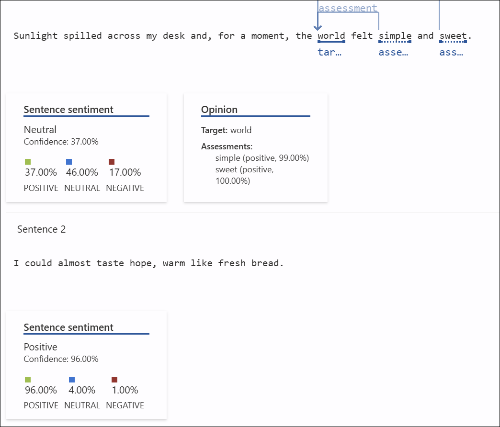

3. **Test Entity Recognition (NER):**
   - Analyze text to extract named entities:
     - People: "John Smith works at Microsoft."
     - Organizations: "Apple announced a new iPhone."
     - Locations: "I'm traveling to Paris next month."
     - Dates: "The meeting is on October 20, 2025."
   - Review entity types and confidence scores

    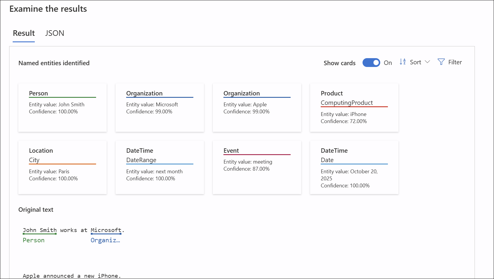

4. **Test Key Phrase Extraction:**
   - Extract main topics from longer text:
     - News article
     - Customer review
     - Email or document
   - Identify key phrases that summarize the content

    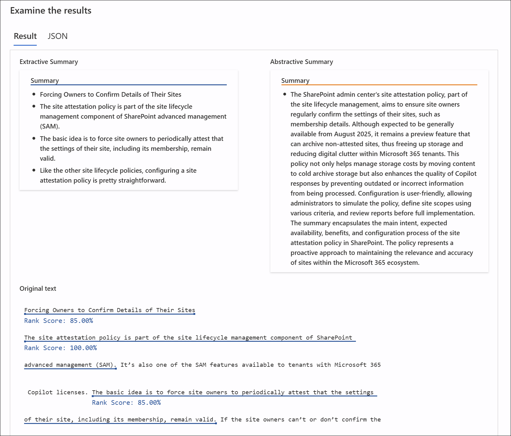

---

### Exercise 2: Speech Recognition and Synthesis

**Objective:** Convert speech to text and text to speech using Azure AI Speech.

**📚 Related Documentation:**

- [What is Azure AI Speech?](https://learn.microsoft.com/en-us/azure/ai-services/speech-service/overview)
- [Speech-to-text overview](https://learn.microsoft.com/en-us/azure/ai-services/speech-service/speech-to-text)
- [Text-to-speech overview](https://learn.microsoft.com/en-us/azure/ai-services/speech-service/text-to-speech)
- [Speech translation overview](https://learn.microsoft.com/en-us/azure/ai-services/speech-service/speech-translation)
- [Try Speech Studio](https://speech.microsoft.com/)

**Steps:**

1. **Create Azure AI Speech Resource:**
   - Navigate to Azure Portal
   - Create resource: "Speech" service
   - Note the endpoint and API key

    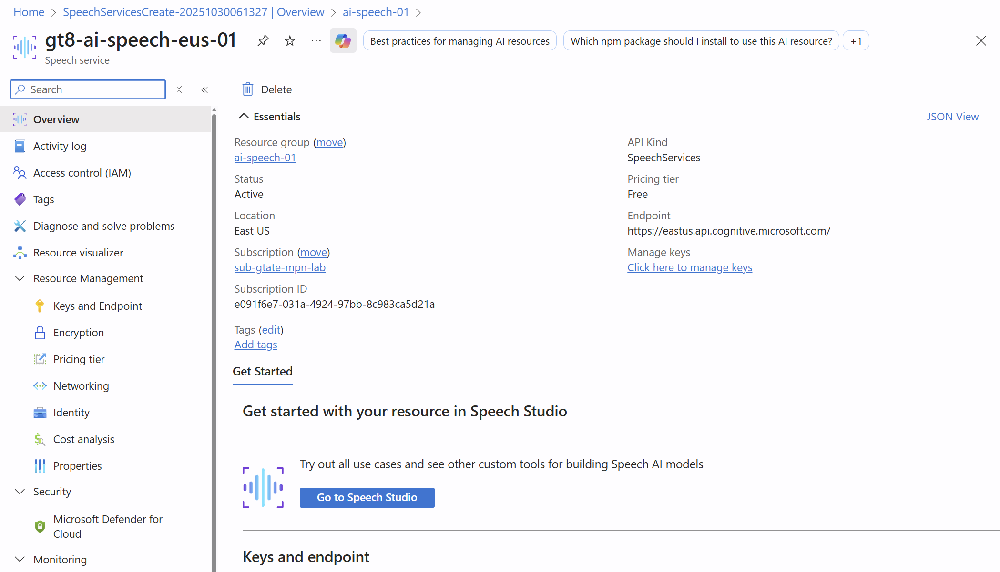

2. **Test Speech-to-Text (Recognition):**
   - Use Speech Studio or SDK
   - Upload an audio file or use microphone
   - Review transcribed text
   - Test with:
     - Clear speech
     - Background noise
     - Different accents

    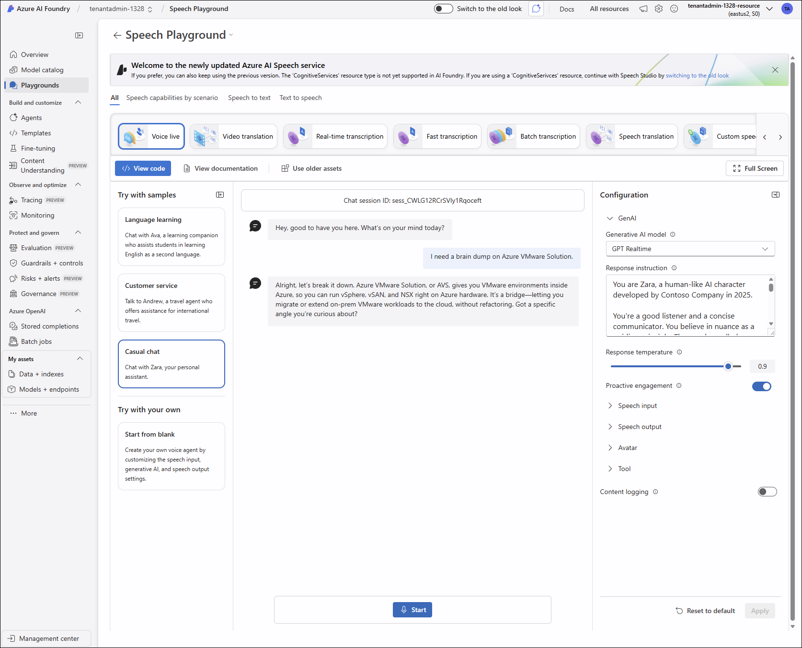

3. **Test Text-to-Speech (Synthesis):**
   - Convert text to spoken audio
   - Experiment with:
     - Different voices (male, female)
     - Different languages
     - Speech rate and pitch
   - Download the generated audio

    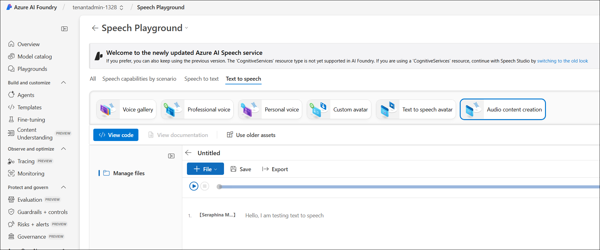

4. **Test Speech Translation (Optional):**
   - Translate spoken audio to text in another language
   - Example: Speak in English, get Spanish text output

    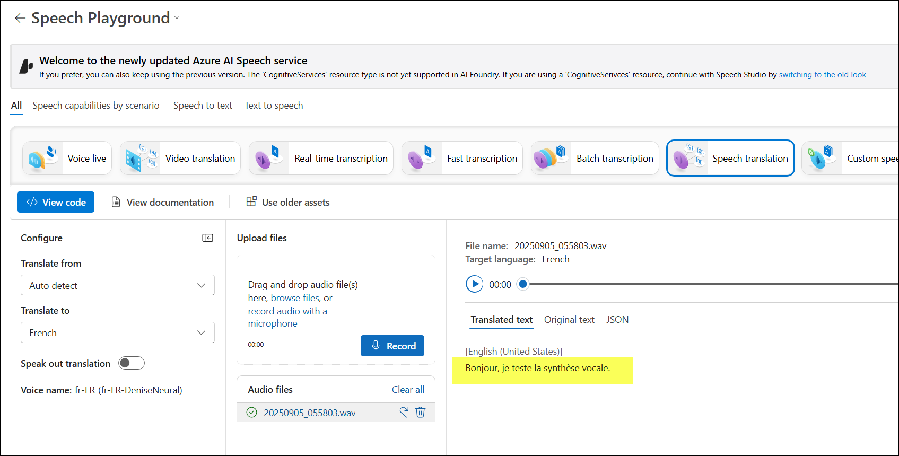

---

### Exercise 3: Language Translation

**Objective:** Translate text between languages.

**📚 Related Documentation:**

- [What is Azure AI Translator?](https://learn.microsoft.com/en-us/azure/ai-services/translator/translator-overview)
- [Text Translation overview](https://learn.microsoft.com/en-us/azure/ai-services/translator/text-translation-overview)
- [Document Translation overview](https://learn.microsoft.com/en-us/azure/ai-services/translator/document-translation/overview)
- [Quickstart: Text translation](https://learn.microsoft.com/en-us/azure/ai-services/translator/quickstart-text-rest-api)
- [Language support](https://learn.microsoft.com/en-us/azure/ai-services/translator/language-support)

**Steps:**

1. **Create Azure AI Translator Resource:**
   - Navigate to Azure Portal
   - Create resource: "Translator" (part of Azure AI services)
   - Note the endpoint and API key

    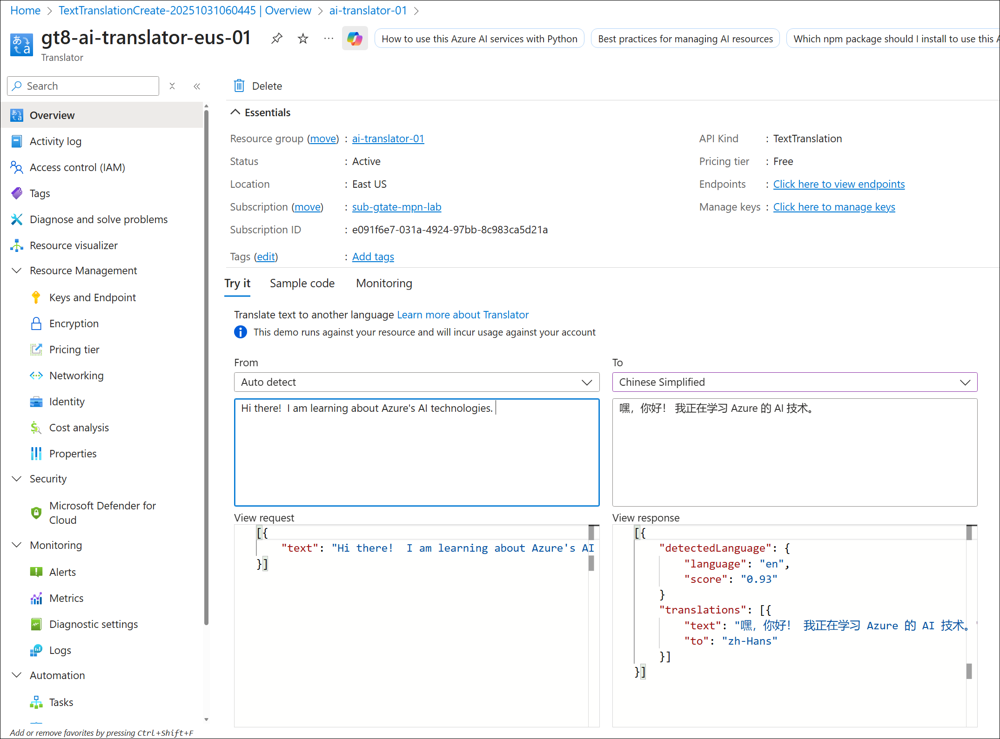

2. **Test Text Translation:**
   - Translate sample sentences:
     - English to Spanish
     - French to English
     - German to Japanese
   - Compare translation quality

---

### Exercise 4: Conversational Language Understanding (CLU)

**Objective:** Understand how to build language understanding models for chatbots and voice assistants.

**📚 Related Documentation:**

- [What is conversational language understanding?](https://learn.microsoft.com/en-us/azure/ai-services/language-service/conversational-language-understanding/overview)
- [Quickstart: Conversational language understanding](https://learn.microsoft.com/en-us/azure/ai-services/language-service/conversational-language-understanding/quickstart)
- [Build schema design](https://learn.microsoft.com/en-us/azure/ai-services/language-service/conversational-language-understanding/how-to/build-schema)
- [Intents and entities](https://learn.microsoft.com/en-us/azure/ai-services/language-service/conversational-language-understanding/concepts/entity-components)
- [Train and evaluate models](https://learn.microsoft.com/en-us/azure/ai-services/language-service/conversational-language-understanding/how-to/train-model)

**Concepts:**

- **Intent:** What the user wants to do (e.g., "BookFlight", "CheckWeather", "CancelOrder")
- **Entity:** Key information extracted from the utterance (e.g., "Seattle" as a location, "tomorrow" as a date)
- **Utterance:** What the user says (e.g., "Book a flight to Seattle tomorrow")

**Activity: Build a Conversational Language Understanding Project**

In this exercise, you'll create a CLU project in Microsoft Foundry using a sample project.

**Steps:**

1. **Import Sample Project:**
   - Navigate to [Microsoft Foundry](https://ai.azure.com/) → **Playgrounds** → **Language playground**
   - Select **Conversational language understanding** → **Fine-tune**
   - Import the [EmailAppDemo.json](https://github.com/Azure-Samples/cognitive-services-sample-data-files/blob/master/language-service/CLU/EmailAppDemo.json) sample project

2. **Train and Deploy:**
   - Train the model using **Standard training** mode
   - Deploy the trained model to an endpoint

3. **Test Your Model:**
   - In the Language playground, enter a test utterance (e.g., "Check email")
   - Review predicted intent and extracted entities

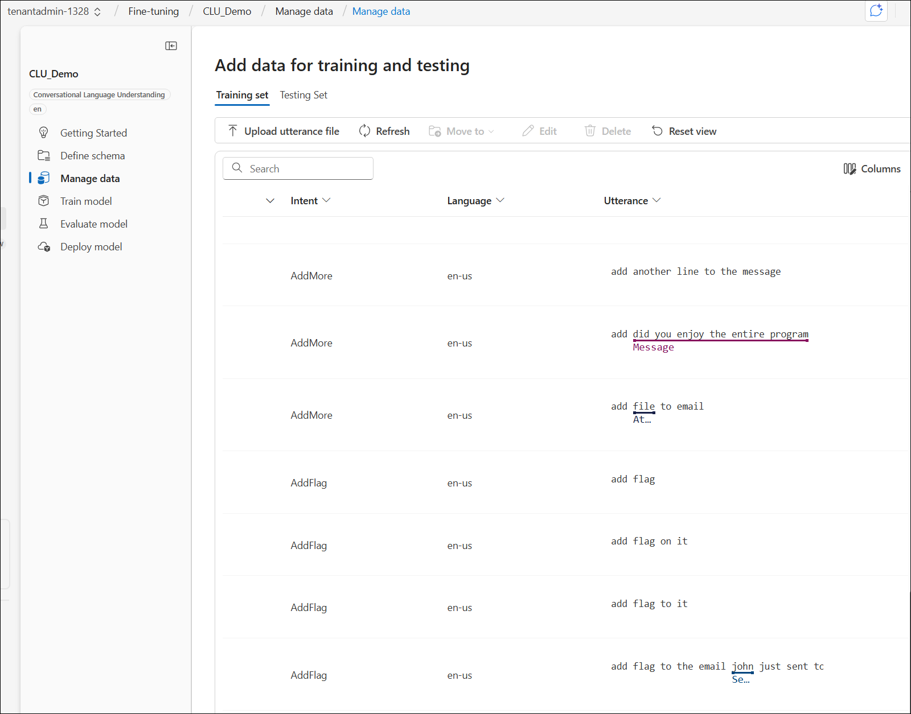

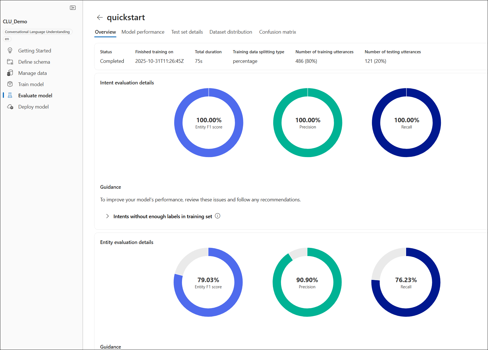

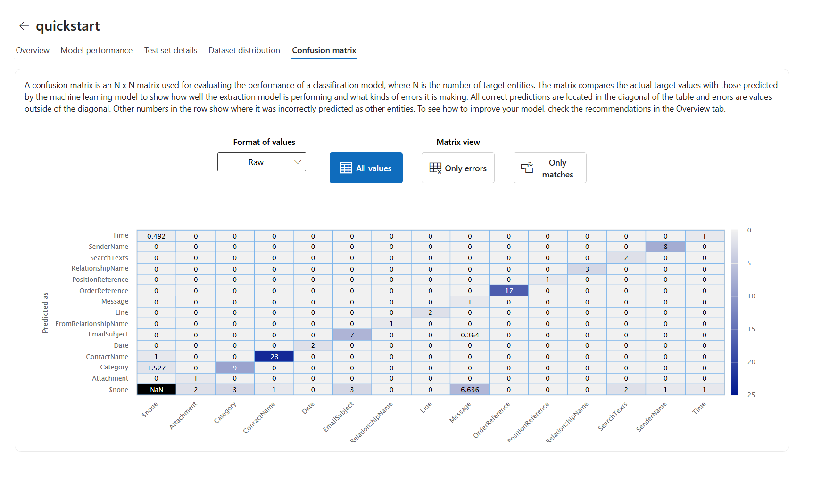

---

## 🧠 Knowledge Check

1. **What is the difference between sentiment analysis and key phrase extraction?**

   

   
Answer

   - **Sentiment Analysis** determines the emotional tone or attitude expressed in text (positive, negative, neutral, or mixed). It evaluates how the author feels about the subject matter.
   - **Key Phrase Extraction** identifies the main topics and important concepts mentioned in the text. It extracts significant words or phrases that summarize the content without evaluating emotion or opinion.

   Example: For "I love this amazing product!" - Sentiment would be "positive" while key phrases might be "amazing product."
   

2. **Which Azure service converts speech to text?**

   

   
Answer

   **Azure AI Speech** service (specifically the Speech-to-Text feature) converts spoken audio into written text. It supports real-time transcription, batch transcription, and can handle multiple languages and accents.
   

3. **What is an "entity" in the context of NLP?**

   

   
Answer

   An **entity** is a specific piece of information extracted from text that represents a real-world object, concept, or category. Entities are key data points that provide meaning and context, such as names, places, dates, quantities, or custom domain-specific items. They help structure unstructured text by identifying and categorizing important information.
   

4. **Name three types of entities that can be extracted from text.**

   

   
Answer

   Common entity types include:
   - **Person** - Names of people (e.g., "John Smith", "Dr. Sarah Johnson")
   - **Location** - Geographic places (e.g., "Paris", "Microsoft headquarters", "California")
   - **Organization** - Company names, institutions (e.g., "Microsoft", "United Nations", "Harvard University")
   - **DateTime** - Dates and times (e.g., "October 20, 2025", "next Tuesday", "3:00 PM")
   - **Quantity** - Numbers and measurements (e.g., "25 dollars", "3 kilometers")
   - **Email** - Email addresses
   - **URL** - Web addresses
   

5. **What is the purpose of conversational language understanding (CLU)?**

   

   
Answer

   **Conversational Language Understanding (CLU)** enables applications to understand user intentions and extract relevant information from natural language input. Its purposes include:

   - **Intent Recognition** - Determining what the user wants to do (e.g., book a flight, check weather, cancel order)
   - **Entity Extraction** - Identifying key information needed to fulfill the request (e.g., destination, date, order number)
   - **Building Conversational AI** - Powering chatbots, voice assistants, and interactive applications that can understand and respond to human language naturally
   - **Custom Language Models** - Creating domain-specific models trained on your business vocabulary and user interactions

   CLU is essential for building intelligent conversational interfaces that can interpret user requests and take appropriate actions.
   

6. **How does Azure AI Speech differ from Azure AI Language?**

   

   
Answer

   **Azure AI Speech** and **Azure AI Language** serve different but complementary purposes:

   **Azure AI Speech:**
   - Focuses on **audio processing**
   - Converts speech to text (speech recognition)
   - Converts text to speech (speech synthesis)
   - Provides speech translation
   - Works with audio input/output

   **Azure AI Language:**
   - Focuses on **text analysis and understanding**
   - Performs sentiment analysis, entity recognition, key phrase extraction
   - Provides conversational language understanding (CLU)
   - Supports text classification and summarization
   - Works exclusively with text input

   **In practice:** You might use Speech to transcribe an audio recording to text, then use Language to analyze that text for sentiment and extract key information.
   

---

## 📚 Additional Resources

- [Azure AI Language Documentation](https://learn.microsoft.com/en-us/azure/ai-services/language-service/)
- [Azure AI Speech Documentation](https://learn.microsoft.com/en-us/azure/ai-services/speech-service/)
- [Conversational Language Understanding](https://learn.microsoft.com/en-us/azure/ai-services/language-service/conversational-language-understanding/overview)

---

## ✅ Lab Completion

You have successfully completed Lab 04. You should now understand:

- How to use Azure AI Language for text analysis (sentiment, entities, key phrases)
- How to use Azure AI Speech for speech-to-text and text-to-speech
- How to translate text between languages
- Concepts behind conversational language understanding (intents, entities, utterances)

**Next Steps:** Proceed to [Lab 05: Generative AI with Azure OpenAI](../lab05-generative-ai/)

---

**Last updated:** 2025-10-16
