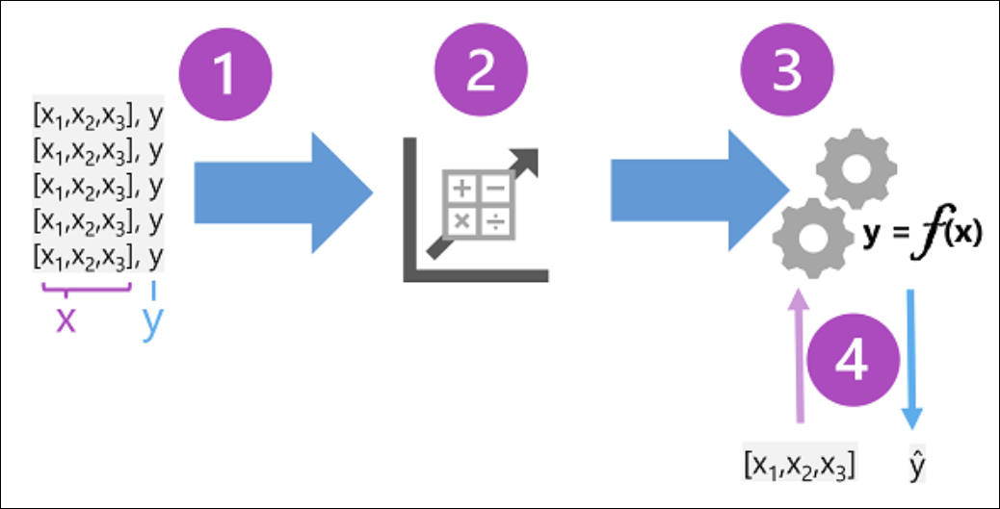
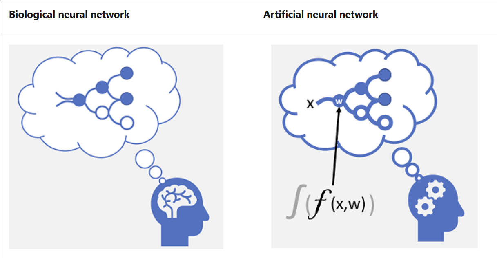
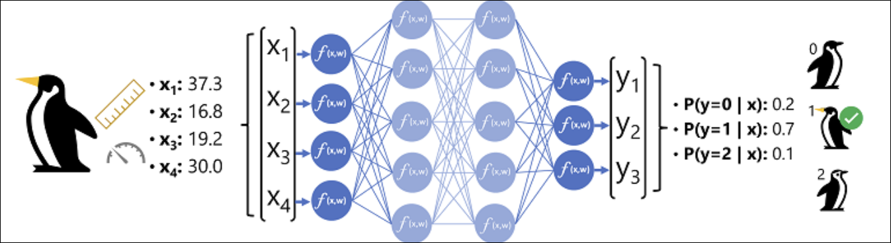

# Module 3: Introduction to machine learning concepts

**Link:** [Microsoft Learn](https://learn.microsoft.com/en-us/training/modules/fundamentals-machine-learning/)

* [Machine learning models](#machine-learning-models)
* [Types of machine learning model](#types-of-machine-learning-model)
* [Regression](#regression)
* [Binary classification](#binary-classification)
* [Multiclass classification](#multiclass-classification)
* [Clustering](#clustering)
* [Deep learning](#deep-learning)

---

## Machine learning models

[Module Reference](https://learn.microsoft.com/training/modules/intro-to-machine-learning-concepts/)

**Definition of a Machine Learning Model**

* A **machine learning model** is a **software application** that encapsulates a **function** used to calculate an output value from one or more input values.
* Defining this function is called **training**.
* Using the trained function to predict new values is called **inferencing**.

**Training and Inferencing Overview**

* **Training phase**

  * Uses historical data to define the function that maps inputs to outputs.
* **Inferencing phase**

  * Uses the trained model to predict outputs for new, unseen inputs.

**Training Data Components**

* **Observations** consist of:

  * **Features (x)**: observed attributes of the entity being analyzed.
  * **Label (y)**: the known value the model is trained to predict.
* An observation typically includes **multiple features**, so **x is a vector**:

  * Example format: `[x1, x2, x3, …]`

**Features and Labels in Examples**

* **Ice cream sales scenario**

  * Features (x): weather measurements (temperature, rainfall, windspeed, etc.)
  * Label (y): number of ice creams sold
* **Medical scenario**

  * Features (x): patient measurements (weight, blood glucose level, etc.)
  * Label (y): diabetes risk indicator (for example, 1 = at risk, 0 = not at risk)
* **Antarctic penguin scenario**

  * Features (x): physical attributes (flipper length, bill width, etc.)
  * Label (y): penguin species (for example, 0 = Adelie, 1 = Gentoo, 2 = Chinstrap)

**Role of the Algorithm**

* An **algorithm** analyzes the training data to determine a relationship between:

  * Features (x)
  * Label (y)
* The algorithm generalizes this relationship into a **calculation**.
* The choice of algorithm depends on the **type of predictive problem** being solved.
* The objective is to **fit the data to a function** that calculates y from x.

**The Model Function**

* The output of training is a **model** that encapsulates a function:

  * Mathematical form: **y = f(x)**

**Inferencing Output**

* During inferencing:

  * Feature values are input into the model.
  * The model outputs a **predicted label**.
* Predicted output is often written as **ŷ (“y-hat”)** to indicate it is a prediction, not an observed value.

**Key Facts to Remember**

* **Training** defines the function; **inferencing** uses it for prediction.
* **Features (x)** are inputs; **labels (y)** are known outputs during training.
* **x is a vector** when multiple features are used.
* A trained model represents a function: **y = f(x)**.
* Predicted values are denoted as **ŷ**, not y.

---

## Types of machine learning model

[Module Reference](https://learn.microsoft.com/training/modules/introduction-machine-learning-concepts/)

**Overview**

* There are multiple **types of machine learning**, and the correct type depends on **what you are trying to predict**
* Common categories:

  * **Supervised machine learning**
  * **Unsupervised machine learning**

**Supervised machine learning**

* Training data includes:

  * **Feature values**
  * **Known label values**
* Models learn the relationship between **features and labels**
* Used to predict **unknown labels** for future data

**Regression (Supervised)**

* Predicted label is a **numeric value**
* Example use cases:

  * Predicting **number of ice creams sold** based on weather conditions
  * Predicting **property selling price** based on size, bedrooms, and location metrics
  * Predicting **fuel efficiency (MPG)** based on vehicle dimensions and engine size

**Classification (Supervised)**

* Predicted label represents a **category (class)**

**Binary classification**

* Predicts **one of two mutually exclusive outcomes**
* Examples:

  * Whether a patient **is or is not** at risk for diabetes
  * Whether a customer **will or will not** default on a loan
  * Whether a customer **will or will not** respond to a marketing offer
* Output represents **true/false** or **positive/negative** for a single class

**Multiclass classification**

* Predicts **one of multiple possible classes**
* Examples:

  * Penguin species (**Adelie, Gentoo, Chinstrap**)
  * Movie genre (**comedy, horror, romance, adventure, science fiction**)
* Typically predicts **mutually exclusive labels**
* Some algorithms support **multilabel classification**

  * More than one valid label per observation
  * Example: a movie classified as **science fiction and comedy**

**Unsupervised machine learning**

* Training data contains:

  * **Feature values only**
  * **No known labels**
* Models discover **patterns and relationships** within the data

**Clustering (Unsupervised)**

* Groups observations into **discrete clusters** based on feature similarity
* Examples:

  * Grouping flowers by size, leaves, and petals
  * Segmenting customers by demographics and purchasing behavior
* Key differences from classification:

  * **No predefined labels**
  * Groups are formed **purely by feature similarity**
* Can be used as a **precursor to classification**

  * Identify clusters
  * Analyze and assign labels
  * Use labeled results to train a classification model

**Key Facts to Remember**

* **Supervised learning** requires labeled data
* **Regression** predicts numeric values
* **Classification** predicts categorical labels
* **Binary classification** predicts two outcomes
* **Multiclass classification** predicts one of many classes
* **Unsupervised learning** has no labels
* **Clustering** groups data based on similarity alone

---

## Regression

[Module Reference](https://learn.microsoft.com/training/modules/introduction-to-machine-learning-concepts/)

**What Regression Is**

* **Regression models** predict **numeric label values**.
* Training data includes **features** and **known labels**.
* Regression is a type of **supervised machine learning**.

**Supervised Model Training Process**

1. **Split data** randomly into:

   * Training dataset
   * Validation dataset
2. **Train the model** using an algorithm (for regression, a regression algorithm such as **linear regression**).
3. **Predict labels** for the validation data.
4. **Evaluate performance** by comparing predicted labels to actual labels.
5. **Repeat iteratively** with different algorithms and parameters until an acceptable metric is achieved.

**Regression Example Overview**

* **Feature (x)**: Temperature (maximum daily temperature)
* **Label (y)**: Number of ice creams sold
* Goal: Predict numeric sales values from temperature data.

**Training a Regression Model**

* A subset of historical temperature and sales data is used for training.
* Data points can be visualized using a **scatter plot**.
* A **linear regression algorithm** fits a straight line that minimizes the average distance between the line and the data points.
* The resulting function from the example:

  * **f(x) = x − 50**
* Example prediction:

  * If temperature is **77**, predicted sales = **27**.

**Model Validation**

* Held-back validation data is used to test predictions.
* Predicted values (ŷ) are compared to actual values (y).
* Differences between ŷ and y represent prediction errors.

**Regression Evaluation Metrics**

* **Mean Absolute Error (MAE)**

  * Average of absolute prediction errors.
  * Example MAE: **2.33**

* **Mean Squared Error (MSE)**

  * Mean of squared errors, emphasizing larger errors.
  * Example MSE: **6**

* **Root Mean Squared Error (RMSE)**

  * Square root of MSE.
  * Expresses error in the same units as the label.
  * Example RMSE: **2.45**

* **Coefficient of Determination (R²)**

  * Measures the proportion of variance explained by the model.
  * Value ranges from **0 to 1**.
  * Closer to **1** indicates a better fit.
  * Example R²: **0.95**
  * Formula:

    * **R² = 1 − ∑(y − ŷ)² ÷ ∑(y − ȳ)²**

**Iterative Training Considerations**

* Models are refined by varying:

  * **Feature selection and preparation**
  * **Algorithm selection**
  * **Algorithm parameters (hyperparameters)**
* The final model is chosen based on the **best acceptable evaluation metric** for the scenario.

**Key Facts to Remember**

* Regression predicts **numeric outcomes**.
* Training involves **split → train → validate → evaluate → repeat**.
* **MAE, MSE, RMSE, and R²** are standard regression metrics.
* **R² ranges from 0 to 1** and measures explained variance.
* Model development is an **iterative process**.

---

## Binary classification

[Module Reference](https://learn.microsoft.com/training/modules/introduction-to-machine-learning-concepts/)

**Overview**

* **Binary classification** is a **supervised machine learning** technique.
* Follows an **iterative process** of **training**, **validating**, and **evaluating** models.
* Predicts **one of two possible labels** for a single class (typically **1 or 0**, **true or false**).
* Models calculate **probability values** for class assignment.
* Evaluation compares **predicted classes** to **actual classes**, not numeric values.

**Training Data Characteristics**

* Observations include:

  * One or more **features (x)**
  * A **label (y)** with values **1 or 0**
* Probabilities range from **0.0 to 1.0**
* Total probability across all classes equals **1.0**

**Example Scenario**

* Feature: **Blood glucose level**
* Label: **Diabetic (1) or not diabetic (0)**
* Used to demonstrate binary classification with a **single feature**

**Training a Binary Classification Model**

* Uses an algorithm to fit training data to a function:

  * **f(x) = P(y = 1 | x)**
* Output represents the **probability** that the label is true.
* **Logistic regression** is a common binary classification algorithm.

  * Produces a **sigmoid (S-shaped) function**
  * Output values between **0.0 and 1.0**
* Despite its name, **logistic regression is used for classification**, not regression.

**Decision Threshold**

* A **threshold** determines predicted class:

  * Default threshold: **0.5**
* Rules:

  * **P(y) ≥ 0.5 → predict 1**
  * **P(y) < 0.5 → predict 0**
* Changing the threshold changes prediction behavior.

**Model Validation**

* A **subset of data** is held back for validation.
* Model generates **predicted labels (ŷ)** using the learned function.
* Predicted labels are compared to **actual labels (y)**.

**Confusion Matrix**

* Used to summarize prediction results:

  * **True Negative (TN)**: ŷ=0, y=0
  * **False Positive (FP)**: ŷ=1, y=0
  * **False Negative (FN)**: ŷ=0, y=1
  * **True Positive (TP)**: ŷ=1, y=1
* Correct predictions appear along the **diagonal**.

**Accuracy**

* Measures overall correctness of predictions.
* Formula:

  * **(TN + TP) ÷ (TN + FN + FP + TP)**
* Example result:

  * **0.83 (83%)**
* Limitation:

  * Can be misleading with **imbalanced datasets**.

**Recall**

* Measures ability to identify **positive cases**.
* Formula:

  * **TP ÷ (TP + FN)**
* Example result:

  * **0.75**
* Also known as **True Positive Rate (TPR)**.

**Precision**

* Measures correctness of **positive predictions**.
* Formula:

  * **TP ÷ (TP + FP)**
* Example result:

  * **1.0**

**F1-score**

* Combines **precision** and **recall** into one metric.
* Formula:

  * **(2 × Precision × Recall) ÷ (Precision + Recall)**
* Example result:

  * **0.86**

**ROC Curve and AUC**

* **False Positive Rate (FPR)** formula:

  * **FP ÷ (FP + TN)**
* **ROC curve** plots:

  * **TPR vs. FPR** across all threshold values from **0.0 to 1.0**
* Interpretation:

  * **Perfect model**: AUC = **1.0**
  * **Random guessing**: AUC = **0.5**
* Example model:

  * **AUC = 0.875**
  * Performs better than random guessing.

**Key Facts to Remember**

* Binary classification predicts **one of two labels**.
* Output is a **probability between 0.0 and 1.0**.
* Default classification threshold is **0.5**.
* Accuracy alone can be misleading.
* **Recall**, **precision**, **F1-score**, and **AUC** provide deeper performance insight.
* **AUC > 0.5** indicates better-than-random performance.

---

## Multiclass classification

[Module Reference](https://learn.microsoft.com/training/modules/introduction-to-machine-learning-concepts/)

**Definition**

* **Multiclass classification** predicts which one of **multiple possible classes** an observation belongs to.
* It is a **supervised learning** technique.
* Follows the same **train, validate, evaluate** process as:

  * Regression
  * Binary classification
* A subset of training data is held back for **validation**.

**Example scenario**

* Observations: **penguin flipper length (x)**
* Target variable: **penguin species (y)**
* Class encoding:

  * **0** – Adelie
  * **1** – Gentoo
  * **2** – Chinstrap
* Example data:

| Flipper length (x) | Species (y) |
| ------------------ | ----------- |
| 167                | 0           |
| 172                | 0           |
| 225                | 2           |
| 197                | 1           |
| 189                | 1           |
| 232                | 2           |
| 158                | 0           |

* Real-world scenarios typically use **multiple features**, not just one.

**Training a multiclass classification model**

* The model learns a function that calculates a **probability for each possible class**.
* Two algorithm approaches are used:

  * **One-vs-Rest (OvR)**
  * **Multinomial**

**One-vs-Rest (OvR) algorithms**

* Train **one binary classifier per class**.
* Each classifier estimates the probability that an observation belongs to its target class versus all others.
* Example functions:

  * **f₀(x) = P(y = 0 | x)**
  * **f₁(x) = P(y = 1 | x)**
  * **f₂(x) = P(y = 2 | x)**
* Each function produces a **sigmoid output between 0.0 and 1.0**.
* The predicted class is the one with the **highest probability**.

**Multinomial algorithms**

* Use a **single function** that outputs a **probability distribution** across all classes.
* Output is a **vector** where probabilities sum to **1.0**:

  * **f(x) = [P(y=0|x), P(y=1|x), P(y=2|x)]**
* Common example: **softmax function**
* Example output:

  * **[0.2, 0.3, 0.5]**
* The predicted class is the one with the **highest probability value**.

**Prediction behavior**

* Regardless of algorithm type:

  * The model selects the **most probable class**.
  * Outputs the corresponding **class label (y)**.

**Evaluating a multiclass classification model**

* Evaluation approaches:

  * Calculate **binary classification metrics per class**
  * Calculate **aggregate metrics across all classes**
* Uses a **multiclass confusion matrix** showing predicted vs. actual labels.

**Example evaluation results**

| Flipper length (x) | Actual (y) | Predicted (ŷ) |
| ------------------ | ---------- | ------------- |
| 165                | 0          | 0             |
| 171                | 0          | 0             |
| 205                | 2          | 1             |
| 195                | 1          | 1             |
| 183                | 1          | 1             |
| 221                | 2          | 2             |
| 214                | 2          | 2             |

**Per-class metrics**

| Class | TP | TN | FP | FN | Accuracy | Recall | Precision | F1-score |
| ----- | -- | -- | -- | -- | -------- | ------ | --------- | -------- |
| 0     | 2  | 5  | 0  | 0  | 1.0      | 1.0    | 1.0       | 1.0      |
| 1     | 2  | 4  | 1  | 0  | 0.86     | 1.0    | 0.67      | 0.8      |
| 2     | 2  | 4  | 0  | 1  | 0.86     | 0.67   | 1.0       | 0.8      |

**Overall metrics**

* **Overall accuracy**:

  * (13 + 6) ÷ (13 + 6 + 1 + 1) = **0.90**
* **Overall recall**:

  * 6 ÷ (6 + 1) = **0.86**
* **Overall precision**:

  * 6 ÷ (6 + 1) = **0.86**
* **Overall F1-score**:

  * (2 × 0.86 × 0.86) ÷ (0.86 + 0.86) = **0.86**

**Key Facts to Remember**

* Multiclass classification predicts **one of more than two classes**.
* OvR uses **multiple binary classifiers**, one per class.
* Multinomial uses **one model** with a probability vector output.
* Predicted class is always the **highest probability**.
* Multiclass evaluation can be done **per class** or **aggregated**.
* Overall metrics are calculated from **total TP, TN, FP, and FN values**.

---

## Clustering

[Module Reference](URL)

**Overview**

* **Clustering** is a form of **unsupervised machine learning**
* Observations are grouped into **clusters** based on similarities in their **features**
* No previously known **label values** are used to train the model
* In clustering, the **label** is the cluster an observation is assigned to

**Clustering Example**

* Dataset contains **no known labels**
* Each observation has **two features**:

  * Number of leaves (**x1**)
  * Number of petals (**x2**)
* Goal is **not** to identify flower species
* Goal is to **group similar flowers** based on feature values

**Training a Clustering Model (K-Means)**

1. **Vectorize features**

   * Feature values are converted into **n-dimensional coordinates**
   * n equals the number of features (for example, `[x1, x2]`)
2. **Choose number of clusters**

   * Select **k**, the number of clusters
   * k random points are plotted as initial **centroids**
3. **Assign data points**

   * Each data point is assigned to the **nearest centroid**
4. **Move centroids**

   * Each centroid is repositioned to the **mean center** of its assigned points
5. **Reassign clusters**

   * Data points may be reassigned based on updated centroid positions
6. **Repeat**

   * Steps repeat until clusters are **stable** or a **maximum number of iterations** is reached

**Evaluating a Clustering Model**

* Evaluation is based on **cluster separation**, not label accuracy
* Common evaluation metrics include:

  * **Average distance to cluster center** – Average distance of points to their centroid
  * **Average distance to other center** – Average distance of points to centroids of other clusters
  * **Maximum distance to cluster center** – Furthest distance from a point to its centroid
  * **Silhouette score**

    * Value between **-1 and 1**
    * Closer to **1** indicates better cluster separation

**Key Facts to Remember**

* Clustering is **unsupervised learning**
* **K-Means** requires selecting a value for **k**
* Centroids are updated using the **mean** of assigned points
* Clustering evaluation focuses on **separation**, not prediction accuracy
* **Silhouette scores** range from **-1 to 1**

---

## Deep learning

[Module Reference](https://learn.microsoft.com/training/modules/introduction-to-machine-learning-concepts/)

**Overview**

* **Deep learning** is an advanced form of machine learning that attempts to emulate how the human brain learns.
* It is based on **artificial neural networks** that simulate electrochemical activity in biological neurons using mathematical functions.
* Models built with this approach are called **deep neural networks (DNNs)**.

**Artificial Neural Networks**

* Each **neuron**:

  * Operates on an input value **(x)** and a **weight (w)**.
  * Applies a mathematical function.
  * Uses an **activation function** to decide whether to pass the output forward.
* Networks consist of **multiple layers of neurons**, forming a deeply nested function.
* The depth (multiple layers) is why the technique is called **deep learning**.

**Machine Learning Tasks Supported**

* **Regression**
* **Classification**
* Specialized models for:

  * **Natural language processing**
  * **Computer vision**

**Deep Learning Model Function**

* Like other machine learning techniques:

  * Training data is fitted to a function **f(x)** that predicts a label **(y)**.
* **f(x)** represents the outer layer of a nested function.
* Each layer:

  * Encapsulates functions that operate on **x** and **w** values.
* Training process:

  * Feed features **(x)** forward through the network to compute predicted values **(ŷ)**.
  * Compare **ŷ** to known **y** values to measure **loss**.
  * Adjust **weights (w)** iteratively to reduce loss.
* The trained model consists of the final weight values that produce the most accurate predictions.

**Example – Deep Learning for Classification**

* **Problem type**: Classification
* **Scenario**: Predicting penguin species

**Feature Vector (x)**

* Measurements used:

  * Bill length
  * Bill depth
  * Flipper length
  * Weight
* Represented as:

  * **x = [x₁, x₂, x₃, x₄]**

**Labels (y)**

* Possible species:

  * Adelie
  * Gentoo
  * Chinstrap
* Output is a **probability vector**:

  * **[P(y=0|x), P(y=1|x), P(y=2|x)]**

**Inference Process**

1. Feature vector is fed into the **input layer**, with one neuron per feature.
2. Neurons compute weighted sums and apply activation functions.
3. Each layer is **fully connected** to the next layer.
4. The **output layer** uses a **softmax (or similar) function** to produce class probabilities.
5. The predicted class is the one with the **highest probability**.

**How a Neural Network Learns**

1. Training and validation datasets are defined.
2. Training features are fed into the network.
3. Initial weights are assigned **randomly**.
4. The network produces predicted values **(ŷ)**.
5. A **loss function** compares **ŷ** to known **y** values and calculates total loss.
6. An **optimization function** (typically **gradient descent**) evaluates how each weight affects loss.
7. Weights are adjusted to minimize loss.
8. Updated weights are **backpropagated** through the network.
9. The process repeats over multiple **epochs** until acceptable accuracy is reached.

**Performance Considerations**

* Training is performed using **batches of data** represented as matrices.
* Neural network training relies heavily on **linear algebra**.
* **GPUs** are preferred due to efficient vector and matrix processing.

**Key Facts to Remember**

* **Deep learning** uses multi-layer neural networks (DNNs).
* Each neuron operates on **x**, **w**, and an **activation function**.
* Classification outputs are **probability vectors**.
* Training minimizes **loss** using **gradient descent** and **backpropagation**.
* Training is computationally intensive and best suited for **GPUs**.

---

*Last updated: 2026-01-16*
