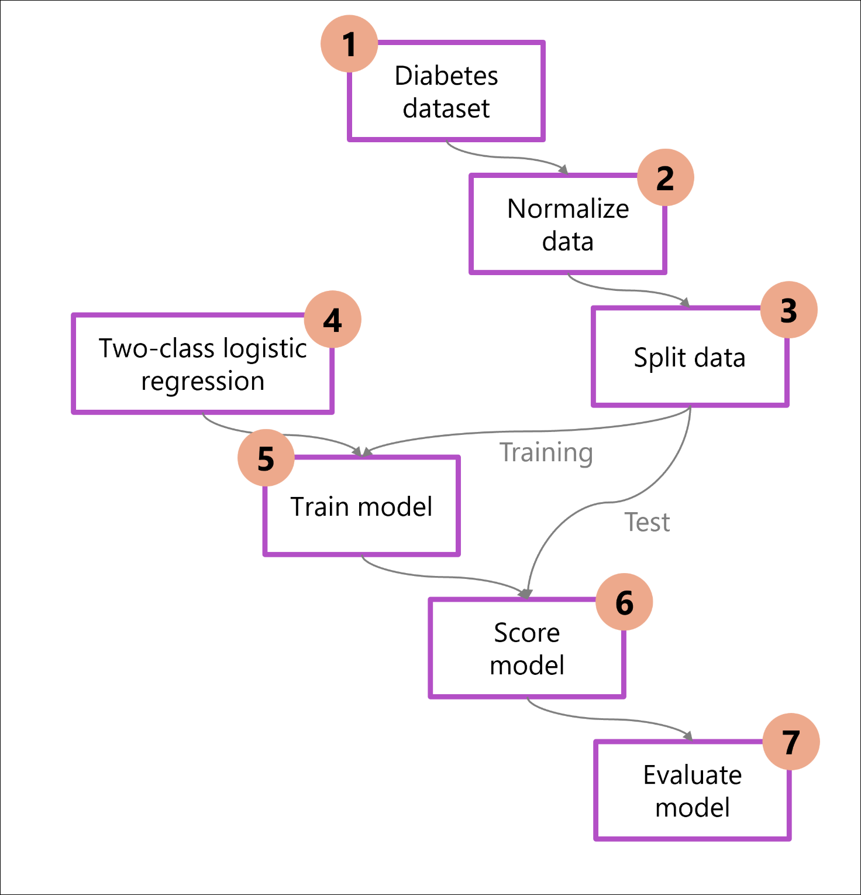
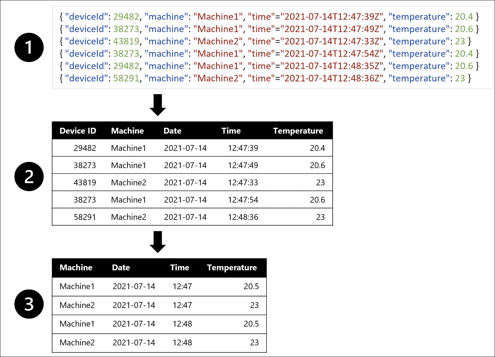

# Module 4: Get started with machine learning in Azure

**Link:** [Microsoft Learn](https://learn.microsoft.com/en-us/training/modules/design-machine-learning-model-training-solution/)

---

## Introduction

[Module Reference](https://learn.microsoft.com/training/modules/get-started-with-machine-learning-in-azure/)

**Purpose of the Module**

* **Machine learning solutions** underpin modern AI applications such as predictive analytics and personalized recommendations.
* These solutions use **existing data to generate new insights**.
* **Design decisions by data scientists** directly impact:

  * **Cost**
  * **Speed**
  * **Quality**
  * **Longevity** of the solution.

**Enterprise Machine Learning in Azure**

* The module focuses on designing an **end-to-end machine learning solution** using **Microsoft Azure**.
* Emphasis is on **planning, training, deployment, and monitoring** in an enterprise context.

**Six-Step Machine Learning Framework**

1. **Define the problem**

   * Decide **what the model should predict**
   * Define **what success looks like**
2. **Get the data**

   * Identify **data sources**
   * Obtain **access to data**
3. **Prepare the data**

   * **Explore** the data
   * **Clean and transform** data based on model requirements
4. **Train the model**

   * Choose an **algorithm**
   * Select **hyperparameter values** through **trial and error**
5. **Integrate the model**

   * **Deploy the model** to an endpoint
   * Use it to **generate predictions**
6. **Monitor the model**

   * **Track model performance** over time

**Process Characteristics**

* The machine learning process is **iterative and continuous**.
* Monitoring results may lead to **retraining the model**.

**Next Unit**

* **Define the problem**

**Key Facts to Remember**

* Machine learning design choices affect **cost, speed, quality, and longevity**.
* The Azure machine learning lifecycle is framed as **six steps**.
* **Monitoring can trigger retraining**, making the process continuous.

---

## Define the problem

[Module Reference](https://learn.microsoft.com/training/modules/get-started-with-machine-learning-in-azure/)

**Purpose of defining the problem**

* Clarify **what the model’s output should be**
* Determine **what type of machine learning task** is required
* Define **criteria that make the model successful**

**Machine learning task selection**

* The **type of task** depends on:

  * The **data available**
  * The **expected output**
* The chosen task determines:

  * Which **algorithms** can be used
  * Which **evaluation metrics** are appropriate

**Common machine learning tasks**

* **Classification** – Predict a **categorical value**
* **Regression** – Predict a **numerical value**
* **Time-series forecasting** – Predict **future numerical values** based on time-series data
* **Computer vision** – **Classify images** or **detect objects** in images
* **Natural language processing (NLP)** – **Extract insights from text**

**Model training and evaluation**

* Models are trained using **algorithms** appropriate to the selected task
* Models are evaluated using **performance metrics** (for example, **accuracy** or **precision**)
* Available metrics depend on the **machine learning task**
* Metrics help determine whether the model is **successful**

**Example: Diabetes prediction**

* Goal: Determine whether a patient **has diabetes or does not**
* Output type: **Categorical**
* Selected task: **Classification**
* Input data: Other **health-related data points** from patients

**End-to-end model training process**

1. **Load data** – Import and inspect the dataset
2. **Preprocess data** – Normalize and clean data for consistency
3. **Split data** – Separate data into **training** and **test** sets
4. **Choose model** – Select and configure an algorithm
5. **Train model** – Learn patterns from training data
6. **Score model** – Generate predictions on test data
7. **Evaluate** – Calculate performance metrics

**Iterative nature of training**

* Training a model is an **iterative process**
* Steps are often repeated to achieve the **best-performing model**

**Key Facts to Remember**

* The **problem definition** drives task selection, algorithms, and metrics
* **Task type** determines valid outputs and evaluation methods
* **Classification** is used for categorical outcomes; **regression** for numerical outcomes
* Model training typically follows **seven structured steps**
* Iteration is expected to improve model performance

---

## Get and prepare data

[Module Reference](https://learn.microsoft.com/training/modules/get-started-machine-learning-azure/)

**Overview**

* **Data is the foundation of machine learning**

  * Both **data quantity** and **data quality** directly affect model accuracy.
* Before training a model, you must:

  * **Identify data source and format**
  * **Choose how to serve data**
  * **Design a data ingestion solution**

**Identify data source and format**

* **Data source**

  * Examples include:

    * **Customer Relationship Management (CRM) systems**
    * **Transactional databases** (for example, SQL databases)
    * **Internet of Things (IoT) devices**
* **Data format**

  * **Structured (tabular) data**
  * **Semi-structured data**
  * **Unstructured data**
* You must decide:

  * What data is required to train the model
  * The format in which the data should be served to the model

**Design a data ingestion solution**

* Best practice is to:

  * **Extract data from its source**
  * **Transform the data**
  * **Load it into a serving layer**
* This process is known as:

  * **ETL** (Extract, Transform, Load)
  * **ELT** (Extract, Load, Transform)
* The **serving layer** makes data available for:

  * Training machine learning models
  * Making predictions
* Data ingestion pipelines:

  * Are a **sequence of tasks** that move and transform data
  * Can be **manually triggered** or **scheduled**
  * Can be built using:

    * Azure Synapse Analytics
    * Azure Databricks
    * Azure Machine Learning

**Common data ingestion approach**

1. **Extract** raw data from the source (for example, CRM system or IoT device)
2. **Copy and transform** data using Azure Synapse Analytics
3. **Store** prepared data in Azure Blob Storage
4. **Train** the model using Azure Machine Learning

**Example: Weather forecasting scenario**

* Goal:

  * One table containing **temperature measurements per minute**
  * Aggregated data showing **average temperature per hour**
* Source data:

  * **Semi-structured JSON data** from IoT temperature sensors
* Transformation steps:

  1. Extract temperature measurements as **JSON objects**
  2. Convert JSON objects into a **tabular format**
  3. Transform data to calculate **temperature per machine per minute**

**Key Facts to Remember**

* **Data quality and quantity** both impact model accuracy
* Machine learning data preparation requires:

  * Identifying **source**
  * Understanding **format**
  * Designing an **ingestion pipeline**
* **ETL/ELT pipelines** are standard for preparing data
* **Serving layers** make prepared data available for model training
* Semi-structured data (like JSON) often must be **converted to tabular data** before training

---

*Last updated: 2026-01-16*
