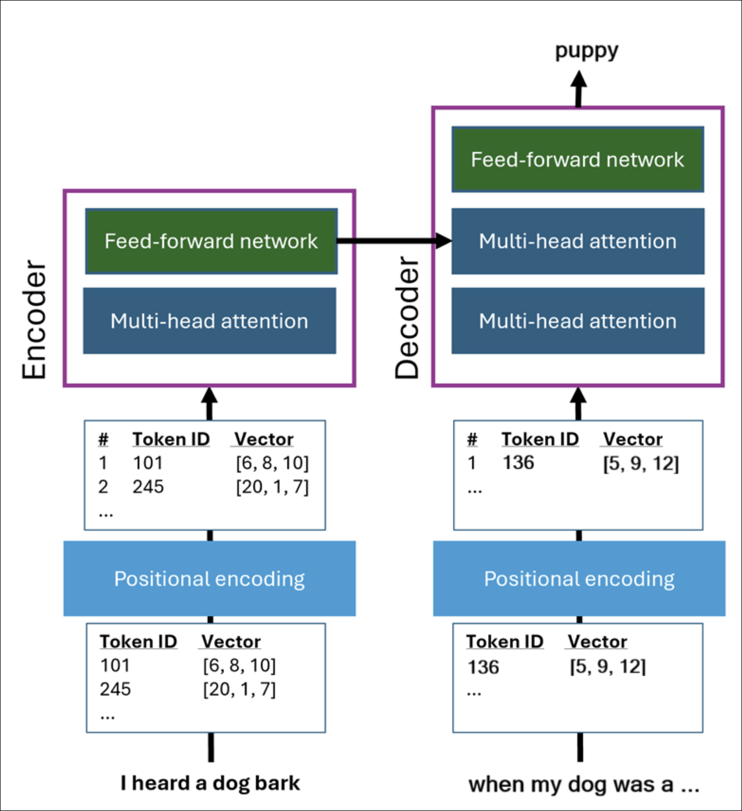
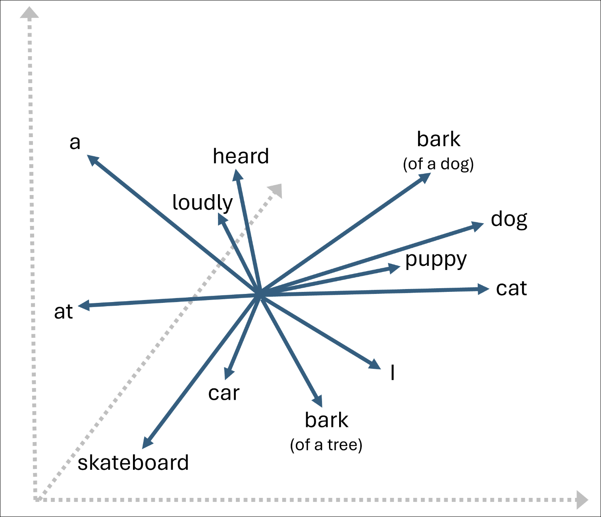

# Module 5: Introduction to generative AI and agents

**Link:** [Microsoft Learn](https://learn.microsoft.com/en-us/training/modules/fundamentals-generative-ai/)

---

## Large language models (LLMs)

[Module Reference](https://learn.microsoft.com/training/modules/introduction-to-generative-ai-and-agents/large-language-models)

**Overview**

* **Large language models (LLMs)** and **small language models (SLMs)** capture linguistic and semantic relationships between words and phrases.
* Models generate **completions from prompts**, similar to predictive text but with deeper understanding of language context.
* Word prediction is based on:

  * A **large vocabulary**
  * Learned **linguistic structures**
  * **Semantic understanding** of concepts and meanings

**Prompt-Based Text Generation**

* A **prompt** starts a sequence of predictions.
* The model predicts the **most probable next token** based on prior context.
* Some words in a sequence carry more predictive weight than others (for example, *heard* and *dog* strongly suggest *bark*).

**Tokenization**

* Models do not process text as whole words.
* Text is broken into **tokens**, which can include:

  * Whole words
  * Sub-words (for example, *un* in *unlikely*)
  * Punctuation
  * Common character sequences
* Each token is assigned a **unique integer ID**.
* Modern LLM vocabularies contain **hundreds of thousands of tokens**.
* Token sets grow as more training data is added.

**Transforming Tokens with a Transformer**

* Each token is represented as a **vector** (array of numeric values).
* Vectors encode linguistic and semantic attributes.
* Through training, vectors become **embeddings**—representations enriched with contextual meaning.
* A **transformer model** is used to generate embeddings.

**Transformer Architecture**

* **Encoder block**

  * Uses **attention** to evaluate how surrounding tokens influence the current token.
  * Uses **multi-head attention** to process multiple aspects of tokens in parallel.
  * Outputs contextual **embedding vectors**.
* **Decoder block**

  * Uses embeddings to predict the **next most probable token**.
  * Applies attention and a feed-forward neural network during prediction.

 

**Initial Vectors and Positional Encoding**

* Token vectors start with **random values**.
* **Positional encoding** is added to indicate each token’s position in the sequence.
* Token order matters for meaning and relationships.
* Real-world models use vectors with **thousands of dimensions** (simplified examples use fewer).

**Attention and Embeddings**

* Attention layers:

  * Weight nearby tokens based on relevance.
  * Assign greater influence to contextually important tokens.
* Over time, the model learns:

  * Which tokens frequently appear together
  * How proximity and frequency affect meaning
* Tokens can have **multiple embeddings** if they appear in different contexts (for example, *bark* of a dog vs. *bark* of a tree).
* Embeddings exist in a **multi-dimensional vector space**.
* **Cosine similarity** measures semantic closeness between tokens.

 

**Predicting Completions from Prompts**

* The decoder predicts tokens **one at a time**.
* Uses **masked attention** so only prior tokens influence the prediction.
* During training:

  * Predicted tokens are compared to known correct tokens.
  * Errors are used to adjust model weights.
* During inference:

  * The most probable token is selected.
  * The token is appended and prediction repeats.
* Generation stops when the model predicts an **end-of-sequence** token.

**Key Facts to Remember**

* **LLMs generate text by predicting tokens**, not words.
* **Attention** is central to learning context and meaning.
* **Embeddings** encode semantic relationships between tokens.
* Tokens can have **multiple embeddings** depending on context.
* **Masked attention** prevents future tokens from influencing predictions.
* Semantic similarity is measured using **cosine similarity** between embeddings.

---

## Prompts

[Module Reference](https://learn.microsoft.com/training/modules/introduction-to-generative-ai-and-agents/)

**Prompt Definition**

* A **prompt** is the input given to a large language model (LLM) to generate a response.
* Prompts can be:

  * A **question**
  * A **command**
  * A **casual comment** to start a conversation
* The model produces a **completion** in response to the prompt.

**Types of Prompts**

There are **two main types** of prompts:

1. **System prompts**

   * Set the **behavior**, **tone**, and **constraints** of the model
   * Example: Instructing the model to respond in a specific style or manner
   * Typically defined by the **application**, not the end user

2. **User prompts**

   * Ask a **specific question** or provide an **instruction**
   * Can specify:

     * Audience
     * Format
     * Tone
     * Length or structure
   * Entered directly by a user or generated by an application

**Prompt Interaction Model**

* The model responds to **user prompts** while following the guidance defined in the **system prompt**
* System prompts always take precedence over user prompts

**Conversation History**

* Generative AI applications often retain **conversation history**
* Prior prompts and responses are:

  * Stored
  * Summarized
  * Included in future prompts
* This provides **ongoing context**, improving relevance and consistency in responses

**Follow-up Prompts**

* Follow-up questions rely on:

  * The original prompt
  * The model’s previous response
* Including prior context helps the model understand the intent of the follow-up question

**Retrieval Augmented Generation (RAG)**

* **RAG** enhances prompts by adding **retrieved external information**
* The application:

  * Queries relevant sources (documents, emails, policies)
  * Injects retrieved content into the prompt
* The model generates responses **grounded in provided data**, not generic knowledge

**RAG Benefits**

* Produces more **accurate**, **relevant**, and **context-aware** responses
* Reduces the need for vague or non-actionable answers
* Especially useful for:

  * Policy questions
  * Organizational knowledge
  * Domain-specific information

**Tips for Better Prompts**

* **Be clear and specific**

  * Explicit instructions outperform vague language
* **Add context**

  * Specify topic, audience, and intent
* **Use examples**

  * Demonstrate desired style or output
* **Ask for structure**

  * Request bullet points, tables, or numbered lists

**Key Facts to Remember**

* Prompts are the primary input mechanism for LLMs
* System prompts define constraints and behavior
* User prompts drive task-specific responses
* Conversation history maintains continuity
* RAG improves accuracy by grounding responses in retrieved data
* Prompt quality directly impacts response quality

---

## AI agents

[Module Reference](https://learn.microsoft.com/training/modules/introduction-generative-ai-agents/ai-agents)

**What is an AI agent**

* Software application built on **generative AI**
* Can **reason over and generate natural language**
* Can **automate tasks using tools**
* Can **respond to contextual conditions** and take appropriate action
* Goes beyond answering questions to **getting tasks done**

**Core components of an AI agent**

* **Large language model**

  * Acts as the agent’s **brain**
  * Provides **language understanding and reasoning**
* **Instructions**

  * Defined through a **system prompt**
  * Specifies the agent’s **role and behavior**
  * Comparable to a **job description**
* **Tools**

  * Enable interaction with the outside world
  * **Knowledge tools**

    * Access information sources such as **search engines** or **databases**
  * **Action tools**

    * Perform tasks such as **sending emails**
    * **Updating calendars**
    * **Controlling devices**

**Capabilities enabled by agents**

* Intelligent task automation
* Context-aware responses
* Collaboration with users to improve efficiency
* Acting as **digital assistants** rather than passive responders

**Multi-agent systems**

* Consist of **multiple agents working together**
* Each agent has a **specialized role**

  * Example:

    * One agent gathers data
    * Another analyzes data
    * A third takes action
* Agents collaborate to handle **complex workflows**
* Function similarly to a **human team**

**Agent communication**

* Agents communicate using **prompts**
* Generative AI determines:

  * What tasks are required
  * Which agent is responsible for each task

**Agentic AI**

* Represents the **next advancement** in technology use
* Focuses on:

  * Finding information
  * Completing work
  * Automating end-to-end processes

**Key Facts to Remember**

* AI agents combine **models, instructions, and tools**
* Tools are divided into **knowledge tools** and **action tools**
* Multi-agent systems enable **collaborative, specialized workflows**
* Agentic AI emphasizes **action and automation**, not just responses

---
