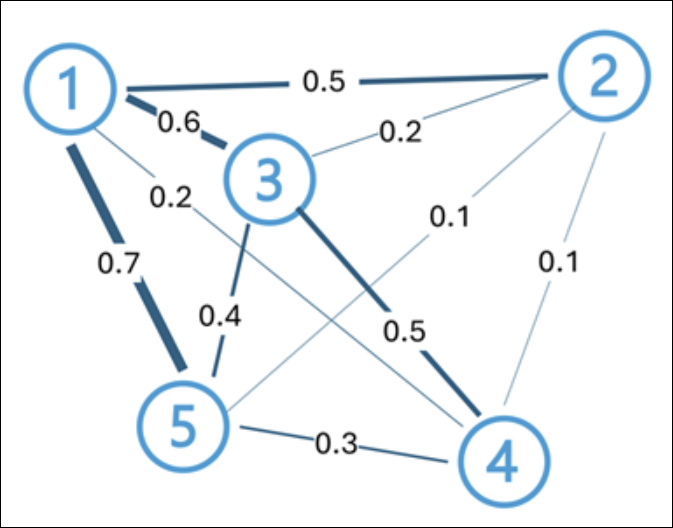

# Module 7: Introduction to text analysis concepts

**Link:** [Microsoft Learn](https://learn.microsoft.com/en-us/training/modules/introduction-language/)

---

## Introduction to text analysis concepts

[Module Reference](https://learn.microsoft.com/training/modules/introduction-text-analysis/)

**Overview**

* **Text analysis** is a subset of **natural language processing (NLP)** within artificial intelligence (AI).
* It enables machines to extract **meaning, structure, and insights** from **unstructured text**.
* Organizations use text analysis to convert sources such as **customer feedback, support tickets, contracts, and social media posts** into **actionable intelligence**.

**Evolution of Text Analysis Techniques**

* Techniques have evolved over many years:

  * From **statistical methods** based on **term frequency**
  * To **vector-based language models** that capture **semantic meaning**

**Common Text Analysis Use Cases**

* **Key term extraction**

  * Identifies important words and phrases
  * Helps determine **topics and themes** in text
* **Entity detection**

  * Identifies **named entities** such as **places, people, dates, and organizations**
* **Text classification**

  * Categorizes documents based on content
  * Example: classifying email as **spam** or **not spam**
* **Sentiment analysis**

  * A specialized form of text classification
  * Predicts sentiment such as **positive, neutral, or negative**
* **Text summarization**

  * Reduces text length while retaining **salient points**
  * Example: generating a **one-paragraph summary** from a multi-page document

**Challenges of Text Analysis**

* Language is **complex** and difficult for computers to interpret
* All text analysis techniques rely on the ability to **extract meaning from natural language**

**Learning Format Note**

* Content is available in **video-based** and **text-based** formats
* **Text content contains greater detail** and may supplement videos

**Key Facts to Remember**

* Text analysis is a core capability of **NLP**
* Input text is typically **unstructured**
* Techniques range from **term-frequency statistics** to **semantic vector models**
* Sentiment analysis is a **type of text classification**
* The fundamental challenge is **deriving meaning from natural language**

---

## Tokenization

[Module Reference]()

**Overview**

* **Tokenization** is the first step in analyzing a body of text (**corpus**).
* Text is broken into **tokens**, which can be:

  * Distinct whole words
  * Partial words
  * Combinations of words and punctuation

**Basic Token Example**

* Phrase: *“We choose to go to the moon”*
* Tokens:

  * We
  * choose
  * to
  * go
  * to
  * the
  * moon
* Tokens can repeat; for example, **“to”** appears twice.
* Assigning discrete values to tokens enables:

  * **Frequency counting**
  * Identification of **commonly used terms**
  * Inference of the **main subject** of the text

**Pre-processing Techniques for Tokenization**

**Text normalization**

* Removes punctuation
* Converts text to lowercase
* Improves performance for word-frequency analysis
* May lose semantic meaning

  * Example distinction:

    * **“Mr Banks”** vs **“banks”**
    * **“banks”** vs **“banks.”** (period indicates sentence end)

**Stop word removal**

* Excludes common words such as **“the”**, **“a”**, **“it”**
* Reduces noise and highlights semantically important terms

**N-gram extraction**

* Identifies multi-word phrases
* Types:

  * **Unigram** – single word
  * **Bigram** – two-word phrase
  * **Trigram** – three-word phrase
* Helps algorithms better understand meaning by grouping frequent word sequences

**Stemming**

* Strips word endings such as **“s”**, **“ing”**, **“ed”**
* Groups words with the same root

  * Example:

    * powering, powered, powerful → **power**

**Lemmatization**

* Reduces words to their valid base or dictionary form (**lemma**)
* Uses linguistic rules and vocabulary
* Examples:

  * running → **run**
  * global → **globe**

**Parts of speech (POS) tagging**

* Labels each token with its grammatical category:

  * noun
  * verb
  * adjective
  * adverb
* Uses linguistic rules and statistical models
* Considers both the token and its surrounding context

**Key Facts to Remember**

* **Tokenization** is the foundational step in text analysis.
* Tokens may include words, partial words, or punctuation.
* **Pre-processing choices** affect both performance and semantic accuracy.
* **N-grams**, **stemming**, and **lemmatization** change how meaning is represented.
* **POS tagging** adds grammatical context to tokens.

---

## Statistical text analysis

[Module Reference](https://learn.microsoft.com/en-us/training/modules/introduction-language/3-statistical-techniques?pivots=text)

**Overview**

* Statistical text analysis infers meaning from text after **tokenization**, **normalization**, and **lemmatization**.
* Techniques identify themes, relevance, and structure within documents or across a corpus.

**Frequency Analysis**

* Counts occurrences of each **normalized token** in a document.
* Assumption: **More frequent terms indicate key topics or themes**.
* Effective for understanding **single documents**.
* Example outcome: high counts for terms like **AI**, **business**, and **benefit** indicate business-focused AI content.

**Term Frequency – Inverse Document Frequency (TF-IDF)**

* Used to **differentiate relevance across multiple documents** in a corpus.
* Addresses limitations of simple frequency counts when common terms appear in many documents.

**TF-IDF Calculation Process**

1. **Term Frequency (TF)**

   * Number of times a term appears in a document.
   * Example: tf(agent) = 6.
2. **Inverse Document Frequency (IDF)**

   * Measures how rare a term is across the corpus.
   * Formula: **idf(t) = log(N / df(t))**

     * **N** = total number of documents
     * **df(t)** = number of documents containing term *t*
3. **TF-IDF Score**

   * Formula: **tfidf(t, d) = tf(t, d) × log(N / df(t))**

* **High TF-IDF**: term is frequent in one document but rare across others.
* **Low TF-IDF**: term is common across many documents.
* Terms appearing in all documents have **IDF = 0** and no discriminative value.

**Bag-of-Words Techniques**

* Represents text as a **vector of word frequencies or occurrences**.
* **Ignores grammar and word order**.
* Commonly used as features for machine learning algorithms.

**Common Uses**

* **Naive Bayes classification** for document categorization.
* **Spam filtering** based on word frequency patterns.
* **Sentiment analysis**, assigning labels such as *positive* or *negative* using probabilistic models.

**TextRank**

* **Unsupervised, graph-based algorithm** for text ranking.
* Models text as a graph:

  * **Nodes**: sentences (or words)
  * **Edges**: weighted by similarity (e.g., word overlap, cosine similarity)

 

**TextRank Process**

1. **Build a graph** of sentences connected by similarity-weighted edges.
2. **Iteratively calculate ranks** using:

   * TextRank(Sᵢ) = (1 − d) + d × Σ(wⱼᵢ / Σwⱼₖ) × TextRank(Sⱼ)
   * **d (damping factor)** ≈ 0.85
3. **Extract top-ranked sentences** after convergence.

* Used for **extractive summarization** (selects existing sentences).
* Can also be applied to **keyword extraction** at the word level.
* Distinct from **abstractive summarization**, which generates new text.

**Key Facts to Remember**

* **Frequency analysis** is best for single-document topic identification.
* **TF-IDF** highlights terms that distinguish documents within a corpus.
* **Bag-of-words** ignores word order and grammar.
* **Naive Bayes** commonly uses bag-of-words features.
* **TextRank** is graph-based and unsupervised.
* **Extractive summarization** selects original sentences; no new text is generated.

---
