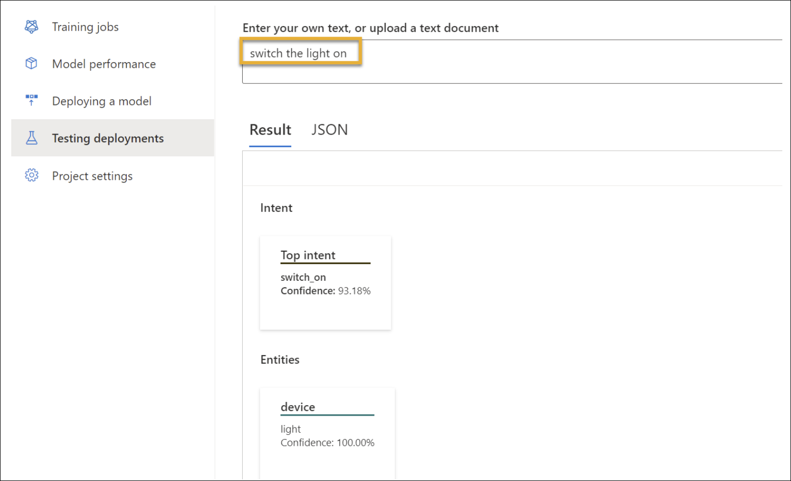

# Module 8: Get started with natural language processing in Microsoft Foundry

**Link:** [Microsoft Learn](https://learn.microsoft.com/en-us/training/modules/get-started-language-azure/)

* [Understand natural language processing on Azure](#understand-natural-language-processing-on-azure)
* [Understand Azure Language's text analysis capabilities](#understand-azure-languages-text-analysis-capabilities)
* [Azure Language's conversational AI capabilities](#azure-languages-conversational-ai-capabilities)
* [Azure Translator capabilities](#azure-translator-capabilities)
* [Get started in Microsoft Foundry](#get-started-in-microsoft-foundry)

---

## Understand natural language processing on Azure

[Module Reference](https://learn.microsoft.com/training/modules/get-started-text-analysis-foundry/)

**Core Natural Language Processing (NLP) Tasks**

* **Language detection**: Identify the language of input text.
* **Sentiment analysis**: Determine whether text expresses positive, negative, or neutral sentiment.
* **Named entity recognition (NER)**: Identify entities such as people, places, organizations, and dates.
* **Text classification**: Categorize text based on its content.
* **Translation**: Convert text from one language to another.
* **Summarization**: Produce a concise summary of longer text.

**Foundry Tools That Support NLP**

* **Azure Language service**

  * Cloud-based service for understanding and analyzing text.
  * Supports:

    * **Sentiment analysis**
    * **Key phrase identification**
    * **Text summarization**
    * **Conversational language understanding**
* **Azure Translator service**

  * Cloud-based translation service.
  * Uses **Neural Machine Translation (NMT)**.
  * Analyzes **semantic context** to produce more accurate and complete translations.

**Key Facts to Remember**

* Core NLP tasks include **language detection, sentiment analysis, NER, text classification, translation, and summarization**.
* **Azure Language** focuses on text understanding and analysis features.
* **Azure Translator** uses **NMT** to improve translation accuracy by considering semantic context.

---

## Understand Azure Language's text analysis capabilities

[Module Reference](https://learn.microsoft.com/training/modules/get-started-text-analysis-microsoft-fabric/)

**Azure Language Overview**

* **Azure Language** is part of **Foundry Tools**
* Performs **advanced natural language processing (NLP)** on **unstructured text**
* Provides prebuilt text analysis features without requiring model training

**Text Analysis Features**

* **Named entity recognition (NER)**

  * Identifies entities such as **people, places, events**
  * Can be customized to extract **custom categories**
* **Entity linking**

  * Links recognized entities to **specific Wikipedia articles**
  * Used to **disambiguate entities**
* **Personal identifying information (PII) detection**

  * Identifies **personally sensitive information**
  * Includes **personal health information (PHI)**
* **Language detection**

  * Detects the language of the text
  * Returns a **language name**, **ISO 639-1 code**, and **confidence score**
* **Sentiment analysis and opinion mining**

  * Determines whether text is **positive, neutral, or negative**
* **Summarization**

  * Identifies and returns the **most important information**
* **Key phrase extraction**

  * Extracts the **main concepts** from unstructured text

**Entity Recognition**

* An **entity** is an item with a **type** and sometimes a **subtype**
* Supported entity types include:

| Type                  | Subtype     | Example                                                 |
| --------------------- | ----------- | ------------------------------------------------------- |
| Person                | —           | “Bill Gates”, “John”                                    |
| Location              | —           | “Paris”, “New York”                                     |
| Organization          | —           | “Microsoft”                                             |
| Quantity              | Number      | “6”, “six”                                              |
| Quantity              | Percentage  | “25%”, “fifty percent”                                  |
| Quantity              | Ordinal     | “1st”, “first”                                          |
| Quantity              | Age         | “30 years old”                                          |
| Quantity              | Currency    | “10.99”                                                 |
| Quantity              | Dimension   | “10 miles”, “40 cm”                                     |
| Quantity              | Temperature | “45 degrees”                                            |
| DateTime              | —           | “6:30PM February 4, 2012”                               |
| DateTime              | Date        | “May 2nd, 2017”                                         |
| DateTime              | Time        | “8am”                                                   |
| DateTime              | DateRange   | “May 2nd to May 5th”                                    |
| DateTime              | TimeRange   | “6pm to 7pm”                                            |
| DateTime              | Duration    | “1 minute and 45 seconds”                               |
| DateTime              | Set         | “every Tuesday”                                         |
| URL                   | —           | “[https://www.bing.com”](https://www.bing.com”)         |
| Email                 | —           | “[support@microsoft.com](mailto:support@microsoft.com)” |
| US-based Phone Number | —           | “(312) 555-0176”                                        |
| IP Address            | —           | “10.0.1.125”                                            |

**Entity Linking**

* Returns a **Wikipedia URL** for recognized entities
* Used to clarify meaning when entities are ambiguous

**Language Detection**

* For each document, Azure Language returns:

  * **Language name** (e.g., English)
  * **ISO 639-1 code** (e.g., en)
  * **Confidence score**
* Detects the **predominant language**, even in mixed-language text
* Mixed-language content may result in a **confidence score < 1**
* Ambiguous or minimal text (for example `:-)`) returns:

  * Language name: **unknown**
  * Language code: **unknown**
  * Score: **NaN**

**Sentiment Analysis and Opinion Mining**

* Uses a **prebuilt machine learning classification model**
* Returns sentiment in **three categories**:

  * **Positive**
  * **Neutral**
  * **Negative**
* Each category includes a **score from 0 to 1**
* A single **document-level sentiment** is also returned

**Key Phrase Extraction**

* Identifies **main points and concepts** from text
* Useful for summarizing large volumes of customer feedback
* Extracted phrases represent **important themes** rather than full sentences

**Key Facts to Remember**

* **Azure Language** is part of **Foundry Tools**
* **Entity linking** returns **Wikipedia URLs**
* **Language detection** returns name, ISO code, and confidence score
* **Predominant language** is returned for mixed-language text
* **Sentiment scores** range from **0 to 1** across three categories
* **Ambiguous text** can return **unknown language** and **NaN score**
* **Key phrase extraction** highlights core concepts, not summaries

---

## Azure Language's conversational AI capabilities

[Module Reference](https://learn.microsoft.com/training/modules/get-started-text-analysis-microsoft-foundry/)

**Overview**

* **Conversational AI** enables dialog between an AI system and a human.
* Azure Language includes features that support conversational AI solutions.

**Question Answering**

* **Question answering** enables building conversational AI solutions with an automated dialog component.
* Commonly used for **bot applications** that respond to customer queries.
* Capabilities include:

  * Immediate responses
  * Accurate answers
  * Natural, **multi-turn interactions**
* Bots can be implemented across multiple platforms:

  * Web sites
  * Social media platforms
* Azure Language provides **custom question answering**:

  * Create a **knowledge base** of question-and-answer pairs
  * Query the knowledge base using **natural language input**

**Conversational Language Understanding (CLU)**

* **Conversational Language Understanding (CLU)** interprets the meaning of phrases in a conversational context.
* Used to build **end-to-end conversational applications**.
* Enables customization of natural language understanding models to:

  * Predict the **intent** of an incoming phrase
  * Extract **important information** from user input
* Example use case:

  * Interpreting commands such as “Turn the light off” and identifying the required action
* Applicable scenarios include:

  * Command and control tasks
  * End-to-end conversations
  * Enterprise support solutions

**Relationship to Generative AI**

* Modern AI solutions often combine multiple AI capabilities.
* Conversational AI builds on **natural language processing (NLP)**.
* **Generative AI** uses NLP as a foundation but extends it by **creating new content**.

**Key Facts to Remember**

* **Question answering** is optimized for conversational bots using knowledge bases.
* **Custom question answering** uses question-and-answer pairs queried via natural language.
* **CLU** focuses on intent prediction and information extraction.
* Conversational AI and generative AI are related but **not the same**—generative AI creates new content.

---

## Azure Translator capabilities

[Module Reference](https://learn.microsoft.com/en-us/training/modules/get-started-language-azure/5-azure-translator)

**Overview**

* Early machine translation relied on **literal translation** (word-for-word), which caused issues:

  * No equivalent word in the target language
  * Changed meaning or loss of context
* AI-based translation focuses on **semantic context**, not just individual words
* Accurate translation must consider:

  * **Context**
  * **Grammar rules**
  * **Formal vs. informal language**
  * **Colloquialisms**

**Language Support**

* Supports **text-to-text translation** between **more than 130 languages**
* Allows specifying:

  * **One source (“from”) language**
  * **Multiple target (“to”) languages** simultaneously

**Azure Translator Capabilities**

* **Text translation**

  * Real-time translation across all supported languages
* **Document translation**

  * Translates multiple documents
  * Preserves **original document structure**
* **Custom translation**

  * Enables enterprises, app developers, and language service providers
  * Used to build **customized neural machine translation (NMT)** systems

**Integration and Availability**

* Available in **Microsoft Foundry**

  * Unified platform for enterprise AI operations, model builders, and application development
* Also available in **Microsoft Translator Pro**

  * Mobile application for enterprises
  * Supports **real-time speech-to-speech translation**

**Key Facts to Remember**

* **Literal translation** is insufficient due to context and meaning loss
* Azure Translator supports **130+ languages**
* One source language can be translated into **multiple target languages at once**
* **Document translation** preserves structure
* **Custom translation** uses **neural machine translation (NMT)**
* Service is accessible through **Microsoft Foundry** and **Microsoft Translator Pro**

---

## Get started in Microsoft Foundry

[Module Reference](https://learn.microsoft.com/training/modules/get-started-text-analysis-microsoft-foundry/)

**Overview**

* **Azure Language** and **Azure Translator** provide the core language capabilities for applications.
* Both services are available as **Foundry Tools** and can be integrated into applications using:

  * **Microsoft Foundry portal**
  * **SDKs or REST APIs**

**Resource Provisioning Options**

To use Azure Language or Azure Translator, you must provision a resource in an Azure subscription. Available options:

* **Language resource**

  * Use when only Azure Language services are required
  * Allows separate access control and billing
* **Translator resource**

  * Use when managing access and billing for translation independently
* **Foundry Tools resource**

  * Use when combining Azure Language with other Foundry Tools
  * Centralized access and billing across services

**Resource Creation Methods**

* Resources can be created using:

  * A **user interface**
  * A **script**
* Both the **Azure portal** and **Microsoft Foundry portal** support UI-based creation.
* Choose the **Microsoft Foundry portal** when you want to view and test Foundry Tools examples.

**Microsoft Foundry Portal**

* **Microsoft Foundry** is a unified platform for:

  * Enterprise AI operations
  * Model building
  * Application development
* The portal is organized around **hubs** and **projects**.
* Creating a **project**:

  * Is required to use Foundry Tools
  * Automatically creates a **Foundry Tools resource**
* **Projects** act as containers for:

  * Datasets
  * Models
  * Other AI-related resources
* Projects support organization, management, and collaboration.

**Playground Capabilities**

* The Foundry portal includes playgrounds to test services without writing code:

  * **Language playground** (for example, sentiment analysis)
  * **Translator playground** (for example, text translation)

**Key Facts to Remember**

* **Azure Language** and **Azure Translator** are Foundry Tools used for language capabilities.
* A **resource must be provisioned** before using either service.
* **Foundry Tools resources** support combined billing and access management.
* A **project in Microsoft Foundry** is required to use Foundry Tools.
* The Foundry portal includes **language and translator playgrounds** for experimentation.

---
