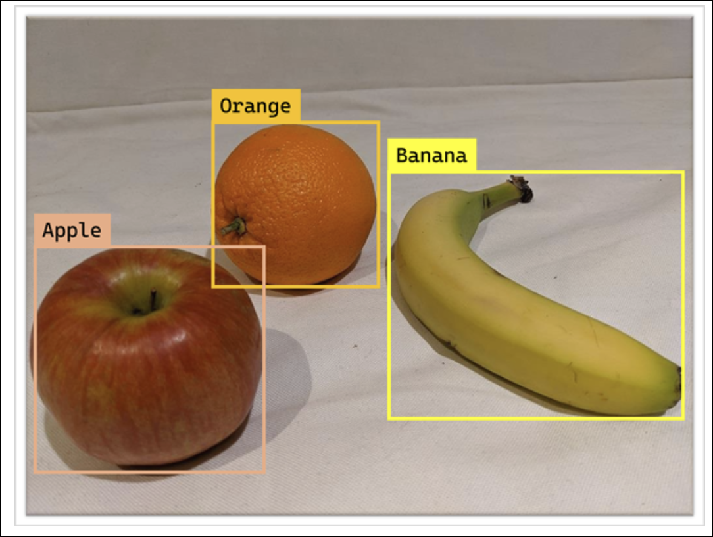
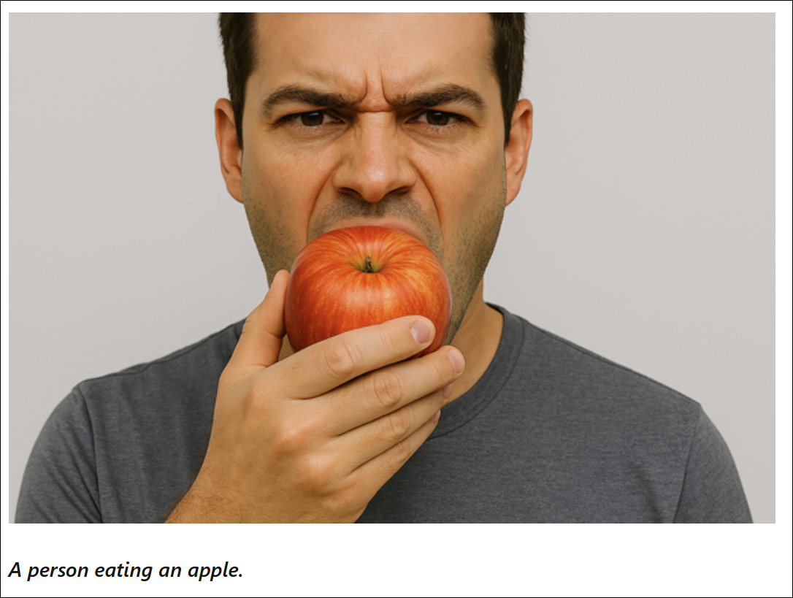
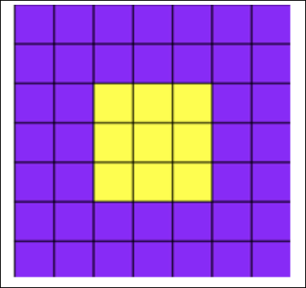

# Module 11: Introduction to computer vision concepts

**Link:** [Microsoft Learn](https://learn.microsoft.com/en-us/training/modules/introduction-computer-vision/)

---

## Computer vision tasks and techniques

[Module Reference](https://learn.microsoft.com/training/modules/introduction-computer-vision-concepts/)

**Computer Vision Overview**

* **Computer vision** refers to AI tasks and techniques that process **visual input**.
* Visual input typically comes from **images, videos, or live camera streams**.
* Computer vision is a **well-established field of AI** with techniques that have evolved significantly over time.
* The goal is to **extract meaningful information** from visual data.

**Image Classification**

* One of the **oldest computer vision techniques**.
* A model is trained with a **large number of labeled images**.
* The model predicts a **single text label** that represents the main subject of an image.
* Uses **visual features** of an image to determine its contents.
* Example use case:

  * Identifying types of produce (apple, orange, banana) at a grocery store checkout.
  * Pricing is determined by identifying the item and combining it with its **measured weight**.

**Object Detection**

* Used when **multiple objects** need to be identified in a single image.
* Models analyze **multiple regions** within an image.
* Output includes:

  * **Which objects** were detected.
  * **Where** they appear in the image.
* Object locations are represented by **rectangular bounding boxes** with coordinates.

**Semantic Segmentation**

* A more **precise object detection technique**.
* The model classifies **individual pixels** in the image.
* Each pixel is assigned to a specific object class.
* Produces a **detailed mask** showing exact object boundaries.
* Provides more accurate localization than bounding boxes.

**Contextual Image Analysis**

* Used by **modern multimodal computer vision models**.
* Identifies **relationships between objects** and associated text.
* Enables:

  * Semantic interpretation of images.
  * Understanding of **objects and activities** within an image.
  * Automatic generation of **descriptions** or **relevant tags**.

**Key Facts to Remember**

* **Image classification** outputs a single label per image.
* **Object detection** identifies multiple objects and their locations using bounding boxes.
* **Semantic segmentation** classifies images at the pixel level.
* **Contextual image analysis** connects visual content with semantic meaning and descriptions.
* All techniques rely on **trained models** using labeled visual data.

---

## Images and image processing

[Module Reference](https://learn.microsoft.com/training/modules/introduction-computer-vision/)

**Images as Pixel Arrays**

* An image is represented as an **array of numeric pixel values**
* Example shown uses a **7 × 7 pixel image** (resolution = rows × columns)
* Pixel values range from:

  * **0 = black**
  * **255 = white**
  * Values between represent **shades of gray**
* A **grayscale image** is a **two-dimensional array** (x and y coordinates)
* A single layer of pixel values represents one grayscale image

**Color Images and Channels**

* Most digital images are **multidimensional**
* A color image consists of **three channels**:

  * **Red**
  * **Green**
  * **Blue (RGB)**
* Each channel is a two-dimensional array with the same resolution
* Pixel color is determined by the **combination of RGB values**

  * Example combinations:

    * **Purple**: Red 150, Green 0, Blue 255
    * **Yellow**: Red 255, Green 255, Blue 0

**Filters and Kernels**

* Image processing commonly uses **filters** to modify pixel values
* A filter is defined by one or more **filter kernels**
* A kernel is a small matrix (example shown: **3 × 3**)

**Example Kernel (Laplace filter)**

* Kernel values:

  * -1 -1 -1
  * -1  8 -1
  * -1 -1 -1

**Convolutional Filtering Process**

* The kernel is **convolved across the image**
* For each position:

  * Multiply each pixel value by the corresponding kernel value
  * Sum the results to produce a new pixel value
* The computed value is placed into a **new output array**
* The kernel moves **one pixel at a time** until the entire image is processed

**Edge Handling and Normalization**

* Output values may fall **outside the 0–255 range**

  * Values are adjusted to fit within this range
* Pixels at the image edges are not fully computed

  * **Padding** is applied (usually value **0**)

**Effect of Filtering**

* The resulting array represents a **new transformed image**
* The example Laplace filter **highlights edges** in the image
* Convolutional filtering is named because the filter is convolved across the image

**Types of Filters**

* Laplace filter: **edge detection**
* Other filters can produce:

  * Blurring
  * Sharpening
  * Color inversion
  * Other visual effects

**Key Facts to Remember**

* **Grayscale images** use a single 2D pixel array
* **Color images** use **three RGB channels**
* Pixel values range from **0 to 255**
* **Filters use kernels** and convolution to modify images
* **Laplace filters highlight edges**
* Padding is typically **0** for edge pixels

---

## Convolutional neural networks

[Module Reference](https://learn.microsoft.com/training/modules/introduction-computer-vision-concepts/)

**Overview**

* Computer vision focuses on **extracting meaning or actionable insights** from images, not just applying visual effects.
* This requires **machine learning models** trained on large volumes of images.
* A **convolutional neural network (CNN)** is one of the most common deep learning architectures used for computer vision.

**What is a CNN**

* A CNN is a **deep learning architecture** that uses **filters** to extract numeric features from images.
* Extracted features are used by a neural network to **predict a label**.
* In image classification, the label represents **what the image contains** (for example, apple, banana, or orange).

**CNN Training Process**

* **Filter kernels** are initialized with **randomly generated weights**.
* Images with **known labels** are fed into the network.
* Model predictions are **compared to actual labels**.
* **Weights are adjusted** to improve accuracy.
* Training continues until an **optimal set of weights** is learned.

**CNN Image Classification Flow**

1. Images with known labels (for example, `0: apple`, `1: banana`, `2: orange`) are input to the network.
2. One or more **convolutional filter layers** extract features from images.

   * Filters generate **feature maps** (arrays of numeric values).
   * Optional **pooling/downsampling layers** reduce feature map size and emphasize key features.
3. Feature maps are **flattened** into a single-dimensional array.
4. Flattened values are passed to a **fully connected neural network**.
5. The output layer applies **softmax or similar functions** to produce class probabilities (for example, `[0.2, 0.5, 0.3]`).
6. Predicted probabilities are compared to actual labels (for example, banana = `[0.0, 1.0, 0.0]`).
7. **Loss is calculated**, and weights in both the neural network and filter kernels are updated.
8. Training repeats over multiple **epochs** until loss is minimized.

**Model Usage After Training**

* Learned weights are **saved**.
* The trained model can predict labels for **new, unlabeled images**.

**Architecture Notes**

* CNNs typically include:

  * Multiple convolutional layers
  * Layers to reduce feature map size
  * Layers to constrain or manipulate feature values
* These layers may be omitted in simplified explanations to focus on the **core concept**:

  * Filters extract numeric features
  * Features are used to predict image labels

**Key Facts to Remember**

* **CNNs are deep learning models** designed for image-based tasks.
* **Filters extract numeric feature maps** from images.
* **Random weights** are refined through training and loss minimization.
* **Softmax outputs probabilities** for each possible class.
* Training occurs over multiple **epochs** until optimal weights are learned.

---
