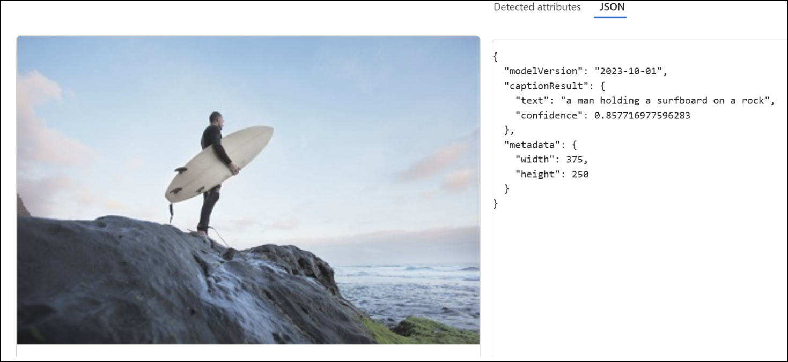
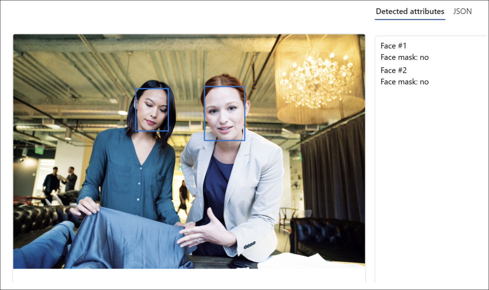
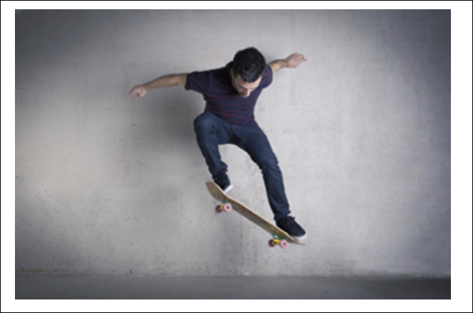
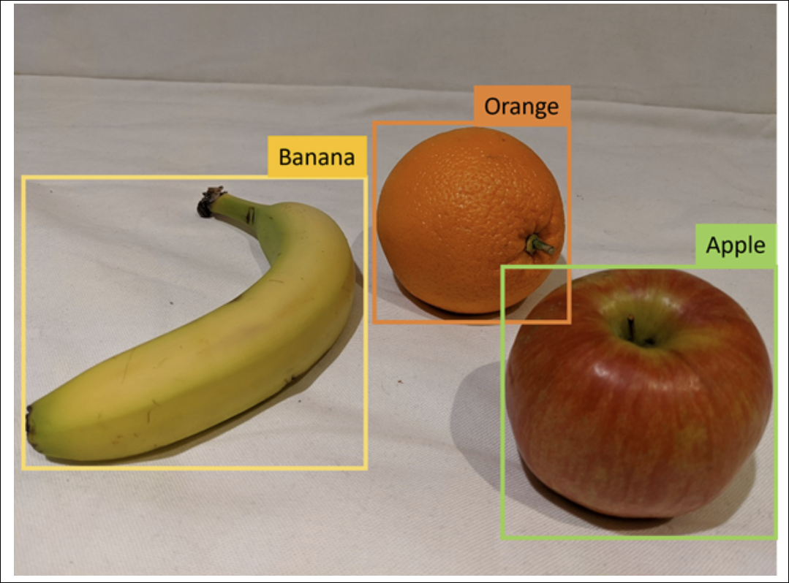
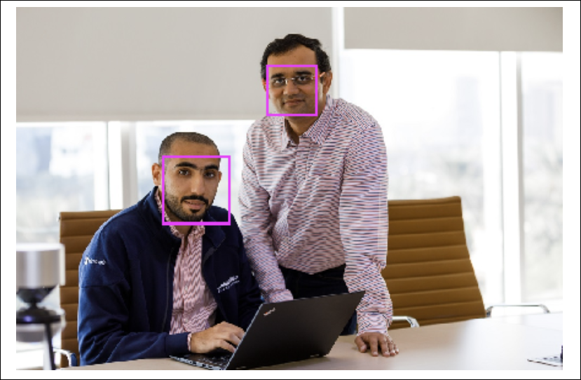
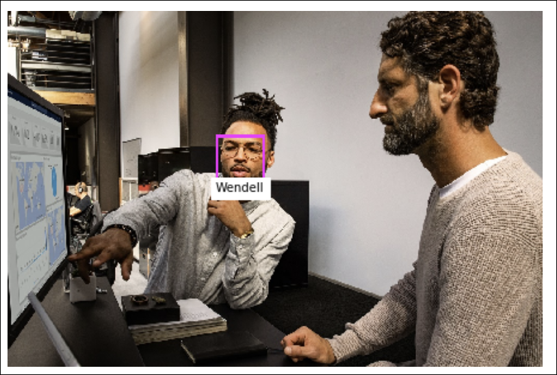

# Module 12: Get started with computer vision in Microsoft Foundry

**Link:** [Microsoft Learn](https://learn.microsoft.com/en-us/training/modules/get-started-computer-vision-azure/)

* [Understand Foundry Tools for computer vision](#understand-foundry-tools-for-computer-vision)
* [Understand Azure Vision Image Analysis Capabilities](#understand-azure-vision-image-analysis-capabilities)
* [Understand Azure Vision's Face service capabilities](#understand-azure-visions-face-service-capabilities)
* [Get started in Microsoft Foundry portal](#get-started-in-microsoft-foundry-portal)

---

## Understand Foundry Tools for computer vision

[Module Reference](https://learn.microsoft.com/training/modules/get-started-with-computer-vision-in-microsoft-foundry/)

**Overview**

* **Azure AI** provides cloud-based AI services, including computer vision.
* **Azure Vision** delivers prebuilt and customizable computer vision models based on deep learning.
* Azure Vision supports **off-the-shelf** scenarios and **custom models** trained with your own images.

**Azure Vision Products**

* **Azure Vision Image Analysis**

  * Detects common objects in images
  * Tags visual features
  * Generates image captions
  * Supports **optical character recognition (OCR)**

* **Azure AI Face**

  * Detects, recognizes, and analyzes human faces in images
  * Provides facial analysis models beyond standard image analysis

**Common Use Cases**

* **Search engine optimization**

  * Image tagging and captioning to improve search ranking
* **Content moderation**

  * Image detection to monitor image safety
* **Security**

  * Facial recognition for building security and device unlocking
* **Social media**

  * Automatic tagging of known people in photos
* **Missing persons**

  * Facial recognition used with public camera systems
* **Identity validation**

  * Entry kiosks where users present special permits
* **Museum archive management**

  * OCR to preserve text from paper documents

**Related Vision Capabilities**

* Many vision solutions combine multiple services.
* **Azure AI Video Indexer**

  * Supports video analysis
  * Built on Foundry Tools including:

    * Face
    * Translator
    * Image Analysis
    * Speech

**Key Facts to Remember**

* **Azure Vision** offers both prebuilt and custom computer vision models.
* **Image Analysis** handles objects, tags, captions, and OCR.
* **Azure AI Face** specializes in advanced facial detection and analysis.
* **Azure AI Video Indexer** integrates multiple Foundry Tools for video scenarios.

---

## Understand Azure Vision Image Analysis Capabilities

[Module Reference](https://learn.microsoft.com/training/modules/get-started-with-computer-vision/)

**Image Analysis Capabilities (No Customization Required)**

* **Image captions**: Analyze an image and generate a **human-readable description** of its contents.
* **Object detection**: Identify **thousands of common objects** in images.
* **Image tagging**: Generate **metadata tags** that summarize visual attributes.
* **Optical character recognition (OCR)**: Detect and extract **printed text** from images.

**Describing an Image with Captions**

* Azure Vision evaluates objects within an image and generates a **natural language caption**.
* Example output: *“A person jumping on a skateboard”*

**Detecting Common Objects in an Image**

* Identifies objects and returns:

  * **Object labels**
  * **Confidence scores** (percentage likelihood)
  * **Bounding box coordinates**:

    * Top
    * Left
    * Width
    * Height
* Example detections:

  * **Person (95.5%)**
  * **Skateboard (90.40%)**

**Tagging Visual Features**

* Generates **descriptive tags** with confidence scores.
* Tags are stored as **image metadata**.
* Useful for:

  * Indexing images
  * Enabling search scenarios
* Example tag characteristics:

  * Environment (outdoor)
  * Activity (skateboarding, jumping)
  * Objects (skateboard, clothing)
  * Concepts (balance, extreme sport)

**Optical Character Recognition (OCR)**

* Detects and extracts **text content from images**.
* Common use cases:

  * Labels
  * Signs
  * Printed documents
* Example extracted content:

  * Nutrition facts
  * Serving sizes
  * Calories and ingredients

**Training Custom Models**

* Used when built-in models **do not meet requirements**.
* Custom models are trained on a **pre-trained foundation model**.
* Requires **relatively few training images**.

**Image Classification**

* Predicts a **single category or class** for an image.
* Example use case:

  * Classifying fruit images (Apple, Banana, Orange)

**Object Detection (Custom Models)**

* Detects **multiple objects** in an image.
* Returns:

  * Object classification
  * Bounding box coordinates
* Can be trained using **custom image datasets**.

**Key Facts to Remember**

* Azure Vision supports **captioning, object detection, tagging, and OCR without customization**.
* Object detection outputs include **confidence scores and bounding box coordinates**.
* Tags are used as **searchable metadata**.
* OCR extracts **printed text from images**.
* Custom models extend image classification and object detection using **foundation models**.

---

## Understand Azure Vision's Face service capabilities

[Module Reference](https://learn.microsoft.com/training/modules/get-started-computer-vision-microsoft-foundry/)

**Overview**

* **Azure AI Face** is a product within **Azure Vision**
* Supports use cases such as:

  * **User identity verification**
  * **Liveness detection**
  * **Touchless access control**
  * **Face redaction**
* Core concepts include **face detection** and **face recognition**

**Facial detection**

* Identifies regions of an image that contain a human face
* Returns **bounding box (rectangle) coordinates** around each detected face
* Can analyze facial features to support model training
* Facial features include:

  * **Eyes**
  * **Eyebrows**
  * **Nose**
  * **Lips**
  * Other face landmarks

**Facial recognition**

* Uses multiple images of an individual to **train a machine learning model**
* Enables identification of known individuals in new images
* Operates only after the model has been trained with labeled faces
* Intended for responsible use to improve **efficiency, security, and customer experience**

**Azure AI Face service capabilities**

* Returns **face rectangle coordinates** for detected faces
* Can also return the following **face attributes**:

  * **Accessories**: headwear, glasses, mask (confidence score from 0–1)
  * **Blur**: indicates how blurred the face is
  * **Exposure**: underexposed or overexposed face
  * **Glasses**: whether glasses are worn
  * **Head pose**: face orientation in 3D space
  * **Mask**: whether a mask is worn
  * **Noise**: visual noise (graininess) in the face image
  * **Occlusion**: whether objects may be blocking the face
  * **Quality for recognition**: **high**, **medium**, or **low**

**Responsible AI use**

* Azure AI Face and Azure Vision use a **Limited Access policy**
* **Available to all users without approval**:

  * Detect face locations in images
  * Determine if glasses are worn
  * Detect **occlusion**, **blur**, **noise**, and **over/under exposure**
  * Return **head pose coordinates**
* **Requires Limited Access approval (intake form)**:

  * **Face verification** (compare faces for similarity)
  * **Face identification** (identify named individuals)
  * **Liveness detection** (detect real vs. fake or replayed input)

**Key Facts to Remember**

* **Face detection** returns bounding box coordinates
* **Face recognition** requires training with multiple images
* **Quality for recognition** is rated as high, medium, or low
* **Verification, identification, and liveness detection** require Limited Access approval
* Responsible AI standards govern advanced Face service capabilities

---

## Get started in Microsoft Foundry portal

[Module Reference](https://learn.microsoft.com/training/modules/get-started-computer-vision-microsoft-foundry/)

**Azure Vision Overview**

* **Azure Vision** provides core vision capabilities for applications.
* It is one of the **Foundry Tools** available for building AI solutions.
* Azure Vision solutions can be created using:

  * **Microsoft Foundry portal**
  * **SDKs or REST APIs**

**Azure Resources for Azure Vision**

* To use Azure Vision, a resource must be created in an Azure subscription.
* Two supported resource types:

  * **Azure Vision**

    * Dedicated resource for Azure Vision only.
    * Use when not planning to use other Foundry Tools.
    * Allows separate tracking of utilization and costs.
  * **Foundry Tools**

    * General resource that includes Azure Vision and other AI services.
    * Includes services such as **Azure Language**, **Azure AI Custom Vision**, and **Azure Translator**.
    * Use when planning to work with multiple AI services to simplify administration and development.

**Resource Creation Options**

* Resources can be created using:

  * A **user interface**
  * **Scripts**
* Both the **Azure portal** and **Microsoft Foundry portal** provide UI-based resource creation.
* Choose **Microsoft Foundry portal** when you want to:

  * Create resources
  * View examples of Foundry Tools in action

**Microsoft Foundry Portal**

* Microsoft Foundry is a **unified platform** for:

  * Enterprise AI operations
  * Model builders
  * Application development
* The portal UI is organized around **hubs** and **projects**.
* To use any Foundry Tool (including Azure Vision):

  * You must create a **project**
  * Creating a project automatically creates a **Foundry Tools resource**

**Projects in Microsoft Foundry**

* Projects act as **containers** for:

  * Datasets
  * Models
  * Other AI-related resources
* Projects help:

  * Organize work
  * Manage resources
  * Enable collaboration on AI solutions

**Using Azure Vision in the Portal**

* The Microsoft Foundry portal allows you to:

  * Test vision features with **sample images**
  * Upload and test **your own images**
* Vision capabilities can be explored directly within the portal UI.

**Key Facts to Remember**

* **Azure Vision** is a Foundry Tool used for computer vision capabilities.
* Two resource types: **Azure Vision** (dedicated) and **Foundry Tools** (shared).
* Creating a **project** in Microsoft Foundry automatically creates a Foundry Tools resource.
* Use the **Microsoft Foundry portal** to experiment with vision features using sample or uploaded images.
* Projects organize datasets, models, and resources for collaboration.

---
