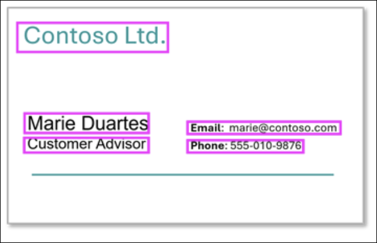

# Module 13: Introduction to AI-powered information extraction concepts

**Link:** [Microsoft Learn](https://learn.microsoft.com/en-us/training/modules/introduction-information-extraction/)

---

## Introduction to AI-powered information extraction concepts

[Module Reference](https://learn.microsoft.com/en-us/training/modules/introduction-information-extraction/1-introduction?pivots=text)

**Introduction**

* AI information extraction solutions are used to extract **structured data fields** from **unstructured media**
* Supported media includes:

  * **Documents**
  * **Images**
  * Emerging support for **videos** and **audio recordings**
* The module focuses on **documents and images**, while acknowledging broader AI capabilities

**Information Extraction Scenarios**

* Scenarios range from **simple applications** to **complex business workflow automation systems**
* Example spectrum:

  * Reading contact information from a **photograph of a business card**
  * Processing **financial and legal documents** in automated workflows

**Financial Document Processing**

* **Invoice processing** can extract:

  * **Vendor information**: company names, addresses, contact details
  * **Transaction details**: invoice numbers, dates, payment terms
  * **Line items**: product descriptions, quantities, unit prices, totals
  * **Tax information**: tax rates, amounts, exempt items
* **Receipt processing** can extract:

  * **Merchant details**: store names, locations, transaction IDs
  * **Purchase information**: items purchased, prices, discounts
  * **Payment details**: payment methods, change amounts, loyalty points
* **Financial statements** can extract:

  * **Account information**: account numbers, balances, transaction histories
  * **Performance metrics**: revenue, expenses, profit margins
  * **Compliance data**: regulatory reporting fields, audit trail information

**Legal and Compliance Documents**

* **Contract processing** can extract:

  * **Party information**: contracting parties, signatories, witnesses
  * **Terms and conditions**: effective dates, renewal terms, termination clauses
  * **Financial terms**: payment schedules, penalties, insurance requirements
* **Regulatory forms** can include:

  * **Tax documents**: W-2s, 1099s, other tax forms
  * **Insurance forms**: policy numbers, claim amounts, incident details
  * **Government forms**: application data, certification requirements

**Healthcare Documentation**

* **Medical records** can be processed to extract:

  * **Patient information**: demographics, medical record numbers, insurance details
  * **Clinical data**: diagnoses, treatments, medication lists, vital signs
  * **Administrative data**: appointment schedules, billing codes, provider information

**Supply Chain and Logistics**

* **Shipping documents** can extract:

  * **Shipment details**: tracking numbers, weights, dimensions
  * **Address information**: sender and recipient details, delivery instructions
  * **Customs documentation**: commodity codes, values, geographical origin
* **Purchase Orders** can extract:

  * **Vendor information**: supplier details, contact information
  * **Product specifications**: item codes, descriptions, quantities
  * **Delivery requirements**: schedules, locations, special instructions

**Learning Format Notes**

* The module supports **video-based** and **text-based** learning formats
* **Text content** provides **greater detail** and may supplement videos

**Key Facts to Remember**

* Information extraction converts **unstructured content** into **structured data**
* Common source media includes **documents** and **images**
* Use cases span **finance, legal, healthcare, and logistics**
* Information extraction is foundational for **workload automation systems**

---

## Overview of information extraction

[Module Reference](https://learn.microsoft.com/training/modules/intro-ai-powered-information-extraction-concepts/)

**Information Extraction Overview**

* **Information extraction** is a workload that combines multiple AI techniques to extract data from content, often digital documents.
* A comprehensive solution typically combines:

  * **Computer vision** to detect text in image-based data.
  * **Machine learning or generative AI** to semantically map extracted text to specific data fields.

**Information Extraction Process**

* **Text detection and extraction** from images using **optical character recognition (OCR)**.
* **Value identification and mapping** from OCR results to predefined data fields.

**Example Use Case**

* AI-powered expense claim processing:

  * Automatically extracts relevant fields from receipts.
  * Improves efficiency in processing claims.
* Example extracted fields:

  * **Vendor**
  * **Date**
  * **Subtotal**
  * **Tax**
  * **Total claim**

**Choosing the Right Approach**

* **Document characteristics**

  * **Layout consistency**:

    * Standardized forms favor template-based approaches.
    * Multiple formats and layouts may require machine learning–based solutions.
  * **Volume requirements**:

    * High-volume processing benefits from automated machine learning models on optimized hardware.
  * **Accuracy requirements**:

    * Critical applications may require **human-in-the-loop validation**.

* **Technical infrastructure requirements and constraints**

  * **Security and privacy**:

    * Documents may contain sensitive or confidential data.
    * Solutions must secure access and comply with industry requirements.
  * **Processing power**:

    * Deep learning and generative AI models require significant computational resources.
  * **Latency requirements**:

    * Real-time processing can limit model complexity.
  * **Scalability needs**:

    * Cloud-based solutions provide better scalability for variable workloads.
  * **Integration complexity**:

    * Consider API compatibility and data format requirements.

**Platform-Based Solutions**

* Information extraction solutions can be built using software services such as:

  * **Azure Document Intelligence** in Microsoft Foundry Tools.
  * **Azure Content Understanding** in Microsoft Foundry Tools.
* Using these services:

  * Reduces development effort.
  * Provides scalable, industry-proven performance.
  * Improves accuracy and integration capabilities.

**Key Facts to Remember**

* Information extraction combines **OCR**, **computer vision**, and **machine learning or generative AI**.
* OCR is responsible for **text detection and extraction**.
* Value mapping links extracted text to **specific data fields**.
* Layout consistency, volume, and accuracy drive solution design.
* Cloud-based services improve **scalability**, **performance**, and **integration**.

---
