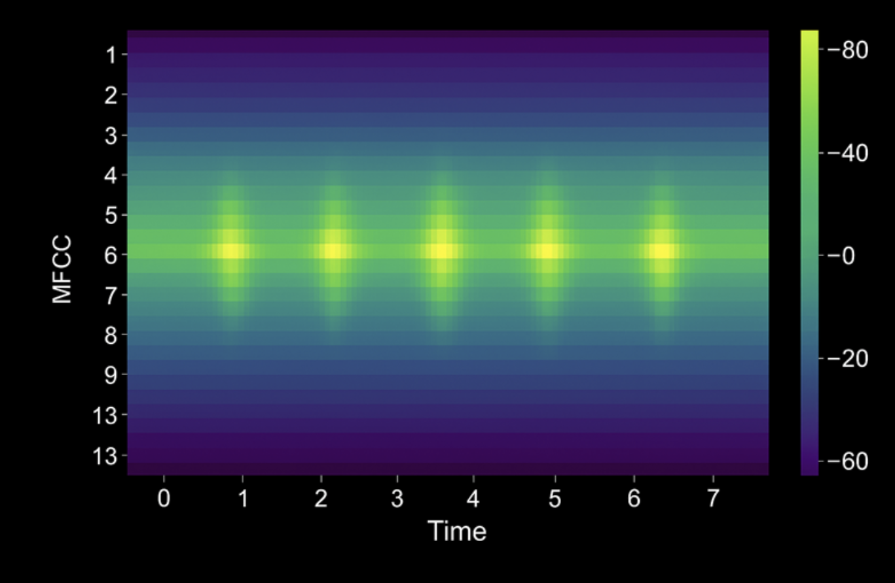

# Microsoft Learn - AI-900 Modules

**Objective:** Complete all official Microsoft Learn modules mapped to AI-900 exam objectives.

- [AI-900 Certification Page](https://learn.microsoft.com/en-us/credentials/certifications/azure-ai-fundamentals/?practice-assessment-type=certification)
- [AI-900 Study Guide](https://learn.microsoft.com/en-us/credentials/certifications/resources/study-guides/ai-900)
- [Microsoft Learn Course for AI-900](https://learn.microsoft.com/en-us/training/courses/ai-900t00)
- [Microsoft Learning Path - Introduction to AI in Azure](https://learn.microsoft.com/en-us/training/paths/introduction-to-ai-on-azure/)

---

## 📚 Learning Path: Introduction to AI in Azure

**Link:** [Introduction to AI in Azure](https://learn.microsoft.com/en-us/training/paths/introduction-to-ai-on-azure/)

| #   | Module                                                                                                                                                   | Status | Completed | Notes                                                               |
| --- | -------------------------------------------------------------------------------------------------------------------------------------------------------- | ------ | --------- | ------------------------------------------------------------------- |
| 1   | [Overview of AI concepts](https://learn.microsoft.com/en-us/training/modules/get-started-ai-fundamentals/)                                               | ✅     | 1/17/26         | [notes](01-overview-ai-concepts/notes.md)                           |
| 2   | [Get started with AI in Microsoft Foundry](https://learn.microsoft.com/en-us/training/modules/get-started-ai-in-foundry/)                                | ✅    | 1/18/26          | [notes](02-get-started-ai-foundry/notes.md)                         |
| 3   | [Introduction to machine learning concepts](https://learn.microsoft.com/en-us/training/modules/fundamentals-machine-learning/)                           | ✅    | 1/18/26         | [notes](03-intro-machine-learning-concepts/notes.md)                |
| 4   | [Get started with machine learning in Azure](https://learn.microsoft.com/en-us/training/modules/design-machine-learning-model-training-solution/)        | ✅    | 1/19/26         | [notes](04-get-started-machine-learning-azure/notes.md)             |
| 5   | [Introduction to generative AI and agents](https://learn.microsoft.com/en-us/training/modules/fundamentals-generative-ai/)                               | ✅    | 1/19/26        | [notes](05-intro-generative-ai-agents/notes.md)                     |
| 6   | [Get started with generative AI in Microsoft Foundry](https://learn.microsoft.com/en-us/training/modules/get-started-generative-ai-azure/)               | ✅    | 1/19/26         | [notes](06-get-started-generative-ai-foundry/notes.md)              |
| 7   | [Introduction to text analysis concepts](https://learn.microsoft.com/en-us/training/modules/introduction-language/)                                      | ✅    | 1/19/26         | [notes](07-intro-text-analysis-concepts/notes.md)                   |
| 8   | [Get started with text analysis in Microsoft Foundry](https://learn.microsoft.com/en-us/training/modules/get-started-language-azure/)      | ✅    | 1/20/26         | [notes](08-get-started-nlp-foundry/notes.md)                        |
| 9   | [Introduction to AI speech concepts](https://learn.microsoft.com/en-us/training/modules/introduction-ai-speech/)                                         | 🕒    | —         | [notes](09-intro-ai-speech-concepts/notes.md)                       |
| 10  | [Get started with speech in Microsoft Foundry](https://learn.microsoft.com/en-us/training/modules/recognize-synthesize-speech/)                          | 🕒    | —         | [notes](10-get-started-speech-foundry/notes.md)                     |
| 11  | [Introduction to computer vision concepts](https://learn.microsoft.com/en-us/training/modules/introduction-computer-vision/)                             | 🕒    | —         | [notes](11-intro-computer-vision-concepts/notes.md)                 |
| 12  | [Get started with computer vision in Microsoft Foundry](https://learn.microsoft.com/en-us/training/modules/get-started-computer-vision-azure/)           | 🕒    | —         | [notes](12-get-started-computer-vision-foundry/notes.md)            |
| 13  | [Introduction to AI-powered information extraction concepts](https://learn.microsoft.com/en-us/training/modules/introduction-information-extraction/)    | 🕒    | —         | [notes](13-intro-information-extraction-concepts/notes.md)          |
| 13  | [Get started with AI-powered information extraction in Microsoft Foundry](https://learn.microsoft.com/en-us/training/modules/ai-information-extraction/) | 🕒    | —         | [notes](14-get-started-information-extraction-foundry/notes.md)     |

**Legend:** 🕒 Not Started | 🚧 In Progress | ✅ Complete

---

## Introduction to AI Speech Concepts

[Module Reference](https://learn.microsoft.com/training/modules/introduction-ai-speech-concepts/)

**Overview**

* **Speech** is a natural human communication method that enables more intuitive, accessible, and engaging AI applications.
* Adding speech capabilities improves user experiences in:

  * Voice assistants
  * Accessible applications
  * Conversational AI agents
* Understanding speech technologies is essential for modern AI solutions.

**Fundamental Speech Capabilities**

* **Speech recognition**

  * Converts **spoken words into text**
* **Speech synthesis**

  * Converts **text into natural-sounding speech**
* These two capabilities work together to enable **seamless voice interactions**.

**Learning Focus of the Module**

* How speech recognition and speech synthesis function
* How both technologies combine to power **voice-enabled applications**
* Real-world scenarios where speech technologies enhance user interaction

**Key Facts to Remember**

* **Speech recognition** = spoken language → text
* **Speech synthesis** = text → spoken language
* Speech technologies enable **intuitive, accessible, and engaging** AI experiences

---

## Speech-enabled solutions

[Module Reference](URL)

**Overview**

- **Speech recognition** converts spoken language into text.
- **Speech synthesis** converts text into natural-sounding audio.
- Together, they enable hands-free interaction, improve accessibility, and support natural conversational experiences.

**Benefits of Integrating Speech**

- **Expand accessibility**: Supports users with visual impairments or mobility challenges.
- **Increase productivity**: Enables multitasking without keyboards or screens.
- **Enhance user experience**: Creates natural, human-like conversations.
- **Reach global audiences**: Supports multiple languages and regional dialects.

**Common Speech Recognition Scenarios (Speech-to-Text)**

- **Customer service and support**

  - Real-time call transcription
  - Intelligent call routing
  - Sentiment analysis and issue detection
  - Searchable call records
  - **Business value**: Reduces manual notes, improves accuracy, captures service insights.

- **Voice-activated assistants and agents**

  - Voice commands for hands-free control
  - Natural language question answering
  - Task execution (reminders, messages, searches)
  - Device and system control
  - **Business value**: Increases engagement and simplifies workflows.

- **Meeting and interview transcription**

  - Searchable meeting notes
  - Real-time captions
  - Summaries and key point extraction
  - **Business value**: Saves time, ensures accurate and accessible records.

- **Healthcare documentation**

  - Dictation into electronic health records
  - Real-time updates to treatment plans
  - Reduced administrative burden
  - **Business value**: Improves care focus and documentation accuracy.

**Common Speech Synthesis Scenarios (Text-to-Speech)**

- **Conversational AI and chatbots**

  - Spoken responses instead of text
  - Adjustable tone, pace, and style
  - Voice-based customer interactions
  - **Business value**: Improves approachability and availability.

- **Accessibility and content consumption**

  - Read-aloud web and document content
  - Support for dyslexia and visual impairments
  - Hands-free content consumption
  - **Business value**: Expands audience reach and inclusion.

- **Notifications and alerts**

  - Spoken alerts and reminders
  - Navigation and GPS instructions
  - Safety and system status updates
  - **Business value**: Improves responsiveness and safety.

- **E-learning and training**

  - Narrated lessons without recording studios
  - Pronunciation guidance
  - Multilingual audio content
  - **Business value**: Reduces costs and accelerates content creation.

- **Entertainment and media**

  - Character voices and voiceovers
  - Podcast and audiobook prototypes
  - Personalized audio experiences
  - **Business value**: Enables rapid prototyping and scalability.

**Combining Speech Recognition and Synthesis**

- **Voice-driven customer service**
- **Interactive voice response (IVR) systems**
- **Language learning applications**
- **Voice-controlled vehicles**

*Combined use enables fluid, two-way conversational experiences that reduce user friction.*

**Key Considerations Before Implementation**

- **Audio quality**: Noise, microphones, and bandwidth affect accuracy.
- **Language and dialect support**: Verify coverage for target audiences.
- **Privacy and compliance**: Understand audio data handling and protection.
- **Latency**: Real-time conversations require low latency.
- **Accessibility standards**: Must align with WCAG guidelines.
- **Alternative interfaces**: Always provide text-based input and output options.

**Key Facts to Remember**

- **Speech recognition** = speech-to-text.
- **Speech synthesis** = text-to-speech.
- Combining both enables conversational AI.
- Accessibility and alternative interfaces are mandatory considerations.

---

## Introduction to AI speech concepts – Speech recognition

[Module Reference](https://learn.microsoft.com/en-us/training/modules/introduction-ai-speech/3-speech-recognition?pivots=text)

**Speech Recognition Overview**

- **Speech recognition (speech-to-text)** converts spoken language into written text.
- The pipeline consists of **six coordinated stages**:

  - Audio capture
  - Pre-processing
  - Acoustic modeling
  - Language modeling
  - Decoding
  - Post-processing

**Audio Capture**

- Converts **analog sound waves to digital signals** using a microphone.
- Typical sampling rate for speech:

  - **16,000 samples per second (16 kHz)**
- Sampling rate considerations:

  - Higher rates (e.g., **44.1 kHz**) capture more detail but increase processing cost.
  - Speech systems balance clarity and efficiency at **8–16 kHz**.
- Accuracy is affected by:

  - Background noise
  - Microphone quality
  - Distance from the speaker
- Basic filters may remove hums, clicks, and background noise before further processing.

**Pre-Processing**

- Transforms raw audio into compact, meaningful representations.
- Discards irrelevant details such as absolute volume.

**Mel-Frequency Cepstral Coefficients (MFCCs)**

- **Most common feature extraction technique** in speech recognition.
- Mimics human hearing by emphasizing speech-relevant frequencies.
- **MFCC process**:

  1. Divide audio into overlapping **20–30 ms frames**
  2. Apply **Fourier transform** to convert time domain to frequency domain
  3. Map frequencies to the **Mel scale**
  4. Extract a small set of coefficients (commonly **13 coefficients**)
- Output is a **sequence of feature vectors**, one per frame.
- Each vector contains **13 MFCC values** representing spectral shape.

**Acoustic Modeling**

- Learns the relationship between audio features and **phonemes**.
- **Phonemes** are the smallest sound units distinguishing words.

  - English uses approximately **44 phonemes**
  - Example: *cat* → /k/, /æ/, /t/
- Modern systems use **transformer architectures**.
- Transformer characteristics:

  - **Attention mechanisms** use surrounding frames for context
  - **Parallel processing** improves speed and accuracy
  - **Contextualized predictions** learn common phoneme sequences
- Output is a **probability distribution over phonemes** for each frame.
- Phonemes are **language-specific** and require retraining for other languages.

**Language Modeling**

- Resolves ambiguity where phonemes alone are insufficient.
- Applies knowledge of:

  - Vocabulary
  - Grammar
  - Common word patterns
- Language model guidance includes:

  - **Statistical patterns** from training data
  - **Context awareness** based on prior words
  - **Domain adaptation** for specialized terminology

**Decoding**

- Searches for the word sequence that best matches acoustic and language models.
- Balances:

  - Fidelity to the audio signal
  - Readability and grammatical correctness
- **Beam search decoding**:

  - Maintains a shortlist of top-scoring hypotheses
  - Extends, scores, and prunes candidates at each step
- Evaluates **thousands of hypotheses** for short utterances.
- Decoding is **computationally intensive**.

  - Real-time systems limit beam width and hypothesis depth to reduce latency.

**Post-Processing**

- Refines raw decoded text for presentation.
- Common tasks:

  - **Capitalization**
  - **Punctuation restoration**
  - **Number formatting**
  - **Profanity filtering**
  - **Inverse text normalization**
  - **Confidence scoring**
- Azure Speech returns:

  - Final transcription
  - **Word-level timestamps**
  - **Confidence scores**

**End-to-End Pipeline Flow**

- Audio capture → raw signal
- Pre-processing → MFCC features
- Acoustic modeling → phoneme probabilities
- Language modeling → vocabulary and grammar context
- Decoding → best word sequence
- Post-processing → readable, formatted text

**Key Facts to Remember**

- **Six stages** make up the speech recognition pipeline
- Typical speech sampling rate: **16 kHz**
- MFCCs commonly extract **13 coefficients**
- Audio frames are **20–30 ms**
- English has approximately **44 phonemes**
- Transformers are used for modern acoustic modeling
- Beam search is the most common decoding technique
- Post-processing improves readability and usability

---
