---

## Wrong Answers

Click to expand

## Why You Missed This Question

You selected **Key Phrase Extraction**, but the correct answer is **Named Entity Recognition (NER)**. Here's a clearer breakdown of why:

### The Key Difference

| Feature | What It Does | Example Output |
|---------|--------------|----------------|
| **Key Phrase Extraction** | Identifies the *main topics or concepts* in text | "machine learning", "cloud computing", "data analysis" |
| **Named Entity Recognition** | Identifies and *classifies specific entities* into categories like **people, places, organizations** | "John Smith" → Person, "Seattle" → Location, "Microsoft" → Organization |

### Why NER is Correct for This Scenario

The question specifically asks about extracting **"information and concepts, such as people and locations, for classification purposes."**

The critical phrase here is **"such as people and locations"** — these are **named entities**, not key phrases.

- **NER** categorizes text into predefined entity types (Person, Location, Organization, Date, Quantity, etc.)
- **Key Phrase Extraction** just pulls out important topics/themes without categorizing them

### For an Article Recommendation System

NER is ideal because:

- You can recommend articles about the **same person** mentioned
- You can recommend articles about the **same location**
- You can group articles by **organization** or **company**

Key phrase extraction would only tell you "this article is about technology" — it wouldn't distinguish between *who* or *where*.

### Quick Memory Trick

- **Key Phrase** = "What is this about?" (topics)
- **NER** = "Who/What/Where specifically?" (classified entities)

---

---

---

---

---

---

---

---

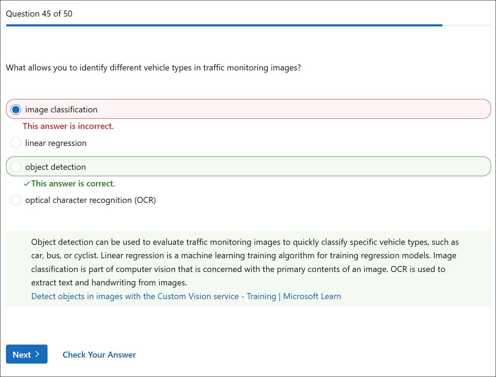

---

## Correct Answers

---

---

---

---

---

---

---

---

---

---

---

---

---

---

---

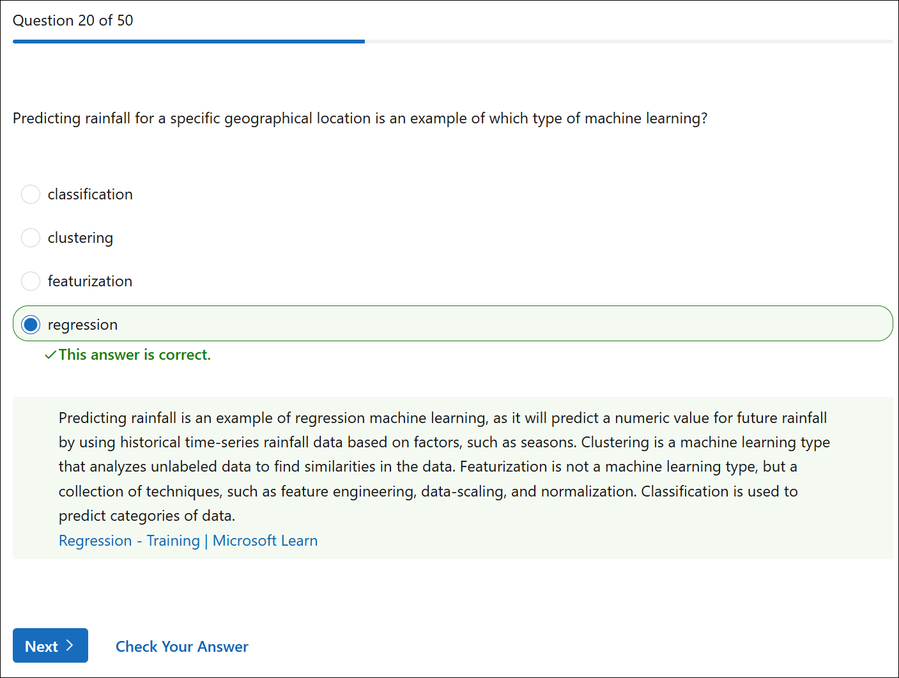

---

---

---

---

---

---

---

---

---

---

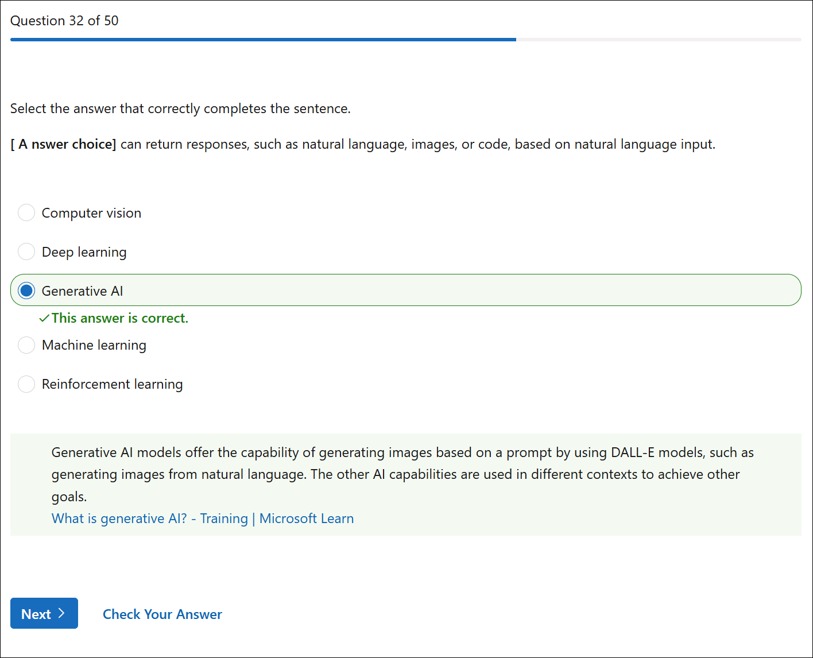

---

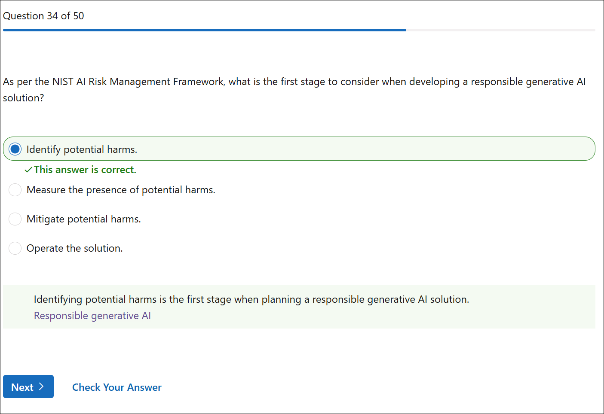

---

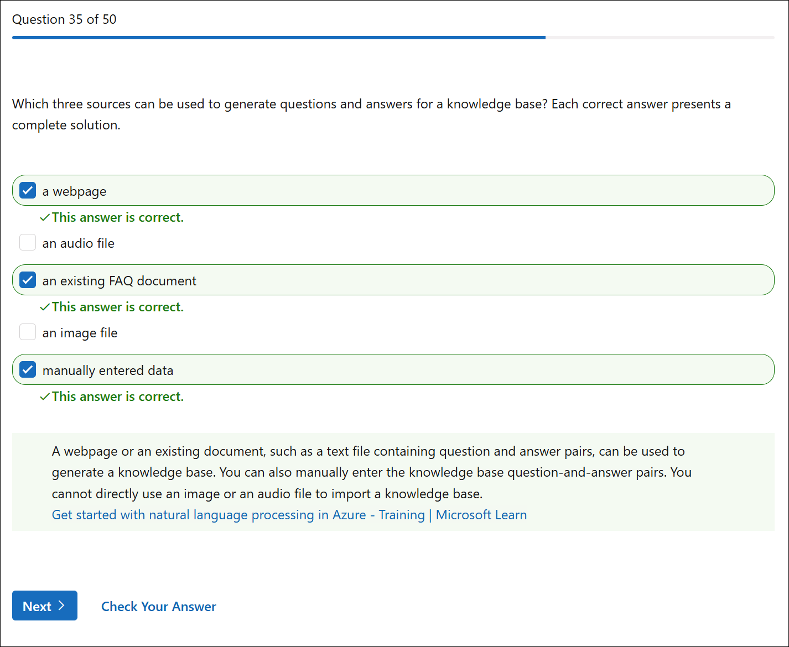

---

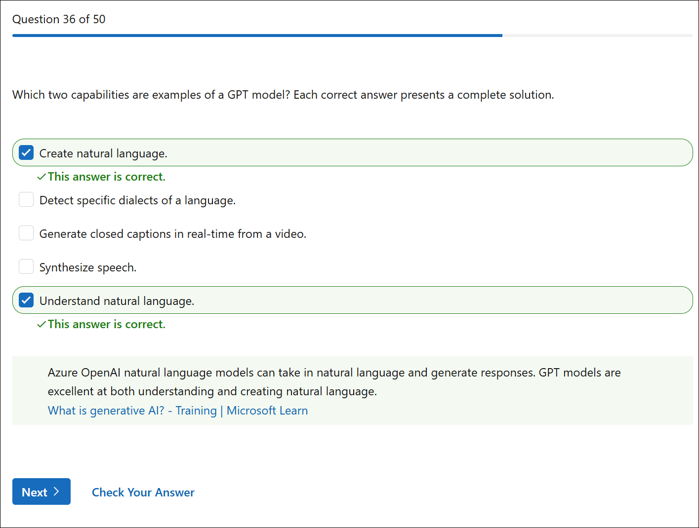

---

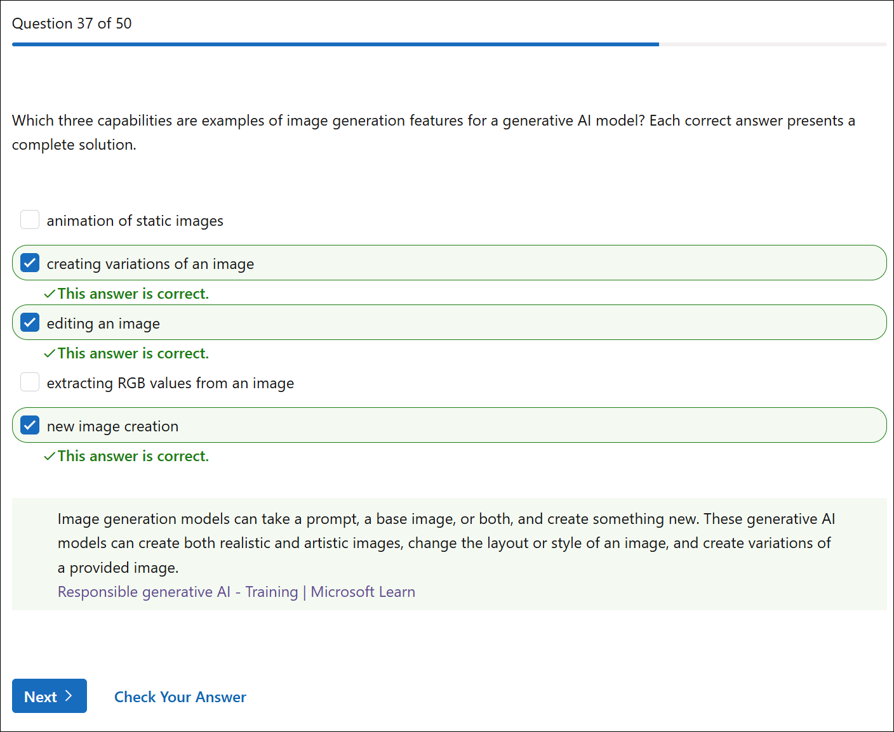

---

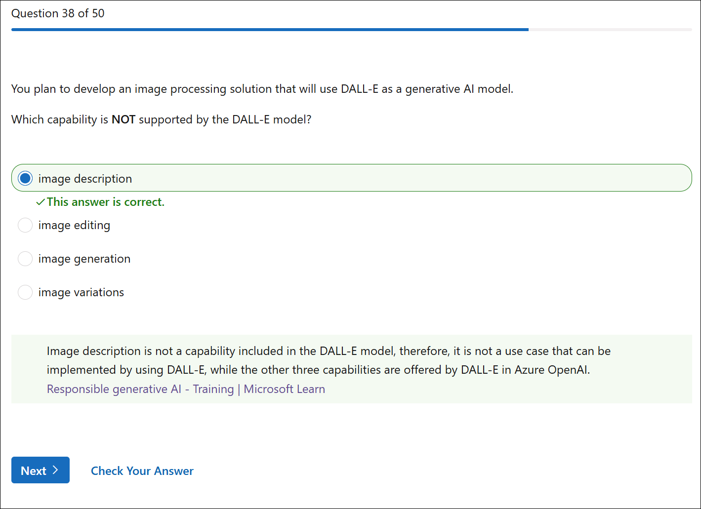

---

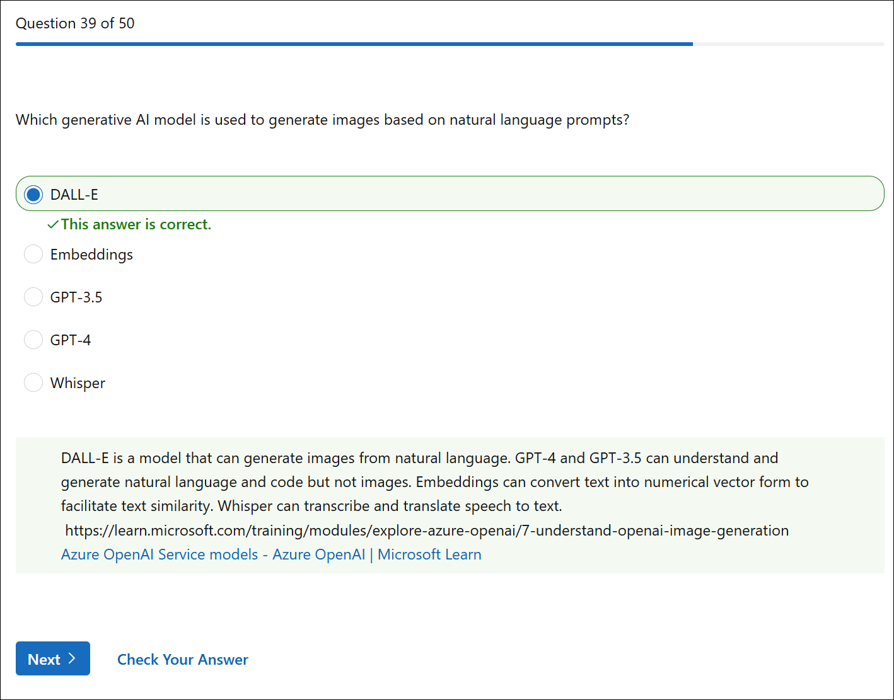

---

---

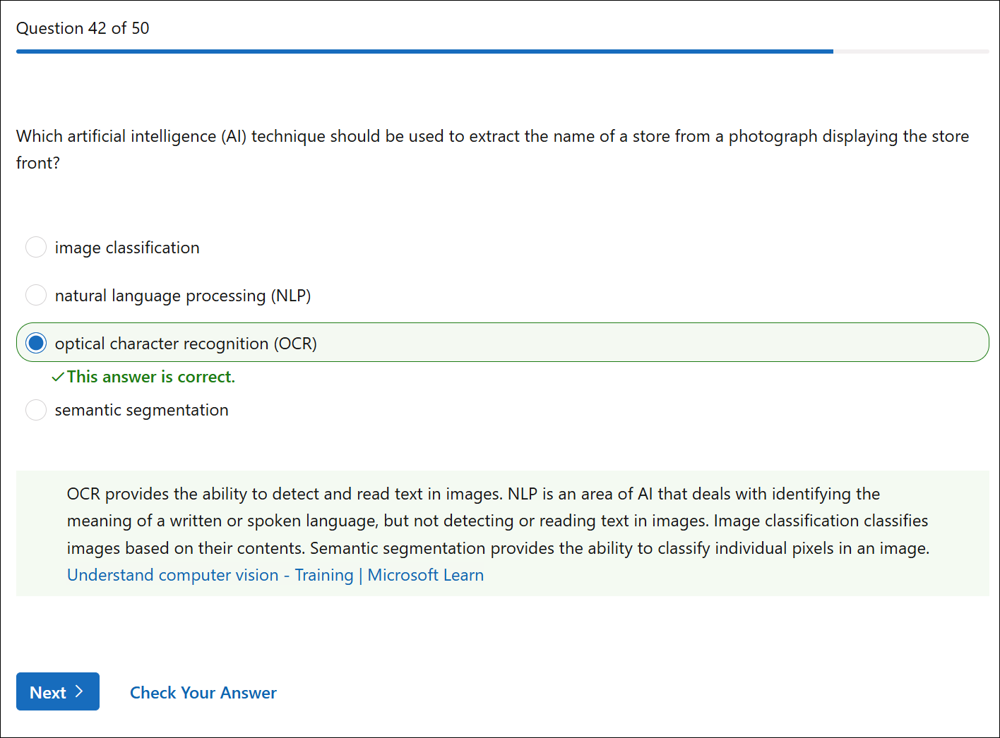

---

---

---

---

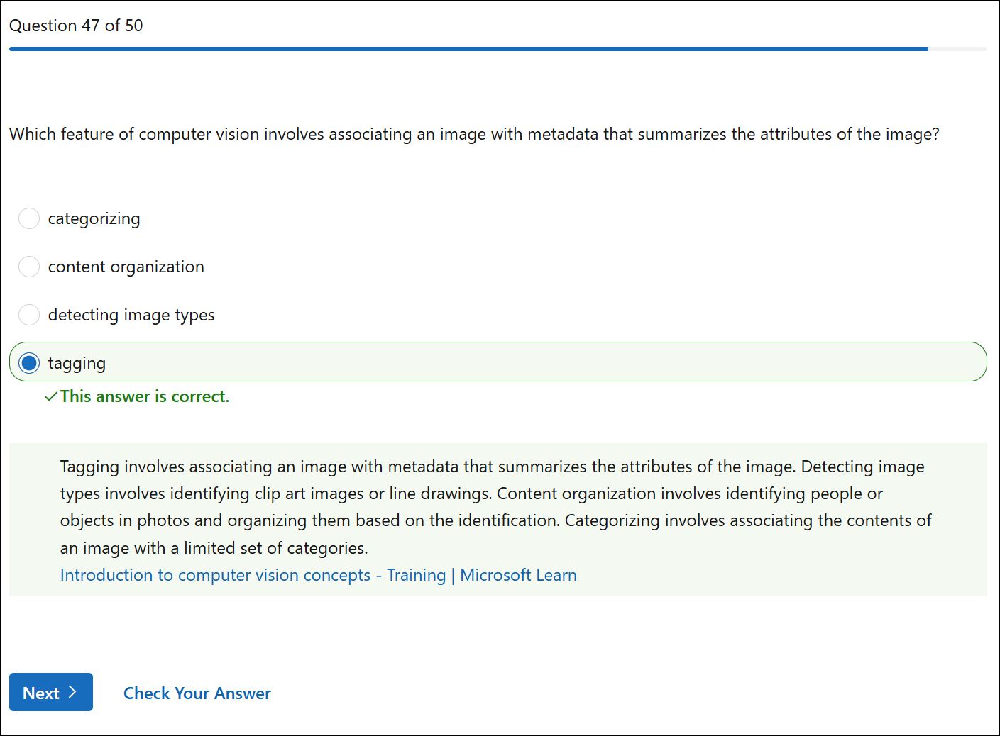

---

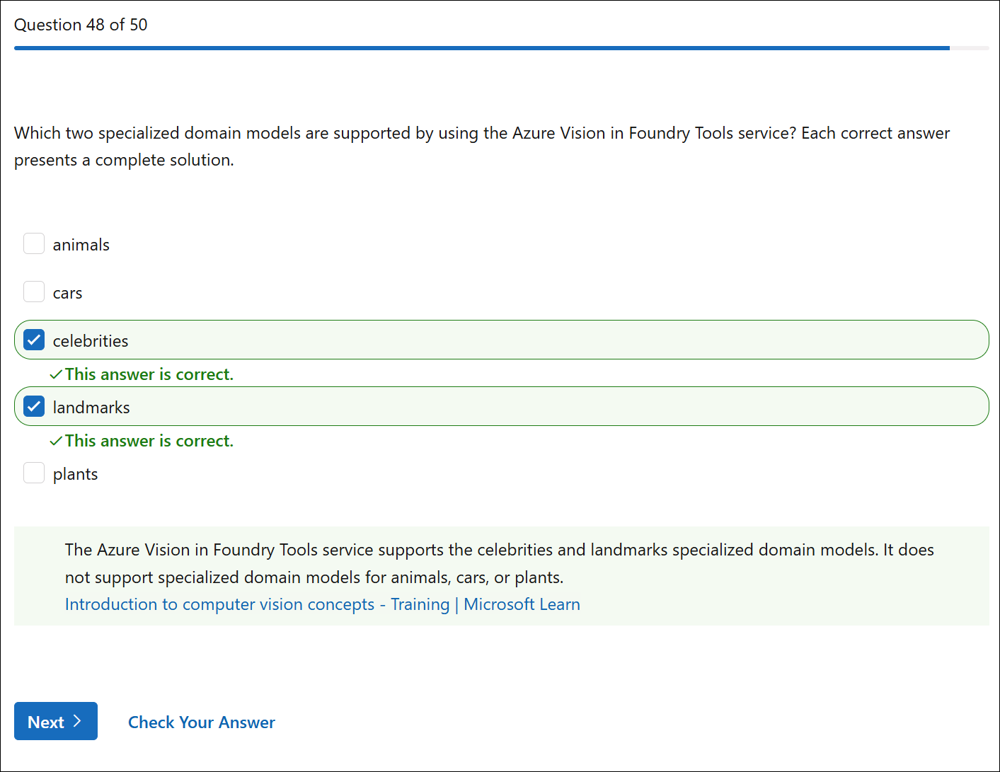

---

---

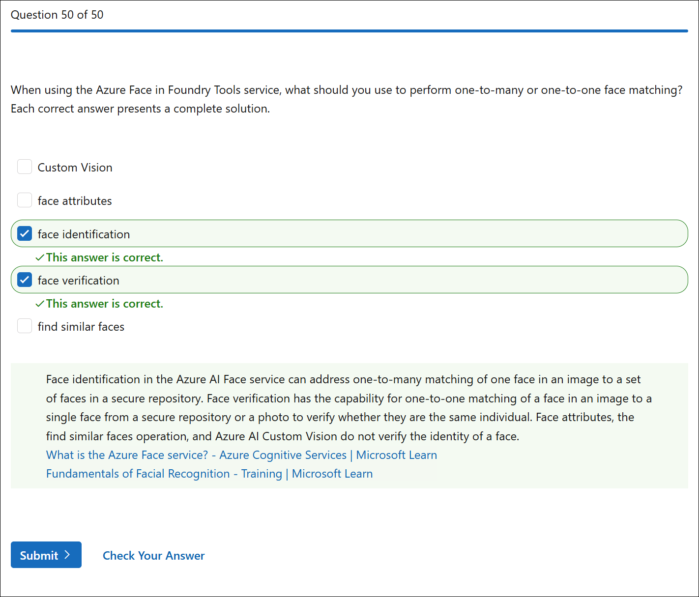
