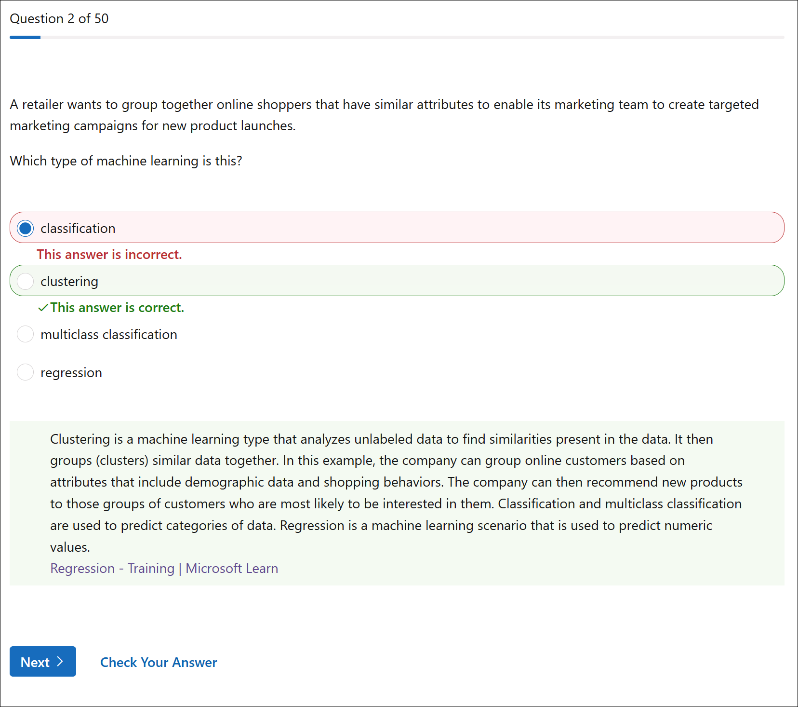
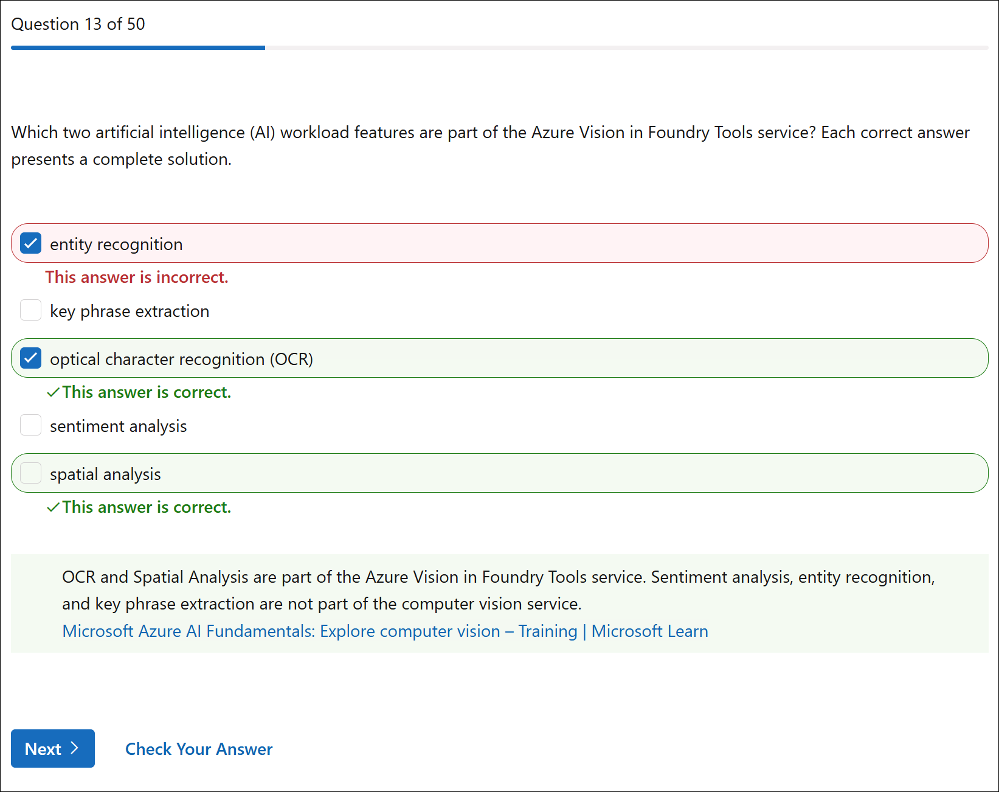
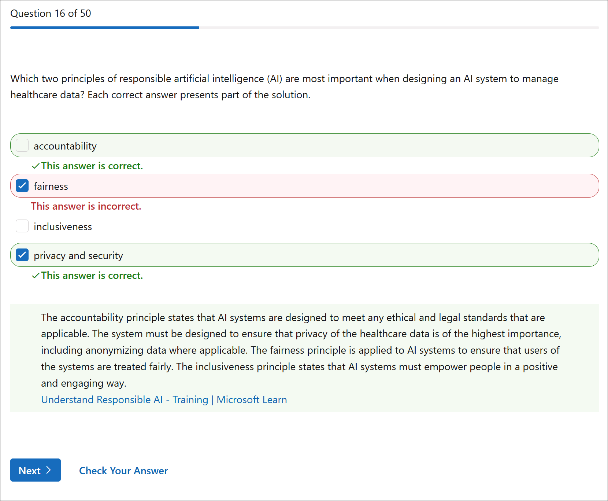
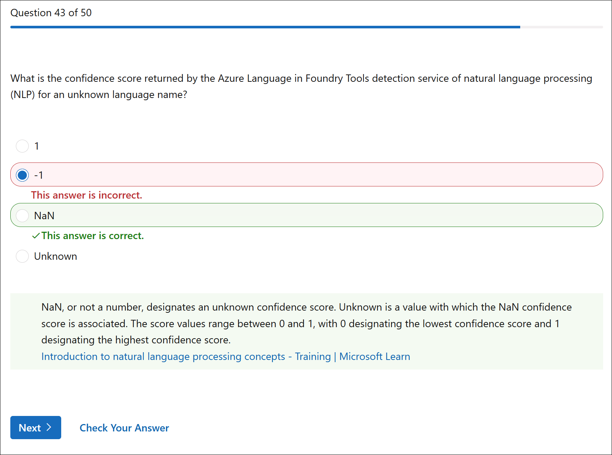
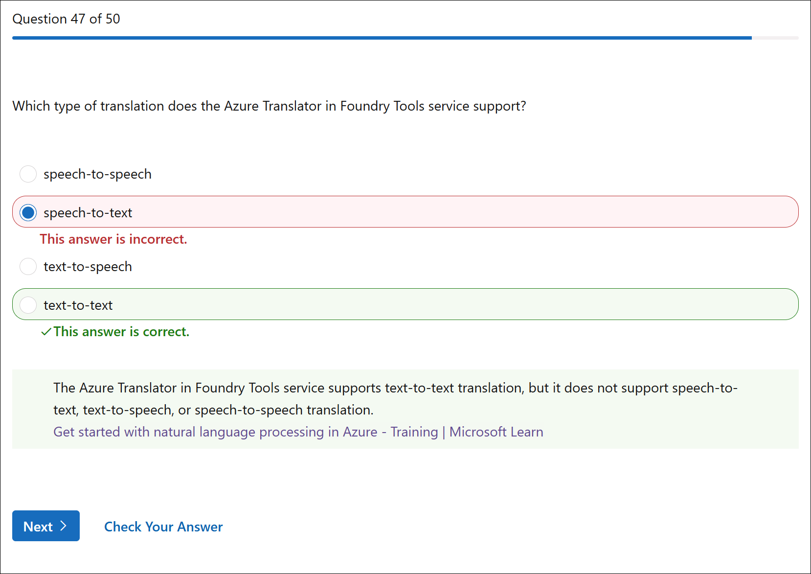
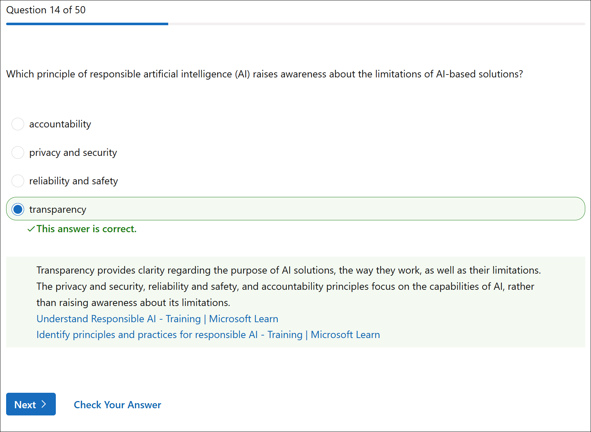
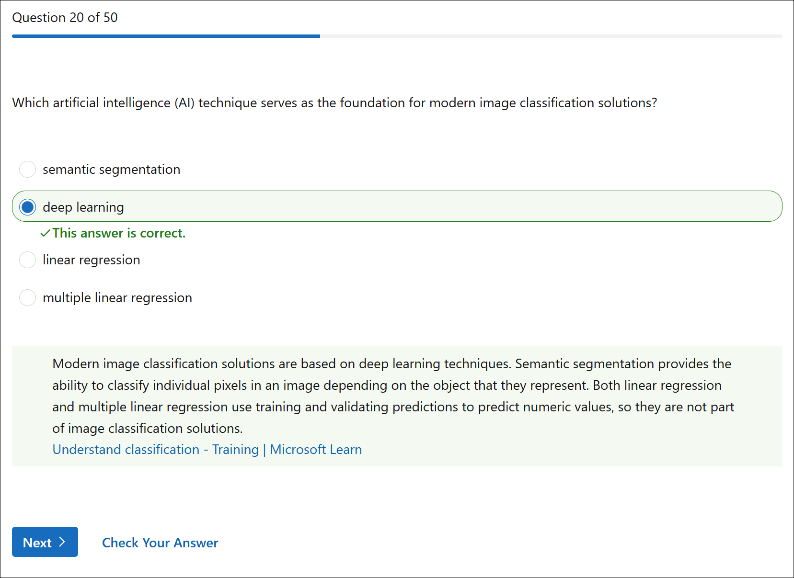
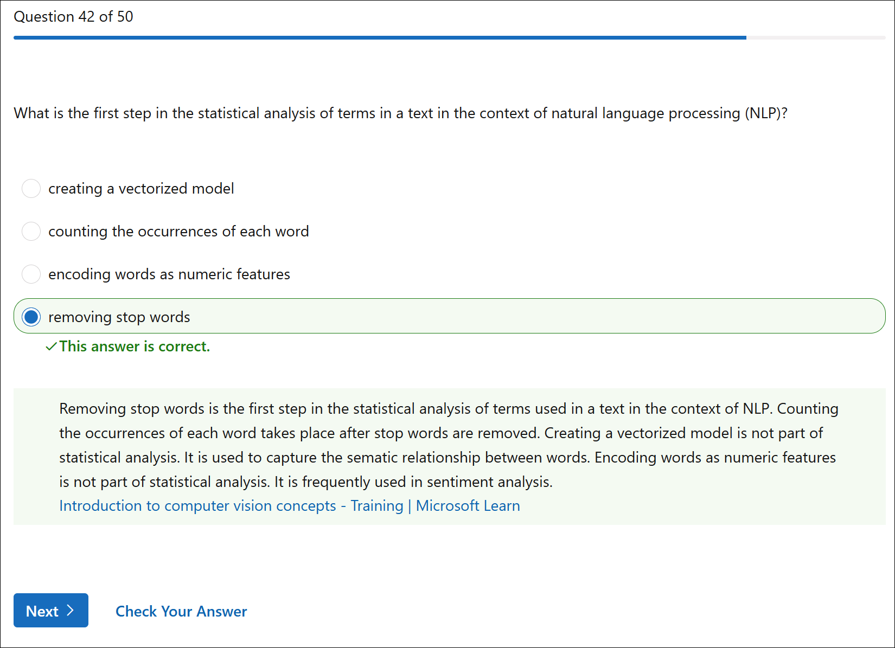
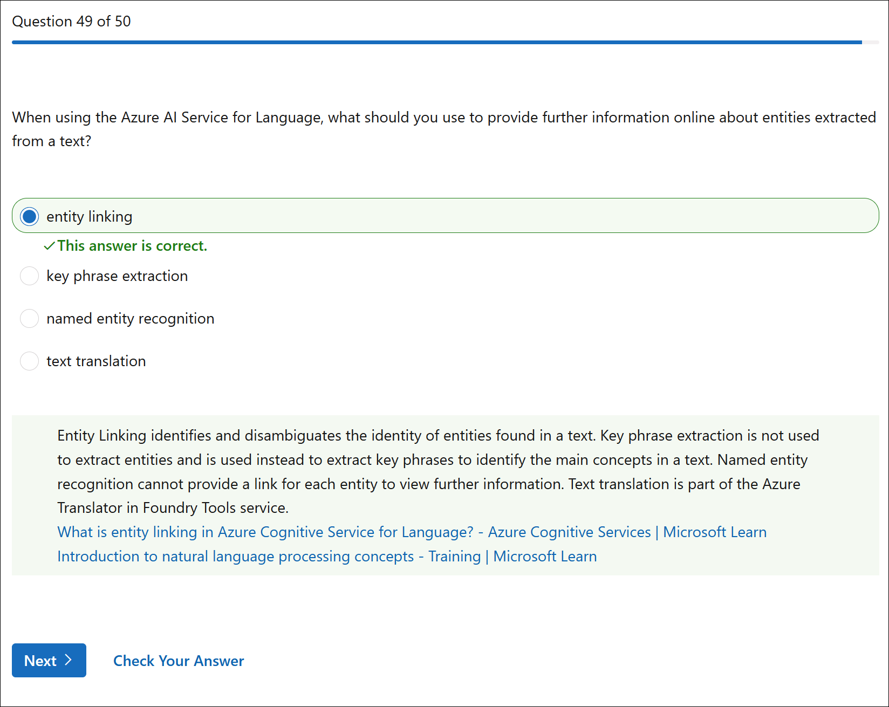

# Microsoft Assessment AI-900: Azure AI Fundamentals (Attempt 2)

## Overview

Second attempt at the Microsoft practice assessment for AI-900.

## Assessment Results

---

## Wrong Answers

Click to expand explanation

**Why your answer (classification) is wrong:**  
Classification is a *supervised* learning technique that requires **labeled training data**—meaning you already know the categories (e.g., "will buy" vs. "won't buy") and train a model to predict which category new data belongs to. The question doesn't mention any predefined labels or categories to predict; it's asking about grouping customers based on similarities, not predicting a known outcome.

**Why the correct answer (clustering) is right:**  
Clustering is an *unsupervised* learning technique that works with **unlabeled data**. It discovers natural groupings based on similarities in the data (like demographics and shopping behaviors) without needing predefined categories. The key phrase in the question is "group together online shoppers that have similar attributes"—this describes exactly what clustering does. The model finds patterns and segments customers into clusters, which the marketing team can then use for targeted campaigns.

**How to distinguish these on the exam:**

| Scenario | ML Type |
|----------|---------|
| Predict a **known category** (yes/no, spam/not spam) | Classification |
| Predict a **numeric value** (price, temperature) | Regression |
| **Group data by similarity** without predefined labels | Clustering |

**Key takeaway:**  
When a question describes grouping or segmenting data based on shared characteristics *without* mentioning predefined labels or predictions, the answer is clustering. Classification requires you to already know what categories exist.

**References**

- [What is clustering? - Azure Machine Learning](https://learn.microsoft.com/en-us/azure/machine-learning/component-reference/k-means-clustering)
- [Machine learning algorithm types - Microsoft Learn](https://learn.microsoft.com/en-us/training/modules/fundamentals-machine-learning/2-what-is-machine-learning)
- [Clustering models in Azure Machine Learning designer](https://learn.microsoft.com/en-us/azure/machine-learning/component-reference/train-clustering-model)

---

Click to expand explanation

**Why your selected answer (entity recognition) is wrong:**  
Entity recognition is a **Natural Language Processing (NLP)** feature, not a computer vision feature. It identifies and categorizes entities like names, dates, locations, and organizations from *text*. This capability belongs to the Azure AI Language service, not Azure Vision. The question specifically asks about *Vision* workloads, which deal with analyzing images and video—not text.

**Why the correct answers (OCR and spatial analysis) are right:**  
Both are core **computer vision** capabilities within Azure Vision in Foundry Tools:

- **Optical Character Recognition (OCR):** Extracts printed and handwritten text *from images*. Even though it outputs text, it's a vision workload because it analyzes image data.
- **Spatial Analysis:** Analyzes video streams to detect and track people's movements in physical spaces (e.g., counting people, detecting social distancing). This is a real-time video analytics feature.

**The trap in this question:**  
It's easy to confuse *entity recognition* with vision because OCR and entity recognition both deal with "extracting information." However:

- OCR extracts text *from images* → **Vision**
- Entity recognition extracts entities *from text* → **Language/NLP**

**Quick reference for AI-900:**

| Feature | Azure Service Category |
|---------|------------------------|
| OCR | Vision |
| Spatial Analysis | Vision |
| Image Classification | Vision |
| Entity Recognition | Language (NLP) |
| Key Phrase Extraction | Language (NLP) |
| Sentiment Analysis | Language (NLP) |

**Key takeaway:**  
When a question asks about Azure Vision, focus on features that analyze *images or video*. NLP features like entity recognition, key phrase extraction, and sentiment analysis all operate on text and belong to Azure AI Language.

**References**

- [What is Azure AI Vision?](https://learn.microsoft.com/en-us/azure/ai-services/computer-vision/overview)
- [OCR - Azure AI Vision](https://learn.microsoft.com/en-us/azure/ai-services/computer-vision/overview-ocr)
- [Azure AI services Computer Vision Spatial Analysis](https://mcr.microsoft.com/artifact/mar/azure-cognitive-services/vision/spatial-analysis/about)
- [What is Azure AI Language?](https://learn.microsoft.com/en-us/azure/ai-services/language-service/overview)

---

Click to expand explanation

**Why your selected answer (fairness) is wrong:**  
Fairness focuses on ensuring AI systems treat all users equitably and do not produce biased outcomes across different groups. While fairness is always important, this question specifically asks about managing *healthcare data*—the scenario emphasizes data handling and compliance, not equitable treatment of users. Fairness doesn't directly address the protection of sensitive medical information or regulatory compliance.

**Why the correct answers (accountability and privacy and security) are right:**  

- **Privacy and Security:** Healthcare data (PHI/PII) is highly sensitive and regulated (HIPAA, GDPR, etc.). This principle ensures data is protected, anonymized where applicable, and accessed only by authorized parties. It's the most directly relevant principle when the question mentions "manage healthcare data."
- **Accountability:** This principle ensures AI systems meet ethical and *legal* standards. Healthcare AI must comply with strict regulations, and organizations must be accountable for how the system handles patient data, makes decisions, and can be audited.

**The trap in this question:**  
The word "healthcare" might make you think about treating patients fairly, which pulls you toward "fairness." However, the question emphasizes *managing healthcare data*—this is about data governance, not equitable outcomes. Read the scenario carefully for whether it's about data handling vs. user treatment.

**Microsoft's Six Responsible AI Principles (quick reference):**

| Principle | Focus |
|-----------|-------|
| Fairness | Avoid bias; treat users equitably |
| Reliability & Safety | Operate safely and as intended |
| Privacy & Security | Protect data; ensure secure access |
| Inclusiveness | Empower all users; accessible design |
| Transparency | Explainable and understandable AI |
| Accountability | Meet ethical/legal standards; auditability |

**Key takeaway:**  
When a question mentions sensitive data (healthcare, financial, personal), prioritize **privacy and security**. When it mentions legal/regulatory compliance or organizational responsibility, prioritize **accountability**. Fairness is about equitable treatment of people, not data protection.

**References**

- [Understand Responsible AI - Microsoft Learn](https://learn.microsoft.com/en-us/training/modules/get-started-ai-fundamentals/8-understand-responsible-ai)
- [Microsoft Responsible AI principles](https://learn.microsoft.com/en-us/azure/machine-learning/concept-responsible-ai)
- [Responsible AI overview - Azure AI Services](https://learn.microsoft.com/en-us/azure/ai-services/responsible-use-of-ai-overview)

---

Click to expand explanation

**Why your selected answer (business card model) is wrong:**  
The business card model is specifically designed to extract contact information from business cards—names, phone numbers, email addresses, job titles, and company names. It has no capability to process passports or sales account documents. The question asks about two distinct document types: international passports and sales accounts. You need to match each document type to its appropriate prebuilt model.

**Why the correct answers (ID document model and invoice model) are right:**  

- **ID document model:** Optimized to extract key information from identity documents, specifically US driver's licenses and *international passport biographical pages*. This directly addresses the "international passports" requirement in the question.
- **Invoice model:** Designed to extract structured data from sales invoices and billing documents—vendor info, line items, totals, dates, etc. "Sales accounts" refers to sales/billing documentation, which maps to the invoice model.

**The trap in this question:**  
The question pairs two unrelated document types (passports + sales accounts), requiring you to identify the correct model for each. It's easy to overthink or pick a model that sounds plausible but doesn't match either document type. Business cards and receipts are common prebuilt models, but they don't apply here.

**Azure Document Intelligence prebuilt models (quick reference):**

| Model | Extracts From |
|-------|---------------|
| Invoice | Invoices, billing documents |
| Receipt | Retail receipts |
| ID Document | Passports, driver's licenses |
| Business Card | Contact cards |
| W-2 | US tax forms |
| Health Insurance Card | US health insurance cards |

**Key takeaway:**  
Map each document type in the question to a specific prebuilt model. "Passports" = ID document model. "Sales accounts/invoices" = Invoice model. Don't select models based on partial matches or assumptions.

**References**

- [Prebuilt models - Azure AI Document Intelligence](https://learn.microsoft.com/en-us/azure/ai-services/document-intelligence/concept-model-overview)
- [ID document model](https://learn.microsoft.com/en-us/azure/ai-services/document-intelligence/concept-id-document)
- [Invoice model](https://learn.microsoft.com/en-us/azure/ai-services/document-intelligence/concept-invoice)

---

Click to expand explanation

**Why the selected answer (-1) is wrong:**  
You likely assumed that Azure uses a sentinel value like -1 to indicate an unknown or invalid result, which is a common programming convention. However, Azure AI Language service does not use -1 for confidence scores. The confidence score range is strictly 0 to 1, where 0 is lowest confidence and 1 is highest. A value of -1 falls outside this range and is not part of the API's response schema.

**Why the correct answer (NaN) is right:**  
When Azure's language detection service cannot determine the language of the input text, it returns:

- **Language name:** "Unknown"
- **Confidence score:** NaN (Not a Number)

NaN is the specific value used to indicate that a confidence score cannot be calculated because the language itself is unidentifiable. This is distinct from a low confidence score (like 0.1), which would indicate the service made a guess but isn't confident. NaN means no valid score exists at all.

**The relationship between "Unknown" and "NaN":**

- "Unknown" is the language *name* returned when detection fails
- NaN is the confidence *score* associated with that unknown detection
- They always appear together—you won't see "Unknown" with a numeric score

**Common trap:**  
The answer "Unknown" is tempting because the question mentions "unknown language name," but the question asks specifically about the *confidence score*, not the language name. The score for an unknown language is NaN, not the word "Unknown."

**Key takeaway:**  
Azure Language detection confidence scores range from 0 to 1. When the language cannot be detected, the service returns NaN (Not a Number) as the confidence score, paired with "Unknown" as the language name.

**References**

- [Language detection - Azure AI Language](https://learn.microsoft.com/en-us/azure/ai-services/language-service/language-detection/overview)
- [Quickstart: Language detection](https://learn.microsoft.com/en-us/azure/ai-services/language-service/language-detection/quickstart)

---

Click to expand explanation

**Why the selected answer (lemmatization) is wrong:**
Lemmatization is a text *normalization* technique that reduces words to their base or dictionary form (e.g., "running" → "run," "better" → "good"). It's about standardizing word forms before analysis, not about understanding meaning or relationships between words. Lemmatization doesn't assign values or measure how semantically close words are to each other.

**Why the correct answer (vectorization) is right:**
Vectorization converts words into numerical vectors in a multi-dimensional space. Words with similar meanings (like "plant" and "flower") are positioned closer together in this vector space, while unrelated words (like "airplane") are farther apart. This is the foundation of semantic similarity—the technique that enables NLP systems to understand that "plant" and "flower" are related concepts.

**How each option works:**

| Technique | What It Does |
|-----------|--------------|
| **Vectorization** | Maps words to coordinates in n-dimensional space; captures semantic relationships |
| **Lemmatization** | Reduces words to root form for normalization |
| **Frequency analysis** | Counts how often words appear |
| **N-grams** | Analyzes sequences of consecutive words (bigrams, trigrams, etc.) |

**The trap:**
Lemmatization sounds sophisticated and deals with word forms, which might seem related to word relationships. However, the key phrase in the question is "considered closer to each other"—this describes *spatial/semantic proximity*, which is specifically what vectorization achieves through embeddings.

**Key takeaway:**
When a question mentions words being "closer" or having "similar values" based on meaning, the answer is vectorization (or embeddings). Lemmatization is purely about reducing words to their root form.

**References**

- [Understand embeddings in Azure OpenAI](https://learn.microsoft.com/en-us/azure/ai-services/openai/concepts/understand-embeddings)
- [Natural language processing - Azure AI Fundamentals](https://learn.microsoft.com/en-us/training/modules/analyze-text-with-text-analytics-service/)

---

Click to expand explanation

**Why the selected answer (speech-to-text) is wrong:**
Speech-to-text is a capability of the **Azure Speech service**, not the Azure Translator service. Speech-to-text transcribes spoken audio into written text. The Translator service does not accept audio input—it works exclusively with text.

**Why the correct answer (text-to-text) is right:**
Azure Translator is designed specifically for **text-to-text translation**—you provide text in one language, and it returns translated text in another language. It supports over 100 languages and handles only written text as both input and output.

**The trap:**
It's easy to conflate Azure's language-related services. The word "translation" might make you think of converting between modalities (like speech to text), but Translator is narrowly scoped to translating *text between languages*, not converting between formats.

**How Azure's language services divide responsibilities:**

| Service | Function |
|---------|----------|
| **Translator** | Text-to-text translation (language A → language B) |
| **Speech** | Speech-to-text, text-to-speech, speech translation |
| **Language** | NLP features (sentiment, entities, key phrases, etc.) |

**Key takeaway:**
Azure Translator = text in, text out. Any scenario involving speech (audio) requires the Azure Speech service, even for translation tasks.

**References**

- [What is Azure Translator?](https://learn.microsoft.com/en-us/azure/ai-services/translator/translator-overview)
- [What is the Speech service?](https://learn.microsoft.com/en-us/azure/ai-services/speech-service/overview)
- [Speech translation overview](https://learn.microsoft.com/en-us/azure/ai-services/speech-service/speech-translation)

---

Click to expand explanation

**Why the selected answer (Azure Language in Foundry Tools service) is wrong:**
Azure Language is a *specific* AI service that only provides access to NLP features like sentiment analysis, entity recognition, and key phrase extraction. It does not include Translator or Speech capabilities. Each individual service (Language, Translator, Speech, Vision) has its own endpoint and key—they are not interchangeable.

**Why the correct answer (Azure AI Services) is right:**
Azure AI Services is a **multi-service resource** that consolidates access to multiple Azure AI capabilities under a single endpoint and authentication key. When you create an Azure AI Services resource (rather than individual service resources), you can access Translator, Speech, Language, Vision, and other services using the same credentials. This simplifies management and billing when you need multiple AI capabilities.

**The key concept being tested:**
Azure offers two deployment options for AI services:

- **Single-service resources:** Dedicated to one service (e.g., Language only, Speech only)
- **Multi-service resource (Azure AI Services):** Unified access to multiple services with one key

| Resource Type | Services Accessible |
|---------------|---------------------|
| Azure AI Services | Translator, Speech, Language, Vision, etc. |
| Azure Language | Language features only |
| Azure Speech | Speech features only |
| Azure Translator | Translator features only |

**The trap:**
The question asks about accessing *both* Translator and Speech with a single endpoint. Azure Language cannot provide this—it only covers Language service features. The umbrella resource that spans multiple services is Azure AI Services.

**Key takeaway:**
When a question asks about unified access to multiple Azure AI capabilities through one endpoint and key, the answer is **Azure AI Services** (the multi-service resource).

**References**

- [What are Azure AI Services?](https://learn.microsoft.com/en-us/azure/ai-services/what-are-ai-services)
- [Create a multi-service resource](https://learn.microsoft.com/en-us/azure/ai-services/multi-service-resource)

## Unsure but Correctly Answered

 

---

---

Click to expand explanation

You got this one correct! Here's a deeper explanation of the concept being tested.

**What embeddings are:**  
Embeddings are numerical vector representations of text (or other data) that capture semantic meaning. In Azure OpenAI, embedding models (like `text-embedding-ada-002`) convert words, sentences, or documents into high-dimensional vectors. Text with similar meaning will have vectors that are mathematically "close" to each other, enabling similarity comparisons.

**Why embeddings enable search, classify, and compare:**  

- **Search:** Convert a query into a vector, then find documents whose vectors are closest (using cosine similarity or other distance metrics). This powers semantic search—finding results based on meaning, not just keyword matching.
- **Classify:** Use vectors as input features for classification algorithms. Similar texts cluster together in vector space, making categorization possible.
- **Compare:** Calculate the distance between two text vectors to determine how semantically similar they are.

**Why the other options are wrong:**

| Option | Why It Doesn't Fit |
|--------|-------------------|
| **Data grounding** | Refers to augmenting LLM responses with external data sources (like RAG). It doesn't inherently search or compare text—it provides context to reduce hallucinations. |
| **Machine learning** | A broad category/discipline, not a specific capability that "searches, classifies, and compares text for similarity." Too general. |
| **System messages** | Instructions given to a model to shape its behavior (persona, rules). They don't perform search or comparison functions. |

**Practical example:**  
If you want to build a FAQ bot that finds the most relevant answer to a user's question, you'd:

1. Generate embeddings for all FAQ entries
2. Generate an embedding for the user's question
3. Compare vectors to find the closest FAQ match

**Key takeaway:**  
When the exam mentions converting text to vectors, semantic similarity, or comparing/searching text by meaning, the answer is **embeddings**. This is a foundational concept for AI-900's generative AI section.

**References**

- [Understand embeddings in Azure OpenAI Service](https://learn.microsoft.com/en-us/azure/ai-services/openai/concepts/understand-embeddings)
- [Tutorial: Explore Azure OpenAI embeddings](https://learn.microsoft.com/en-us/azure/ai-services/openai/tutorials/embeddings)
- [Azure OpenAI models - Embeddings](https://learn.microsoft.com/en-us/azure/ai-services/openai/concepts/models#embeddings-models)

---

Click to expand explanation

You got this one correct! Here's a deeper look at the concept being tested.

**What the question is testing:**
This question assesses your understanding of the text preprocessing pipeline in NLP, specifically the sequence of steps involved in statistical text analysis.

**Why removing stop words is the first step:**
Stop words are common, high-frequency words (like "the," "is," "and," "a," "in") that carry little semantic meaning but appear frequently in text. Removing them *first* is essential because:

- They add noise to statistical analysis
- They would dominate word frequency counts if not removed
- They don't contribute meaningful information about the text's content
- Removing them reduces the dataset size and improves processing efficiency

**Why the other options come later (or aren't part of statistical analysis):**

| Option | Role in NLP Pipeline |
|--------|---------------------|
| **Counting word occurrences** | Happens *after* stop words are removed—otherwise "the" and "a" would dominate frequency counts |
| **Creating a vectorized model** | Not statistical analysis; used for capturing semantic relationships (like word2vec or embeddings) |
| **Encoding words as numeric features** | Used in downstream tasks like sentiment analysis; not part of the initial statistical analysis step |

**Typical NLP text preprocessing order:**

1. Tokenization (split text into words)
2. Normalization (lowercase, remove punctuation)
3. **Remove stop words** ← first step in *statistical* analysis
4. Stemming/Lemmatization (reduce words to root form)
5. Count occurrences / build frequency distributions
6. Further analysis (TF-IDF, n-grams, etc.)

**Key takeaway:**
For AI-900, remember that **stop word removal** is the foundational preprocessing step before performing any statistical analysis on text. It ensures that meaningless high-frequency words don't skew your analysis.

**References**

- [Analyze text with the Language service - Microsoft Learn](https://learn.microsoft.com/en-us/training/modules/analyze-text-with-text-analytics-service/)
- [Natural language processing - Azure AI Fundamentals](https://learn.microsoft.com/en-us/training/paths/explore-natural-language-processing/)
- [What is text analytics?](https://learn.microsoft.com/en-us/azure/ai-services/language-service/overview)

---

Click to expand explanation

You got this one correct! Here's an expanded explanation with emphasis on the distinction between entity linking and named entity recognition, which is commonly tested on AI-900.

**Why entity linking is correct:**
Entity linking not only identifies entities in text but also **disambiguates** them and provides **links to external knowledge sources** (typically Wikipedia). The key phrase in the question is "provide further information online"—this directly points to entity linking's unique capability of returning URLs where users can learn more about the identified entity.

**Entity Linking vs. Named Entity Recognition (NER) — the critical distinction:**

| Feature | Named Entity Recognition (NER) | Entity Linking |
|---------|-------------------------------|----------------|
| **Primary function** | Identifies and categorizes entities | Identifies, disambiguates, and links entities |
| **Output** | Entity text + category (Person, Location, Organization, etc.) | Entity text + Wikipedia URL + disambiguation |
| **Disambiguation** | No — just labels what type of entity it is | Yes — resolves ambiguity (e.g., "Mars" the planet vs. "Mars" the candy company) |
| **External links** | No | Yes — provides URLs to knowledge bases |

**Example to illustrate the difference:**

For the sentence: *"I visited the Washington Monument in Washington."*

- **NER output:** "Washington Monument" (Location), "Washington" (Location)
- **Entity Linking output:** "Washington Monument" → <https://en.wikipedia.org/wiki/Washington_Monument>, "Washington" → <https://en.wikipedia.org/wiki/Washington,_D.C>. (disambiguated from Washington state or George Washington)

**Why the other options are wrong:**

- **Named entity recognition:** Identifies and categorizes entities but does NOT provide links or disambiguate between entities with the same name.
- **Key phrase extraction:** Extracts important phrases/concepts from text, not entities. No categorization or linking.
- **Text translation:** Converts text between languages—completely different functionality.

**Exam tip:**
When a question mentions "further information," "links," "URLs," "Wikipedia," or "disambiguation," the answer is **entity linking**. When it mentions "categorize," "identify type," or lists categories like Person/Location/Organization, the answer is **NER**.

**References**

- [What is entity linking in Azure AI Language?](https://learn.microsoft.com/en-us/azure/ai-services/language-service/entity-linking/overview)
- [What is Named Entity Recognition (NER)?](https://learn.microsoft.com/en-us/azure/ai-services/language-service/named-entity-recognition/overview)
- [NLP concepts - Microsoft Learn training](https://learn.microsoft.com/en-us/training/modules/analyze-text-with-text-analytics-service/)

