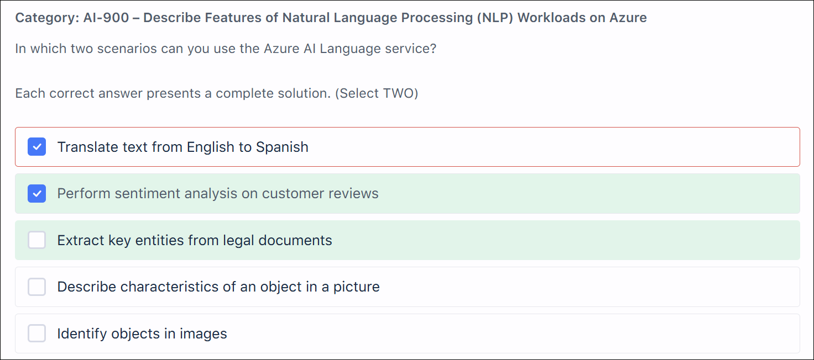
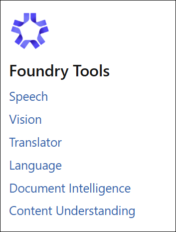

# TutorialsDojo AI-900: Azure AI Fundamentals Practice Exam

## Overview

Practice exam from TutorialsDojo for AI-900: Azure AI Fundamentals.

## Assessment Results

[Add screenshot of assessment results]

---

## Wrong Answers

 

Click to expand explanation

**Why the selected answer is wrong (Computer Vision)**
Azure AI Computer Vision is a **prebuilt** model designed for **general image analysis**, such as detecting objects, describing scenes, identifying landmarks, reading text (OCR), and tagging common objects. It does **not** allow you to train the service to recognize **custom categories** like specific plant species.
A common exam trap is assuming “classification” always maps to Computer Vision. In Azure exam terms, **Computer Vision = fixed model**, not trainable for domain-specific classes.

**Why the correct answer is right (Custom Vision)**
Azure AI Custom Vision is specifically designed for **custom image classification and object detection**. It allows you to:

* Upload labeled images of different plant species
* Train a model on **your own categories**
* Classify new images based on that custom training

Classifying plants into species is a textbook example of a **custom image classification workload**, which is exactly what Custom Vision is built for.

**Why the other options are incorrect**

* **Face**: Only for detecting and analyzing human faces. Not applicable.
* **Azure AI Document Intelligence**: Used for extracting text and structure from documents, forms, and receipts—not image classification.

**Key takeaway**
If the scenario requires **training a model to recognize your own image categories**, the correct service is **Custom Vision**, not Computer Vision.

**References**

* [https://learn.microsoft.com/azure/ai-services/computer-vision/overview](https://learn.microsoft.com/azure/ai-services/computer-vision/overview)
* [https://learn.microsoft.com/azure/ai-services/custom-vision-service/overview](https://learn.microsoft.com/azure/ai-services/custom-vision-service/overview)
* [https://learn.microsoft.com/azure/ai-services/what-are-ai-services](https://learn.microsoft.com/azure/ai-services/what-are-ai-services)

---

Click to expand explanation

**Why the selected answer is wrong (Determine the seller’s identity from a sales receipt)**
Azure AI Document Intelligence can **extract text and structured fields** (for example, merchant name, date, total) from receipts, but it **does not determine or verify a person’s identity**. In exam wording, “identity” implies **identity recognition or verification**, which is outside the scope of Document Intelligence. This is a common exam trap: confusing **text extraction** with **identity recognition**.

**Why the correct answers are right**

* **Analyze and extract data from insurance claim forms**
  This is a core use case for Azure AI Document Intelligence. The service is designed to process structured and semi-structured documents (forms, invoices, claims) and extract key-value pairs, tables, and fields using prebuilt or custom models.

* **(Correct alternative instead of identity-related options)**
  None of the remaining options align with Document Intelligence:

  * Locating an image of a product → Computer Vision (image search/object detection)
  * Converting a form from Filipino to English → Azure AI Translator
  * Identifying emotions or sentiment → Azure AI Language (Text Analytics)

**Key takeaway**
For AI-900, Azure AI Document Intelligence is about **document OCR and structured data extraction**, not **image search**, **language translation**, **sentiment analysis**, or **identity recognition**. When you see wording like “identity,” treat it as a red flag unless the task is clearly about extracting text fields.

**References**

* [https://learn.microsoft.com/azure/ai-services/document-intelligence/overview](https://learn.microsoft.com/azure/ai-services/document-intelligence/overview)
* [https://learn.microsoft.com/azure/ai-services/document-intelligence/prebuilt/receipts](https://learn.microsoft.com/azure/ai-services/document-intelligence/prebuilt/receipts)
* [https://learn.microsoft.com/azure/ai-services/document-intelligence/prebuilt/forms](https://learn.microsoft.com/azure/ai-services/document-intelligence/prebuilt/forms)

 

---

Click to expand explanation

**Why the selected answer is wrong (Translate text from English to Spanish)**
Text translation is **not** provided by Azure AI Language. Translation is handled by **Azure AI Translator**, which is a separate service under Azure AI Services. This is a common AI-900 trap: translation feels like “language,” but on the exam, **Azure AI Language focuses on understanding and analyzing text**, not converting it between languages.

**Why the correct answers are right**
**Perform sentiment analysis on customer reviews** is a core Azure AI Language capability. Sentiment analysis evaluates text to determine positive, negative, neutral, or mixed sentiment and is explicitly part of the service.

**Extract key entities from legal documents** is also a native Azure AI Language feature. Entity recognition identifies people, organizations, locations, dates, and other structured information from unstructured text, which fits this scenario exactly.

**Why the other options are incorrect**
**Describe characteristics of an object in a picture** and **Identify objects in images** are computer vision workloads. These are handled by **Azure AI Vision**, not Azure AI Language. The exam expects you to separate **text-based NLP services** from **image-based vision services**.

**Key takeaway**
For AI-900, remember this boundary clearly:

* **Azure AI Language** → sentiment analysis, entity extraction, key phrase extraction, text classification
* **Azure AI Translator** → language translation
* **Azure AI Vision** → images and visual content

If translation or images are involved, Azure AI Language is not the correct choice.

**References**  
[https://learn.microsoft.com/azure/ai-services/language-service/overview](https://learn.microsoft.com/azure/ai-services/language-service/overview)
[https://learn.microsoft.com/azure/ai-services/translator/overview](https://learn.microsoft.com/azure/ai-services/translator/overview)
[https://learn.microsoft.com/azure/ai-services/computer-vision/overview](https://learn.microsoft.com/azure/ai-services/computer-vision/overview)

 

---

Click to expand explanation

**Why the selected answer is wrong (Computer Vision)**
Azure AI Computer Vision focuses on *general image analysis*. It can detect objects, read text (OCR), generate image descriptions, and identify visual features such as colors or landmarks. It **does not support facial recognition tasks** like identifying or verifying a person’s identity. A common exam trap is assuming “faces are images, so Computer Vision must be correct.” On Microsoft exams, **general vision ≠ facial identity**.

**Why the correct answer is right (Azure AI Face)**
Azure AI Face is the service **specifically designed for facial analysis and recognition**. It supports detecting faces in images and performing **face verification and identification**, which is exactly what a security system granting access to authorized personnel requires. When the requirement explicitly mentions *facial recognition*, the exam expects Azure AI Face.

**Key takeaway**
For Azure exams:

* **Computer Vision** → objects, scenes, OCR, general image understanding
* **Azure AI Face** → face detection, verification, and identification
  If identity or access control is involved, choose **Azure AI Face**, not Computer Vision.

**References**

* [https://learn.microsoft.com/azure/ai-services/computer-vision/overview](https://learn.microsoft.com/azure/ai-services/computer-vision/overview)
* [https://learn.microsoft.com/azure/ai-services/face/overview](https://learn.microsoft.com/azure/ai-services/face/overview)
* [https://learn.microsoft.com/training/modules/analyze-images-computer-vision/](https://learn.microsoft.com/training/modules/analyze-images-computer-vision/)
* [https://learn.microsoft.com/training/modules/detect-analyze-faces/](https://learn.microsoft.com/training/modules/detect-analyze-faces/)

---

## Correctly Answered but Uncertain Questions

[Add screenshots and explanations of correctly answered but uncertain questions]
