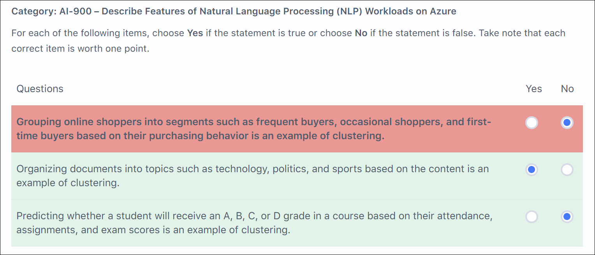

# Tutorials Dojo AI-900 Practice Exam - Review Mode Set 2

## Overview

Practice exam from TutorialsDojo for AI-900: Azure AI Fundamentals.

## Assessment Results

---

## Wrong or Unsure Answers

---

### Distinguish Clustering from Other ML Techniques

Category: AI-900 – Describe Features of Natural Language Processing (NLP) Workloads on Azure

For each of the following items, choose Yes if the statement is true or choose No if the statement is false. Take note that each correct item is worth one point.

| Questions | Yes | No |
|-----------|-----|-----|
| Grouping online shoppers into segments such as frequent buyers, occasional shoppers, and first-time buyers based on their purchasing behavior is an example of clustering. | ☐ | ☑ |
| Organizing documents into topics such as technology, politics, and sports based on the content is an example of clustering. | ☑ | ☐ |
| Predicting whether a student will receive an A, B, C, or D grade in a course based on their attendance, assignments, and exam scores is an example of clustering. | ☐ | ☑ |

📸 Click to expand screenshot

💡 Click to expand explanation

**Why the selected answer is wrong**

The statement *“Grouping online shoppers into segments such as frequent buyers, occasional shoppers, and first-time buyers based on their purchasing behavior is an example of clustering”* is **true**, but it was marked **No**.

This scenario describes grouping customers based on similarities in behavior **without predefined labels assigned ahead of time**. The segments emerge from patterns in the data (purchase frequency, recency, volume), which is the defining characteristic of **clustering**.

Marking this as **No** incorrectly treats it as classification. Classification would require predefined labels applied during training, which is not implied here.

**Why the correct answer is correct**

Clustering groups data points based on shared characteristics to discover natural groupings. Customer segmentation based on behavior is a classic clustering use case, commonly performed using algorithms such as K-means.

Because the groups are derived from similarity rather than predicted from labeled outcomes, **Yes** is the correct choice.

**Why the other options are correct or incorrect**

* **Organizing documents into topics such as technology, politics, and sports based on the content**
  **Correct (Yes).** Documents are grouped by similarity in language and themes, which is clustering.

* **Predicting whether a student will receive an A, B, C, or D grade based on performance**
  **Correct (No).** This is **classification**, because the model predicts one of several predefined labels.

**Key takeaway**

* **Clustering** → discovers groups based on similarity, no predefined labels
* **Classification** → predicts predefined categories using labeled data

Customer segmentation and topic grouping are clustering; grade prediction is classification.

**References**

* [https://learn.microsoft.com/en-us/azure/architecture/data-guide/technology-choices/natural-language-processing](https://learn.microsoft.com/en-us/azure/architecture/data-guide/technology-choices/natural-language-processing)
* [https://learn.microsoft.com/en-us/azure/ai-services/language-service/overview](https://learn.microsoft.com/en-us/azure/ai-services/language-service/overview)
* [https://learn.microsoft.com/en-us/azure/machine-learning/component-reference/k-means-clustering?view=azureml-api-2#understand-k-means-clustering](https://learn.microsoft.com/en-us/azure/machine-learning/component-reference/k-means-clustering?view=azureml-api-2#understand-k-means-clustering)

---
