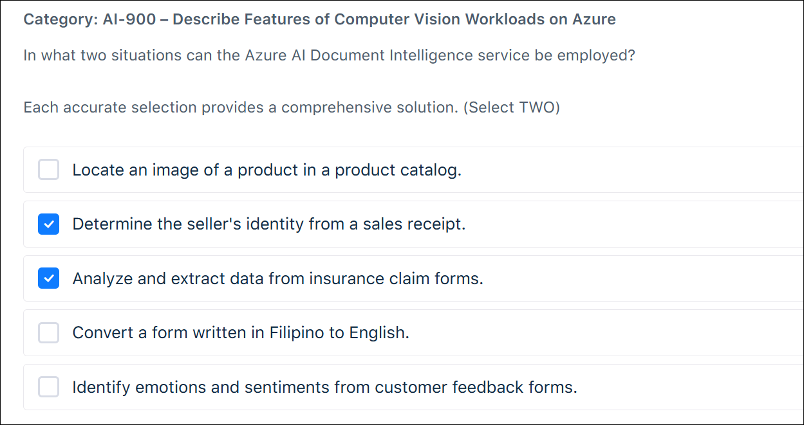
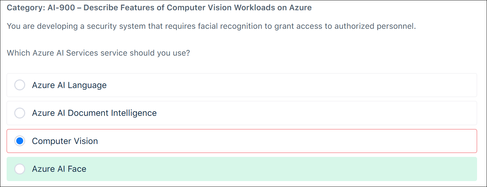
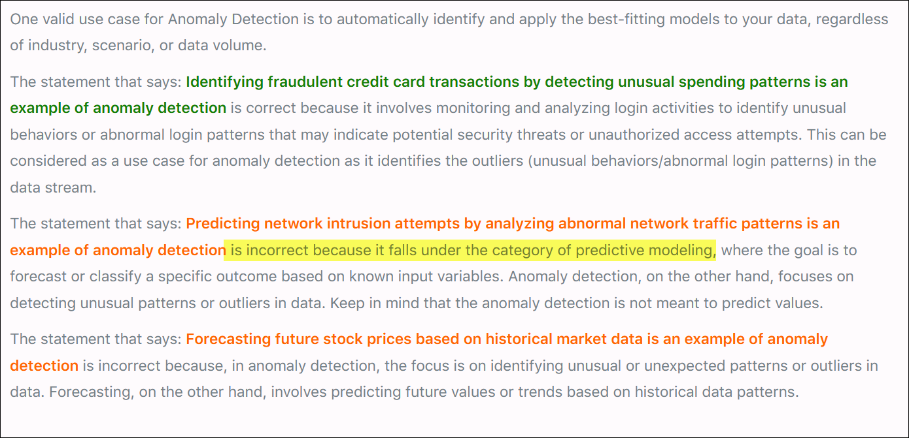
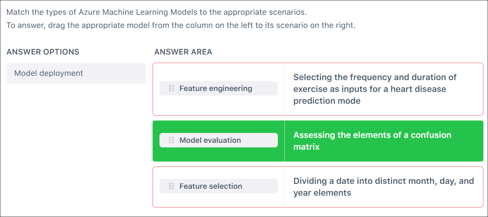
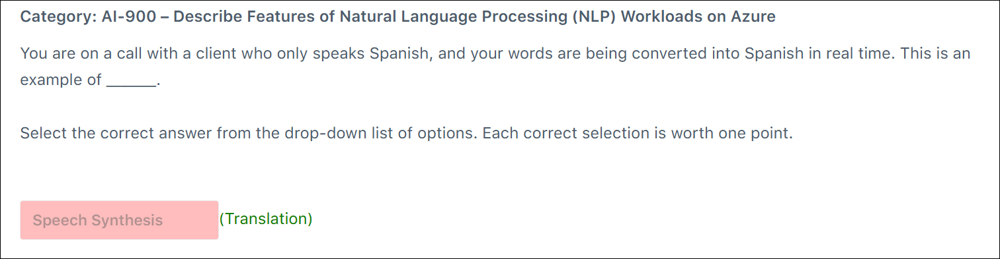
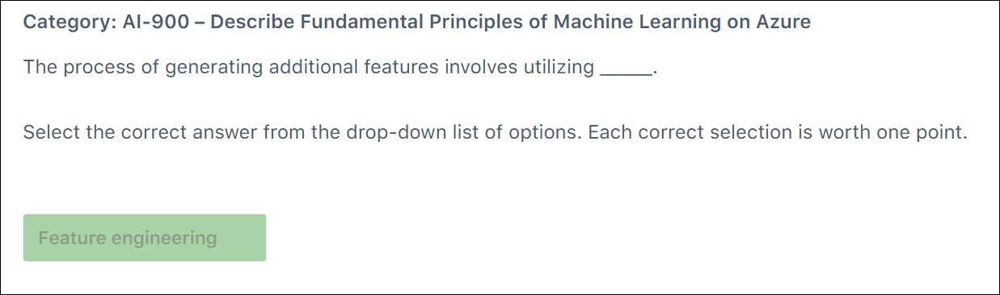
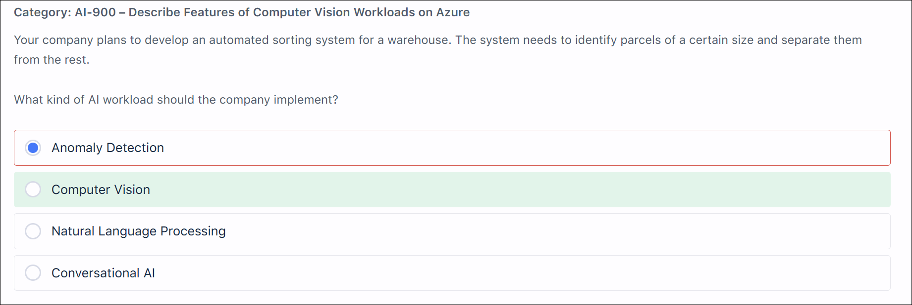
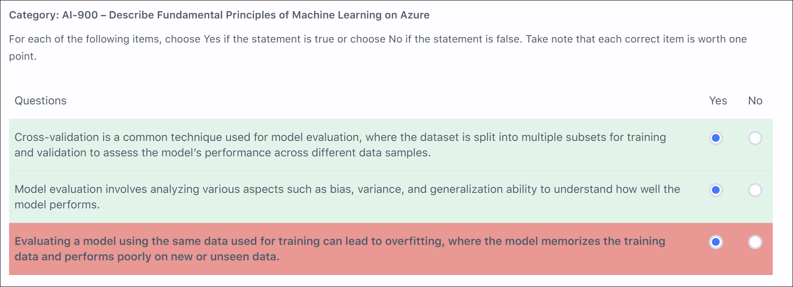

# Tutorials Dojo AI-900 Practice Exam - Review Mode Set 1

## Overview

Practice exam from TutorialsDojo for AI-900: Azure AI Fundamentals.

## Assessment Results

---

## Wrong or Unsure Answers

Click to expand explanation

**Why the selected answer is wrong (Computer Vision)**
Azure AI Computer Vision is a **prebuilt** model designed for **general image analysis**, such as detecting objects, describing scenes, identifying landmarks, reading text (OCR), and tagging common objects. It does **not** allow you to train the service to recognize **custom categories** like specific plant species.
A common exam trap is assuming “classification” always maps to Computer Vision. In Azure exam terms, **Computer Vision = fixed model**, not trainable for domain-specific classes.

**Why the correct answer is right (Custom Vision)**
Azure AI Custom Vision is specifically designed for **custom image classification and object detection**. It allows you to:

* Upload labeled images of different plant species
* Train a model on **your own categories**
* Classify new images based on that custom training

Classifying plants into species is a textbook example of a **custom image classification workload**, which is exactly what Custom Vision is built for.

**Why the other options are incorrect**

* **Face**: Only for detecting and analyzing human faces. Not applicable.
* **Azure AI Document Intelligence**: Used for extracting text and structure from documents, forms, and receipts—not image classification.

**Key takeaway**
If the scenario requires **training a model to recognize your own image categories**, the correct service is **Custom Vision**, not Computer Vision.

**References**

* [https://learn.microsoft.com/azure/ai-services/computer-vision/overview](https://learn.microsoft.com/azure/ai-services/computer-vision/overview)
* [https://learn.microsoft.com/azure/ai-services/custom-vision-service/overview](https://learn.microsoft.com/azure/ai-services/custom-vision-service/overview)
* [https://learn.microsoft.com/azure/ai-services/what-are-ai-services](https://learn.microsoft.com/azure/ai-services/what-are-ai-services)

---

Click to expand explanation

**Why the selected answer is wrong (Determine the seller’s identity from a sales receipt)**
Azure AI Document Intelligence can **extract text and structured fields** (for example, merchant name, date, total) from receipts, but it **does not determine or verify a person’s identity**. In exam wording, “identity” implies **identity recognition or verification**, which is outside the scope of Document Intelligence. This is a common exam trap: confusing **text extraction** with **identity recognition**.

**Why the correct answers are right**

* **Analyze and extract data from insurance claim forms**
  This is a core use case for Azure AI Document Intelligence. The service is designed to process structured and semi-structured documents (forms, invoices, claims) and extract key-value pairs, tables, and fields using prebuilt or custom models.

* **(Correct alternative instead of identity-related options)**
  None of the remaining options align with Document Intelligence:

  * Locating an image of a product → Computer Vision (image search/object detection)
  * Converting a form from Filipino to English → Azure AI Translator
  * Identifying emotions or sentiment → Azure AI Language (Text Analytics)

**Key takeaway**
For AI-900, Azure AI Document Intelligence is about **document OCR and structured data extraction**, not **image search**, **language translation**, **sentiment analysis**, or **identity recognition**. When you see wording like “identity,” treat it as a red flag unless the task is clearly about extracting text fields.

**References**

* [https://learn.microsoft.com/azure/ai-services/document-intelligence/overview](https://learn.microsoft.com/azure/ai-services/document-intelligence/overview)
* [https://learn.microsoft.com/azure/ai-services/document-intelligence/prebuilt/receipts](https://learn.microsoft.com/azure/ai-services/document-intelligence/prebuilt/receipts)
* [https://learn.microsoft.com/azure/ai-services/document-intelligence/prebuilt/forms](https://learn.microsoft.com/azure/ai-services/document-intelligence/prebuilt/forms)

---

Click to expand explanation

**Why the selected answer is wrong (Translate text from English to Spanish)**
Text translation is **not** provided by Azure AI Language. Translation is handled by **Azure AI Translator**, which is a separate service under Azure AI Services. This is a common AI-900 trap: translation feels like “language,” but on the exam, **Azure AI Language focuses on understanding and analyzing text**, not converting it between languages.

**Why the correct answers are right**
**Perform sentiment analysis on customer reviews** is a core Azure AI Language capability. Sentiment analysis evaluates text to determine positive, negative, neutral, or mixed sentiment and is explicitly part of the service.

**Extract key entities from legal documents** is also a native Azure AI Language feature. Entity recognition identifies people, organizations, locations, dates, and other structured information from unstructured text, which fits this scenario exactly.

**Why the other options are incorrect**
**Describe characteristics of an object in a picture** and **Identify objects in images** are computer vision workloads. These are handled by **Azure AI Vision**, not Azure AI Language. The exam expects you to separate **text-based NLP services** from **image-based vision services**.

**Key takeaway**
For AI-900, remember this boundary clearly:

* **Azure AI Language** → sentiment analysis, entity extraction, key phrase extraction, text classification
* **Azure AI Translator** → language translation
* **Azure AI Vision** → images and visual content

If translation or images are involved, Azure AI Language is not the correct choice.

**References**  
[https://learn.microsoft.com/azure/ai-services/language-service/overview](https://learn.microsoft.com/azure/ai-services/language-service/overview)
[https://learn.microsoft.com/azure/ai-services/translator/overview](https://learn.microsoft.com/azure/ai-services/translator/overview)
[https://learn.microsoft.com/azure/ai-services/computer-vision/overview](https://learn.microsoft.com/azure/ai-services/computer-vision/overview)

---

Click to expand explanation

**Why the selected answer is wrong (Computer Vision)**
Azure AI Computer Vision focuses on *general image analysis*. It can detect objects, read text (OCR), generate image descriptions, and identify visual features such as colors or landmarks. It **does not support facial recognition tasks** like identifying or verifying a person’s identity. A common exam trap is assuming “faces are images, so Computer Vision must be correct.” On Microsoft exams, **general vision ≠ facial identity**.

**Why the correct answer is right (Azure AI Face)**
Azure AI Face is the service **specifically designed for facial analysis and recognition**. It supports detecting faces in images and performing **face verification and identification**, which is exactly what a security system granting access to authorized personnel requires. When the requirement explicitly mentions *facial recognition*, the exam expects Azure AI Face.

**Key takeaway**
For Azure exams:

* **Computer Vision** → objects, scenes, OCR, general image understanding
* **Azure AI Face** → face detection, verification, and identification
  If identity or access control is involved, choose **Azure AI Face**, not Computer Vision.

**References**

* [https://learn.microsoft.com/azure/ai-services/computer-vision/overview](https://learn.microsoft.com/azure/ai-services/computer-vision/overview)
* [https://learn.microsoft.com/azure/ai-services/face/overview](https://learn.microsoft.com/azure/ai-services/face/overview)
* [https://learn.microsoft.com/training/modules/analyze-images-computer-vision/](https://learn.microsoft.com/training/modules/analyze-images-computer-vision/)
* [https://learn.microsoft.com/training/modules/detect-analyze-faces/](https://learn.microsoft.com/training/modules/detect-analyze-faces/)

---

Click to expand explanation

**Why the selected answer is wrong**
You marked **“Sorting songs into playlists based on their genres”** as **No**, but this statement is **true** in the context of clustering. The mistake is assuming that clustering only applies when there are no known categories at all. On exams, **grouping items based on shared characteristics** (such as genre, tempo, or mood) is commonly treated as clustering, even if humans conceptually understand what those groups represent.

A common trap is overthinking the difference between **classification vs clustering**:

* Classification requires **pre-labeled data** and a trained model.
* Clustering groups items **based on similarity**, often without predefined labels.

The question does not state that a supervised model with labeled genres is being used, so clustering is valid.

**Why the correct answer is right**

* **Predicting house prices** is **regression**, not clustering. You correctly answered **No**.
* **Sorting songs into playlists based on genre** is **clustering** because songs are grouped by similarity. Correct answer is **Yes**.
* **Segmenting customers by purchasing behavior** is a textbook **clustering** example. You correctly answered **Yes**.

**Key takeaway**
On Microsoft exams, **clustering = grouping similar items**. Do not assume clustering is invalid just because the groups are meaningful or named. If the task is about **organizing data into groups based on shared traits**, clustering is usually the correct interpretation.

**References**

* [https://learn.microsoft.com/en-us/training/modules/describe-machine-learning-workloads/](https://learn.microsoft.com/en-us/training/modules/describe-machine-learning-workloads/)
* [https://learn.microsoft.com/en-us/training/modules/describe-artificial-intelligence-workloads/](https://learn.microsoft.com/en-us/training/modules/describe-artificial-intelligence-workloads/)

---

Click to expand explanation

**Why the selected answer is wrong**
You marked **Yes** for “Predicting network intrusion attempts by analyzing abnormal network traffic patterns is an example of anomaly detection.” This statement is actually **true**, so selecting **Yes** should have been correct. The mistake likely comes from overthinking the word *predicting*. In AI-900, anomaly detection commonly includes identifying **unusual or abnormal patterns** that may indicate issues such as intrusions, fraud, or faults. Network intrusion detection is a textbook anomaly detection scenario.

**Why the correct answer is right**
Anomaly detection focuses on finding data points or patterns that deviate from normal behavior. Abnormal spikes, traffic patterns, or unusual access attempts in network logs fit this definition precisely. Whether the system flags them in real time or uses historical baselines, the task is still detecting anomalies rather than forecasting a continuous value.

**Clarifying the contrast with forecasting**
This question set is testing your ability to distinguish **forecasting/regression** from **anomaly detection**:

* Forecasting stock prices is about **predicting future numeric values**, not identifying outliers.
* Detecting abnormal network traffic or unusual credit card spending is about **finding deviations from normal patterns**, which is anomaly detection.

**Key takeaway**
If the scenario emphasizes **unusual, abnormal, or unexpected patterns**, the correct classification is **anomaly detection**. If it emphasizes **predicting a future value**, it is **forecasting/regression**.

  

**References**
[https://learn.microsoft.com/en-us/training/modules/describe-machine-learning/](https://learn.microsoft.com/en-us/training/modules/describe-machine-learning/)
[https://learn.microsoft.com/en-us/training/modules/fundamentals-machine-learning/](https://learn.microsoft.com/en-us/training/modules/fundamentals-machine-learning/)
[https://learn.microsoft.com/en-us/azure/architecture/data-guide/scenarios/anomaly-detection](https://learn.microsoft.com/en-us/azure/architecture/data-guide/scenarios/anomaly-detection)

---

Click to expand explanation

**Why the selected answers are wrong**

* **Selecting the frequency and duration of exercise as inputs** was matched to **Feature engineering**, which is incorrect. This scenario describes **choosing which existing variables to include**, not transforming or creating new ones.
* **Dividing a date into month, day, and year elements** was matched to **Feature selection**, which is incorrect. This action **creates new derived features** from a single raw feature.

**Why the correct answers are correct**

* **Selecting the frequency and duration of exercise as inputs for a heart disease prediction model → Feature selection**
  This is about deciding **which features are relevant** to include in the model.
* **Assessing the elements of a confusion matrix → Model evaluation**
  Confusion matrices are used to **measure model performance** (accuracy, precision, recall, etc.).
* **Dividing a date into distinct month, day, and year elements → Feature engineering**
  This involves **transforming raw data into more useful features** for the model.

**Why other options are incorrect**

* **Model deployment** is unrelated to choosing inputs, transforming data, or evaluating performance. It concerns **making a trained model available for use** in production.

**Key takeaway**

* **Feature selection** = choosing which inputs to use.
* **Feature engineering** = creating or transforming inputs.
* **Model evaluation** = measuring how well the model performs.

**References**

* No stable Microsoft Learn link can be guaranteed for this specific exam concept.

---

Click to expand explanation

**Why the selected answer is wrong**

Speech synthesis refers to **text-to-speech**—generating spoken audio from text. In this scenario, your spoken English is being converted into Spanish in real time. The core capability being used is **language translation**, not speech generation. While speech services may be involved under the hood, the task is not creating

---

Click to expand explanation

**Why the selected answers are wrong**

The first statement is **false**, but it was marked **Yes**. In Azure Custom Vision, **object detection does not require choosing a predefined domain**. Domain selection (for example, General, Food, Retail) applies to **image classification**, not object detection. Object detection focuses on locating and labeling objects with bounding boxes and uses a fixed detection approach.

The second statement is also **false**, but it was marked **Yes**. **Custom Vision does not support text classification** at all. Text classification (multiclass vs multilabel) is part of **Azure AI Language**, not Custom Vision. This question is testing service boundaries, not model configuration details.

**Why the selected answer is correct**

The third statement is **true** and correctly marked **Yes**. Custom Vision can be used to identify different types of fruits in an image, either by:

* **Image classification** (classifying the whole image as apple, banana, etc.), or
* **Object detection** (detecting and labeling multiple fruits within the same image).

**Why the other options are incorrect**

* Domain selection being mandatory for object detection is a **common confusion with image classification**.
* Multiclass vs multilabel classification is a **language NLP concept**, not a computer vision feature in Custom Vision.

**Key takeaway**

Custom Vision is strictly for **image classification and object detection**.

* **Domains apply only to image classification**, not object detection.
* **Text classification is handled by Azure AI Language**, not Custom Vision.

**References**

* No stable Microsoft Learn link can be guaranteed for this specific exam concept.

---

Click to expand explanation

**What the question is testing**
It’s testing the distinction between *creating new input variables* from existing data (**feature engineering**) versus *choosing among existing variables* (**feature selection**) and other ML lifecycle steps (training/evaluation).

**Why “Feature engineering” is correct**
Feature engineering is the process of transforming raw data and **deriving additional features** that can improve a model’s predictive performance. Examples include:

* Creating aggregates (e.g., total spend, rolling averages)
* Extracting parts of a value (e.g., hour/day from a timestamp)
* Encoding categories (one-hot, label encoding)
* Normalizing/scaling, binning, handling missing values
* Combining fields (ratios, interactions)

This matches “generating additional features.”

**Why the other options are wrong (common traps)**

* **Feature selection**: reduces dimensionality by selecting a subset of the *existing* features. It does **not** generate new ones.
* **Model training**: fits the algorithm to the (already prepared) features; it doesn’t focus on creating new features.
* **Model evaluation**: measures performance (accuracy, precision/recall, RMSE, etc.); it doesn’t create features.

**Key takeaway**
If the prompt says **“create/generate additional features,”** the answer is **feature engineering**. If it says **“choose the most relevant features,”** that’s **feature selection**.

**References**

* [Feature engineering](https://learn.microsoft.com/en-us/azure/machine-learning/concept-automated-ml?view=azureml-api-2#feature-engineering)
* [https://learn.microsoft.com/en-us/azure/architecture/data-science-process/create-features](https://learn.microsoft.com/en-us/azure/architecture/data-science-process/create-features)
* [https://learn.microsoft.com/en-us/azure/machine-learning/concept-automated-ml#featurization](https://learn.microsoft.com/en-us/azure/machine-learning/concept-automated-ml#featurization)
* [https://learn.microsoft.com/en-us/training/modules/introduction-to-azure-machine-learning/](https://learn.microsoft.com/en-us/training/modules/introduction-to-azure-machine-learning/)

---

Click to expand explanation

**Why the selected answer is wrong (Anomaly Detection)**
Anomaly detection is used to identify unusual patterns or outliers compared to a normal baseline (for example, defective items, fraud, or sensor spikes). The scenario is not about detecting rare or abnormal parcels. It is about **identifying parcels that meet a known physical characteristic (size)** and sorting them accordingly. That is classification or measurement, not anomaly detection.

**Why the correct answer is correct (Computer Vision)**
Computer vision is designed to **analyze images or video to detect, measure, and classify physical objects**. Identifying parcels of a certain size requires visual input (camera images) and object detection or measurement, which is a core computer vision workload. This aligns directly with warehouse automation scenarios such as package sorting, quality inspection, and object recognition.

**Why the other options are incorrect**

* **Natural Language Processing**: Used for understanding or generating text and speech, not for analyzing physical objects or images.
* **Conversational AI**: Used for chatbots and voice assistants, not for visual inspection or sorting tasks.

**Key takeaway**
When the problem involves **seeing, detecting, measuring, or classifying physical objects**, the correct AI workload is **computer vision**, not anomaly detection.

**References**

* No stable Microsoft Learn link can be guaranteed for this specific exam concept.

---

Click to expand explanation

**Why the selected answer is wrong**

The third statement is **true**, but it was marked **No**.
That is why the score is 2/3.

The statement says that evaluating a model using the same data it was trained on can lead to overfitting and poor performance on unseen data. That is a correct concept in machine learning fundamentals.

**Why the statement is correct**

Evaluating on training data often produces **overly optimistic results** because the model has already seen that data. This masks overfitting, where the model learns patterns specific to the training set rather than generalizable patterns.

While overfitting is caused by model complexity and training behavior, **evaluating only on training data prevents you from detecting overfitting**, which is exactly why the statement is considered correct in an exam context.

For AI-900, the key idea being tested is:

* Training data ≠ evaluation data
* Proper evaluation requires validation or test data
* Using the same data hides generalization problems

**Why the other statements are correct**

* **Cross-validation**: Correctly described as splitting data into multiple folds to train and validate across different subsets. This improves reliability of performance estimates.
* **Model evaluation beyond accuracy**: Correctly emphasizes bias, variance, underfitting, overfitting, and generalization—core ML evaluation concepts.

**Common exam trap**

The trap is interpreting the third statement too literally and thinking:
“Overfitting happens during training, not evaluation.”

While technically true, **AI-900 expects the broader conceptual interpretation**: evaluating on training data leads to misleading conclusions and is closely associated with overfitting risk.

**Key takeaway**

For Microsoft exams, treat this as a rule of thumb:

* Training data → learn
* Validation/test data → evaluate
* Same data for both → unreliable results and overfitting risk

---

**References**

* No stable Microsoft Learn link can be guaranteed for this specific exam concept.

---

Click to expand explanation

**Why the selected answer is incorrect**

The statement **“A validation set can indicate the most important features in the input data”** is **false**, but it was marked **Yes**.

A validation set does not determine feature importance. Its role is to **evaluate model performance during training**, typically to compare models or tune hyperparameters and detect overfitting. It measures *how well* the model performs, not *why* it performs that way.

**Why the correct answer is No**

Feature importance comes from **model-specific interpretation techniques**, not from the validation dataset itself. Examples include:

* Coefficients in linear or logistic regression
* Feature importance scores in decision trees or random forests
* Regularization effects (for example, L1/LASSO)
* Model explainability tools (such as SHAP or permutation importance)

The validation set may reveal that performance improves or degrades when certain features are included, but it **does not directly identify or rank feature importance**. That distinction is critical for exam questions.

**Why the other statements are correct**

* **“A validation set is used to adjust the weights and biases of a model during training”** → **Incorrect (No)**
  Weights and biases are updated using the **training set**. The validation set is not used for gradient updates.

* **“A validation set is used to assess the model’s performance on unseen data”** → **Correct (Yes)**
  This is the primary purpose of the validation set during training. It evaluates generalization before final testing.

**Key takeaway**

On Microsoft exams, remember this rule of thumb:

* **Training set** → learns weights and biases
* **Validation set** → evaluates performance and tunes hyperparameters
* **Test set** → final, unbiased evaluation
* **Feature importance** → comes from the model or interpretability methods, **not** the validation set

**References**

* [https://learn.microsoft.com/en-us/azure/well-architected/security/design-segmentation](https://learn.microsoft.com/en-us/azure/well-architected/security/design-segmentation)
* [https://learn.microsoft.com/en-us/azure/architecture/data-guide/technology-choices/natural-language-processing](https://learn.microsoft.com/en-us/azure/architecture/data-guide/technology-choices/natural-language-processing)
* [https://learn.microsoft.com/en-us/azure/machine-learning/how-to-use-automated-ml-for-ml-models?view=azureml-api-2](https://learn.microsoft.com/en-us/azure/machine-learning/how-to-use-automated-ml-for-ml-models?view=azureml-api-2)

---

Click to expand explanation

**Why the selected answer is incorrect**

The item **“Every transaction process must be logged so that verified authorities can determine the reasoning behind any transaction”** was matched to **Reliability and Safety**, which is incorrect.
Reliability and Safety focuses on **consistent operation, robustness, fault tolerance, and preventing harm** (for example, system uptime, handling failures safely, or avoiding unsafe behavior). Logging decisions for later inspection does not address system stability or safety mechanisms.

**Why the correct answer is Transparency**

That statement clearly aligns with **Transparency**. Transparency requires that AI systems provide **traceability and explainability**, so that humans can understand how and why a decision was made. Logging transactions and decision reasoning is a textbook transparency requirement, enabling audits and accountability.

**Why the other matches are correct**

* **Fairness** – “The algorithm should not favor customers from any specific region or income group”
  This directly addresses bias and equal treatment, which is the core of the Fairness principle.

* **Privacy and Security** – “Bank details should only be accessible to verified authorities”
  This focuses on protecting sensitive data and restricting access to authorized parties, which is exactly what Privacy and Security covers.

**Key takeaway**

* **Transparency** = explainability, traceability, decision logging
* **Reliability and Safety** = dependable operation, resilience, and preventing harm
  Confusing auditability with system robustness is a common exam trap.

**References**

* [https://learn.microsoft.com/en-us/azure/cloud-adoption-framework/innovate/best-practices/trusted-ai](https://learn.microsoft.com/en-us/azure/cloud-adoption-framework/innovate/best-practices/trusted-ai)
* [https://learn.microsoft.com/en-us/azure/machine-learning/concept-responsible-ai?view=azureml-api-2#privacy-and-security](https://learn.microsoft.com/en-us/azure/machine-learning/concept-responsible-ai?view=azureml-api-2#privacy-and-security)

---

Click to expand explanation

**Why your selected answer is incorrect**

You selected **The model ID** and **The authentication key**.

The **authentication key** is required and is correct.
The **model ID** is not required once the model is deployed as a web service. After deployment, clients do not interact with the model artifact directly; they interact with the endpoint that hosts it. The model ID is used internally by Azure Machine Learning for model management, versioning, and deployment—not for runtime inferencing calls.

**Why the correct answers are correct**

The correct answers are **The REST endpoint** and **The authentication key**.

* **The REST endpoint** is the HTTP URL exposed when a model is deployed to an online endpoint. Clients send inference requests to this URL using standard REST calls.
* **The authentication key** secures the endpoint. Each request must include this key to authorize access to the deployed service.

Together, these two details are sufficient to submit input data and receive predictions from the deployed model.

**Why the other options are incorrect**

* **The scoring endpoint**: This is a terminology trap. While “scoring endpoint” is sometimes used informally, in Azure Machine Learning exam context the deployed service is accessed via a **REST endpoint**. The exam expects the REST endpoint terminology.
* **The data preprocessing script**: Preprocessing logic is part of model training or deployment configuration. It is not required by clients consuming the web service.
* **The model ID**: Identifies the model within Azure Machine Learning but plays no role in calling a deployed endpoint.

**Key takeaway**

For real-time inferencing in Azure Machine Learning, clients only need:

* The **REST endpoint** (where to send requests)
* The **authentication key** (to authorize requests)

Everything else is handled within the deployed service.

**References**

* [https://learn.microsoft.com/en-us/azure/machine-learning/concept-automated-ml?view=azureml-api-2](https://learn.microsoft.com/en-us/azure/machine-learning/concept-automated-ml?view=azureml-api-2)
* [https://learn.microsoft.com/en-us/azure/machine-learning/how-to-deploy-with-rest?view=azureml-api-2](https://learn.microsoft.com/en-us/azure/machine-learning/how-to-deploy-with-rest?view=azureml-api-2)
* [https://learn.microsoft.com/en-us/azure/ai-services/language-service/conversational-language-understanding/how-to/train-model?tabs=language-studio](https://learn.microsoft.com/en-us/azure/ai-services/language-service/conversational-language-understanding/how-to/train-model?tabs=language-studio)

---

Click to expand explanation

**Why the selected answer is wrong**

**Utilize Azure AI Vision Image Analysis** is incorrect because Image Analysis is a **prebuilt, general-purpose service**. While it can identify objects and describe scenes, it is not designed to reliably detect **custom product types** or return **precise bounding boxes for each product on shelves**. For retail shelf analysis, you need consistent, fine-grained localization of many similar objects, which Image Analysis does not guarantee.

**Why the correct answer is correct**

**Create a project in Azure AI Custom Vision using object detection as a project type** is correct because **object detection is explicitly designed to identify multiple objects in an image and return their exact locations using bounding boxes**. This directly matches the requirement to detect **where products are located on shelves**.

Custom Vision Object Detection allows you to:

* Train a model on **your specific products**
* Detect **multiple instances** of products in a single image
* Retrieve **precise coordinates** (bounding boxes) for each product

This makes it the appropriate choice for retail scenarios such as shelf auditing, planogram compliance, and inventory visibility.

**Why the other options are incorrect**

**Launch a project in Azure AI Custom Vision using classification as project types** is incorrect because image classification only answers **“what is in the image”**, not **“where is it”**. Classification does not provide bounding boxes or object locations.

**Implement Azure AI Vision Optical Character Recognition (OCR)** is incorrect because OCR is designed to **extract text from images**, not to identify or locate physical objects like products on shelves.

**Key takeaway**

When a question involves **finding the location of objects within an image**, the exam is testing knowledge of **object detection**, not image analysis, classification, or OCR.

**References**

* [https://learn.microsoft.com/en-us/azure/ai-services/custom-vision-service/get-started-build-detector](https://learn.microsoft.com/en-us/azure/ai-services/custom-vision-service/get-started-build-detector)
* [https://learn.microsoft.com/en-us/azure/ai-services/custom-vision-service/](https://learn.microsoft.com/en-us/azure/ai-services/custom-vision-service/)

---
