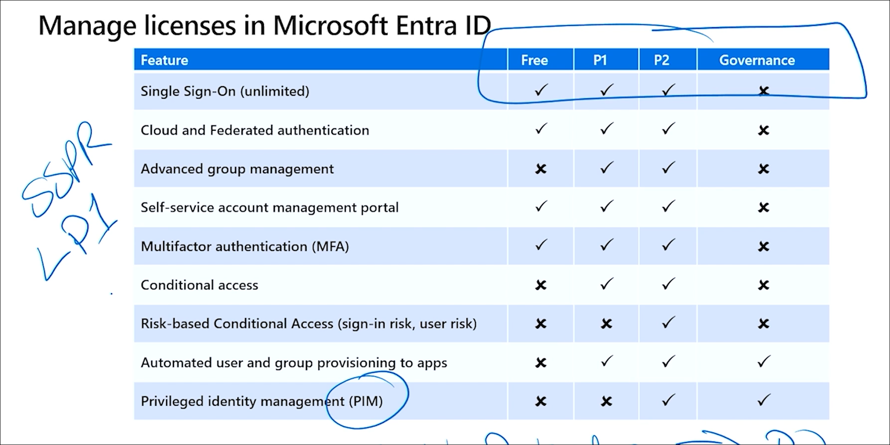
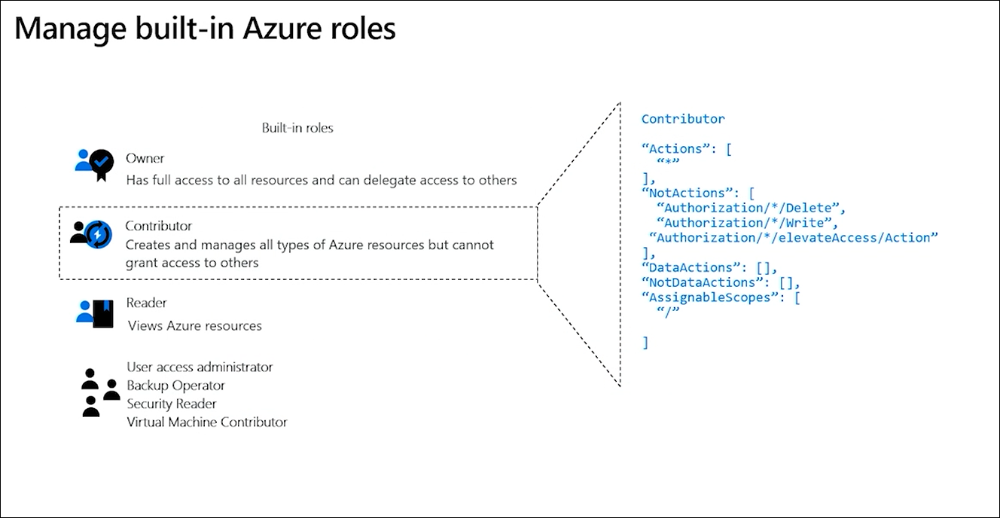
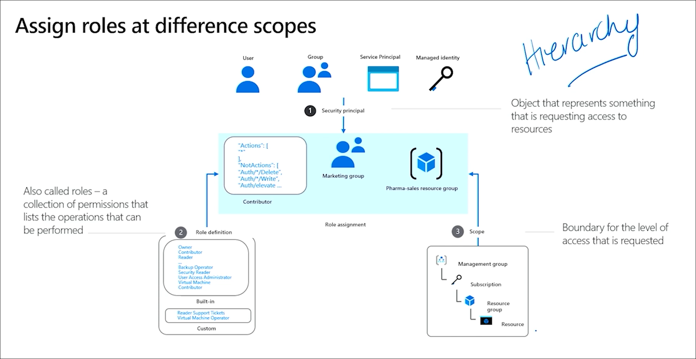
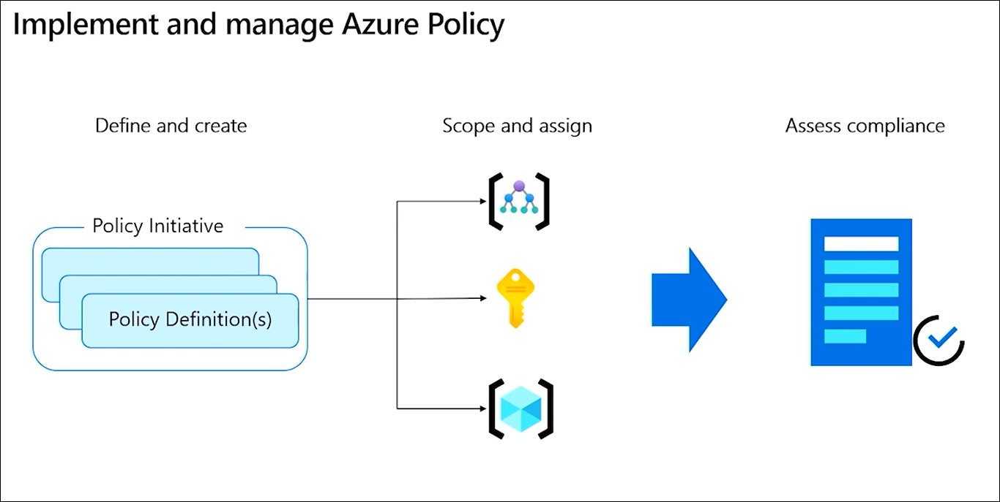
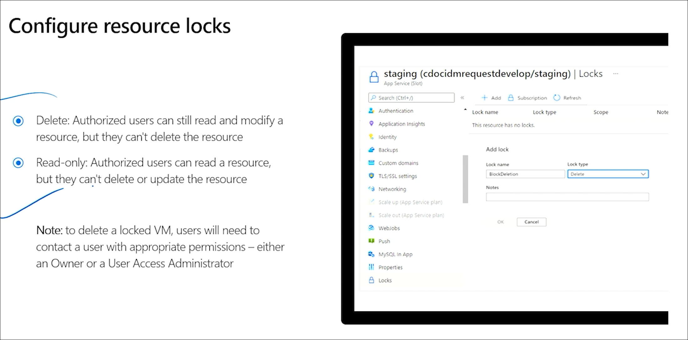
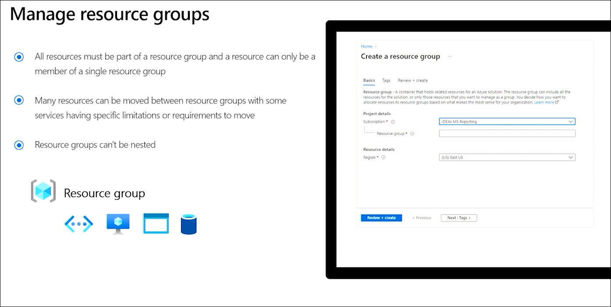
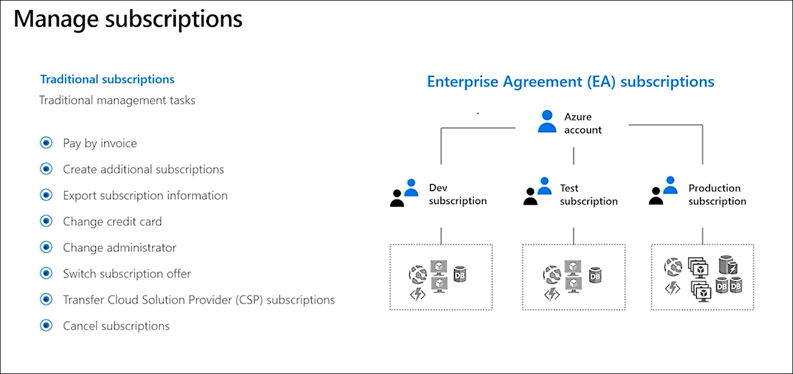
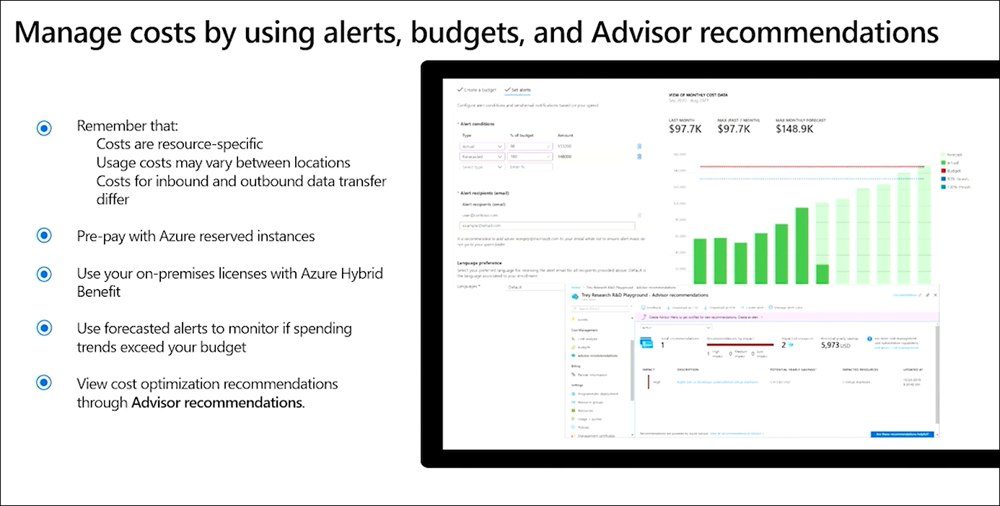
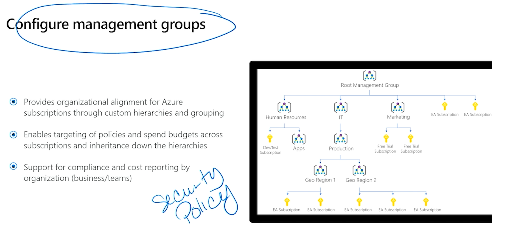
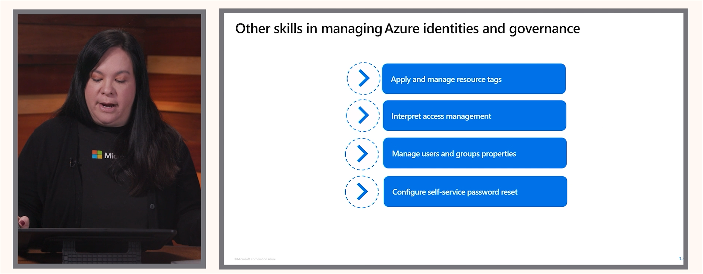

# AZ-104 Exam Readiness Guide

**Purpose:**  
Help you consolidate key concepts, study strategies, and quick-reference visuals for the **Microsoft Certified: Azure Administrator Associate (AZ-104)** exam.

---

## 🧭 Structure

This guide complements the hands-on labs in the [AZ-104 Lab Series](./README.md).  
Use it to reinforce concepts, review domain summaries, and quickly recall high-value exam facts.

---

## 🧠 Domain 1: Manage Azure Identities and Governance (20–25%)

**Key Topics**
- Create and manage users, groups, and administrative units.
- Manage user and group properties.
- Configure and manage license assignments (Free, P1, P2).
- Manage external users (guest accounts, B2B collaboration).
- Configure self-service password reset (SSPR).
- Implement role-based access control (RBAC).
  - Built-in roles, custom roles.
  - Role assignment scope: management group → subscription → resource group → resource.
- Implement and manage **Azure Policy**.
  - Policy definition vs. initiative.
  - Policy assignment and remediation.
- Configure resource locks:
  - **CanNotDelete** and **ReadOnly**.
- Manage resource tagging.
- Manage **management groups** for multiple subscriptions.
- Apply and scope **policies**, **budgets**, and **cost alerts**.

**Common Pitfalls**
- Forgetting that **resource groups cannot be nested**.
- Misunderstanding the order of **scope inheritance** (cannot break it).
- Confusing **policy definitions** (individual) vs. **initiatives** (grouped).
- Confusing **P1 vs P2** feature sets in Entra ID.
- Missing the need for **Azure AD roles** to manage licenses, not just RBAC roles.

**References**
- [Exam Readiness Zone – Identities & Governance](https://learn.microsoft.com/en-us/shows/exam-readiness-zone/preparing-for-az-104-manage-azure-identities-and-governance-1-of-5)
- [Microsoft Learn – Manage Azure identities and governance](https://learn.microsoft.com/en-us/training/modules/azure-manage-identities-governance/)

---

## 💾 Domain 2: Implement and Manage Storage (15–20%)

**Key Topics**
- Create and configure storage accounts.
- Configure redundancy (LRS, ZRS, GRS, RA-GRS, GZRS).
- Configure Azure Storage firewalls and VNets.
- Manage access keys and rotate keys.
- Configure and use **SAS tokens** and **stored access policies**.
- Configure **Azure Files** identity-based access (Entra ID, AD DS).
- Configure object replication and encryption.
- Manage data using **AzCopy** and **Storage Explorer**.
- Configure **lifecycle management**, soft delete, snapshots, and versioning.

**Common Pitfalls**
- Forgetting that **shared access signatures (SAS)** can be revoked only via policy.
- Misconfiguring **network rules** that block access unintentionally.
- Confusing **Azure File Sync** with **Azure Files share** identity integration.

---

## ☁️ Domain 3: Deploy and Manage Azure Compute Resources (20–25%)

**Key Topics**
- Create and configure VMs (size, disks, images).
- Configure VM availability (sets, zones).
- Configure and manage VM extensions.
- Automate deployment using ARM/Bicep/Terraform.
- Create and manage VM Scale Sets.
- Manage Azure Container Instances and Azure Container Apps.
- Configure and manage App Services and Web Apps.
- Manage VM moving between subscriptions and regions.
- Apply VM encryption and secure boot.

**Common Pitfalls**
- Confusing **availability sets** (within a datacenter) vs. **zones** (across datacenters).
- Forgetting to update **NSG rules** when using custom VMs.
- Not linking **diagnostic settings** for boot diagnostics.

---

## 🌐 Domain 4: Implement and Manage Virtual Networking (15–20%)

**Key Topics**
- Create and configure VNets, subnets, and peering.
- Configure and manage public/private IPs.
- Configure routing and **user-defined routes (UDR)**.
- Configure and manage **Network Security Groups (NSGs)** and **Application Security Groups (ASGs)**.
- Configure and use **Bastion**, **Private Link**, and **Private Endpoints**.
- Configure name resolution using **Azure DNS zones** (public/private).
- Configure and manage **VPN Gateway**, **ExpressRoute**, and **Virtual WAN**.
- Configure load balancing using **Load Balancer**, **Application Gateway**, **Front Door**, and **Traffic Manager**.

**Common Pitfalls**
- Misunderstanding that **NSG rules are stateful**.
- Forgetting to disable **private endpoint network policies**.
- Confusing **service endpoints** vs. **private endpoints**.

---

## 🩺 Domain 5: Monitor and Maintain Azure Resources (10–15%)

**Key Topics**
- Configure diagnostic settings and **Azure Monitor**.
- Query and analyze data in **Log Analytics**.
- Create and manage **alerts** and **action groups**.
- Configure and interpret **metrics** and **workbooks**.
- Implement **Azure Backup** and **Recovery Services Vault**.
- Perform restore operations.
- Monitor cost and resource utilization.
- Manage updates and apply **Azure Automation Update Management**.

**Common Pitfalls**
- Forgetting to connect resources to a **Log Analytics workspace**.
- Overlooking **monitoring inheritance** (diagnostic settings per resource).
- Not validating recovery jobs after backup configuration.

---

## 🧩 Study Strategy

| Phase | Focus | Key Tools |
|-------|--------|-----------|
| **1** | Build identity and governance baseline | Entra ID, Policy, RBAC |
| **2** | Master storage and redundancy | Storage Explorer, AzCopy |
| **3** | Deploy compute and automation | Portal, PowerShell, Bicep/Terraform |
| **4** | Deep dive into networking and security | NSGs, Private Link, VNet Peering |
| **5** | Monitor and optimize | Log Analytics, Alerts, Backup |

> 💡 **Tip:** Rotate between the Azure Portal and CLI to reinforce muscle memory for both GUI and automation workflows.

---

## 📸 Visual Aids

Use the following reference images to reinforce identity and governance concepts:

---

## 🧾 Checklist: Final Review Before Exam

✅ Know the difference between Entra ID and RBAC roles  
✅ Practice assigning roles at different scopes  
✅ Deploy and lock resources using Azure Policy  
✅ Understand redundancy models (LRS → GZRS)  
✅ Deploy a VM with diagnostics and backup enabled  
✅ Implement a load balancer + NSG combo  
✅ Set up Azure Monitor and send logs to Log Analytics  
✅ Configure a recovery vault and restore a VM  
✅ Review Advisor recommendations and budgets  
✅ Perform the last lab (Capstone) without reference  

---

**Recommended Resources**
- [Exam Readiness Zone (Official Microsoft Series)](https://learn.microsoft.com/en-us/shows/exam-readiness-zone/?terms=az-104)
- [Microsoft Learn – AZ-104 Learning Path](https://learn.microsoft.com/en-us/training/paths/azure-administrator/)
- [John Savill’s AZ-104 Study Cram (YouTube)](https://www.youtube.com/watch?v=tQp1YxR0h1Y)
- [Microsoft Docs Hub](https://learn.microsoft.com/en-us/azure/)
- [Azure Architecture Center](https://learn.microsoft.com/en-us/azure/architecture/)

---

*Last updated: 2025-10-08*
