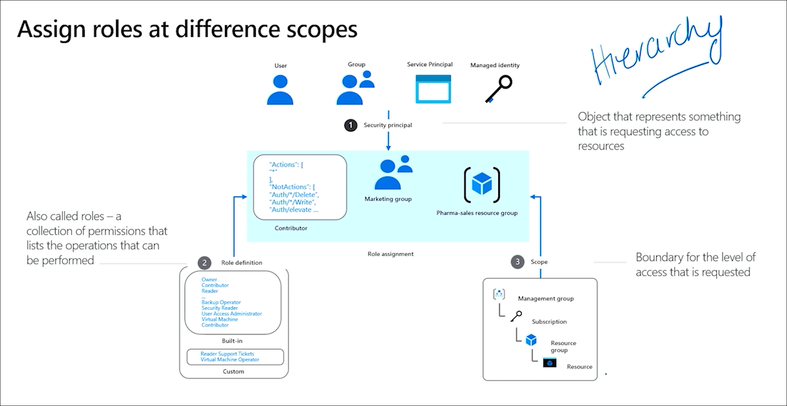
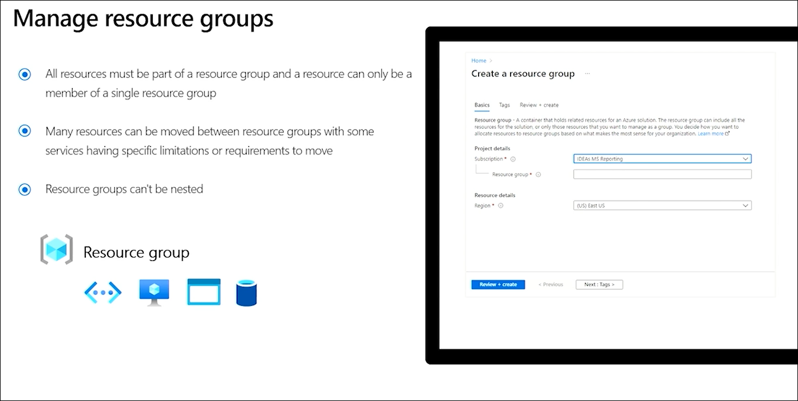
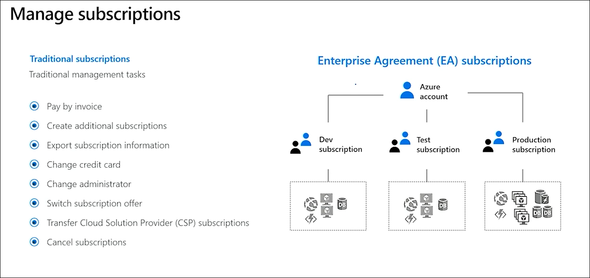
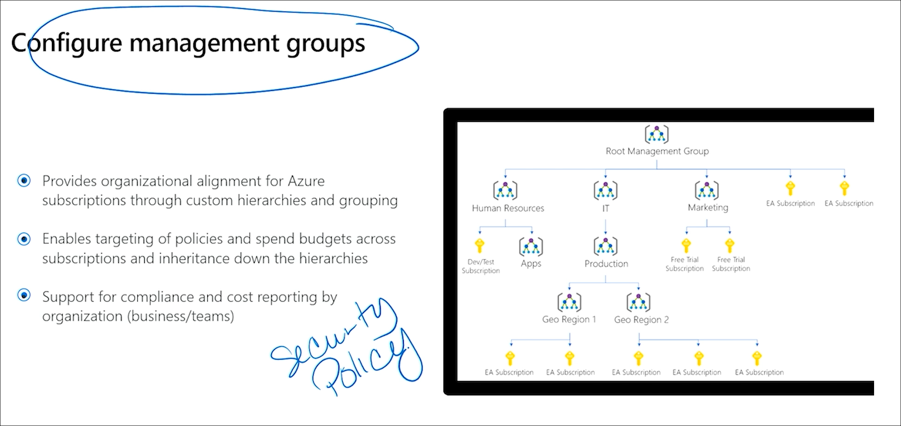
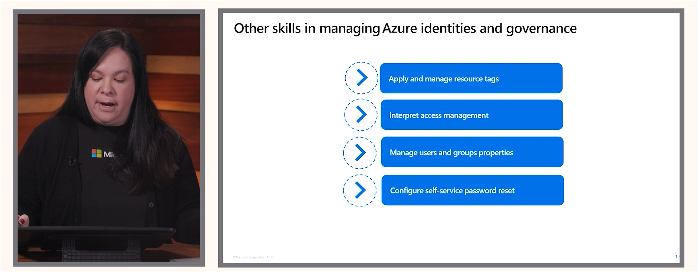

# AZ-104: Microsoft Azure Administrator — Hands-On Lab Series

**Objective:** Build real-world, exam-aligned proficiency for the **AZ-104: Microsoft Azure Administrator** certification through a sequence of medium-to-hard, scenario-driven labs.

---

## 🎯 Overview

This repository contains a structured, hands-on path for mastering the **AZ-104** certification objectives.

Each lab is designed to:

- map directly to an **official exam subskill**,
- integrate multiple **deployment modalities** (Portal, CLI, PowerShell, Bicep, Terraform),
- force you to reference the **Microsoft documentation**,
- and reinforce troubleshooting, governance, and automation skills.

Average lab duration: **1.5–2 hours**

---

## 📘 Exam Domains (per Microsoft Learn)

| Domain | Weight |
|--------|--------|
| 1. Manage Azure identities and governance | 20–25% |
| 2. Implement and manage storage | 15–20% |
| 3. Deploy and manage Azure compute resources | 20–25% |
| 4. Implement and manage virtual networking | 15–20% |
| 5. Monitor and maintain Azure resources | 10–15% |

> Source: [Microsoft Official Study Guide](https://learn.microsoft.com/en-us/credentials/certifications/resources/study-guides/az-104)

---

## 🧭 Learning Approach

- **Hands-on:** Every lab deploys and validates live Azure resources.  
- **Multi-modal:** Each scenario is implemented using Azure Portal, CLI, PowerShell, and Infrastructure as Code (Bicep or Terraform).  
- **Exam-driven:** Aligned with the **skills measured** outline; every bullet is covered.  
- **Documentation-first:** Labs intentionally omit some parameter details to force interaction with Microsoft Docs.  
- **Scenario-based:** You’ll act as a cloud admin responding to realistic business or operational challenges.

---

## 🗓 8-Week Lab Roadmap

| Phase | Week | Focus Area | Labs |
|-------|------|-------------|------|
| **A** | **1–2** | **Identity & Governance Foundations** | [Lab 1 – Setup and Identity Baseline](./labs/Lab01_IdentityBaseline.md)   [Lab 2 – RBAC and Scoping](./labs/Lab02_RBAC_Scopes.md)   [Lab 3 – Policy & Resource Locks](./labs/Lab03_Policy.md)   [Lab 4 – Subscription & Budgets](./labs/Lab04_Budgets.md) |
| **B** | **3** | **Storage and Data Management** | [Lab 5 – Secure Azure Storage Accounts](./labs/Lab05_StorageAccounts.md)   [Lab 6 – Azure Files & Blob Management](./labs/Lab06_StorageData.md) |
| **C** | **4–5** | **Compute and Automation** | [Lab 7 – Infrastructure as Code (Bicep & Terraform)](./labs/Lab07_IaC.md)   [Lab 8 – Virtual Machines & Disks](./labs/Lab08_VMs.md)   [Lab 9 – Scale Sets & Containers](./labs/Lab09_VMSS_Containers.md)   [Lab 10 – App Services & Web Apps](./labs/Lab10_AppServices.md) |
| **D** | **6–7** | **Networking and Hybrid Connectivity** | [Lab 11 – Virtual Networks & Routing](./labs/Lab11_VNetRouting.md)   [Lab 12 – Network Security (NSG, Private Endpoint)](./labs/Lab12_NetworkSecurity.md)   [Lab 13 – VPN, ExpressRoute, Virtual WAN](./labs/Lab13_HybridConnectivity.md)   [Lab 14 – Load Balancing & Front Door](./labs/Lab14_LoadBalancing.md)   [Lab 15 – Azure DNS Zones](./labs/Lab15_DNS.md) |
| **E** | **8** | **Monitoring & Resilience** | [Lab 16 – Monitoring & Diagnostics](./labs/Lab16_Monitoring.md)    [Lab 17 – Backup & Recovery](./labs/Lab17_Bac_)  [Lab 18 - Final Integration / Scenario Lab](tbd)

### Artifact Index

💡 Each lab folder contains:  

* A markdown guide (`Lab##_Name.md`)  
* IaC templates (`/bicep`, `/terraform`)  
* Automation scripts (`/powershell`, `/cli`)  
* Artifacts (`/artifacts/configs`, `/logs`, `/outputs`)

| Category    | Folder                     | Description                |
| ----------- | -------------------------- | -------------------------- |
| Logs        | `./artifacts/logs/`        | CLI/PowerShell transcripts |
| Configs     | `./artifacts/configs/`     | JSON/YAML exports          |
| Outputs     | `./artifacts/outputs/`     | Deployment results         |
| Exports     | `./artifacts/exports/`     | Downloaded reports         |

### Exam Readiness Tips

[AZ-104 Exam Readiness Zone](https://learn.microsoft.com/en-us/shows/exam-readiness-zone/?terms=az-104)
- [Manage Azure identities and governance](https://learn.microsoft.com/en-us/shows/exam-readiness-zone/preparing-for-az-104-manage-azure-identities-and-governance-1-of-5)
    - Know license feature differences in Free, P1, P2, and Governance
    - Managing external users
    - Built-in roles and custom roles
    - Scoping permissions and policies (can't break inheritance)
    - Policy initiative vs policy definition
    - Two types of resource locks
    - Resource groups can't be nested
    - Management groups for multiple subscriptions
    - Tagging

### Lab Modules

| Lab #      | Title / Focus                             | Covered Subskills (bullets)                                                                                                             | Dependencies / Notes                                            |
| ---------- | ----------------------------------------- | --------------------------------------------------------------------------------------------------------------------------------------- | --------------------------------------------------------------- |
| **Lab 1**  | Setup and Identity Baseline               | Create users & groups; manage user/group properties; license management; external users; self-service password reset (SSPR)             | No prerequisites except Azure subscription. Good “warm-up” lab. |
| **Lab 2**  | Role-Based Access & RBAC Scoping          | Built-in roles, assign roles at scopes (subscription, resource group, resource), interpret access assignments                           | Depends on identity baseline lab                                |
| **Lab 3**  | Governance & Policies                     | Azure Policy (create, assign, remediation), resource locks, tags, resource groups, move resources                                       | Builds on Lab 2                                                 |
| **Lab 4**  | Subscription & Cost Management            | Manage subscriptions, management groups, budgets, cost alerts, Azure Advisor recommendations                                            | Requires ability to create policies and groups; governance lab  |
| **Lab 5**  | Storage Account & Access Controls         | Create storage accounts, configure redundancy, firewalls / VNet rules, access keys, SAS, stored access policies                         | No strong dependency, though identity / RBAC helps              |
| **Lab 6**  | Data & Storage Operations                 | Blob containers, lifecycle management, snapshots, soft delete, versioning; Azure Files (shares), identity-based access                  | After Lab 5                                                     |
| **Lab 7**  | Infrastructure as Code (ARM/Bicep)        | Interpret & modify templates, deploy resources (e.g. storage, network, VM) using ARM/Bicep, export from portal, convert between formats | After labs covering basic resource creation                     |
| **Lab 8**  | Virtual Machines & Disks                  | Create/size VMs, disks, encryption, availability sets/zones, move VMs between RG/subscription/region                                    | Arm/Bicep lab as dependency                                     |
| **Lab 9**  | VM Scale Sets & Containers                | Deploy VMSS, container registry, Azure Container Instances / Azure Container Apps                                                       | After VM lab                                                    |
| **Lab 10** | App Services & Web Apps                   | App Service plans, deploying Web Apps, scaling, TLS, custom domain, deployment slots, backup                                            | Can run in parallel with VM labs                                |
| **Lab 11** | Networking Fundamentals                   | VNets, subnets, peering, public IPs, UDRs, troubleshoot connectivity                                                                    | A foundation before advanced networking                         |
| **Lab 12** | Network Security & Private Access         | NSGs, ASGs, NSG rule evaluation, Bastion, service endpoints, private endpoints                                                          | Based on Lab 11                                                 |
| **Lab 13** | Advanced Networking & Hybrid Connectivity | VPN Gateway, ExpressRoute, Azure Virtual WAN, routing, effective routes                                                                 | After network security lab                                      |
| **Lab 14** | Load Balancing & Traffic Management       | Azure Load Balancer (internal, external), Application Gateway, Front Door, Traffic Manager                                              | After VNet and application lab pieces                           |
| **Lab 15** | DNS & Name Resolution                     | Azure DNS zones (public/private), custom DNS, private DNS + linking, conditional forwarding                                             | Works alongside networking labs                                 |
| **Lab 16** | Monitoring & Diagnostics                  | Azure Monitor, metrics, diagnostic settings, log analytics workspace, alerts                                                            | Works in parallel or after service deployments                  |
| **Lab 17** | Backup & Recovery                         | Azure Backup, Recovery Services Vault, configuring backup and restore for VMs, storage, app services                                    | After compute & storage labs                                    |
| **Lab 18** | Final Integration / Scenario Lab          | A multi-tier workload with identity, networking, compute, storage, monitoring, governance; include failure injection / troubleshooting  | Use all prior labs                                              |
