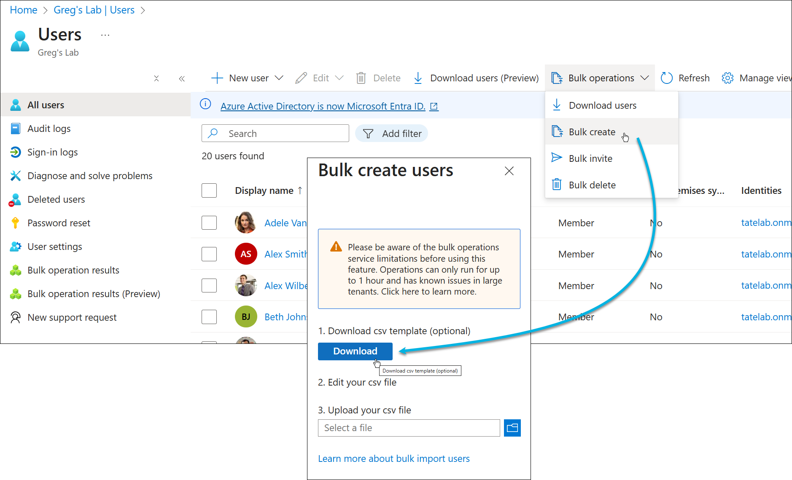
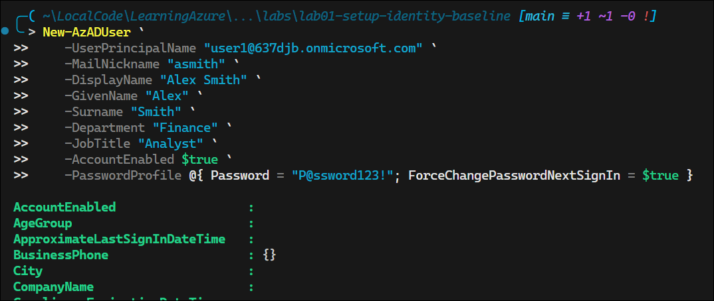
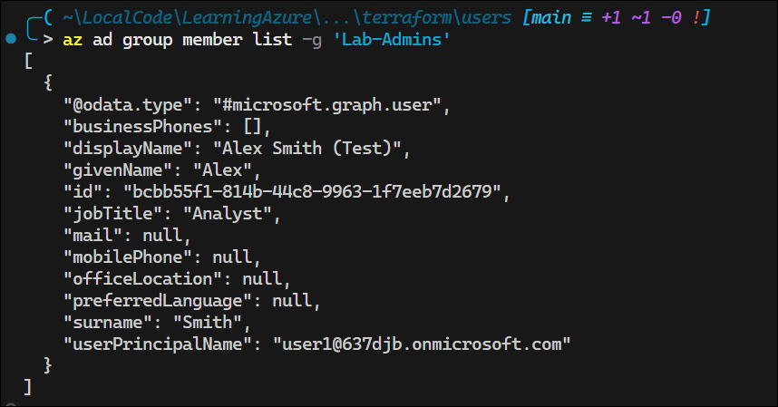
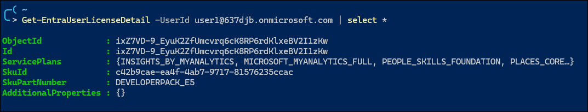
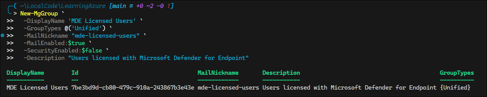
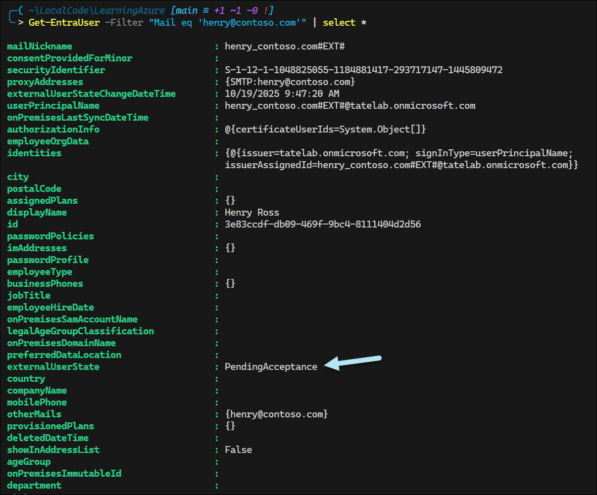

# Lab 1 – Setup and Identity Baseline

**Domain:** Manage Azure identities and governance  
**Difficulty:** Medium-High (≈1.5–2 hrs)  
**Dependencies:** None – requires only an Azure subscription

---

<!-- omit in toc -->
## 🧾 Contents

* [🎯 Lab Objective](#-lab-objective)
* [🧱 Skills Measured (Exam Outline)](#-skills-measured-exam-outline)
* [🧠 Scenario](#-scenario)
* [⚙️ Environment Setup](#️-environment-setup)
* [⏱ Estimated Duration](#-estimated-duration)
* [🔹 Exercise 1 – Create Internal Users](#-exercise-1--create-internal-users)
  * [Azure Portal (Bulk Users)](#azure-portal-bulk-users)
  * [Using `Az` CLI](#using-az-cli)
    * [Create user](#create-user)
    * [Verify user](#verify-user)
  * [Using PowerShell](#using-powershell)
    * [Create user](#create-user-1)
    * [Verify and Remove User](#verify-and-remove-user)
  * [Using Bicep](#using-bicep)
  * [Using Terraform](#using-terraform)
  * [Exam Insights](#exam-insights)
* [🔹 Exercise 2 – Create and Configure Groups](#-exercise-2--create-and-configure-groups)
  * [Static Group](#static-group)
    * [Using `Az` CLI](#using-az-cli-1)
    * [Using Terraform](#using-terraform-1)
  * [Dynamic Group](#dynamic-group)
    * [Using PowerShell (`New-AzADGroup`)](#using-powershell-new-azadgroup)
  * [Exam Insights](#exam-insights-1)
* [🔹 Exercise 3 – Assign Licenses](#-exercise-3--assign-licenses)
  * [Retrieve user license details](#retrieve-user-license-details)
  * [Set the `UsageLocation` property for the user](#set-the-usagelocation-property-for-the-user)
  * [Review available user license plans](#review-available-user-license-plans)
  * [Verify permissions to assign license](#verify-permissions-to-assign-license)
  * [Assign a license to the user](#assign-a-license-to-the-user)
    * [Using the Microsoft Entra PowerShell module](#using-the-microsoft-entra-powershell-module)
    * [Using the Microsoft Graph PowerShell module](#using-the-microsoft-graph-powershell-module)
  * [Group-Based Licensing](#group-based-licensing)
    * [1. Create a Security Group (`New-MgGroup`)](#1-create-a-security-group-new-mggroup)
    * [2. Identify the License SKU ID](#2-identify-the-license-sku-id)
    * [3. Assign Licenses to the Group (`Set-MgGroupLicense`)](#3-assign-licenses-to-the-group-set-mggrouplicense)
    * [4. Add Users to the Group](#4-add-users-to-the-group)
      * [Using the `Az` command](#using-the-az-command)
      * [Using `Add-AzADGroupMember`](#using-add-azadgroupmember)
      * [Using `Add-EntraGroupMember`](#using-add-entragroupmember)
      * [Using `New-MgGroupMember`](#using-new-mggroupmember)
    * [Group-based licensing features](#group-based-licensing-features)
    * [Limitations with group-based licensing](#limitations-with-group-based-licensing)
      * [Deleting a licensed group](#deleting-a-licensed-group)
    * [Issues with group-based licensing](#issues-with-group-based-licensing)
      * [Force user licensing processing to resolve errors (`Invoke-MgUserLicense`)](#force-user-licensing-processing-to-resolve-errors-invoke-mguserlicense)
  * [Exam Insights](#exam-insights-2)
* [🔹 Exercise 4 – Invite and Manage a Guest User](#-exercise-4--invite-and-manage-a-guest-user)
  * [Using PowerShell to invite a guest user (`New-MgInvitation`)](#using-powershell-to-invite-a-guest-user-new-mginvitation)
* [🔹 Exercise 5 – Enable and Validate SSPR](#-exercise-5--enable-and-validate-sspr)
  * [SSPR Authentication Methods](#sspr-authentication-methods)
  * [Important SSPR Configuration Notes](#important-sspr-configuration-notes)
  * [SSPR Registration](#sspr-registration)
* [🔹 Exercise 6 – Explore License Tier Differences](#-exercise-6--explore-license-tier-differences)
  * [Microsoft Entra ID License Feature Comparison](#microsoft-entra-id-license-feature-comparison)
  * [Key Differences for AZ-104 Exam](#key-differences-for-az-104-exam)
  * [Common Exam Scenarios](#common-exam-scenarios)
* [🧭 Reflection \& Readiness](#-reflection--readiness)
* [📚 References](#-references)

## 🎯 Lab Objective

Establish a secure and well-organized Microsoft Entra ID (Azure AD) identity baseline for a new Azure environment.
You will:

* Create and manage users, groups, and licenses
* Configure external (guest) user collaboration
* Enable and validate self-service password reset (SSPR)
* Explore licensing differences across Free, P1, P2, and Governance tiers

---

## 🧱 Skills Measured (Exam Outline)

* Create users and groups
* Manage user and group properties
* Manage license assignments
* Manage external users
* Configure self-service password reset (SSPR)

---

## 🧠 Scenario

You’ve been asked to prepare a clean Entra ID tenant for a project team called **Project AZ104**.
You’ll configure users, groups, and identity features to establish a governance baseline and verify tier-based feature differences.

---

## ⚙️ Environment Setup

| Component | Example                                            |
| --------- | -------------------------------------------------- |
| Tenant    | `637djb.onmicrosoft.com`                           |
| Users     | 3 internal users, 1 guest                          |
| Groups    | `Lab-Admins`, `Lab-Users`                          |
| Licenses  | M365 E5 or Entra ID Premium P1/P2                  |
| Tools     | Azure Portal, Azure CLI, VS Code (Bicep/Terraform) |

---

## ⏱ Estimated Duration

**90–120 minutes**  

---

## 🔹 Exercise 1 – Create Internal Users

**Goal:** Create baseline users with key identity attributes.

### Azure Portal (Bulk Users)

Create the following users:

   | UPN                                                                 | Display Name | Department | Job Title  |
   | ------------------------------------------------------------------- | ------------ | ---------- | ---------- |
   | [user1@637djb.onmicrosoft.com](mailto:user1@637djb.onmicrosoft.com) | Alex Smith   | Finance    | Analyst    |
   | [user2@637djb.onmicrosoft.com](mailto:user2@637djb.onmicrosoft.com) | Dana White   | IT         | Admin      |
   | [user3@637djb.onmicrosoft.com](mailto:user3@637djb.onmicrosoft.com) | Jamie Cruz   | HR         | Specialist |



Notes on the .csv template:

* The first two rows of the upload template must not be removed or modified, or the upload can't be processed.
* The required columns are listed first.
* We don't recommend adding new columns to the template. Any additional columns you add are ignored and not processed.
* We recommend that you download the latest version of the CSV template as often as possible.
* Make sure to check there is no unintended whitespace before/after any field. For User principal name, having such whitespace would cause import failure.
* Ensure that values in Initial password comply with the currently active password policy.


The process will create other users even if some rows have errors.


See [Create users in bulk](https://learn.microsoft.com/en-us/entra/identity/users/users-bulk-add)

### Using `Az` CLI

#### Create user

```pwsh
az ad user create `
 --display-name "Alex Smith" `
 --user-principal-name 'user1@637djb.onmicrosoft.com' `
 --password "P@ssword123!" `
 --force-change-password-next-sign-in
```


The built-in `az ad user create` command only supports required attributes. It does does not support other attributes, such as `givenName` and `surname`, directly. For that, use the `az rest` method as shown in the Deep Dive link below.

🥽 Deep Dive: [Using the `az` command](./deepdives/Lab01_Deep-Dive-Users.md#using-the-az-command).

Documentation: [az ad user](https://learn.microsoft.com/en-us/cli/azure/ad/user?view=azure-cli-latest)

#### Verify user

```pwsh
az ad user list --query "[?contains(displayName, 'Alex')].{Name: displayName, UPN: userPrincipalName}"
```


See [JMESPath Examples](https://jmespath.org/examples.html) for query syntax.

### Using PowerShell

#### Create user

```pwsh
New-AzADUser `
   -UserPrincipalName "user1@637djb.onmicrosoft.com" `
   -MailNickname "asmith" `
   -DisplayName "Alex Smith" `
   -GivenName "Alex" `
   -Surname "Smith" `
   -Department "Finance" `
   -JobTitle "Analyst" `
   -AccountEnabled $true `
   -PasswordProfile @{ Password = "P@ssword123!"; ForceChangePasswordNextSignIn = $true }
```



**Note:** The PowerShell version supports `givenName` and `surname` directly, among other properties.

#### Verify and Remove User

```pwsh
Get-AzADUser -ObjectId 'user1@637djb.onmicrosoft.com'

Remove-AzADUser -UPNOrObjectId 'user1@637djb.onmicrosoft.com'
```


Documentation: [New-AzADUser](https://learn.microsoft.com/en-us/powershell/module/az.resources/new-azaduser?view=azps-14.4.0)

### Using Bicep

Azure Bicep cannot directly create Azure AD (Entra ID) user accounts, because Bicep operates through the Azure Resource Manager (ARM), and user objects live in Microsoft Entra ID, which is managed by the Microsoft Graph API, not ARM.

### Using Terraform

For production scenarios, avoid using Terraform to create users because Terraform stores the passwords in plain text within the state file.

*terraform.tfstate*:  


See [main.tf](./terraform/users/main.tf) for a working example. This example uses the [users.yaml](./terraform/users/users.yaml) file for user definitions.


### Exam Insights

💡 Know the difference between creating users via Portal, CLI, PowerShell, and Graph API—each method has different attribute support.

💡 Understand that `ForceChangePasswordNextSignIn` is a security best practice for initial passwords and is commonly tested.

💡 Remember that user accounts require a valid `UsageLocation` before licenses can be assigned—this is a frequent exam scenario.

💡 Be familiar with bulk user operations using CSV files in the Portal—the exam may ask about the most efficient way to create multiple users.

---

## 🔹 Exercise 2 – Create and Configure Groups

**Goal:** Organize users using static and dynamic membership.

### Static Group

#### Using `Az` CLI

The following command creates an Azure security group.

```pwsh
az ad group create --display-name 'Lab-Admins' --mail-nickname 'lab-admins'
```

Run the following command to list and verify the group:

```pwsh
az ad group list | cfj | select displayname, groupTypes
```

**Note:** `cfj` is a custom alias for `ConvertFrom-Json` in PowerShell.


**Note:** The `az ad group` command is limited to creating static security groups.

To add a member:

```pwsh
az ad group member add -g 'Lab-Admins' --member-id 'bcbb55f1-814b-44c8-9963-1f7eeb7d2679'
```

You must use the user's **object ID** (not UPN) to add them as a member. Use `az ad user list` to find the object ID.

Use `az ad group member list` to verify members:



The `az ad group` command provides limited functionality for group management. For fuller functionality, use either `az rest` or Microsoft Graph PowerShell.

#### Using Terraform

See [main.tf](./terraform/groups/main.tf) for a working example.


### Dynamic Group

#### Using PowerShell (`New-AzADGroup`)

The following command creates a dynamic M365 security group:

```pwsh
New-AzADGroup `                                                   
   -DisplayName "Marketing Team" `
   -MailNickname "marketing-team" `
   -Description "Dynamic M365 group for Marketing department" `
   -MailEnabled `
   -SecurityEnabled `
   -GroupType "Unified", "DynamicMembership" `
   -MembershipRule 'user.department -eq "Marketing"' `
   -MembershipRuleProcessingState "On"
```


### Exam Insights

💡 Understand propagation latency of dynamic membership updates.

* [Troubleshoot dynamic membership groups](https://learn.microsoft.com/en-us/entra/identity/users/groups-troubleshooting#troubleshoot-dynamic-membership-groups)

💡 Know the difference between Security Groups and Microsoft 365 Groups—Security Groups are for access control, M365 Groups include collaboration features like shared mailbox and Teams.

💡 Understand that dynamic groups require Entra ID Premium P1 or P2 licenses and are based on user or device attributes using membership rules.

💡 Remember that nested groups are supported for security groups but not for dynamic groups—this is a common exam scenario question.

💡 Be familiar with the membership rule syntax for dynamic groups (e.g., `user.department -eq "Marketing"`)—the exam may ask you to identify correct or incorrect rule syntax.

💡 Know that group-based license assignment is only available with Entra ID Premium P1 or higher and requires groups to be security-enabled—this is frequently tested.

---

## 🔹 Exercise 3 – Assign Licenses

**Goal:** Enable features through license assignment.

See [🥽 Deep Dive: Using Microsoft Graph Commands](./deepdives/Lab01_Deep-Dive-Graph.md) for additional guidance on finding the right command and permissions.

### Retrieve user license details

```pwsh
Get-EntraUserLicenseDetail -UserId user1@637djb.onmicrosoft.com
```



```pwsh
Get-MgUserLicenseDetail -UserId user1@637djb.onmicrosoft.com
```


You can also use `Get-MgUser`, but you have to explicitly specify the `AssignedLicenses` property:


With `Get-EntraUser`, you do not need to specify the `AssignedLicenses` property:


Unfortunately, neither `Get-AzADUser` nor the `az ad user` command provide license details.

### Set the `UsageLocation` property for the user

```pwsh
Update-AzADUser -UPNOrObjectId user1@637djb.onmicrosoft.com -UsageLocation GB
```

```pwsh
Set-EntraUser -UserId user1@637djb.onmicrosoft.com -UsageLocation US
```

```pwsh
Set-MgUser -UserId user1@637djb.onmicrosoft.com -UsageLocation GB
```

The `az ad user` command does not support setting `UsageLocation`.

### Review available user license plans

```pwsh
Get-EntraSubscribedSku | select *
Get-MgSubscribedSku | select *      # Returns same info
```


### Verify permissions to assign license

Both your account and the Microsoft Graph PowerShell SDK application needs permissions.

```pwsh
Find-MgGraphCommand Set-MgUserLicense | select -ExpandProperty Permissions
```


```pwsh
Get-MgContext | select -ExpandProperty scopes
```


### Assign a license to the user

#### Using the Microsoft Entra PowerShell module

```pwsh
$license = New-Object -TypeName Microsoft.Open.AzureAD.Model.AssignedLicense
$license.SkuId = (Get-EntraSubscribedSku | Where-Object { $_.SkuPartNumber -eq 'DEVELOPERPACK_E5' }).SkuId
$licenses = New-Object -TypeName Microsoft.Open.AzureAD.Model.AssignedLicenses
$licenses.AddLicenses = $license
Set-EntraUserLicense -UserId user1@637djb.onmicrosoft.com -AssignedLicenses $licenses
```


References:  

* [Managing user licenses using Microsoft Entra PowerShell](https://learn.microsoft.com/en-us/powershell/entra-powershell/how-to-manage-user-licenses?view=entra-powershell)
* [Set-EntraUserLicense](https://learn.microsoft.com/en-us/powershell/module/microsoft.entra.users/set-entrauserlicense?view=entra-powershell)

#### Using the Microsoft Graph PowerShell module

```pwsh
$skuID = (Get-MgSubscribedSku | Where-Object { $_.SkuPartNumber -eq 'DEVELOPERPACK_E5' }).SkuId
Set-MgUserLicense -UserId user1@637djb.onmicrosoft.com -AddLicenses @{SkuId = $skuID} -RemoveLicenses @()
```


References:  

* [Assign Microsoft 365 licenses to user accounts with PowerShell](https://learn.microsoft.com/en-us/microsoft-365/enterprise/assign-licenses-to-user-accounts-with-microsoft-365-powershell?view=o365-worldwide)
* [Set-MgUserLicense](https://learn.microsoft.com/en-us/powershell/module/microsoft.graph.users.actions/set-mguserlicense?view=graph-powershell-1.0)

### Group-Based Licensing

Group-based licensing simplifies license management by assigning licenses to groups instead of individual users. Follow these steps:

#### 1. Create a Security Group (`New-MgGroup`)

Use the following command to create a security group for licensing:

```pwsh
New-MgGroup `
 -DisplayName 'MDE Licensed Users' `
 -GroupTypes @('Unified') `
 -MailNickname "mde-licensed-users" `
 -MailEnabled:$true `
 -SecurityEnabled:$true `
 -Description "Users licensed with Microsoft Defender for Endpoint"
```



By default, this command creates a security group. Specify the `-GroupTypes` parameter as shown to create a Microsoft 365 group.

The `-SecurityEnabled` flag must be set to `$true` for group-based licensing to work. Otherwise, you will get an error when assigning licenses.


References:  

* [New-MgGroup](https://learn.microsoft.com/en-us/powershell/module/microsoft.graph.groups/new-mggroup?view=graph-powershell-1.0#-grouptypes)
* [Graph API: Create group](https://learn.microsoft.com/en-us/graph/api/group-post-groups?view=graph-rest-1.0&tabs=powershell)

#### 2. Identify the License SKU ID

Run `Get-MgSubscribedSku` to find the SKU ID for the license you want to assign (e.g., Microsoft Defender for Endpoint).

```pwsh
$MDESkuId = (Get-MgSubscribedSku | ? SkuPartNumber -eq 'WIN_DEF_ATP').SkuId
$MDESkuId
111046dd-295b-4d6d-9724-d52ac90bd1f2
```


#### 3. Assign Licenses to the Group (`Set-MgGroupLicense`)

```pwsh
$groupID = (Get-MgGroup | ? DisplayName -eq 'MDE Licensed Users').Id
Set-MgGroupLicense -GroupId $groupID -AddLicenses @(@{ skuId=$MDESkuId; disabledPlans=@() }) -RemoveLicenses @()
```


Verify the license assignment:

```pwsh
Get-MgGroup -Property DisplayName, AssignedLicenses | ? DisplayName -eq 'MDE Licensed Users' | Select DisplayName, AssignedLicenses
```


References:  

* [Set-MgGroupLicense](https://learn.microsoft.com/en-us/powershell/module/microsoft.graph.groups/set-mggrouplicense?view=graph-powershell-1.0)
* [Graph API: Assign licenses to a group](https://learn.microsoft.com/en-us/graph/api/group-assignlicense?view=graph-rest-1.0&tabs=http)
* [Graph API: Assigned license resource type](https://learn.microsoft.com/en-us/graph/api/resources/assignedlicense?view=graph-rest-1.0)

#### 4. Add Users to the Group

##### Using the `Az` command

```pwsh
az ad group member add -g 'MDE Licensed Users' --member-id '5dd8c7a4-ecc1-47a1-8d01-20b1b145476f'
```

##### Using `Add-AzADGroupMember`

```pwsh
$groupId = (Get-AzADGroup -DisplayName 'MDE Licensed Users').Id
$members = @()
$members += (Get-AzADUser -UserPrincipalName 'user1@637djb.onmicrosoft.com').Id
$members += (Get-AzADUser -UserPrincipalName 'user2@637djb.onmicrosoft.com').Id
Add-AzADGroupMember -TargetGroupObjectId $groupID -MemberObjectId $members
```

Reference: [Add-AzADGroupMember](https://learn.microsoft.com/en-us/powershell/module/az.resources/add-azadgroupmember?view=azps-14.4.0)

##### Using `Add-EntraGroupMember`

```pwsh
$memberId = (Get-EntraUser -UserId 'user1@637djb.onmicrosoft.com').Id
$groupID = (Get-EntraGroup | ? DisplayName -eq 'MDE Licensed Users').Id
Add-EntraGroupMember -GroupId $groupId -MemberId $memberId
```

Unlike `Add-AzADGroupMember`, `Add-EntraGroupMember` only supports adding one member at a time.


Reference: [Add-EntraGroupMember](https://learn.microsoft.com/en-us/powershell/module/microsoft.entra.groups/add-entragroupmember?view=entra-powershell)

##### Using `New-MgGroupMember`

```pwsh
$groupId = (Get-MgGroup -Filter "displayName eq 'MDE Licensed Users'").Id
$userId = (Get-MgUSer -Filter "userPrincipalName eq 'user1@637djb.onmicrosoft.com'").Id
New-MgGroupMember -GroupId $groupID -DirectoryObjectId $userId
```

#### Group-based licensing features

Features:

* **Automatic license assignment**: When a user is added to a group with assigned licenses, the appropriate licenses are automatically assigned to the user.

* **Automatic license removal**: When a user is removed from a group with assigned licenses, the licenses are automatically removed from the user.

* **Service plan control**: You can disable specific service plans within a license. For example, you can assign an Office 365 Enterprise E3 license but disable the SharePoint Online service.

* **Multiple license support**: A user can be a member of multiple groups, each with different licenses assigned. The user will receive all the licenses from all groups they belong to.

* **License conflict resolution**: If a user is assigned conflicting licenses through multiple groups, you can see and resolve these conflicts in the Azure portal.

* **Error handling and monitoring**: If license assignment fails (for example, due to insufficient licenses), the system logs the error and allows you to review and resolve issues through the Azure portal.

* **Inherited licensing**: Licenses assigned to a group are inherited by all members of that group, simplifying license management for large organizations.

* **Azure portal integration**: All group-based licensing operations can be managed through the Azure portal, providing a centralized interface for license administration.

* **PowerShell and Graph API support**: You can automate group-based licensing operations using PowerShell cmdlets or the Microsoft Graph API.

* **Audit logging**: All license assignment and removal operations are logged in Azure AD audit logs, providing visibility into licensing changes.

* **License usage reporting**: You can view which licenses are assigned through groups and track license consumption across your organization.

#### Limitations with group-based licensing

* Group-based licensing doesn’t support nested groups. When a license is applied to a nested group, only the direct, first-level user members receive the licenses.
* This feature works only with security groups and Microsoft 365 groups where `securityEnabled=TRUE`.
* Assigning or modifying licenses for large groups (for example, 100,000 users) can affect performance. The volume of changes from Microsoft Entra automation may slow down directory synchronization between Microsoft Entra ID and on-premises systems.
* If you use dynamic membership groups, ensure that the user is a confirmed member of the group before assigning licenses. If the user isn’t included, check the processing status of the dynamic group’s membership rule.
* Under heavy load, processing license or membership changes may take longer. If updates for a group with 60,000 users or fewer take more than 24 hours, open a support ticket for investigation.

##### Deleting a licensed group

When deleting a licensed group, all assigned licenses must be removed first. Removing licenses from all users can take time.

License removal may fail if a user has a dependent license or a proxy address conflict. If a user holds a dependent license tied to one being removed during group deletion, all licenses assigned by that group enter an error state. These licenses can’t be removed until the dependency issue is resolved.

After resolving the dependency, reprocess the user’s licensing using Graph for PowerShell.

#### Issues with group-based licensing

Common issues with group licensing:  

* An insufficient number of licenses
* Conflict between two service plans that can't be assigned at the same time
* Missing dependent service plans
* Usage location not specified
* Duplicate proxy addresses

Resolving issues with licensing:

1. Use the Audit Logs to monitor group licensing activity
2. Monitor status and update license features in the M365 Admin Center

    

##### Force user licensing processing to resolve errors (`Invoke-MgUserLicense`)

```pwsh
Invoke-MgLicenseUser -UserId user1@637djb.onmicrosoft.com
```

In the Microsoft 365 Admin Center, you can reprocess user licenses per here:

> For example, after you resolve a dependency violation error for an affected user, you need to trigger the reprocessing of the user. To reprocess a user, navigate back to the M365 Admin Portal > Billing > Licenses. Select the license and navigate to the group where one or more affected users show in error, select the user(s) and then select the Reprocess button on the toolbar.

However, I was unable to locate this feauture in the portal during testing, so using `Invoke-MgLicenseUser` is the recommended approach.

References:  

* [Troubleshoot group licensing features](https://learn.microsoft.com/en-us/entra/fundamentals/concept-group-based-licensing#features)
* [Resolve group license assignment problems](https://learn.microsoft.com/en-us/entra/fundamentals/licensing-groups-resolve-problems)
* [Additional scenarios for group-based licensing](https://learn.microsoft.com/en-us/entra/identity/users/licensing-group-advanced#multiple-groups-and-multiple-licenses)
* [Invoke-MgLicenseUser](https://learn.microsoft.com/en-us/powershell/module/microsoft.graph.users.actions/invoke-mglicenseuser?view=graph-powershell-1.0)

### Exam Insights

💡 Group-based licensing is a key feature of Entra ID Premium P1 and is often tested in scenarios involving license management at scale.

💡 Understand that `UsageLocation` is a required property for license assignment—this is a common exam scenario.

💡 Understand how to verify license assignments using commands like `Get-AzADUser` and the `AssignedLicenses` property—this is frequently tested.

---

## 🔹 Exercise 4 – Invite and Manage a Guest User

**Goal:** Enable secure collaboration.

### Using PowerShell to invite a guest user (`New-MgInvitation`)

```pwsh
New-MgInvitation `          
 -InvitedUserDisplayName 'Henry Ross' `
 -InvitedUserEmailAddress 'henry@contoso.com' `
 -InviteRedirectURL 'https://myapplications.microsoft.com' `
 -SendInvitationMessage:$true
```


You can also use `New-EntraInvitation`.

To verify:

```pwsh
Get-EntraUser -Filter "Mail eq 'henry@contoso.com'" | select *
```



The commands `Get-AzADUser` and `Get-MgUser` don't return sufficient details to understand guest invitation state.

The `az ad user invite` command doesn't exist, so you would need to use `az rest` to call the Graph API directly.

```bash
az rest --method POST \
  --uri 'https://graph.microsoft.com/v1.0/invitations' \
  --headers 'Content-Type=application/json' \
  --body '{
    "invitedUserEmailAddress": "henry@contoso.com",
    "invitedUserDisplayName": "Henry Ross",
    "inviteRedirectUrl": "https://myapplications.microsoft.com",
    "sendInvitationMessage": true
  }'
```

Licensing consideration for guests: workforce tenants allow for 50,000 Monthly Active Users (MAU) for free. Beyond that, you need to assign licenses.

🔍 **Exam Tip:** Guests need explicit RBAC assignments to access resources.

References:  

* [Introduction to Microsoft Entra External ID](https://learn.microsoft.com/en-us/entra/external-id/external-identities-overview)
* [Workforce tenants: Invite a guest user using PowerShell](https://learn.microsoft.com/en-us/entra/external-id/b2b-quickstart-invite-powershell)
* [External ID Pricing](https://learn.microsoft.com/en-us/entra/external-id/external-identities-pricing#external-id-pricing)

---

## 🔹 Exercise 5 – Enable and Validate SSPR

**Goal:** Enable and test self-service password reset for a group.

1. Go to **Entra ID → Password Reset → Properties**.
2. Enable SSPR for **Selected users** → `Lab-Admins`.
3. Configure **authentication methods** (Email + Authenticator).
4. Test with a user from `Lab-Admins`.
5. Review reset events under **Audit Logs → Password reset activity**.

**Prerequisites:**

1. Entra ID P1 license
2. Authentication Administrator role to configure

### SSPR Authentication Methods

The following authentication methods are available for Self-Service Password Reset (SSPR):

| Method | Description | Display Name in Portal | Supported for SSPR | Notes |
|--------|-------------|----------------------|-------------------|-------|
| **Microsoft Authenticator** | Mobile app notification or code | Mobile app notification / Mobile app code | ✅ Yes | Users can approve push notifications or enter TOTP codes. Requires at least one additional method when configured. |
| **Software OATH token** | Third-party authenticator apps (e.g., Google Authenticator) | Mobile app code | ✅ Yes | Generates time-based one-time passcodes (TOTP). |
| **Hardware OATH token** | Physical hardware tokens | Hardware OATH token | ✅ Yes | Physical devices that generate TOTP codes. Must be imported into Entra ID. |
| **Email** | Email sent to alternate address | Email | ✅ Yes | User must have alternate email address registered (not their work email). |
| **Mobile phone (SMS)** | Text message with verification code | Mobile phone | ✅ Yes | SMS sent to user's mobile number. |
| **Mobile phone (Voice)** | Voice call to mobile number | Mobile phone | ✅ Yes | Automated voice call with verification code. |
| **Office phone** | Voice call to office number | Office phone | ✅ Yes (Paid only) | Only available for tenants with paid subscriptions (not Free tier). |
| **Security questions** | Predefined or custom security questions | Security questions | ✅ Yes | **Not recommended** due to weak security (answers are guessable). Admins cannot use this method. |
| **Passkey (FIDO2)** | Passwordless FIDO2 security key | Passkey (FIDO2) | ❌ No | Only for authentication, not password reset. |
| **Windows Hello for Business** | Biometric or PIN on Windows devices | Windows Hello for Business | ❌ No | Only for authentication, not password reset. |
| **Certificate-based authentication** | X.509 certificates | Certificate-based authentication | ❌ No | Only for authentication, not password reset. |
| **Temporary Access Pass** | Time-limited passcode | Temporary Access Pass | ❌ No | Used for initial device registration, not SSPR. |

### Important SSPR Configuration Notes

**Number of Methods Required:**

* You can configure SSPR to require **1 or 2** authentication methods.
* Users must register **at least** the minimum number of required methods.
* **Best practice:** Require 2 methods and encourage users to register multiple options for redundancy.

**Administrator Policy Differences:**

* **Admins** assigned Azure administrator roles are **always required to use 2 methods** for SSPR (two-gate policy).
* **Admins cannot use** security questions or office phone (in Free/Trial tenants).
* Common admin methods: Mobile phone, Email, Authenticator app, Software OATH token.

**Microsoft Authenticator Considerations:**

* When **1 method** is required: Only **verification code** is available (not push notification).
* When **2 methods** are required: Users can use **notification OR code** in addition to other methods.

| Required Methods | Authenticator Features Available |
|-----------------|----------------------------------|
| 1 method | Code only |
| 2 methods | Code **or** Notification |

**Security Questions:**

* **Not recommended** for security reasons (answers are guessable, phishable, or discoverable via OSINT).
* Should only be used as a backup method alongside stronger authentication.
* Admins **cannot** use security questions for SSPR.

**Office Phone:**

* Only available in **paid subscriptions** (not available in Free or Trial tenants).

### SSPR Registration

Users can register for SSPR at:

* **<https://aka.ms/ssprsetup>** (dedicated SSPR registration)
* **<https://aka.ms/setupsecurityinfo>** (combined security info registration - recommended)

**References:**

* [Enable self-service password reset](https://learn.microsoft.com/en-us/entra/identity/authentication/tutorial-enable-sspr)
* [How it works: Microsoft Entra self-service password reset](https://learn.microsoft.com/en-us/entra/identity/authentication/concept-sspr-howitworks)
* [Authentication methods in Microsoft Entra ID](https://learn.microsoft.com/en-us/entra/identity/authentication/concept-authentication-methods)

---

## 🔹 Exercise 6 – Explore License Tier Differences

**Goal:** Compare capabilities across Free, P1, P2, and Governance tiers.

### Microsoft Entra ID License Feature Comparison

The following table compares key features across Microsoft Entra ID license tiers relevant for the AZ-104 exam:

| Feature Category | Free | P1 | P2 | Governance | Suite |
|-----------------|------|----|----|------------|-------|
| **Identity & Access Management** | | | | | |
| User & Group Management | ✅ | ✅ | ✅ | ✅ | ✅ |
| Single Sign-On (SSO) | ✅ Limited (10 apps) | ✅ Unlimited | ✅ Unlimited | ✅ Unlimited | ✅ Unlimited |
| Directory Synchronization (Entra Connect) | ✅ | ✅ | ✅ | ✅ | ✅ |
| B2B Collaboration | ✅ (50k MAU free) | ✅ | ✅ | ✅ | ✅ |
| **Authentication & Security** | | | | | |
| MFA | ✅ Basic (Authenticator only) | ✅ Full MFA | ✅ Full MFA | ✅ Full MFA | ✅ Full MFA |
| SSPR - Cloud Users | ✅ | ✅ | ✅ | ✅ | ✅ |
| SSPR - On-premises Writeback | ❌ | ✅ | ✅ | ✅ | ✅ |
| Conditional Access | ❌ | ✅ | ✅ | ✅ | ✅ |
| Risk-Based Conditional Access | ❌ | ❌ | ✅ | ✅ | ✅ |
| Identity Protection | ❌ | ❌ | ✅ | ❌ | ✅ |
| Security Defaults | ✅ | ✅ | ✅ | ✅ | ✅ |
| **Group Management** | | | | | |
| Static Groups | ✅ | ✅ | ✅ | ✅ | ✅ |
| Dynamic Groups | ❌ | ✅ | ✅ | ✅ | ✅ |
| Self-Service Group Management | ❌ | ✅ | ✅ | ✅ | ✅ |
| Group-Based Licensing | ❌ | ✅ | ✅ | ✅ | ✅ |
| **Identity Governance** | | | | | |
| Access Reviews | ❌ | ❌ | ✅ Basic | ✅ Advanced | ✅ Advanced |
| Privileged Identity Management (PIM) | ❌ | ❌ | ✅ | ✅ | ✅ |
| Entitlement Management | ❌ | ❌ | ✅ Basic | ✅ Advanced | ✅ Advanced |
| Lifecycle Workflows | ❌ | ❌ | ❌ | ✅ | ✅ |
| Terms of Use | ❌ | ✅ | ✅ | ✅ | ✅ |
| **Application Management** | | | | | |
| Application Proxy | ❌ | ✅ | ✅ | ✅ | ✅ |
| Application Provisioning | ❌ | ✅ | ✅ | ✅ | ✅ |
| **Monitoring & Reporting** | | | | | |
| Audit Logs | ✅ 7 days | ✅ 30 days | ✅ 30 days | ✅ 30 days | ✅ 30 days |
| Sign-in Logs | ✅ 7 days | ✅ 30 days | ✅ 30 days | ✅ 30 days | ✅ 30 days |
| Entra Connect Health | ❌ | ✅ | ✅ | ✅ | ✅ |
| Usage & Insights Reports | ❌ | ✅ | ✅ | ✅ | ✅ |
| **Advanced Features** | | | | | |
| Custom RBAC Roles | ❌ | ✅ | ✅ | ✅ | ✅ |
| Administrative Units | ❌ | ✅ | ✅ | ✅ | ✅ |
| Verified ID (Premium) | ❌ | ❌ | ❌ | ❌ | ✅ |
| Private Access | ❌ | ❌ | ❌ | ❌ | ✅ |
| Internet Access | ❌ | ❌ | ❌ | ❌ | ✅ |
| **Included With** | | | | | |
| Microsoft 365 Plan | Azure/M365 subs | M365 E3, M365 BP | M365 E5 | Standalone | Standalone |
| **Typical Monthly Cost/User** | Free | ~$6 | ~$9 | ~$7 (P1 required) | ~$12 (P1 required) |

### Key Differences for AZ-104 Exam

**Free Tier:**
* Basic identity management only
* SSPR limited to cloud users (no on-premises writeback)
* No Conditional Access
* No dynamic groups or group-based licensing

**P1 Tier (Most Common for AZ-104):**
* **Conditional Access** - Control access based on conditions (location, device, risk)
* **Dynamic Groups** - Automatically manage group membership based on user attributes
* **SSPR with Writeback** - Password reset writes back to on-premises AD
* **Group-Based Licensing** - Assign licenses to groups instead of individual users
* **Application Proxy** - Publish on-premises apps securely

**P2 Tier:**
* Everything in P1 **plus**:
* **Identity Protection** - Risk-based policies and risk detections
* **Privileged Identity Management (PIM)** - Just-in-time admin access
* **Access Reviews** - Periodic reviews of group membership and app access
* **Risk-Based Conditional Access** - Block/allow based on calculated risk scores

**Governance Tier:**
* Requires P1 or P2 as prerequisite
* Everything in P2 **plus**:
* **Lifecycle Workflows** - Automate joiner/mover/leaver processes
* **Advanced Entitlement Management** - Self-service access packages with approval workflows
* **Advanced Access Reviews** - ML-assisted reviews with recommendations

**Suite Tier:**
* Requires P1 as prerequisite
* Bundles: Governance + ID Protection + Verified ID (premium) + Private Access + Internet Access
* Comprehensive zero-trust access solution

### Common Exam Scenarios

| Scenario | Required License |
|----------|-----------------|
| Enable dynamic group membership based on department attribute | P1 or higher |
| Implement Conditional Access policy based on location | P1 or higher |
| Enable SSPR for hybrid users (with on-premises writeback) | P1 or higher |
| Assign licenses to groups instead of individual users | P1 or higher |
| Block sign-ins for users with high risk scores | P2 or higher (requires Identity Protection) |
| Implement just-in-time admin access with approval workflow | P2 or higher (requires PIM) |
| Conduct periodic access reviews for privileged groups | P2 or higher |
| Automate onboarding/offboarding with custom workflows | Governance |
| Create access packages with multi-stage approval | Governance (advanced features) |

**References:**

* [Microsoft Entra Licensing](https://learn.microsoft.com/en-us/entra/fundamentals/licensing)
* [Microsoft Entra ID Governance Licensing](https://learn.microsoft.com/en-us/entra/id-governance/licensing-fundamentals)
* [Microsoft Entra Pricing](https://www.microsoft.com/security/business/microsoft-entra-pricing)

---

## 🧭 Reflection & Readiness

Be able to answer:

1. **Why does license assignment fail without UsageLocation?**

   **Answer:** Microsoft requires the `UsageLocation` property to ensure license compliance with regional legal requirements and data residency regulations. Different countries/regions have different licensing terms, data protection laws (GDPR, etc.), and service availability. Without this property, Microsoft cannot determine which services and features are legally available to the user. The assignment will fail with an error indicating that the usage location must be set before licenses can be assigned.

   **Example Error:** "You cannot assign a license because the user does not have a usage location specified."

2. **What's the difference between P1 and P2 for Conditional Access?**

   **Answer:**
   * **P1 Conditional Access:**
     * **Standard Conditional Access policies** based on static conditions:
       * User/group membership
       * Location (IP ranges, countries)
       * Device platform (Windows, macOS, iOS, Android)
       * Device state (managed/compliant)
       * Application
       * Client app type
     * Actions: Block, require MFA, require compliant device, require domain-joined device, grant access

   * **P2 Conditional Access:**
     * **Everything in P1** PLUS:
     * **Risk-based Conditional Access** (requires Identity Protection):
       * User risk-based policies (account compromised, leaked credentials)
       * Sign-in risk-based policies (anonymous IP, atypical travel, malware-linked IP)
       * Real-time and calculated risk scores
       * Automated risk remediation (force password change, block high-risk sign-ins)
     * **Advanced session controls** with Cloud App Security integration

   **Key Difference:** P1 uses **static conditions**, P2 adds **dynamic risk assessment** powered by Microsoft's threat intelligence.

3. **How does SSPR behave for guest users?**

   **Answer:**
   * **Guest users CAN use SSPR** if their home tenant has SSPR enabled.
   * SSPR respects the **home tenant's policies**, not the resource tenant's policies.
   * Three scenarios for B2B guest users:
     1. **Partner org with Entra ID:** Guest uses SSPR from their home organization. The resource tenant doesn't control SSPR settings for these guests.
     2. **Self-service signup users:** Can reset passwords using the email they registered during signup.
     3. **Microsoft accounts (personal):** Cannot use Entra SSPR; must use Microsoft account recovery (https://account.live.com/password/reset).

   * **Important:** Resource tenant administrators cannot reset guest user passwords through SSPR—guests must use their home tenant's password reset process.

4. **What happens if two group-based licenses overlap?**

   **Answer:**
   * **User receives licenses from BOTH groups** if they're members of multiple groups with different licenses assigned.
   * **If the same license SKU is assigned by multiple groups:**
     * User receives **one instance** of that license (licenses don't duplicate).
     * Service plans (sub-features within the license) are combined/merged.
     * If one group disables specific service plans, those remain enabled if another group enables them.

   * **Potential Issues:**
     * **Conflicting service plans:** If two licenses have mutually exclusive services, the system may generate an error and enter an error state. Must be resolved manually.
     * **Insufficient licenses:** If total unique licenses needed exceed available licenses in the tenant, some assignments will fail.
     * **License reassignment:** When a user is removed from one group, the license from the remaining group stays active (no disruption).

   **Best Practice:** Design group-based licensing strategy to avoid overlapping licenses with conflicting features. Use hierarchical or mutually exclusive groups when possible.

5. **Which license tier adds Entitlement Management?**

   **Answer:**
   * **Basic Entitlement Management:** Requires **Microsoft Entra ID P2**
     * Create access packages
     * Define policies and approval workflows
     * Basic catalog and resource management
     * External user lifecycle management

   * **Advanced Entitlement Management:** Requires **Microsoft Entra ID Governance** (P1 or P2 prerequisite)
     * Everything in P2 PLUS:
     * Custom extensions with Logic Apps
     * Auto-assignment policies
     * Verified ID integration
     * Sponsors policy
     * Request on-behalf-of functionality
     * Directly assign any user (Preview)
     * Mark guest as governed
     * Microsoft Entra Roles assignment (Preview)

   **Summary:** P2 provides core Entitlement Management; Governance adds advanced automation and integration capabilities.

   **Also Included In:** Microsoft Entra Suite (which requires P1 as prerequisite)

---

## 📚 References

* [Compare Microsoft Entra ID Free, P1, P2, Governance](https://learn.microsoft.com/en-us/entra/fundamentals/licensing-comparison)
* [Enable and test self-service password reset](https://learn.microsoft.com/en-us/entra/identity/authentication/tutorial-enable-sspr)
* [Manage users and groups in Microsoft Entra ID](https://learn.microsoft.com/en-us/entra/identity/users/groups-settings)
* [Azure CLI reference: az ad user/group](https://learn.microsoft.com/en-us/cli/azure/ad/user)

---
