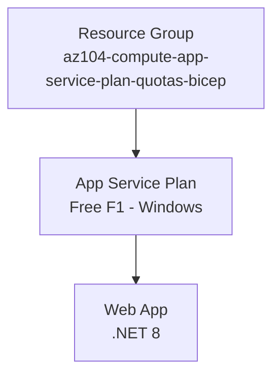
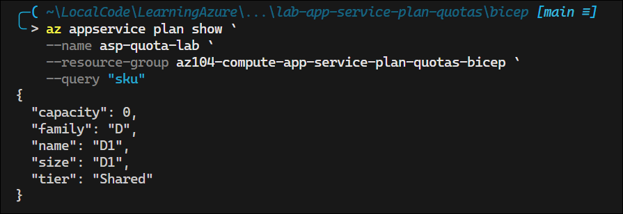
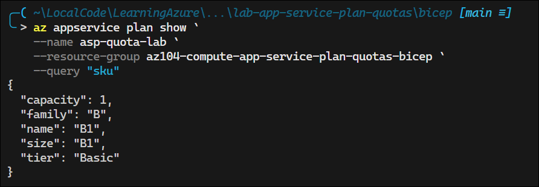

# App Service Plan CPU Quotas

## Exam Question Scenario

You deploy an Azure web app named MyApp. MyApps runs in a Free pricing tier service plan named MyPlan. During testing, you discover that MyApp stops after 60 minutes and that it cannot be restarted until the next day.

You need to ensure that MyApp can run eight hours each day during the testing period. You want to keep the additional costs incurred to a minimum.

Solution: You change the pricing tier for MyPlan to Shared D1.

Does this solution meet the goal?

- No
- Yes

## Solution Architecture

This lab deploys an Azure App Service Plan on the **Free F1 tier** with a simple Web App to let you observe and explore the daily CPU quota behavior that causes the app to stop. The lab focuses on understanding the CPU quota limitations of Free and Shared tiers and why the Basic B1 tier is the minimum tier that removes daily CPU quotas.

Key design decisions:

- **Free F1 tier** deployed initially to reproduce the exact scenario from the exam question (60 CPU minutes/day limit)
- **Windows App Service Plan** used because the Shared D1 tier does not support Linux — this enables you to test the full Free → Shared → Basic upgrade path in the portal
- A simple default web app is deployed for CPU quota observation

> **Cost Note:** The Free F1 tier incurs no cost. If you scale up to Shared D1 (~$10/month prorated) or Basic B1 (~$13/month) during testing, remember to scale back or destroy resources afterward.

## Architecture Diagram



## Lab Objectives

1. Understand the daily CPU quota limitations of the Free (F1) and Shared (D1) App Service Plan tiers
2. Observe how Azure stops a web app when the daily CPU quota is exhausted
3. Compare Free (60 min), Shared (240 min), and Basic (no quota) tier capabilities
4. Determine the minimum App Service Plan tier required for workloads that need extended runtime

## Lab Structure

```
lab-app-service-plan-quotas/
├── README.md
└── bicep/
    ├── main.bicep            # Subscription-scoped orchestration
    ├── app-service.bicep     # App Service Plan + Web App resources
    ├── main.bicepparam       # Parameter values
    ├── bicep.ps1             # Deployment wrapper (shared)
    └── bicepconfig.json      # Bicep linter configuration
```

## Prerequisites

- Azure subscription with Contributor access
- Azure CLI installed and authenticated (`az login`)
- Bicep CLI installed (bundled with Azure CLI)
- PowerShell 7+ installed

## Deployment

```powershell
cd AZ-104/hands-on-labs/compute/lab-app-service-plan-quotas/bicep
.\bicep.ps1 validate
.\bicep.ps1 plan
.\bicep.ps1 apply
```

## Testing the Solution

1. **Verify Deployment:** Run `.\bicep.ps1 output` to retrieve the web app URL, then open it in a browser to confirm the app is running.


2. **Understand CPU Quota Limits (Free F1):** Use Azure CLI to verify the tier's quota limits:

   ```powershell
   az appservice plan show --name asp-quota-lab --resource-group az104-compute-app-service-plan-quotas-bicep --query "sku"
   ```

   The Free F1 tier has a **60 CPU minutes/day** limit (documented in [Azure App Service limits](https://learn.microsoft.com/en-us/azure/azure-resource-manager/management/azure-subscription-service-limits#app-service-limits))

    

3. **Scale Up to Shared D1:** In the Azure Portal, navigate to the App Service Plan → **Scale up (App Service plan)** blade:
   - Select the **Shared D1** tier and apply
   - Verify with: `az appservice plan show --name asp-quota-lab --resource-group az104-compute-app-service-plan-quotas-bicep --query "sku"`
   - The Shared D1 tier increases CPU quota to **240 minutes per day** (4 hours)
   - Note: Still insufficient for 8-hour requirement at full CPU utilization

    

4. **Scale Up to Basic B1:** Select the **Basic B1** tier and apply:
   - Verify: `az appservice plan show --name asp-quota-lab --resource-group az104-compute-app-service-plan-quotas-bicep --query "sku"`
   - The Basic tier removes the daily CPU quota restriction — the app can run continuously
   - Compare pricing vs. tier features in the **Scale up** blade

    

5. **Compare Tier Features:** While on the Scale up blade, review the feature comparison table across tiers:
   - Free/Shared: Daily CPU quotas, no custom domains (Free), no SSL (Free)
   - Basic: No CPU quotas, custom domains, manual scaling
   - Standard+: Autoscale, deployment slots, VNet integration


## Cleanup

```powershell
cd AZ-104/hands-on-labs/compute/lab-app-service-plan-quotas/bicep
.\bicep.ps1 destroy
```

## Scenario Analysis

**Correct Answer: No**

The Shared D1 tier does **not** meet the goal. Here is why:

| Option | Verdict | Explanation |
|--------|---------|-------------|
| **No** | ✅ Correct | The Shared D1 tier provides **240 CPU minutes per day** (4 hours of CPU time). The scenario shows the app exhausts the Free tier's 60-minute CPU quota in exactly 60 minutes of wall-clock time, indicating near-100% CPU utilization. At the same utilization rate, D1's 240-minute quota would be exhausted in ~4 hours — far short of the required 8 hours. The Shared tier still enforces daily CPU quotas and would cause the same "app stops" behavior, just later in the day. |
| **Yes** | ❌ Incorrect | While Shared D1 does provide 4× the CPU quota of Free (240 vs 60 minutes), this is still not enough for an app that requires 8 hours of daily runtime at the observed CPU consumption rate. The correct solution requires a tier with **no daily CPU quota**, which starts at **Basic B1**. |

### Why Basic B1 Is the Correct Solution

The minimum tier that satisfies the requirement is **Basic B1** because:

- **No daily CPU quota** — the app can run continuously 24/7 without being stopped
- **Cheapest tier without CPU restrictions** — at ~$13/month (Windows), it keeps additional costs to a minimum
- **Dedicated compute** — runs on VMs not shared with other customers' apps

### App Service Plan Tier CPU Quotas

| Tier | Daily CPU Quota | Max Runtime (100% CPU) | Monthly Cost (approx.) |
|------|----------------|----------------------|----------------------|
| Free F1 | 60 minutes | ~1 hour | $0 |
| Shared D1 | 240 minutes | ~4 hours | ~$10 |
| Basic B1 | **None** | **Unlimited** | ~$13 |
| Standard S1 | **None** | **Unlimited** | ~$70 |

## Key Learning Points

1. **Free (F1) tier** enforces a **60 CPU minutes/day** quota — once exhausted, the app stops and cannot restart until the next day (UTC midnight reset)
2. **Shared (D1) tier** increases the quota to **240 CPU minutes/day** (4 hours), but still enforces a daily limit that can stop the app
3. **Basic (B1) tier** is the first tier with **no daily CPU quota** — the app can run continuously
4. The **CPU quota measures actual CPU processing time**, not wall-clock time — however, a CPU-intensive app can consume CPU minutes at a 1:1 ratio with wall time
5. When an exam question says "stops after X minutes and cannot restart until next day," this is a hallmark of **daily CPU quota exhaustion** on Free/Shared tiers
6. **"Minimum cost"** in exam questions means the cheapest option that satisfies **all** requirements — not simply the cheapest tier available
7. The **Shared tier does not support Linux** App Service Plans — only Windows

## Related AZ-104 Exam Objectives

- **Deploy and manage Azure compute resources (20–25%)**
  - Create and configure an Azure App Service
  - Configure scaling for an App Service
  - Configure App Service plans

## Additional Resources

- [Azure App Service plan overview](https://learn.microsoft.com/en-us/azure/app-service/overview-hosting-plans)
- [Azure App Service limits](https://learn.microsoft.com/en-us/azure/azure-resource-manager/management/azure-subscription-service-limits#app-service-limits)
- [Scale up an app in Azure App Service](https://learn.microsoft.com/en-us/azure/app-service/manage-scale-up)
- [App Service pricing](https://azure.microsoft.com/en-us/pricing/details/app-service/windows/)

## Related Labs

- **[App Service Plan Tiers](../lab-app-service-plan-tiers/README.md)** - Explore App Service pricing tier capabilities, scaling limits, and choose the right tier for specific requirements

### ▶ Related Labs

- ▶ Related Lab: [lab-app-service-plan-tiers](../lab-app-service-plan-tiers/README.md)

### ▶ Related Practice Exam Questions

- ▶ Practice Question: [Azure App Service Plans](../../../../practice-exams/az-104/app-service-plans.md)
- ▶ Practice Question: [Azure Compute Quotas](../../../../practice-exams/az-104/compute-quotas.md)
