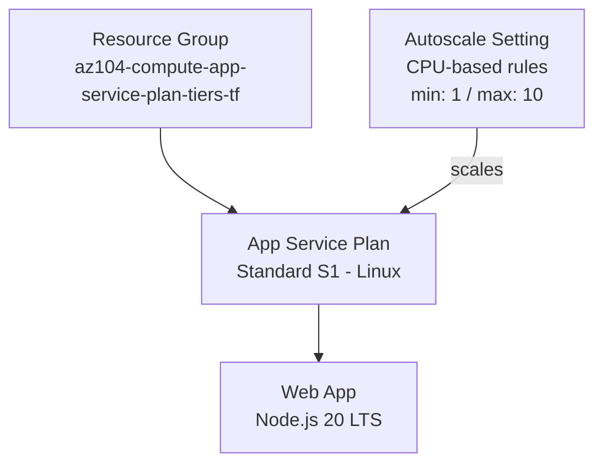
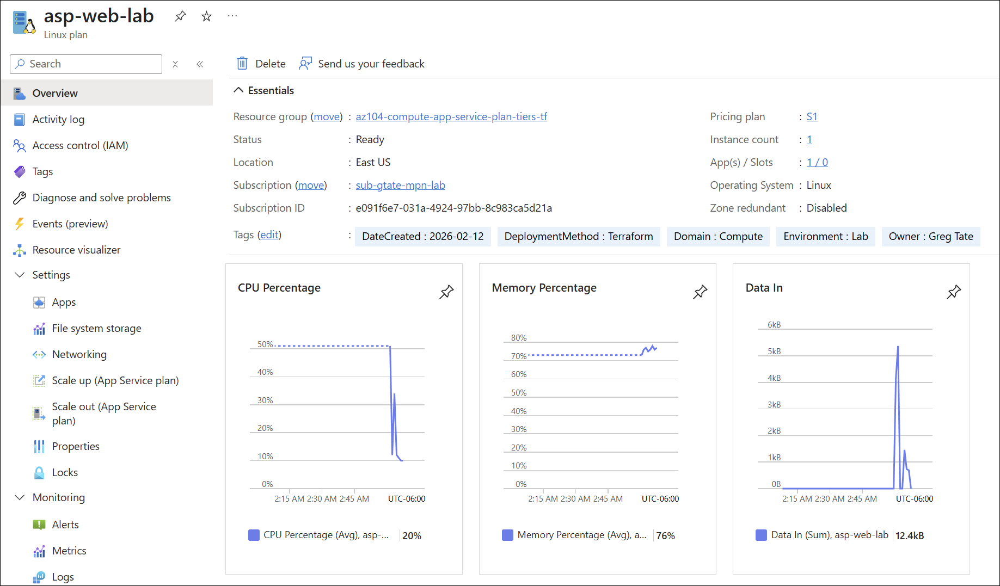
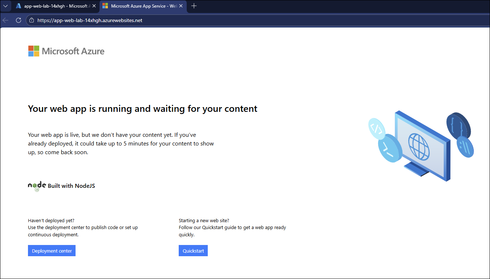
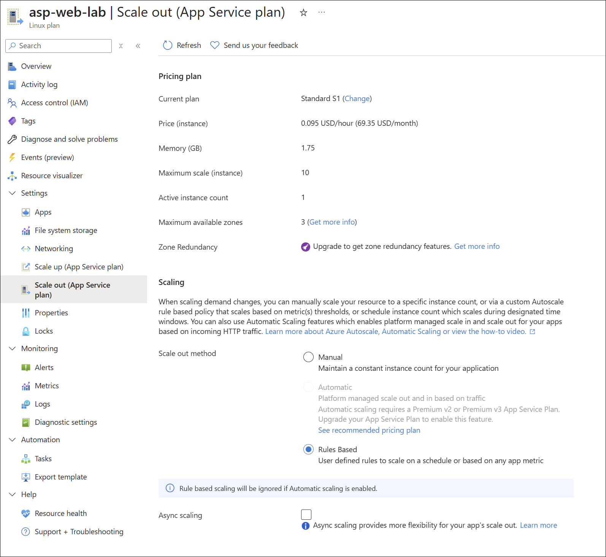

# App Service Plan Tiers

## Exam Question Scenario

You have to provide a website hosting environment that meets the following scalability and security requirements:

- At peak loads, the web application should be able to scale up to 10 host instances.
- The web application storage requirements are minimal and will not exceed 5 GB.
- The web application will perform complex calculations and will require enhanced compute capabilities.
- The virtual machines where the web applications are hosted should be dedicated to your company only.

You need to propose an Azure App Service to host the application. The solution must ensure minimal costs.

Which Azure App Service plan should you use?

- Premium V3
- Isolated
- Standard
- Shared

## Solution Architecture

This lab deploys an Azure App Service Plan with a Web App and autoscale configuration to demonstrate the scaling capabilities discussed in the exam question. A **Standard S1** tier is deployed for cost efficiency, while the Scenario Analysis section below explains why **Premium V3** is the correct answer for the exam.

Key design decisions:

- **Standard S1** provides autoscale up to 10 instances (meeting the scaling requirement)
- **Autoscale rules** are configured based on CPU percentage thresholds
- The Web App runs on Linux with Node.js runtime for simplicity

> **Cost Note:** Premium V3 tiers cost $200-800+/month depending on the SKU, while Standard S1 costs ~$70/month. This lab uses Standard S1 to demonstrate autoscale concepts while keeping costs manageable for learning purposes.

## Architecture Diagram

## Lab Objectives

1. Understand the differences between Azure App Service Plan tiers (Shared, Standard, Premium, Isolated)
2. Configure autoscale rules for an App Service Plan based on CPU metrics
3. Identify when dedicated infrastructure (Isolated tier / ASE) is required
4. Evaluate cost vs. capability tradeoffs across App Service tiers

## Prerequisites

- Azure subscription with Contributor access
- Azure CLI installed and authenticated
- Terraform >= 1.0 installed

## Testing the Solution

1. **Verify App Service Plan tier:** In the Azure Portal, navigate to the App Service Plan and confirm it is running on the Standard S1 tier

2. **Verify Web App deployment:** Open the Web App URL from the Terraform outputs and confirm it loads (default placeholder page)

3. **Inspect autoscale configuration:**
   - Navigate to the App Service Plan > **Scale out (App Service plan)**
   - Verify the autoscale setting shows: minimum = 1, maximum = 10, default = 1
   - Confirm the CPU-based scale-out rule (> 70%) and scale-in rule (< 30%)

4. **Review tier limitations:** In the portal, explore the **Scale up (App Service plan)** blade and compare available tiers to understand what each provides

## Scenario Analysis

**Correct Answer: Premium V3**

The Premium V3 tier is the correct answer because it is the most cost-effective option that satisfies **all four requirements**. Here is why each option is right or wrong:

| Option | Verdict | Explanation |
|--------|---------|-------------|
| **Premium V3** | ✅ Correct | Runs apps on dedicated Azure VMs (not shared with other customers). Supports autoscale up to 30 instances (exceeds the 10-instance requirement). Provides **enhanced compute capabilities** with higher-performance SKUs (more CPU cores and memory) compared to Standard. While more expensive than Standard, it's the cheapest tier that meets the "enhanced compute" requirement. |
| **Isolated** | ❌ Incorrect | Provides dedicated VMs on dedicated infrastructure (via App Service Environment). Supports up to 100 instances with maximum compute power. However, it is significantly more expensive (~$1,000+/month for ASE alone) compared to Premium V3. Since Premium V3 already meets all requirements, Isolated fails the "minimal cost" constraint. |
| **Standard** | ❌ Incorrect | Supports autoscale up to 10 instances (meets scaling requirement) and runs on dedicated VMs (meets the "dedicated to your company" requirement). However, Standard tier uses **lower-performance SKUs** than Premium tiers and does **not** provide "enhanced compute capabilities" for complex calculations. Fails the enhanced compute requirement. |
| **Shared** | ❌ Incorrect | Apps run on shared VMs with other customers' apps (multi-tenant compute). No autoscale support, no dedicated VMs, limited compute power. Fails nearly every requirement except minimal cost. Not suitable for production workloads. |

### Key Distinctions

**What "dedicated to your company" means:**

- In **Free and Shared** tiers: Apps run on VMs shared with other customers' apps (multi-tenant)
- In **Standard, Premium, and Premium V3** tiers: Apps run on dedicated VMs that are **not shared with other customers**; only your apps share these VMs
- In **Isolated** tier (ASE): Apps run on dedicated VMs **and** the underlying physical infrastructure is also dedicated (network and compute isolation)

**The deciding factors:**

1. **Shared tier is eliminated** immediately (no dedicated VMs, no autoscale)
2. **Standard vs Premium V3**: Both provide dedicated VMs and autoscale to 10+ instances. The "enhanced compute capabilities" requirement pushes you to **Premium V3**, which offers higher-performance SKUs
3. **Premium V3 vs Isolated**: Both meet all functional requirements, but Premium V3 is significantly cheaper. Isolated only makes sense if you need the additional network/security isolation (not mentioned in the scenario)

**Cost consideration:** While the question asks for "minimal costs," this means the **least expensive option that satisfies all requirements**. Premium V3 is cheaper than Isolated while still meeting the enhanced compute requirement that Standard cannot satisfy.

## Key Learning Points

1. **App Service Plan tiers** define the compute resources (VM size, performance), scaling limits, and isolation level for hosted web apps
2. **Shared tier** runs apps on VMs shared with other Azure customers' apps (multi-tenant) — unsuitable for any dedicated compute requirement
3. **Standard tier** provides dedicated VMs (not shared with other customers) and supports autoscale up to 10 instances, but uses **lower-performance compute** than Premium tiers
4. **Premium V3** provides dedicated VMs with **enhanced compute capabilities** — higher-performance SKUs with more CPU cores and memory than Standard, and supports autoscale up to 30 instances
5. **Isolated tier** (via App Service Environment) provides both dedicated VMs **and** dedicated underlying infrastructure with network isolation — the highest level of isolation but also the most expensive
6. **"Dedicated to your company"** in exam questions typically means dedicated VMs (Standard, Premium, and Isolated all qualify) — not necessarily dedicated physical infrastructure
7. **Autoscale** is available in Standard, Premium, and Isolated tiers but NOT in Free, Shared, or Basic tiers
8. **Enhanced compute capabilities** specifically refers to higher-performance VM SKUs (more CPU, memory) — this is where Premium tiers differentiate from Standard
9. When evaluating "minimal cost," choose the **least expensive tier that satisfies ALL requirements** — not simply the cheapest tier available
10. **Cost hierarchy** (cheapest to most expensive for production): Standard < Premium V3 < Isolated (with ASE)

## Related AZ-104 Exam Objectives

- **Deploy and manage Azure compute resources (20–25%)**
-
  - Create and configure an Azure App Service
  - Configure scaling for an App Service
  - Configure App Service plans

## Additional Resources

- [Azure App Service plan overview](https://learn.microsoft.com/en-us/azure/app-service/overview-hosting-plans)
- [Scale up an app in Azure App Service](https://learn.microsoft.com/en-us/azure/app-service/manage-scale-up)
- [Get started with autoscale in Azure](https://learn.microsoft.com/en-us/azure/azure-monitor/autoscale/autoscale-get-started)
- [App Service Environment overview](https://learn.microsoft.com/en-us/azure/app-service/environment/overview)
- [App Service pricing](https://azure.microsoft.com/en-us/pricing/details/app-service/)

## Related Labs

▶ Related Lab: [lab-app-service-republication](../../compute/lab-app-service-republication/README.md)
