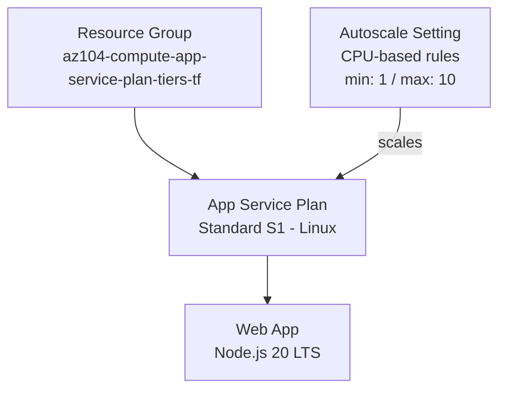

# App Service Plan Tiers

## Exam Question Scenario

You have to provide a website hosting environment that meets the following scalability and security requirements:

- At peak loads, the web application should be able to scale up to 10 host instances.
- The web application storage requirements are minimal and will not exceed 5 GB.
- The web application will perform complex calculations and will require enhanced compute capabilities.
- The virtual machines where the web applications are hosted should be dedicated to your company only.

You need to propose an Azure App Service to host the application. The solution must ensure minimal costs.

Which Azure App Service plan should you use?

- Premium V3
- Isolated
- Standard
- Shared

## Solution Architecture

This lab deploys an Azure App Service Plan with a Web App and autoscale configuration to demonstrate the scaling capabilities discussed in the exam question. A **Standard S1** tier is deployed for cost efficiency, while the Scenario Analysis section below explains the correct answer for the exam.

Key design decisions:

- **Standard S1** provides autoscale up to 10 instances (meeting the scaling requirement)
- **Autoscale rules** are configured based on CPU percentage thresholds
- The Web App runs on Linux with Node.js runtime for simplicity

> **Cost Note:** The Isolated tier requires an App Service Environment (ASE), which costs ~$1,000+/month. This lab uses Standard S1 (~$70/month) to demonstrate autoscale concepts while keeping costs manageable.

## Architecture Diagram

## Lab Objectives

1. Understand the differences between Azure App Service Plan tiers (Shared, Standard, Premium, Isolated)
2. Configure autoscale rules for an App Service Plan based on CPU metrics
3. Identify when dedicated infrastructure (Isolated tier / ASE) is required
4. Evaluate cost vs. capability tradeoffs across App Service tiers

## Prerequisites

- Azure subscription with Contributor access
- Azure CLI installed and authenticated
- Terraform >= 1.0 installed

## Testing the Solution

1. **Verify App Service Plan tier:** In the Azure Portal, navigate to the App Service Plan and confirm it is running on the Standard S1 tier

2. **Verify Web App deployment:** Open the Web App URL from the Terraform outputs and confirm it loads (default placeholder page)

3. **Inspect autoscale configuration:**
   - Navigate to the App Service Plan > **Scale out (App Service plan)**
   - Verify the autoscale setting shows: minimum = 1, maximum = 10, default = 1
   - Confirm the CPU-based scale-out rule (> 70%) and scale-in rule (< 30%)

4. **Review tier limitations:** In the portal, explore the **Scale up (App Service plan)** blade and compare available tiers to understand what each provides

## Scenario Analysis

**Correct Answer: Isolated**

The Isolated tier is the correct answer because it is the **only** App Service plan tier that provides dedicated virtual machines on dedicated infrastructure. Here is why each option is right or wrong:

| Option | Verdict | Explanation |
|--------|---------|-------------|
| **Isolated** | Correct | Runs on a dedicated App Service Environment (ASE) with dedicated VMs. Supports up to 100 instances, enhanced compute, and provides physical network isolation. Meets ALL requirements including dedicated hardware. |
| **Premium V3** | Incorrect | Provides enhanced compute capabilities and up to 30 instances, but runs on **shared infrastructure** — the underlying physical servers may host other Azure customers' workloads. Does not satisfy the "dedicated to your company only" requirement. |
| **Standard** | Incorrect | Supports autoscale up to 10 instances but uses shared infrastructure and offers less compute power than Premium. Does not meet the dedicated VMs or enhanced compute requirements. |
| **Shared** | Incorrect | Apps run on shared VMs with other customers' apps. No autoscale, no dedicated VMs, limited compute. Fails almost every requirement except minimal cost. |

**Key distinction:** In Standard and Premium tiers, the VMs are dedicated to *your apps* but the underlying physical hardware is shared with other Azure customers. The Isolated tier provides dedicated physical infrastructure through an App Service Environment (ASE), ensuring the hardware itself is used only by your organization.

**Cost consideration:** While the question asks for "minimal costs," the Isolated tier is the cheapest option that meets ALL requirements. A cheaper tier would fail the dedicated infrastructure requirement.

## Key Learning Points

1. **App Service Plan tiers** define the compute resources, scaling limits, and isolation level for hosted web apps
2. **Shared tier** runs apps on VMs shared with other customers — unsuitable for any dedicated compute requirement
3. **Standard tier** supports autoscale up to 10 instances with dedicated VMs, but on shared physical infrastructure
4. **Premium V3** offers enhanced compute and up to 30 instances, but still uses shared physical infrastructure
5. **Isolated tier** (via ASE) provides fully dedicated physical infrastructure — the only tier meeting the "dedicated to your company" requirement
6. **Autoscale** is available in Standard, Premium, and Isolated tiers but NOT in Free, Shared, or Basic tiers
7. When exam questions say "dedicated to your company only," this specifically indicates the need for an App Service Environment (Isolated tier)
8. Always evaluate ALL requirements before choosing the cheapest option — "minimal cost" means the least expensive option that satisfies every constraint

## Related AZ-104 Exam Objectives

- **Deploy and manage Azure compute resources (20–25%)**
-
  - Create and configure an Azure App Service
  - Configure scaling for an App Service
  - Configure App Service plans

## Additional Resources

- [Azure App Service plan overview](https://learn.microsoft.com/en-us/azure/app-service/overview-hosting-plans)
- [Scale up an app in Azure App Service](https://learn.microsoft.com/en-us/azure/app-service/manage-scale-up)
- [Get started with autoscale in Azure](https://learn.microsoft.com/en-us/azure/azure-monitor/autoscale/autoscale-get-started)
- [App Service Environment overview](https://learn.microsoft.com/en-us/azure/app-service/environment/overview)
- [App Service pricing](https://azure.microsoft.com/en-us/pricing/details/app-service/)

## Related Labs

*(No related labs currently available)*
