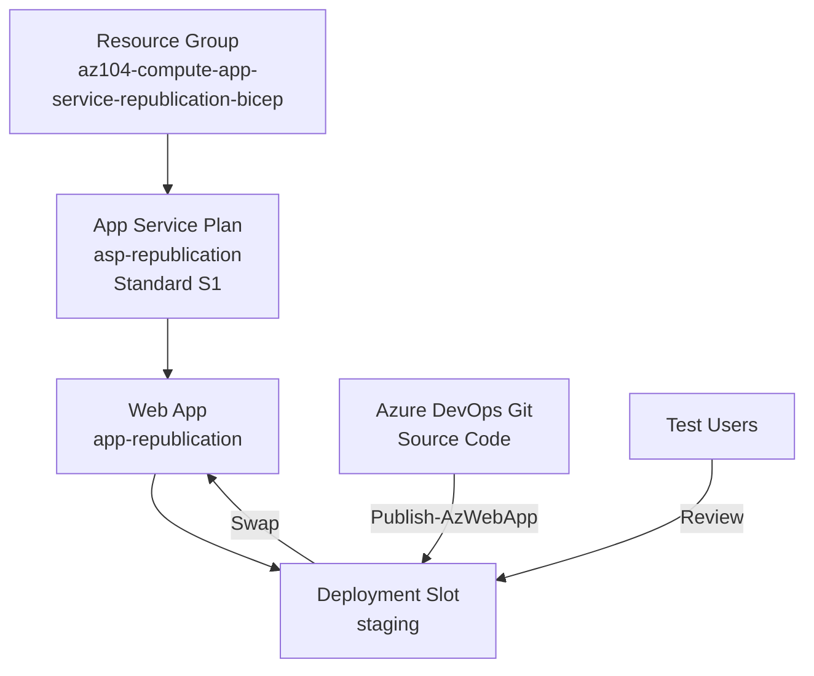

# Prepare Azure App Service for Web App Republication

## Exam Question Scenario

You are developing a new web app. The source code is located in an Azure DevOps Git repository. Before you move the web app into production, its functionality must be reviewed by your test users.

You need to prepare the target environment to be ready to republish the web app.

Which four commands should you run in sequence? To answer, move the appropriate commands from the list of possible commands to the answer area and arrange them in the correct order.

**Available options:**

- Publish-AzWebApp
- New-AzAppServicePlan
- New-AzResourceGroup
- New-AzWebAppSlot
- Start-AzWebAppSlot

---

## Solution Architecture

This lab deploys an Azure App Service environment with a deployment slot so that a web app can be published to a staging slot for test user review before being swapped into production.

**Resources deployed:**

| Resource | Name Pattern | Purpose |
|----------|-------------|---------|
| Resource Group | `az104-compute-app-service-republication-bicep` | Contains all lab resources |
| App Service Plan | `asp-republication` | Hosts the web app (Standard S1 for slot support) |
| Web App | `app-republication-<unique>` | Production web application |
| Deployment Slot | `staging` | Staging slot for test user review |

> **Note:** Standard S1 tier is used because deployment slots require Standard tier or higher. Free and Basic tiers do not support deployment slots.

---

## Architecture Diagram



---

## Lab Objectives

1. Understand the correct sequence of PowerShell commands to prepare an App Service environment
2. Deploy an App Service Plan with a tier that supports deployment slots
3. Create a deployment slot for staging and test review
4. Validate the staging slot is accessible and ready for publishing
5. Learn how deployment slots enable safe republication workflows

---

## Prerequisites

- Azure subscription with Contributor access
- Azure CLI installed and authenticated
- Bicep CLI installed (bundled with Azure CLI)
- PowerShell 7+ with Az module
- `Use-AzProfile Lab` configured for lab subscription

---

## Testing the Solution

### 1. Verify Resource Group Exists

```powershell
az group show --name "az104-compute-app-service-republication-bicep" --query "{name:name, location:location}" -o table
```

### 2. Verify App Service Plan Tier

```powershell
az appservice plan show --name "asp-republication" --resource-group "az104-compute-app-service-republication-bicep" --query "{name:name, sku:sku.name, tier:sku.tier}" -o table
```

Expected: SKU = `S1`, Tier = `Standard`

### 3. Verify Web App Exists

```powershell
$outputs = .\bicep.ps1 output
az webapp show --name $outputs.webAppName --resource-group "az104-compute-app-service-republication-bicep" --query "{name:name, state:state, defaultHostName:defaultHostName}" -o table
```

### 4. Verify Deployment Slot Exists

```powershell
az webapp deployment slot list --name $outputs.webAppName --resource-group "az104-compute-app-service-republication-bicep" --query "[].{name:name, state:state}" -o table
```

Expected: Slot named `staging` in `Running` state

### 5. Test Staging Slot Accessibility

```powershell
$slotUrl = "https://$($outputs.slotHostname)"
Invoke-WebRequest -Uri $slotUrl -UseBasicParsing | Select-Object StatusCode
```

Expected: `StatusCode` = 200 (or similar response confirming the slot is reachable)

---

## Scenario Analysis

### Correct Answer

The four commands in the correct sequence are:

1. **New-AzResourceGroup** — Create the resource group to contain all App Service resources
2. **New-AzAppServicePlan** — Create the App Service Plan that hosts the web app (requires Standard tier or higher for deployment slots)
3. **New-AzWebAppSlot** — Create a deployment slot (e.g., "staging") on the web app for test users to review functionality before production
4. **Publish-AzWebApp** — Publish the web app code from the Azure DevOps Git repository to the staging slot

### Why Other Options Are Wrong

- **Start-AzWebAppSlot** is not needed in this sequence. Deployment slots are started automatically upon creation. While `Start-AzWebAppSlot` is a valid command for restarting a stopped slot, it is not part of the environment preparation workflow. The question asks about preparing the environment and republishing — `Publish-AzWebApp` fulfills the republication step that `Start-AzWebAppSlot` does not.

### Key Sequencing Logic

- A **resource group** must exist before any resources can be created within it
- An **App Service Plan** must exist before a web app can be created (the plan hosts the app)
- A **deployment slot** must be created on an existing web app (the web app is implied as existing or being created as part of the plan)
- **Publishing** the code is the final step that places the application into the slot for test user review
- The scenario emphasizes that test users must review before production — deployment slots enable this by providing a separate URL for testing

---

## Key Learning Points

1. **Deployment slots require Standard tier or higher** — Free and Basic App Service Plans do not support deployment slots
2. **Resource creation follows a dependency chain** — Resource Group → App Service Plan → Web App → Deployment Slot → Publish
3. **Deployment slots get their own hostname** — Format: `<app-name>-<slot-name>.azurewebsites.net`, allowing independent testing
4. **Slots are automatically started** — `Start-AzWebAppSlot` is only needed to restart a previously stopped slot, not during initial setup
5. **Publish-AzWebApp** deploys code to an App Service or slot — it is the command that places application code into the target environment
6. **Slot swapping** is a separate operation (`Switch-AzWebAppSlot`) — not part of the initial preparation but used after test users approve the staging version
7. **Azure DevOps integration** — Source code from Git repositories can be published directly to App Service using PowerShell commands
8. **Infrastructure as Code** — The entire App Service environment (plan, app, slot) can be automated with Bicep or Terraform for repeatable deployments

---

## Related AZ-104 Exam Objectives

- **Deploy and manage Azure compute resources (20-25%)**
  - Create and configure Azure App Service
  - Configure App Service plans
  - Create and manage deployment slots

---

## Additional Resources

- [Azure App Service deployment slots](https://learn.microsoft.com/en-us/azure/app-service/deploy-staging-slots)
- [New-AzWebAppSlot PowerShell reference](https://learn.microsoft.com/en-us/powershell/module/az.websites/new-azwebappslot)
- [Publish-AzWebApp PowerShell reference](https://learn.microsoft.com/en-us/powershell/module/az.websites/publish-azwebapp)
- [Azure App Service plans overview](https://learn.microsoft.com/en-us/azure/app-service/overview-hosting-plans)
- [Set up staging environments in Azure App Service](https://learn.microsoft.com/en-us/azure/app-service/deploy-staging-slots)

---

## Related Labs

- ▶ [App Service Plan Tiers](../lab-app-service-plan-tiers/)
