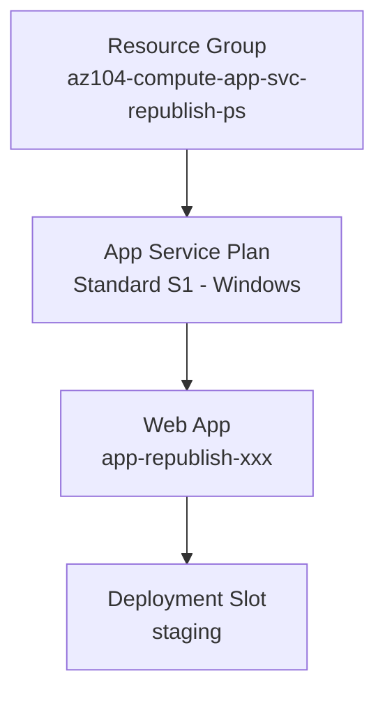

# App Service Republication with Deployment Slots

## Exam Question Scenario

You are developing a new web app. The source code is located in an Azure DevOps Git repository. Before you move the web app into production, its functionality must be reviewed by your test users.

You need to prepare the target environment to be ready to republish the web app.

Which four commands should you run in sequence? To answer, move the appropriate commands from the list of possible commands to the answer area and arrange them in the correct order.

**Available options:**

- Publish-AzWebApp
- New-AzAppServicePlan
- New-AzResourceGroup
- New-AzWebAppSlot
- Start-AzWebAppSlot

## Solution Architecture

This lab uses Azure PowerShell commands to prepare an App Service environment with deployment slots for web app republication. The scripted approach directly mirrors the exam question, which tests knowledge of the correct command sequence for imperative Azure resource provisioning.

Key design decisions:

- **Standard S1 tier** is required because deployment slots are only available in Standard tier and above (Free, Shared, and Basic do not support slots)
- A **staging deployment slot** enables test users to review the app before it reaches production
- The script follows the exact command sequence from the exam question, with `New-AzWebApp` added as a necessary intermediate step (not listed in exam options but required to create a slot)

> **Cost Note:** Standard S1 costs ~$70/month. This is the minimum tier that supports deployment slots. The lab uses this tier to demonstrate the concept while keeping costs manageable.

## Architecture Diagram



## Lab Objectives

1. Understand the correct sequence of Azure PowerShell commands for provisioning an App Service environment
2. Deploy an App Service Plan with a tier that supports deployment slots
3. Create and use deployment slots for pre-production testing and republication
4. Publish a web app to a deployment slot for test user review

## Lab Structure

```
lab-app-service-republication/
├── README.md
├── scripts/
│   ├── deploy.ps1          # Provisions resources and publishes app
│   ├── cleanup.ps1         # Removes all lab resources
│   └── app/
│       └── index.html      # Sample web app for deployment
└── validation/
    └── test-app-service.ps1  # Validates deployment
```

## Prerequisites

- Azure subscription with Contributor access
- Azure PowerShell module (`Az`) installed and authenticated
- PowerShell 7+ recommended

## Deployment

```powershell
# Switch to lab Azure profile
Use-AzProfile Lab

# Run the deployment script
cd AZ-104/hands-on-labs/compute/lab-app-service-republication/scripts
.\deploy.ps1
```

## Testing the Solution

1. **Verify resource group exists:**

   ```powershell
   Get-AzResourceGroup -Name "az104-compute-app-svc-republish-ps"
   ```

2. **Verify App Service Plan tier:**
   - Navigate to the App Service Plan in the Azure Portal
   - Confirm it is running on **Standard S1** tier (required for deployment slots)

3. **Verify deployment slot exists:**

   ```powershell
   Get-AzWebAppSlot -ResourceGroupName "az104-compute-app-svc-republish-ps" -Name "<web-app-name>" -Slot "staging"
   ```

4. **Access the staging slot URL:**
   - Open the staging slot URL displayed in the deployment output (format: `https://<app-name>-staging.azurewebsites.net`)
   - Confirm the sample web page loads successfully

5. **Run the validation script:**

   ```powershell
   .\validation\test-app-service.ps1
   ```

## Cleanup

```powershell
cd AZ-104/hands-on-labs/compute/lab-app-service-republication/scripts
.\cleanup.ps1
```

## Scenario Analysis

**Correct Answer: New-AzResourceGroup → New-AzAppServicePlan → New-AzWebAppSlot → Publish-AzWebApp**

The correct sequence of four commands prepares the target environment for web app republication with test user review via deployment slots:

| Step | Command | Purpose |
|------|---------|---------|
| 1 | `New-AzResourceGroup` | Create the resource group to contain all App Service resources |
| 2 | `New-AzAppServicePlan` | Create the App Service Plan (Standard tier or higher, required for slots) |
| 3 | `New-AzWebAppSlot` | Create a deployment slot (e.g., "staging") for test user review |
| 4 | `Publish-AzWebApp` | Publish the web app code to the deployment slot |

### Why each option is correct or incorrect

| Option | Verdict | Explanation |
|--------|---------|-------------|
| **New-AzResourceGroup** | ✅ Step 1 | Every Azure deployment starts with a resource group. This is always the first command in any provisioning sequence. |
| **New-AzAppServicePlan** | ✅ Step 2 | The App Service Plan defines the compute resources. Must exist before creating a web app or slot. Must be **Standard tier or higher** to support deployment slots. |
| **New-AzWebAppSlot** | ✅ Step 3 | Creates a deployment slot (e.g., "staging") where the app can be published for test user review before swapping to production. |
| **Publish-AzWebApp** | ✅ Step 4 | Deploys the web app code to the target (slot). This is the final step that makes the app available for review. |
| **Start-AzWebAppSlot** | ❌ Not needed | Deployment slots are automatically started when created. `Start-AzWebAppSlot` is used to restart a **stopped** slot, which is not part of the initial preparation sequence. |

### Important note about New-AzWebApp

The exam question omits `New-AzWebApp` from the options, but in practice you **must** create a web app (`New-AzWebApp`) before you can create a deployment slot (`New-AzWebAppSlot`). The exam assumes the web app already exists or that it is implied in the sequence. This lab includes `New-AzWebApp` as a necessary intermediate step between `New-AzAppServicePlan` and `New-AzWebAppSlot`.

## Key Learning Points

1. **Command sequence matters** — Azure resources have dependencies that dictate provisioning order: resource group → App Service Plan → web app → deployment slot → publish
2. **Deployment slots require Standard tier or higher** — Free, Shared, and Basic App Service Plans do not support deployment slots
3. **Deployment slots start automatically** — `Start-AzWebAppSlot` is only needed to restart a previously stopped slot, not during initial setup
4. **Deployment slots enable safe republication** — publish to a staging slot, have test users review, then swap to production
5. **`Publish-AzWebApp`** deploys application code to an App Service or deployment slot using zip deployment
6. **`New-AzWebApp` is a prerequisite for slots** — you cannot create a deployment slot without an existing web app, even though the exam question omits this command
7. **Slot swapping** (not covered in this question) is the typical next step after test users approve — `Switch-AzWebAppSlot` swaps staging and production

## Related AZ-104 Exam Objectives

- **Deploy and manage Azure compute resources (20–25%)**
  - Create and configure an Azure App Service
  - Configure scaling for an App Service
  - Configure deployment slots

## Additional Resources

- [Set up staging environments in Azure App Service](https://learn.microsoft.com/en-us/azure/app-service/deploy-staging-slots)
- [New-AzWebAppSlot documentation](https://learn.microsoft.com/en-us/powershell/module/az.websites/new-azwebappslot)
- [Publish-AzWebApp documentation](https://learn.microsoft.com/en-us/powershell/module/az.websites/publish-azwebapp)
- [Azure App Service plan overview](https://learn.microsoft.com/en-us/azure/app-service/overview-hosting-plans)
- [App Service pricing](https://azure.microsoft.com/en-us/pricing/details/app-service/)

## Related Labs

▶ Related Lab: [lab-app-service-plan-tiers](../../compute/lab-app-service-plan-tiers/README.md)
