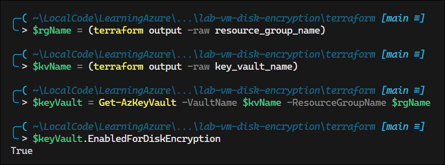
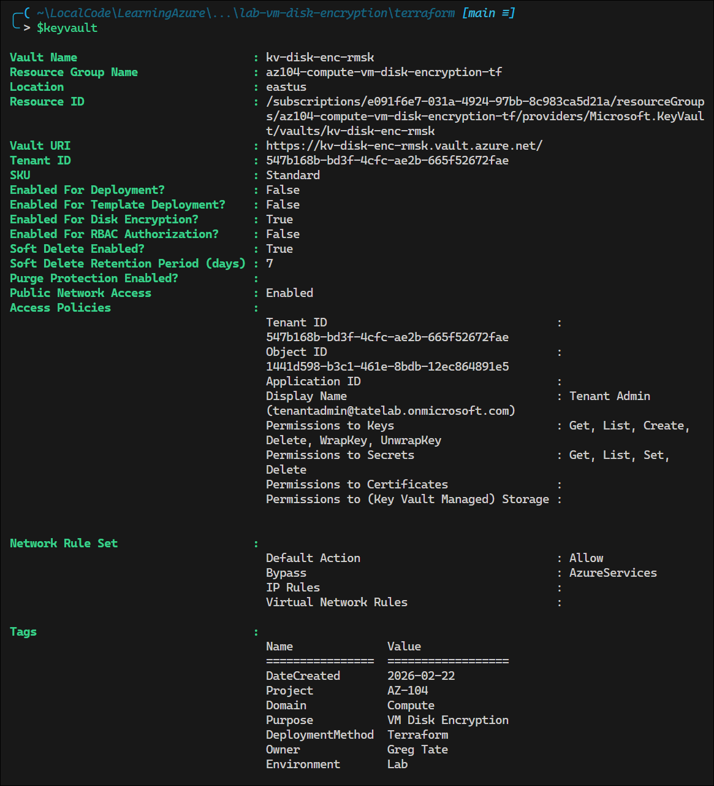
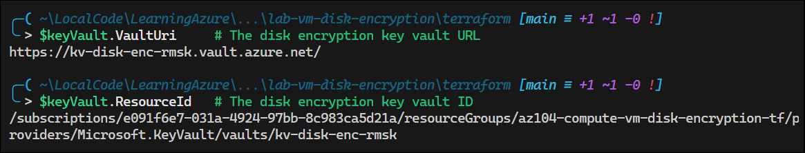

# Lab: Azure VM Disk Encryption with Key Vault

## Exam Question Scenario

**Type:** Multiple Drop-Down

You have a subscription named SubscriptionA that hosts the following resources:

- A key vault named mySecureVault in a resource group named myKeyVaultResourceGroup.
- A virtual machine (VM) named mySecureVM in a resource group named myVirtualMachineResourceGroup.

You need to write a PowerShell script that will encrypt the disk for mySecureVM using the keys stored in the mySecureVault.

How should you complete the script? To answer, select the appropriate options from the drop-down menus.

```powershell
$keyVaultRG = 'myKeyVaultResourceGroup';
$vmRG = 'myVirtualMachineResourceGroup';
$vmName = 'mySecureVM';
$keyVaultName = 'mySecureVault';

$keyVault = Get-AzKeyVault ___[1]___ $keyVaultName -ResourceGroupName $keyVaultRG;
$diskEncryptionKeyVaultUrl = ___[2]___;
$keyVaultId = ___[3]___

Set-AzVMDiskEncryptionExtension -ResourceGroupName ___[4]___ `
    -DiskEncryptionKeyVaultUrl $diskEncryptionKeyVaultUrl `
    -DiskEncryptionKeyVaultId $keyVaultId `
    -VMName $vmName;
```

**Drop-Down Options:**

| Blank | Options |
|-------|---------|
| [1] | `-Name` / `-VaultName` |
| [2] | `$keyVault.Path` / `$keyVault.Uri` / `$keyVault.VaultUri` |
| [3] | `$keyVault.Id` / `$keyVault.ResourceId` |
| [4] | `$keyVaultRG` / `$vmRG` |

---

## Solution Architecture

This lab deploys the infrastructure required to practice Azure Disk Encryption (ADE) with Key Vault:

1. **Key Vault** — Provisioned with `enabled_for_disk_encryption = true`, which allows the ADE extension to store BitLocker encryption keys (BEK) as secrets
2. **Windows VM** — A Standard_B2s VM with an unencrypted OS disk, ready for the student to encrypt using PowerShell
3. **Virtual Network + Subnet** — Network infrastructure for the VM (no public IP; access via Bastion or Cloud Shell)

The student retrieves Key Vault properties (`VaultUri`, `ResourceId`) and runs `Set-AzVMDiskEncryptionExtension` to encrypt the VM disk — mirroring the exact exam scenario.

---

## Architecture Diagram

```mermaid
%%{init: {
  "theme": "base",
  "themeVariables": {
    "background": "#F5F5F5",
    "primaryColor": "#E8E8E8",
    "primaryTextColor": "#333333",
    "primaryBorderColor": "#999999",
    "lineColor": "#666666",
    "clusterBkg": "#FAFAFA",
    "clusterBorder": "#CCCCCC",
    "edgeLabelBackground": "#F5F5F5",
    "fontFamily": "Segoe UI, Roboto, Arial, sans-serif",
    "fontSize": "14px"
  }
}}%%

graph TD
    subgraph RG["az104-compute-vm-disk-encryption-tf"]
        KV["Key Vault<br/>kv-disk-enc-xxxx"]:::security
        VNET["VNet<br/>vnet-disk-enc"]:::network
        SUBNET["Subnet<br/>snet-vm"]:::network
        NIC["NIC<br/>nic-vm-disk-enc"]:::network
        VM["Windows VM<br/>vm-disk-enc"]:::compute
        ADE["ADE Extension<br/>Set-AzVMDiskEncryptionExtension"]:::recovery
    end

    KV -->|"VaultUri + ResourceId"| ADE
    ADE -->|"Encrypts OS Disk"| VM
    VM --> NIC
    NIC --> SUBNET
    SUBNET --> VNET

    %% Core (AZ-104)
    classDef compute   fill:#914BB0,stroke:#6E2E8E,color:#FFFFFF,stroke-width:1.5px;
    classDef network   fill:#50C878,stroke:#2E8B57,color:#0B1A10,stroke-width:1.5px;
    classDef security  fill:#DC3545,stroke:#A61B29,color:#FFFFFF,stroke-width:1.5px;
    classDef storage   fill:#FFA500,stroke:#B36B00,color:#1A1200,stroke-width:1.5px;
    classDef recovery  fill:#0078D4,stroke:#0B5CAD,color:#FFFFFF,stroke-width:1.5px;
    classDef identity  fill:#00B7C3,stroke:#007C86,color:#001417,stroke-width:1.5px;
    classDef monitor   fill:#FFB900,stroke:#B37A00,color:#1A1300,stroke-width:1.5px;
    classDef governance fill:#9B9B9B,stroke:#6B6B6B,color:#111111,stroke-width:1.5px;
```



---

## Lab Objectives

1. Deploy a Key Vault configured for Azure Disk Encryption (`enabled_for_disk_encryption`)
2. Deploy a Windows VM with an unencrypted OS disk
3. Retrieve Key Vault properties (`VaultUri`, `ResourceId`) using `Get-AzKeyVault`
4. Encrypt the VM disk using `Set-AzVMDiskEncryptionExtension` with the correct parameters
5. Verify disk encryption status using `Get-AzVMDiskEncryptionStatus`

---

## Lab Structure

```
lab-vm-disk-encryption/
├── README.md
├── terraform/
│   ├── main.tf
│   ├── variables.tf
│   ├── outputs.tf
│   ├── providers.tf
│   ├── terraform.tfvars
│   └── modules/
│       ├── keyvault/
│       │   ├── main.tf
│       │   ├── variables.tf
│       │   └── outputs.tf
│       └── compute/
│           ├── main.tf
│           ├── variables.tf
│           └── outputs.tf
└── validation/
    └── test-vm-disk-encryption.ps1
```

---

## Prerequisites

- Azure subscription with Contributor access
- [Terraform >= 1.0](https://developer.hashicorp.com/terraform/install)
- [Azure PowerShell module](https://learn.microsoft.com/en-us/powershell/azure/install-azure-powershell) (`Az` module)
- Lab profile active: `Use-AzProfile Lab`

---

## Deployment

```powershell
Use-AzProfile Lab
cd terraform
terraform init
terraform validate
terraform fmt
terraform plan
terraform apply -auto-approve
```

---

## Testing the Solution

### Step 1: Verify Key Vault Configuration

```powershell
# Retrieve the Key Vault and confirm disk encryption is enabled
$rgName = (terraform output -raw resource_group_name)
$kvName = (terraform output -raw key_vault_name)

$keyVault = Get-AzKeyVault -VaultName $kvName -ResourceGroupName $rgName
$keyVault.EnabledForDiskEncryption  # Expected: True
```
<!-- Screenshot -->
  



### Step 2: Retrieve Key Vault Properties (Exam Scenario)

```powershell
# These are the exact properties tested in the exam question
$keyVault.VaultUri     # The disk encryption key vault URL
$keyVault.ResourceId   # The disk encryption key vault ID
```
<!-- Screenshot -->


### Step 3: Encrypt the VM Disk

```powershell
# Run the completed exam script against the lab resources
$vmName = (terraform output -raw vm_name)

Set-AzVMDiskEncryptionExtension -ResourceGroupName $rgName `
    -DiskEncryptionKeyVaultUrl $keyVault.VaultUri `
    -DiskEncryptionKeyVaultId $keyVault.ResourceId `
    -VMName $vmName `
    -VolumeType "All" `
    -Force
```
<!-- Screenshot -->


[Set-AzVMDiskEncryptionExtension](https://learn.microsoft.com/en-us/powershell/module/az.compute/set-azvmdiskencryptionextension?view=azps-15.3.0&viewFallbackFrom=azps-14.5.0) - Enables encryption on a running IaaS virtual machine in Azure.

### Step 4: Verify Encryption Status

```powershell
# Check that disk encryption is enabled
$status = Get-AzVMDiskEncryptionStatus -ResourceGroupName $rgName -VMName $vmName
$status.OsVolumeEncrypted        # Expected: Encrypted
$status.DataVolumesEncrypted     # Expected: NoDiskFound (no data disks)
```
<!-- Screenshot -->


---

## Cleanup

```powershell
cd terraform
terraform destroy -auto-approve
```

> **Note:** Destroy within 7 days per lab governance policy. Key Vault enters soft-delete state after destruction — the `purge_soft_delete_on_destroy` provider feature purges it automatically.

---

## Scenario Analysis

### Correct Answers

| Blank | Correct Answer | Reasoning |
|-------|---------------|-----------|
| **[1]** | `-VaultName` | `Get-AzKeyVault` uses the `-VaultName` parameter to specify which vault to retrieve. `-Name` is not a valid parameter for this cmdlet. |
| **[2]** | `$keyVault.VaultUri` | The `VaultUri` property returns the vault's DNS URL (e.g., `https://mysecurevault.vault.azure.net/`). `$keyVault.Uri` and `$keyVault.Path` are not valid properties. |
| **[3]** | `$keyVault.ResourceId` | The `ResourceId` property returns the full ARM resource ID (e.g., `/subscriptions/.../Microsoft.KeyVault/vaults/mySecureVault`). `$keyVault.Id` is not a valid property on the Key Vault object. |
| **[4]** | `$vmRG` | `Set-AzVMDiskEncryptionExtension` operates on the VM, so it needs the **VM's resource group** (`$vmRG`), not the Key Vault's resource group (`$keyVaultRG`). |

### Completed Script

```powershell
$keyVaultRG = 'myKeyVaultResourceGroup';
$vmRG = 'myVirtualMachineResourceGroup';
$vmName = 'mySecureVM';
$keyVaultName = 'mySecureVault';

$keyVault = Get-AzKeyVault -VaultName $keyVaultName -ResourceGroupName $keyVaultRG;
$diskEncryptionKeyVaultUrl = $keyVault.VaultUri;
$keyVaultId = $keyVault.ResourceId

Set-AzVMDiskEncryptionExtension -ResourceGroupName $vmRG `
    -DiskEncryptionKeyVaultUrl $diskEncryptionKeyVaultUrl `
    -DiskEncryptionKeyVaultId $keyVaultId `
    -VMName $vmName;
```

### Why Other Options Are Wrong

- **`-Name`** — Not a valid parameter for `Get-AzKeyVault`. The cmdlet uses `-VaultName`.
- **`$keyVault.Path`** — Not a property of the Key Vault object returned by `Get-AzKeyVault`.
- **`$keyVault.Uri`** — Not a valid property. The correct property is `VaultUri`.
- **`$keyVault.Id`** — Not a valid property on the PowerShell Key Vault object. The correct property is `ResourceId`.
- **`$keyVaultRG`** — `Set-AzVMDiskEncryptionExtension` targets the VM, so the VM's resource group must be specified.

---

## Key Learning Points

1. **`Get-AzKeyVault -VaultName`** — The `-VaultName` parameter (not `-Name`) is used to retrieve a specific Key Vault. This is a common exam distractor.

2. **Key Vault Properties for ADE** — `VaultUri` provides the HTTPS endpoint URL and `ResourceId` provides the full ARM resource path. Both are required by `Set-AzVMDiskEncryptionExtension`.

3. **`enabled_for_disk_encryption`** — This Key Vault property must be `true` before ADE can store encryption keys (BEK/KEK) as secrets in the vault. Without it, encryption fails.

4. **Resource Group Context** — `Set-AzVMDiskEncryptionExtension` operates on the VM, so the `-ResourceGroupName` must be the VM's resource group, not the Key Vault's resource group.

5. **Azure Disk Encryption (ADE) Flow** — ADE uses BitLocker (Windows) or DM-Crypt (Linux) to encrypt VM disks. Encryption keys are stored as secrets in Key Vault, providing centralized key management.

6. **BEK vs. KEK** — By default, ADE uses BitLocker Encryption Keys (BEK) stored as Key Vault secrets. Optionally, a Key Encryption Key (KEK) can wrap the BEK for an additional layer of protection.

7. **Volume Types** — The `-VolumeType` parameter controls which disks are encrypted: `OS` (OS disk only), `Data` (data disks only), or `All` (both). If omitted, defaults to `All`.

---

## Related AZ-104 Objectives

- **Monitor and maintain Azure resources**
  - Configure backup for VMs (Azure Disk Encryption compatibility with Azure Backup)
- **Deploy and manage Azure compute resources**
  - Configure VMs including disk encryption
  - Manage VM extensions
- **Manage Azure identities and governance**
  - Manage Azure Key Vault access and configuration

---

## Additional Resources

- [Azure Disk Encryption for Windows VMs](https://learn.microsoft.com/en-us/azure/virtual-machines/windows/disk-encryption-overview)
- [Set-AzVMDiskEncryptionExtension Reference](https://learn.microsoft.com/en-us/powershell/module/az.compute/set-azvmdiskencryptionextension)
- [Get-AzKeyVault Reference](https://learn.microsoft.com/en-us/powershell/module/az.keyvault/get-azkeyvault)
- [Create and Configure a Key Vault for ADE](https://learn.microsoft.com/en-us/azure/virtual-machines/windows/disk-encryption-key-vault)
- [Azure Disk Encryption Scenarios](https://learn.microsoft.com/en-us/azure/virtual-machines/windows/disk-encryption-windows)

---

## Related Labs

- [Lab: App Service Plan Quotas](../lab-app-service-plan-quotas/) — Compute resource management fundamentals
