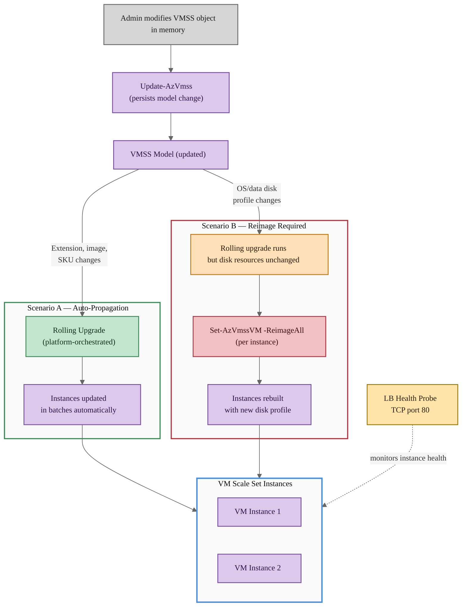
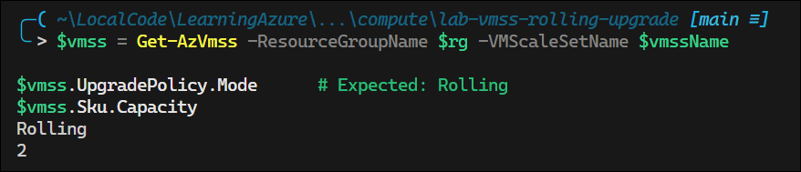
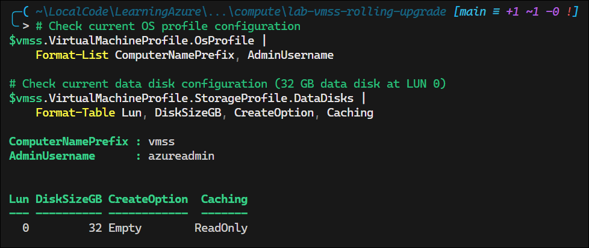
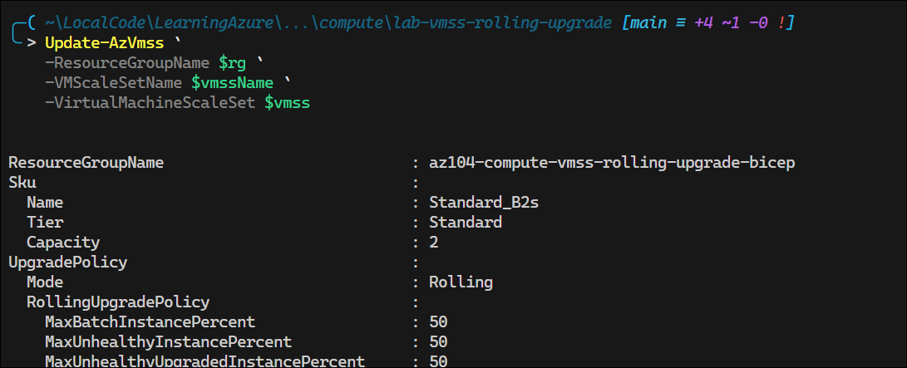
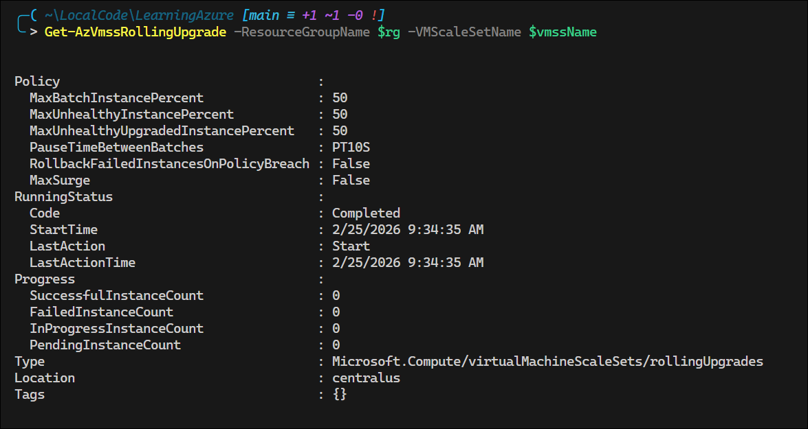
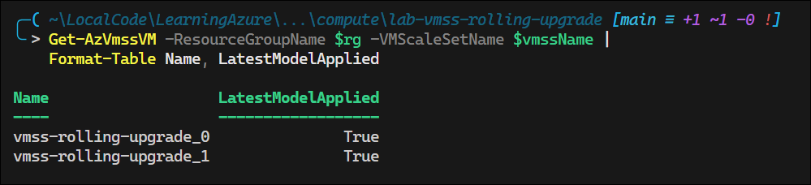
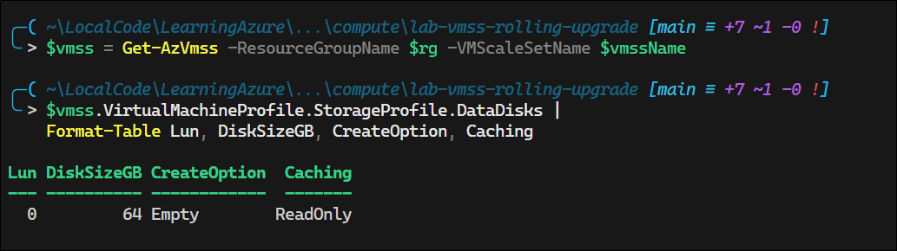
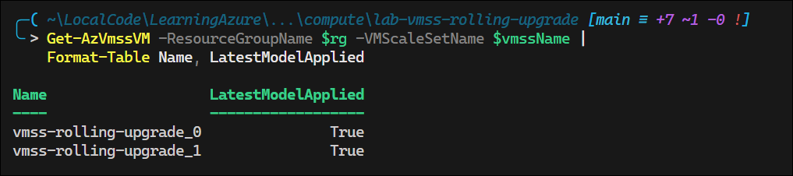

# VMSS Rolling Upgrade — Set-AzVmssVM

## Exam Question

> **Exam**: AZ-104 — Compute

### VMSS Rolling Upgrade PowerShell Cmdlet

*Multiple Choice*

You deploy a virtual machine scale set (VMSS) to support a critical application. The upgrade policy for the VMSS is set to Rolling.

You need to apply a change in the scale set OS and Data disk Profile for the VMSS to the existing VM images.

Which PowerShell cmdlet should you use?

- A. Update-AzVmss
- B. Start-AzVmssRollingOSUpgrade
- C. Update-AzVmssInstance
- D. Set-AzVmssVM

---

## Solution Architecture

This lab deploys a Virtual Machine Scale Set with a Rolling upgrade policy behind a Standard Load Balancer. The VMSS uses Ubuntu Linux instances configured with both an OS disk and a data disk. The lab demonstrates two update scenarios: (1) a model change that Rolling upgrade propagates automatically to instances (adding a VM extension), and (2) an OS/data disk profile change that requires per-instance reimaging via `Set-AzVmssVM -ReimageAll` (resizing existing data disks). A Standard Load Balancer provides health monitoring through a TCP health probe on port 80, which the rolling upgrade policy uses to safely batch instance updates while maintaining application availability.

---

## Architecture Diagram



---

## Lab Objectives

1. Deploy a VMSS with Rolling upgrade policy using Bicep
2. Understand the two-step VMSS update workflow: model update (`Update-AzVmss`) + instance convergence
3. Demonstrate a model change that Rolling upgrade propagates automatically (add VM extension)
4. Demonstrate an OS/data disk profile change that requires per-instance reimaging (`Set-AzVmssVM -ReimageAll`)
5. Distinguish between `Update-AzVmss`, `Update-AzVmssInstance`, `Start-AzVmssRollingOSUpgrade`, and `Set-AzVmssVM`
6. Verify VMSS instance model alignment and actual resource state after upgrades

---

## Lab Structure

```
lab-vmss-rolling-upgrade/
├── README.md
├── bicep/
│   ├── main.bicep
│   ├── main.bicepparam
│   ├── bicepconfig.json
│   ├── bicep.ps1
│   └── modules/
│       ├── network.bicep
│       ├── loadbalancer.bicep
│       └── vmss.bicep
└── validation/
    └── validate-vmss.ps1
```

---

## Prerequisites

- Azure subscription with Contributor access
- Azure CLI installed and authenticated
- Bicep CLI installed (bundled with Azure CLI)
- PowerShell 7+ with Az module (`Az.Compute`, `Az.Network`)

---

## Deployment

### 1. Navigate to the Bicep Directory

```powershell
cd AZ-104/hands-on-labs/compute/lab-vmss-rolling-upgrade/bicep
```

### 2. Validate the Template

```powershell
Use-AzProfile Lab
.\bicep.ps1 validate
```

### 3. Preview the Deployment

```powershell
.\bicep.ps1 plan
```

### 4. Deploy

```powershell
.\bicep.ps1 apply
```


---

## Testing the Solution

### Common Variables

```powershell
# Set variables used throughout both scenarios
$rg       = 'az104-compute-vmss-rolling-upgrade-bicep'
$vmssName = 'vmss-rolling-upgrade'
```

### Step 1: Verify VMSS Deployment

```powershell
# Get the VMSS and verify it exists with Rolling upgrade policy
$vmss = Get-AzVmss -ResourceGroupName $rg -VMScaleSetName $vmssName

$vmss.UpgradePolicy.Mode      # Expected: Rolling
$vmss.Sku.Capacity             # Expected: 2
```



### Step 2: Verify OS Profile and Data Disk Configuration

```powershell
# Check current OS profile configuration
$vmss.VirtualMachineProfile.OsProfile |
    Format-List ComputerNamePrefix, AdminUsername

# Check current data disk configuration (32 GB data disk at LUN 0)
$vmss.VirtualMachineProfile.StorageProfile.DataDisks |
    Format-Table Lun, DiskSizeGB, CreateOption, Caching
```



### Step 3: Verify Rolling Upgrade Policy Settings

```powershell
# Check rolling upgrade policy configuration
$vmss.UpgradePolicy.RollingUpgradePolicy | Format-List
```


---

### Scenario A — Model Change Auto-Propagated by Rolling Upgrade

Rolling upgrade automatically propagates certain model changes to existing instances in batches. Examples include image reference updates, VM SKU changes, and adding/removing extensions. This scenario demonstrates adding a VM extension.

### Step 4: Add a VM Extension Using Update-AzVmss

```powershell
# Re-read the current VMSS model
$vmss = Get-AzVmss -ResourceGroupName $rg -VMScaleSetName $vmssName

# Define the extension settings (creates a marker file on each instance)
$settings = @{
    commandToExecute = "echo 'Rolling upgrade applied' > /tmp/rolling-upgrade-marker.txt"
}

# Add a CustomScript extension to the VMSS model
Add-AzVmssExtension -VirtualMachineScaleSet $vmss `
    -Name 'RollingUpgradeTest' `
    -Publisher 'Microsoft.Azure.Extensions' `
    -Type 'CustomScript' `
    -TypeHandlerVersion '2.1' `
    -Setting $settings

# Persist the model change — rolling upgrade starts automatically
Update-AzVmss `
    -ResourceGroupName $rg `
    -VMScaleSetName $vmssName `
    -VirtualMachineScaleSet $vmss
```




### Step 5: Monitor Rolling Upgrade Progress

```powershell
# Check rolling upgrade status (run shortly after Update-AzVmss)
Get-AzVmssRollingUpgrade -ResourceGroupName $rg -VMScaleSetName $vmssName
```

> **Note:** If the rolling upgrade completes quickly, this command may return an error indicating no active rolling upgrade. This is expected for a 2-instance VMSS.



### Step 6: Verify Extension Applied to All Instances

```powershell
# Confirm all instances are on the latest model
Get-AzVmssVM -ResourceGroupName $rg -VMScaleSetName $vmssName |
    Format-Table Name, LatestModelApplied

# Verify extension is listed on the VMSS model
$updatedVmss = Get-AzVmss -ResourceGroupName $rg -VMScaleSetName $vmssName
$updatedVmss.VirtualMachineProfile.ExtensionProfile.Extensions |
    Format-Table Name, Publisher, Type
```




**Result**: The rolling upgrade automatically propagated the extension to both instances. No per-instance action was needed. This is the expected behavior for model changes like extensions, image references, and SKU changes.


---

### Scenario B — OS/Data Disk Profile Change (Exam Scenario)

Some model changes — particularly OS profile and data disk profile modifications — update the VMSS model definition but do not retroactively mutate the underlying resources (managed disks) already provisioned on existing instances. Even though `LatestModelApplied` shows `True`, the actual disk resources remain at their original size. These changes require reimaging instances using `Set-AzVmssVM`.

### Step 7: Update Data Disk Size in VMSS Model Using Update-AzVmss

```powershell
# Re-read the current VMSS model
$vmss = Get-AzVmss -ResourceGroupName $rg -VMScaleSetName $vmssName

# Update the data disk size from 32 GB to 64 GB in the model
$vmss.VirtualMachineProfile.StorageProfile.DataDisks[0].DiskSizeGB = 64

# Persist the model change
Update-AzVmss `
    -ResourceGroupName $rg `
    -VMScaleSetName $vmssName `
    -VirtualMachineScaleSet $vmss
```


### Step 8: Observe Model Updated but Disk Resources Unchanged

```powershell
# Verify model shows 64 GB (desired state updated)
$vmss = Get-AzVmss -ResourceGroupName $rg -VMScaleSetName $vmssName
$vmss.VirtualMachineProfile.StorageProfile.DataDisks |
    Format-Table Lun, DiskSizeGB, CreateOption, Caching

# Verify instances show LatestModelApplied = True (model aligned)
Get-AzVmssVM -ResourceGroupName $rg -VMScaleSetName $vmssName |
    Format-Table Name, LatestModelApplied
```





```powershell
# Check ACTUAL data disk size on each instance via REST API
# Note: Get-AzVmssVM uses an older API versionthat omits diskSizeGB for
# Uniform-mode VMSS instances. Invoke-AzRestMethod with api-version
# 2024-07-01 returns the provisioned size.
$sub     = (Get-AzContext).Subscription.Id
$apiPath = "/subscriptions/$sub/resourceGroups/$rg/providers" +
           "/Microsoft.Compute/virtualMachineScaleSets/$vmssName" +
           "/virtualMachines?api-version=2024-07-01"

$resp = Invoke-AzRestMethod -Method GET -Path $apiPath
($resp.Content | ConvertFrom-Json).value |
    ForEach-Object {
        [pscustomobject]@{
            InstanceId = $_.instanceId
            DiskSizeGB = $_.properties.storageProfile.dataDisks[0].diskSizeGB
        }
    } | Format-Table
```

<!-- Screenshot -->

**Result**: The VMSS model is updated to 64 GB and `LatestModelApplied = True`, but the actual data disks on existing instances remain at 32 GB. `Update-AzVmss` updated the desired state — it did **not** resize the already-provisioned disk resources.

### Step 9: Apply Change to Existing Instances Using Set-AzVmssVM

```powershell
# Reimage each instance to force rebuild with the updated disk profile
# WARNING: -ReimageAll wipes all disks (OS + data) on the instance
Get-AzVmssVM -ResourceGroupName $rg -VMScaleSetName $vmssName |
    ForEach-Object {
        Write-Host "Reimaging instance $($_.InstanceId)..."
        Set-AzVmssVM `
            -ResourceGroupName $rg `
            -VMScaleSetName $vmssName `
            -InstanceId $_.InstanceId `
            -ReimageAll
    }
```

<!-- Screenshot -->

> **Warning:** `-ReimageAll` destroys all disks on the instance and recreates them from the VMSS model. This is safe for stateless workloads. For stateful instances, back up data before reimaging.

### Step 10: Verify Data Disks Rebuilt at 64 GB

```powershell
# Verify actual data disk size is now 64 GB via REST API
$sub     = (Get-AzContext).Subscription.Id
$apiPath = "/subscriptions/$sub/resourceGroups/$rg/providers" +
           "/Microsoft.Compute/virtualMachineScaleSets/$vmssName" +
           "/virtualMachines?api-version=2024-07-01"

$resp = Invoke-AzRestMethod -Method GET -Path $apiPath
($resp.Content | ConvertFrom-Json).value |
    ForEach-Object {
        [pscustomobject]@{
            InstanceId = $_.instanceId
            DiskSizeGB = $_.properties.storageProfile.dataDisks[0].diskSizeGB
        }
    } | Format-Table
```

<!-- Screenshot -->

**Result**: After reimaging with `Set-AzVmssVM -ReimageAll`, the instances are rebuilt from the updated VMSS model. The data disks are now 64 GB — matching the model's desired state

---

## Cleanup

> Destroy within 7 days per governance policy.

```powershell
cd AZ-104/hands-on-labs/compute/lab-vmss-rolling-upgrade/bicep
.\bicep.ps1 destroy
```

---

## Scenario Analysis

### Correct Answer: D

**`Set-AzVmssVM`** is the correct cmdlet. The exam question asks you to apply OS and Data disk Profile changes **to the existing VM images** — meaning the change must take effect on already-provisioned instances, not just update the scale set model definition.

The VMSS update workflow has two distinct steps:

1. **`Update-AzVmss`** updates the VMSS model (desired state). This is always required first, but it only changes the template — it does not mutate existing managed resources.
2. **`Set-AzVmssVM -ReimageAll`** forces each instance to be rebuilt from the updated model. This is necessary for OS/data disk profile changes because the rolling upgrade mechanism cannot retroactively resize or recreate already-provisioned disk resources.

The lab confirmed this: after running `Update-AzVmss` to change the data disk size from 32 GB to 64 GB, the rolling upgrade completed and `LatestModelApplied = True` — but the actual managed disk resources on each instance remained at 32 GB. Only after `Set-AzVmssVM -ReimageAll` were the instances rebuilt with 64 GB data disks.

### Why Other Options Are Incorrect

- **A. `Update-AzVmss`**: Updates the VMSS model definition only. It does not apply OS/data disk profile changes to existing instances. While it triggers a rolling upgrade under Rolling policy, the rolling upgrade marks instances as model-aligned without actually mutating provisioned disk resources. `Update-AzVmss` is a prerequisite step, but it is not the cmdlet that applies the change to existing VM images.

- **B. `Start-AzVmssRollingOSUpgrade`**: Starts a rolling upgrade to move instances to the latest *platform image* OS version from the publisher. It is specifically for OS image version updates (e.g., a new Ubuntu patch), not for applying OS profile or data disk profile changes.

- **C. `Update-AzVmssInstance`**: Manually upgrades specific instances to the current VMSS model. This cmdlet is designed for **Manual** upgrade policy where you explicitly select which instances to upgrade. It brings the instance configuration in line with the model, but like the rolling upgrade, it does not reimage — so it does not rebuild disk resources. Under Rolling policy, the platform already handles model alignment automatically.

---

## Key Learning Points

1. VMSS maintains two states: the **model** (desired configuration) and the **instance** (actual VM state). The upgrade policy governs how instances converge to the model.
2. **`Update-AzVmss`** always updates the VMSS model. It is a prerequisite for any scale-set-wide change, but it only affects the desired state — not existing resources.
3. Under **Rolling upgrade policy**, some model changes propagate automatically: image reference updates, SKU changes, extension additions/removals, and data disk attach/detach operations.
4. **OS/data disk profile changes** (e.g., resizing an existing data disk) update the model but do **not** retroactively mutate already-provisioned managed disk resources on existing instances.
5. **`Set-AzVmssVM -ReimageAll`** forces an instance to be rebuilt from the current model, including recreating all disks. This is the mechanism for applying profile-level changes to existing instances.
6. **`LatestModelApplied = True`** indicates the instance configuration aligns with the VMSS model — it does **not** guarantee every dependent resource (like managed disks) was mutated.
7. **`Start-AzVmssRollingOSUpgrade`** only applies to platform OS image version updates from the publisher — not general profile changes.
8. **`Update-AzVmssInstance`** is for Manual upgrade policy and does not perform reimaging.
9. `-ReimageAll` is destructive — it wipes both OS and data disks. Use only for stateless workloads or after backing up data.

---

## Related AZ-104 Objectives

- Configure and manage virtual machine scale sets
- Implement VM scale set upgrade policies (Automatic, Manual, Rolling)
- Manage VM scale set instances and model updates
- Distinguish between VMSS model updates and instance-level operations
- Configure load balancing for virtual machines

---

## Additional Resources

- [Virtual Machine Scale Sets Overview](https://learn.microsoft.com/en-us/azure/virtual-machine-scale-sets/overview)
- [VMSS Upgrade Policies](https://learn.microsoft.com/en-us/azure/virtual-machine-scale-sets/virtual-machine-scale-sets-upgrade-policy)
- [Upgrade a VMSS Model](https://learn.microsoft.com/en-us/azure/virtual-machine-scale-sets/virtual-machine-scale-sets-upgrade-scale-set)
- [Reimage VMSS Instances](https://learn.microsoft.com/en-us/azure/virtual-machine-scale-sets/virtual-machine-scale-sets-reimage-virtual-machine)
- [Update-AzVmss Reference](https://learn.microsoft.com/en-us/powershell/module/az.compute/update-azvmss)
- [Set-AzVmssVM Reference](https://learn.microsoft.com/en-us/powershell/module/az.compute/set-azvmssvm)
- [Rolling Upgrades for VMSS](https://learn.microsoft.com/en-us/azure/virtual-machine-scale-sets/virtual-machine-scale-sets-rolling-upgrade)
- [Standard Load Balancer and VMSS](https://learn.microsoft.com/en-us/azure/load-balancer/load-balancer-standard-virtual-machine-scale-sets)

---

## Related Labs

*(None currently available)*
