# VMSS Rolling Upgrade — Update-AzVmss

## Exam Question

> **Exam**: AZ-104 — Compute

### VMSS Rolling Upgrade PowerShell Cmdlet

*Multiple Choice*

You deploy a virtual machine scale set (VMSS) to support a critical application. The upgrade policy for the VMSS is set to Rolling.

You need to apply a change in the scale set OS and Data disk Profile for the VMSS to the existing VM images.

Which PowerShell cmdlet should you use?

- A. Update-AzVmss
- B. Start-AzVmssRollingOSUpgrade
- C. Update-AzVmssInstance
- D. Set-AzVmssVM

---

## Solution Architecture

This lab deploys a Virtual Machine Scale Set with a Rolling upgrade policy behind a Standard Load Balancer. The VMSS uses Ubuntu Linux instances configured with both an OS disk and a data disk, demonstrating how VMSS model updates propagate through the rolling upgrade process. A Standard Load Balancer provides health monitoring through a TCP health probe on port 80, which the rolling upgrade policy uses to safely batch instance updates while maintaining application availability.

---

## Architecture Diagram

```mermaid
%%{init: {
  "theme": "base",
  "themeVariables": {
    "background": "#F5F5F5",
    "primaryColor": "#E8E8E8",
    "primaryTextColor": "#333333",
    "primaryBorderColor": "#999999",
    "lineColor": "#666666",
    "clusterBkg": "#FAFAFA",
    "clusterBorder": "#CCCCCC",
    "edgeLabelBackground": "#F5F5F5",
    "fontFamily": "Segoe UI, Roboto, Arial, sans-serif",
    "fontSize": "14px"
  }
}}%%
flowchart LR
    classDef compute    fill:#DCC8EB,stroke:#7B4FA0,color:#2D1045,stroke-width:1.5px;
    classDef network    fill:#C2E6CE,stroke:#3D8B57,color:#102B18,stroke-width:1.5px;
    classDef security   fill:#F2C0C4,stroke:#B5333D,color:#3A0A0E,stroke-width:1.5px;
    classDef storage    fill:#FDE0B8,stroke:#C07A1A,color:#2A1800,stroke-width:1.5px;
    classDef recovery   fill:#B8D8F2,stroke:#2A6BAD,color:#0D2240,stroke-width:1.5px;
    classDef identity   fill:#B0E2E8,stroke:#1A7C86,color:#082628,stroke-width:1.5px;
    classDef monitor    fill:#FFE4AA,stroke:#A07A00,color:#2A1C00,stroke-width:1.5px;
    classDef governance fill:#D5D5D5,stroke:#6B6B6B,color:#1A1A1A,stroke-width:1.5px;

    admin["Admin updates VMSS model<br/>(OS + Data Disk Profile)"]:::governance
    model["VMSS Model (latest)"]:::compute
    policy["Upgrade Policy: Rolling"]:::network
    cmd["Start-AzVmssRollingOSUpgrade"]:::compute
    health["Health Probe / App Health Checks"]:::monitor

    subgraph VMSS["VM Scale Set Instances"]
      vm1["VM Instance 1"]:::compute
      vm2["VM Instance 2"]:::compute
      vm3["VM Instance 3"]:::compute
    end

    admin --> model --> policy --> cmd
    cmd --> vm1 --> vm2 --> vm3
    health -. validate before next batch .-> vm1
    health -. validate before next batch .-> vm2
    health -. validate before next batch .-> vm3

    style VMSS stroke:#4A90E2,stroke-width:2.5px
```



---

## Lab Objectives

1. Deploy a VMSS with Rolling upgrade policy using Bicep
2. Understand how a Standard Load Balancer health probe integrates with rolling upgrades
3. Apply OS and data disk profile changes to the VMSS model using `Update-AzVmss`
4. Observe rolling upgrade behavior as changes propagate to existing instances
5. Verify VMSS instance model alignment after a rolling upgrade completes

---

## Lab Structure

```
lab-vmss-rolling-upgrade/
├── README.md
├── bicep/
│   ├── main.bicep
│   ├── main.bicepparam
│   ├── bicepconfig.json
│   ├── bicep.ps1
│   └── modules/
│       ├── network.bicep
│       ├── loadbalancer.bicep
│       └── vmss.bicep
└── validation/
    └── validate-vmss.ps1
```

---

## Prerequisites

- Azure subscription with Contributor access
- Azure CLI installed and authenticated
- Bicep CLI installed (bundled with Azure CLI)
- PowerShell 7+ with Az module (`Az.Compute`, `Az.Network`)

---

## Deployment

### 1. Navigate to the Bicep Directory

```powershell
cd AZ-104/hands-on-labs/compute/lab-vmss-rolling-upgrade/bicep
```

### 2. Validate the Template

```powershell
Use-AzProfile Lab
.\bicep.ps1 validate
```

### 3. Preview the Deployment

```powershell
.\bicep.ps1 plan
```

### 4. Deploy

```powershell
.\bicep.ps1 apply
```

---

## Testing the Solution

### Step 1: Verify VMSS Deployment

```powershell
# Get the VMSS and verify it exists with Rolling upgrade policy
$vmss = Get-AzVmss `
    -ResourceGroupName 'az104-compute-vmss-rolling-upgrade-bicep' `
    -VMScaleSetName 'vmss-rolling-upgrade'

$vmss.UpgradePolicy.Mode      # Expected: Rolling
$vmss.Sku.Capacity             # Expected: 2
```

<!-- Screenshot -->


### Step 2: Verify OS and Data Disk Profile

```powershell
# Check current OS disk configuration
$vmss.VirtualMachineProfile.StorageProfile.OsDisk | Format-List

# Check current data disk configuration (32 GB data disk at LUN 0)
$vmss.VirtualMachineProfile.StorageProfile.DataDisks |
    Format-Table Lun, DiskSizeGB, CreateOption, Caching
```

<!-- Screenshot -->


### Step 3: Verify Rolling Upgrade Policy Settings

```powershell
# Check rolling upgrade policy configuration
$vmss.UpgradePolicy.RollingUpgradePolicy | Format-List
```

<!-- Screenshot -->


### Step 4: Apply VMSS Model Change Using Update-AzVmss

```powershell
# Update the data disk size from 32 GB to 64 GB (modifies the VMSS model)
$vmss.VirtualMachineProfile.StorageProfile.DataDisks[0].DiskSizeGB = 64

# Apply the change — this triggers an automatic rolling upgrade
Update-AzVmss `
    -ResourceGroupName 'az104-compute-vmss-rolling-upgrade-bicep' `
    -VMScaleSetName 'vmss-rolling-upgrade' `
    -VirtualMachineScaleSet $vmss
```

<!-- Screenshot -->


### Step 5: Monitor Rolling Upgrade Progress

```powershell
# Check rolling upgrade status (run shortly after Update-AzVmss)
Get-AzVmssRollingUpgrade `
    -ResourceGroupName 'az104-compute-vmss-rolling-upgrade-bicep' `
    -VMScaleSetName 'vmss-rolling-upgrade'
```

> **Note:** If the rolling upgrade completes quickly, this command may return an error indicating no active rolling upgrade. This is expected for a 2-instance VMSS.

<!-- Screenshot -->


### Step 6: Verify Updated Instance Configuration

```powershell
# Verify all instances have the latest model applied
Get-AzVmssVM `
    -ResourceGroupName 'az104-compute-vmss-rolling-upgrade-bicep' `
    -VMScaleSetName 'vmss-rolling-upgrade' |
    Format-Table Name, LatestModelApplied
```

<!-- Screenshot -->


---

## Cleanup

> Destroy within 7 days per governance policy.

```powershell
cd AZ-104/hands-on-labs/compute/lab-vmss-rolling-upgrade/bicep
.\bicep.ps1 destroy
```

---

## Scenario Analysis

### Correct Answer: A

**`Update-AzVmss`** is the correct cmdlet. It updates the VMSS model definition, which includes the OS profile and data disk profile. When the upgrade policy is set to Rolling, the VMSS automatically applies model changes to existing instances in controlled batches according to the rolling upgrade policy settings (max batch percentage, unhealthy thresholds, pause duration).

The two-step workflow is:

1. **Modify the VMSS object** in memory (e.g., change disk size, image reference)
2. **Call `Update-AzVmss`** to persist the model change — the Rolling policy then handles propagation

### Why Other Options Are Incorrect

- **B. `Start-AzVmssRollingOSUpgrade`**: Starts a rolling upgrade to move instances to the latest *platform image* OS version only. It does not apply general VMSS model changes such as data disk profile modifications. It is specifically for platform OS image updates when a newer version is available from the publisher.

- **C. `Update-AzVmssInstance`**: Manually upgrades specific individual instances to the current VMSS model. This cmdlet is designed for **Manual** upgrade policy where you explicitly select which instances to upgrade. With Rolling policy, instance upgrades happen automatically — you do not need to target individual instances.

- **D. `Set-AzVmssVM`**: Updates properties of a single VMSS VM instance directly, bypassing the VMSS model entirely. It operates at the individual instance level rather than updating the scale set definition, so it cannot propagate changes across all instances through the rolling upgrade mechanism.

---

## Key Learning Points

1. **`Update-AzVmss`** modifies the VMSS model (image reference, disk profile, extensions, etc.) and is the correct cmdlet to apply scale-set-wide changes
2. With **Rolling upgrade policy**, model changes trigger automatic batched upgrades to existing instances — no manual per-instance action is needed
3. Rolling upgrades require **health monitoring** — either a load balancer health probe or the Application Health Extension
4. **Rolling upgrade policy settings** control batch size (`maxBatchInstancePercent`), unhealthy thresholds, and pause duration between batches
5. **`Start-AzVmssRollingOSUpgrade`** only applies to platform OS image version updates, not general model changes
6. **`Update-AzVmssInstance`** is for Manual upgrade policy scenarios where you explicitly upgrade individual instances
7. Standard Load Balancer health probes provide per-instance health state that the rolling upgrade process monitors to ensure safe progression

---

## Related AZ-104 Objectives

- Configure and manage virtual machine scale sets
- Implement VM scale set upgrade policies (Automatic, Manual, Rolling)
- Configure load balancing for virtual machines
- Manage VM scale set instances and model updates

---

## Additional Resources

- [Virtual Machine Scale Sets Overview](https://learn.microsoft.com/en-us/azure/virtual-machine-scale-sets/overview)
- [VMSS Upgrade Policies](https://learn.microsoft.com/en-us/azure/virtual-machine-scale-sets/virtual-machine-scale-sets-upgrade-policy)
- [Update-AzVmss Reference](https://learn.microsoft.com/en-us/powershell/module/az.compute/update-azvmss)
- [Rolling Upgrades for VMSS](https://learn.microsoft.com/en-us/azure/virtual-machine-scale-sets/virtual-machine-scale-sets-rolling-upgrade)
- [Standard Load Balancer and VMSS](https://learn.microsoft.com/en-us/azure/load-balancer/load-balancer-standard-virtual-machine-scale-sets)

---

## Related Labs

*(None currently available)*
