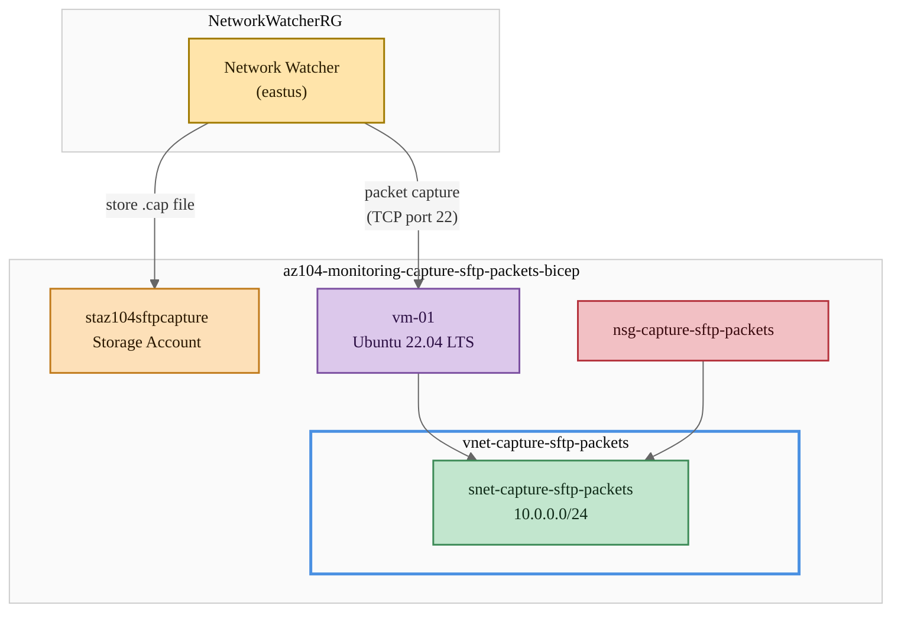
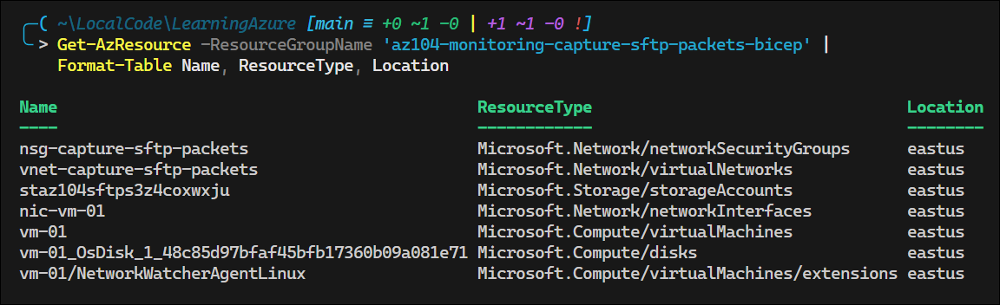
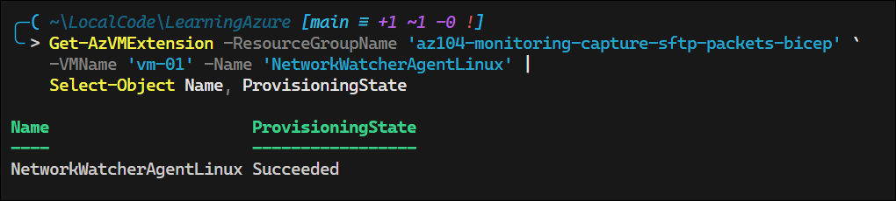
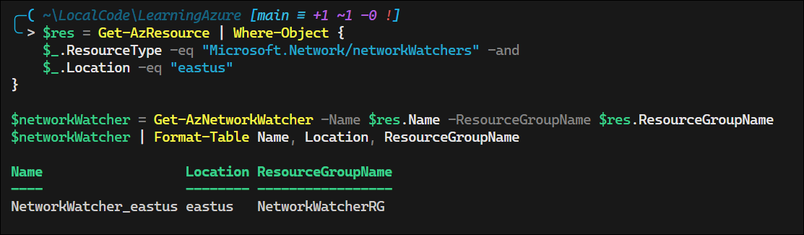
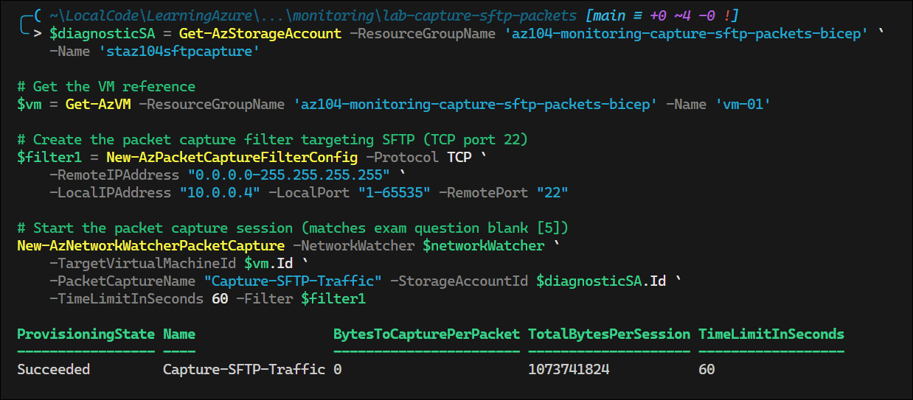
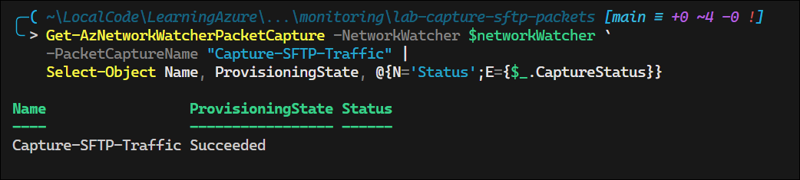
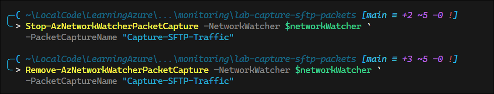
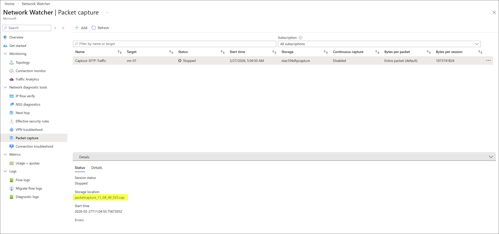

# Lab: Capture SFTP Packets with Network Watcher

## Exam Question

> **Exam**: AZ-104 — Monitoring & Backup

### Capture SFTP Packets with Network Watcher

*Multiple Drop-Down (Fill-in-the-Blank)*

You deploy several virtual machines (VMs) for different purposes. You deploy Network Watcher in the East US region.

You see some odd traffic on a virtual machine named VM01. This machine is making connections to an unknown Secure File Transfer Protocol (SFTP) service.

You need to configure a filter for capturing those packets for the unknown SFTP service. You decide to use PowerShell for this task.

How should you complete the PowerShell script? To answer, select the appropriate options from the drop-down menus.

```powershell
$res = Get-AzResource | Where {$_.ResourceType -eq ___[1]___ -and $_.Location -eq "EastUS"}

$networkWatcher = Get-AzNetworkWatcher -Name $res.Name -ResourceGroupName $res.ResourceGroupName
$diagnosticSA = Get-AzStorageAccount -ResourceGroupName Diagnostics-RG `
  -Name "Diagnostics-Storage"

$filter1 = New-AzPacketCaptureFilterConfig -Protocol TCP `
  -RemoteIPAddress ___[2]___ `
  -LocalIPAddress "10.0.0.3" -LocalPort ___[3]___ -RemotePort ___[4]___

New-AzNetworkWatcherPacketCapture -NetworkWatcher ___[5]___ `
  -TargetVirtualMachineId $vm.Id `
  -PacketCaptureName "Capture SFTP Traffic" -StorageAccountId $diagnosticSA.Id `
  -TimeLimitInSeconds 60 -Filter $filter1
```

Drop-Down Options:

| Blank | Options |
|-------|---------|
| [1] | -Select- / Microsoft.Network/networkWatchers / Microsoft.Network/networkWatchers/packetCaptures |
| [2] | -Select- / "0.0.0.0" / "0.0.0.0-255.255.255.255" |
| [3] | -Select- / "0" / "1-65535" / "20;21" / "20-21" / "22" |
| [4] | -Select- / "0" / "1-65535" / "20;21" / "20-21" / "22" |
| [5] | -Select- / New-AzNetworkWatcher / New-AzNetworkWatcherPacketCapture |

---

## Solution Architecture

This lab deploys a virtual machine (VM01) within a virtual network, along with a diagnostic storage account, to demonstrate Azure Network Watcher packet capture capabilities. The Network Watcher VM extension is installed on the VM to enable packet capture, and PowerShell cmdlets are used to configure capture filters targeting SFTP (TCP port 22) traffic to an unknown remote destination. Captured packets are stored in the diagnostic storage account for analysis.

---

## Architecture Diagram



---

## Lab Objectives

1. Deploy a virtual network with a subnet and NSG using Bicep
2. Deploy a virtual machine with the Network Watcher VM extension
3. Configure a packet capture filter targeting SFTP (TCP port 22) traffic using PowerShell
4. Execute a packet capture session with `New-AzNetworkWatcherPacketCapture`
5. Verify captured packets stored in the diagnostic storage account

---

## Lab Structure

```
lab-capture-sftp-packets/
├── README.md
├── bicep/
│   ├── main.bicep
│   ├── main.bicepparam
│   ├── bicepconfig.json
│   ├── bicep.ps1
│   └── modules/
│       ├── networking.bicep
│       └── compute.bicep
└── validation/
    └── Confirm-SftpPacketCapture.ps1
```

---

## Prerequisites

- Azure subscription with Contributor access
- Azure CLI installed and authenticated
- Azure PowerShell module (`Az`) installed
- PowerShell 7+
- `Use-AzProfile Lab` configured

---

## Deployment

```powershell
# Switch to lab subscription
Use-AzProfile Lab

# Navigate to bicep directory
cd AZ-104/hands-on-labs/monitoring/lab-capture-sftp-packets/bicep

# Validate the template
.\bicep.ps1 validate

# Preview the deployment
.\bicep.ps1 plan

# Deploy the lab
.\bicep.ps1 apply
```

> **Note:** Network Watcher is auto-provisioned by Azure in the `NetworkWatcherRG` resource group when a virtual network is created. The Network Watcher VM extension is deployed on the VM by Bicep to enable packet capture.


---

## Testing the Solution

### Step 1: Verify Deployed Resources

```powershell
# Verify resource group and resources
Get-AzResource -ResourceGroupName 'az104-monitoring-capture-sftp-packets-bicep' |
    Format-Table Name, ResourceType, Location
```



### Step 2: Verify the Network Watcher Extension

```powershell
# Confirm Network Watcher extension is installed on vm-01
Get-AzVMExtension -ResourceGroupName 'az104-monitoring-capture-sftp-packets-bicep' `
    -VMName 'vm-01' -Name 'NetworkWatcherAgentLinux' |
    Select-Object Name, ProvisioningState
```




### Step 3: Get the Network Watcher Instance

```powershell
# Retrieve the Network Watcher for East US (matches exam question blank [1])
$res = Get-AzResource | Where-Object {
    $_.ResourceType -eq "Microsoft.Network/networkWatchers" -and
    $_.Location -eq "eastus"
}

$networkWatcher = Get-AzNetworkWatcher -Name $res.Name -ResourceGroupName $res.ResourceGroupName
$networkWatcher | Format-Table Name, Location, ResourceGroupName
```



### Step 4: Configure and Start Packet Capture

```powershell
# Get the storage account for capture data
$diagnosticSA = Get-AzStorageAccount -ResourceGroupName 'az104-monitoring-capture-sftp-packets-bicep' `
    -Name 'staz104sftpcapture'

# Get the VM reference
$vm = Get-AzVM -ResourceGroupName 'az104-monitoring-capture-sftp-packets-bicep' -Name 'vm-01'

# Create the packet capture filter targeting SFTP (TCP port 22)
$filter1 = New-AzPacketCaptureFilterConfig -Protocol TCP `
    -RemoteIPAddress "0.0.0.0-255.255.255.255" `
    -LocalIPAddress "10.0.0.4" -LocalPort "1-65535" -RemotePort "22"

# Start the packet capture session (matches exam question blank [5])
New-AzNetworkWatcherPacketCapture -NetworkWatcher $networkWatcher `
    -TargetVirtualMachineId $vm.Id `
    -PacketCaptureName "Capture-SFTP-Traffic" -StorageAccountId $diagnosticSA.Id `
    -TimeLimitInSeconds 60 -Filter $filter1
```




### Step 5: Verify Packet Capture Status

```powershell
# Check the capture session status
Get-AzNetworkWatcherPacketCapture -NetworkWatcher $networkWatcher `
    -PacketCaptureName "Capture-SFTP-Traffic" |
    Select-Object Name, ProvisioningState, @{N='Status';E={$_.CaptureStatus}}
```




### Step 6: Stop and Remove Packet Capture

```powershell
# Stop the capture after observation
Stop-AzNetworkWatcherPacketCapture -NetworkWatcher $networkWatcher `
    -PacketCaptureName "Capture-SFTP-Traffic"

# Remove the capture session
Remove-AzNetworkWatcherPacketCapture -NetworkWatcher $networkWatcher `
    -PacketCaptureName "Capture-SFTP-Traffic"
```





---

## Cleanup

Destroy all lab resources within 7 days per governance policy.

```powershell
cd AZ-104/hands-on-labs/monitoring/lab-capture-sftp-packets/bicep

.\bicep.ps1 destroy
```

> **Note:** The deployment stack removes the lab resource group and all managed resources. The `NetworkWatcherRG` resource group is managed by Azure and is not deleted by this stack.

---

## Scenario Analysis

### Correct Answers

| Blank | Correct Value | Reasoning |
|-------|---------------|-----------|
| [1] | `Microsoft.Network/networkWatchers` | The script searches for the Network Watcher resource type, not the packet capture child resource |
| [2] | `"0.0.0.0-255.255.255.255"` | The SFTP service is "unknown," so capture traffic to all remote IP addresses |
| [3] | `"1-65535"` | The local (source) port is an ephemeral port chosen by the OS for outbound connections |
| [4] | `"22"` | SFTP uses SSH protocol on TCP port 22 |
| [5] | `$networkWatcher` | Pass the existing Network Watcher object retrieved by `Get-AzNetworkWatcher` |

### Detailed Explanation

**Blank [1] — Resource Type:** `Get-AzResource` filters by `ResourceType`. The Network Watcher resource type is `Microsoft.Network/networkWatchers`. The option `Microsoft.Network/networkWatchers/packetCaptures` is a child resource type representing individual capture sessions — not the Network Watcher itself.

**Blank [2] — Remote IP Address:** Since the SFTP destination is described as "unknown," the filter must match **any** remote IP. The range `"0.0.0.0-255.255.255.255"` covers the entire IPv4 address space. The value `"0.0.0.0"` represents only the single address `0.0.0.0`, which would not capture traffic to real SFTP servers.

**Blank [3] — Local Port:** VM01 is initiating **outbound** SFTP connections. The operating system assigns an ephemeral (dynamic) source port from the available range. Since we don't know which port the OS will select, we must capture across the full range `"1-65535"`. Common distractors:

- `"22"` — This is the SFTP *destination* port, not the source port
- `"20-21"` or `"20;21"` — These are FTP data/control ports, not SFTP
- `"0"` — Matches no port

**Blank [4] — Remote Port:** SFTP (Secure File Transfer Protocol) runs over SSH on **TCP port 22**. This is the destination port on the remote SFTP server. Common distractors:

- `"20-21"` or `"20;21"` — FTP (not SFTP) uses port 21 for control and port 20 for active data transfer
- `"1-65535"` — Too broad; we know SFTP uses port 22

**Blank [5] — Network Watcher Parameter:** The `-NetworkWatcher` parameter expects a `PSNetworkWatcher` object. The variable `$networkWatcher` was already populated by `Get-AzNetworkWatcher` earlier in the script. The distractors `New-AzNetworkWatcher` (creates a new Network Watcher) and `New-AzNetworkWatcherPacketCapture` (the cmdlet being called) are incorrect — neither returns an object suitable for this parameter in context.

---

## Key Learning Points

1. **SFTP vs. FTP ports** — SFTP runs over SSH on TCP port 22; FTP uses ports 20 (data) and 21 (control). They are distinct protocols despite similar names.
2. **Packet capture requires the Network Watcher VM extension** — The `NetworkWatcherAgentLinux` or `NetworkWatcherAgentWindows` extension must be installed on the target VM before starting a capture.
3. **Network Watcher is auto-provisioned** — Azure creates a Network Watcher in each region when a virtual network is first created in that region's subscription.
4. **Resource type for Network Watcher** is `Microsoft.Network/networkWatchers`, not the child `packetCaptures` type.
5. **Ephemeral (source) ports vs. well-known (destination) ports** — The client OS selects a random source port for outbound connections; the destination port identifies the service (22 for SFTP).
6. **IP range syntax** — `"0.0.0.0-255.255.255.255"` captures all IPs; `"0.0.0.0"` captures only that single address.
7. **Packet captures are stored in Azure Storage** — The `-StorageAccountId` parameter directs capture output to a blob container for later download and analysis.
8. **`New-AzPacketCaptureFilterConfig`** supports Protocol, LocalIPAddress, RemoteIPAddress, LocalPort, and RemotePort to narrow capture scope.

---

## Related AZ-104 Objectives

- **Configure and manage virtual networking** — Configure monitoring for virtual networks (Network Watcher, traffic analytics)
- **Configure and manage virtual networking** — Configure NSGs and service endpoints
- **Monitor and back up Azure resources** — Configure and interpret monitoring for virtual networking

---

## Additional Resources

- [Network Watcher packet capture overview](https://learn.microsoft.com/en-us/azure/network-watcher/packet-capture-overview)
- [Manage packet captures with PowerShell](https://learn.microsoft.com/en-us/azure/network-watcher/packet-capture-vm-powershell)
- [Network Watcher VM extension for Linux](https://learn.microsoft.com/en-us/azure/virtual-machines/extensions/network-watcher-linux)
- [New-AzNetworkWatcherPacketCapture reference](https://learn.microsoft.com/en-us/powershell/module/az.network/new-aznetworkwatcherpacketcapture)
- [New-AzPacketCaptureFilterConfig reference](https://learn.microsoft.com/en-us/powershell/module/az.network/new-azpacketcapturefilterconfig)

---

## Related Labs

▶ Related Lab: [lab-vnet-peering](../../networking/lab-vnet-peering/README.md) — Configure virtual network peering between Azure VNets
