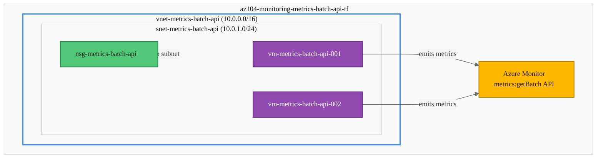

# Lab: Azure Monitor Metrics Batch API

## Exam Question Scenario

You have an Azure subscription that contains virtual machines. You have the following JSON request body for a REST API call:

```json
{
  "resourceids": [
    "/subscriptions/{subscriptionId}/resourceGroups/{rg}/providers/Microsoft.Compute/virtualMachines/vmss-002lsdf4cc9",
    "/subscriptions/{subscriptionId}/resourceGroups/{rg}/providers/Microsoft.Compute/virtualMachines/vmss-003s1187c3h"
  ]
}
```

You need to retrieve multi-dimensional metric definitions and metrics programmatically via APIs.

For each of the following statements, select Yes if the statement is true. Otherwise, select No.

| Statement | Yes | No |
|-----------|-----|----|
| The metrics:getBatch API allows you to prevent throttling and performance issues when querying multiple resources in a single REST request. | ☐ | ☐ |
| Both VMs vmss-002lsdf4cc9 and vmss-003s1187c3h can be spread across multiple Azure regions. | ☐ | ☐ |
| Both VMs vmss-002lsdf4cc9 and vmss-003s1187c3h must be the same resource type. | ☐ | ☐ |

---

## Solution Architecture

This lab deploys two Linux VMs in the same region and resource group. After deployment, the validation script demonstrates the Azure Monitor **metrics:getBatch** REST API — a single POST request that retrieves metrics for multiple resources simultaneously. The lab verifies the API constraints: resources must share the same subscription, region, and resource type.

---

## Architecture Diagram



---

## Lab Objectives

1. Deploy two Azure VMs in the same region to serve as metric sources
2. Retrieve multi-dimensional metric definitions programmatically using `Get-AzMetricDefinition`
3. Query batch metrics for multiple VMs via the `metrics:getBatch` REST API
4. Understand the constraints of batch metric queries (same subscription, region, and resource type)

---

## Lab Structure

```
lab-metrics-batch-api/
├── README.md
├── terraform/
│   ├── main.tf
│   ├── variables.tf
│   ├── outputs.tf
│   ├── providers.tf
│   ├── terraform.tfvars
│   └── modules/
│       ├── networking/
│       │   ├── main.tf
│       │   ├── variables.tf
│       │   └── outputs.tf
│       └── compute/
│           ├── main.tf
│           ├── variables.tf
│           └── outputs.tf
└── validation/
    └── Confirm-MetricsBatchApi.ps1
```

---

## Prerequisites

- Azure subscription with the lab subscription ID (`e091f6e7-031a-4924-97bb-8c983ca5d21a`)
- [Terraform CLI](https://developer.hashicorp.com/terraform/install) >= 1.0
- [Azure PowerShell](https://learn.microsoft.com/en-us/powershell/azure/install-azure-powershell) module (`Az`)
- `Use-AzProfile Lab` configured

---

## Deployment

```bash
cd AZ-104/hands-on-labs/monitoring/lab-metrics-batch-api/terraform
terraform init
terraform validate
terraform plan
terraform apply
```

---

## Testing the Solution

Allow 5–10 minutes after deployment for metrics to populate before running validation.

```powershell
# 1. Verify both VMs are deployed and running
$vms = Get-AzVM -ResourceGroupName 'az104-monitoring-metrics-batch-api-tf'
$vms | Select-Object Name, Location | Format-Table -AutoSize  # Expected: 2 VMs in centralus
```
<!-- Screenshot -->


```powershell
# 2. Retrieve metric definitions for a VM (shows available multi-dimensional metrics)
$vmId = $vms[0].Id
Get-AzMetricDefinition -ResourceId $vmId |
    Where-Object { $_.Dimensions.Count -gt 0 } |
    Select-Object -First 5 -Property @{N='Metric';E={$_.Name.Value}}, @{N='Dimensions';E={($_.Dimensions.Value -join ', ')}} |
    Format-Table -AutoSize
```
<!-- Screenshot -->


```powershell
# 3. Query individual VM CPU metrics (standard approach)
Get-AzMetric -ResourceId $vmId -MetricName 'Percentage CPU' -TimeGrain 00:05:00 -AggregationType Average |
    Select-Object -ExpandProperty Data |
    Where-Object { $null -ne $_.Average } |
    Select-Object -Last 3 TimeStamp, Average
```
<!-- Screenshot -->


```powershell
# 4. Call the metrics:getBatch API for both VMs in a single request
$context = Get-AzContext
$subscriptionId = $context.Subscription.Id
$location = $vms[0].Location
$token = (Get-AzAccessToken -ResourceUrl 'https://metrics.monitor.azure.com').Token

$batchUri = "https://${location}.metrics.monitor.azure.com/subscriptions/${subscriptionId}/metrics:getBatch?api-version=2024-02-01&metricnames=Percentage CPU&metricNamespace=Microsoft.Compute/virtualMachines&timespan=PT1H&interval=PT5M&aggregation=Average"

$body = @{ resourceids = @($vms[0].Id, $vms[1].Id) } | ConvertTo-Json

$headers = @{
    Authorization  = "Bearer $token"
    'Content-Type' = 'application/json'
}

$response = Invoke-RestMethod -Uri $batchUri -Method Post -Headers $headers -Body $body
$response.values | ForEach-Object {
    $vmName = ($_.resourceid -split '/')[-1]
    Write-Host "VM: $vmName - Metrics returned: $($_.value.Count)" -ForegroundColor Green
}
```
<!-- Screenshot -->


```powershell
# 5. Run the full validation script
.\validation\Confirm-MetricsBatchApi.ps1
```
<!-- Screenshot -->


---

## Cleanup

```bash
cd AZ-104/hands-on-labs/monitoring/lab-metrics-batch-api/terraform
terraform destroy
```

> **Reminder:** Destroy lab resources within 7 days per cost governance policy. Track via the `DateCreated` tag.

---

## Scenario Analysis

### Correct Answers

| Statement | Answer | Explanation |
|-----------|--------|-------------|
| The metrics:getBatch API allows you to prevent throttling and performance issues when querying multiple resources in a single REST request. | **Yes** | The batch API is specifically designed to retrieve metrics for multiple resources in a single REST call. This reduces the number of individual API calls, preventing throttling (HTTP 429) and improving performance compared to looping over individual `metrics` endpoints. |
| Both VMs can be spread across multiple Azure regions. | **No** | The `metrics:getBatch` API uses a **regional endpoint** (e.g., `centralus.metrics.monitor.azure.com`). All resources in the request must be located in the same Azure region as the endpoint. Cross-region batch queries are not supported. |
| Both VMs must be the same resource type. | **Yes** | The batch API requires all resources to share the same resource type and metric namespace. You cannot mix `Microsoft.Compute/virtualMachines` with `Microsoft.Storage/storageAccounts` in a single batch request. The `metricNamespace` parameter applies uniformly to all resource IDs. |

### Why Other Combinations Are Incorrect

- Answering **No** to Statement 1 ignores the core purpose of the batch endpoint — reducing throttling by consolidating multiple queries.
- Answering **Yes** to Statement 2 misunderstands the regional nature of the Azure Monitor metrics data plane. Each region has its own metrics endpoint.
- Answering **No** to Statement 3 would imply you can query heterogeneous resource types with a single metric namespace, which the API does not support.

---

## Key Learning Points

1. **metrics:getBatch API** retrieves metrics for multiple resources in a single POST request, reducing API calls and throttling risk
2. **Regional endpoint constraint** — all resources must be in the same Azure region; the batch endpoint URL includes the region name
3. **Same resource type requirement** — all resource IDs in a batch request must share the same `metricNamespace` (e.g., `Microsoft.Compute/virtualMachines`)
4. **Same subscription requirement** — all resources must belong to the same Azure subscription
5. **Multi-dimensional metrics** — Azure Monitor metrics can have dimensions (e.g., per-disk, per-NIC) that enable granular filtering via the API
6. **Get-AzMetricDefinition** lists all available metrics and their dimensions for a resource, useful for discovering queryable metrics before calling the API
7. **Access tokens** — the batch API requires a Bearer token scoped to `https://metrics.monitor.azure.com` (not the standard ARM endpoint)
8. **API version** — use `2024-02-01` or later for the `metrics:getBatch` endpoint

---

## Related AZ-104 Objectives

- **Monitor and Back Up Azure Resources** — Monitor resources by using Azure Monitor
  - Configure and interpret metrics
  - Query and analyze logs by using Azure Monitor
  - Configure monitoring of VMs using Azure Monitor Agent
- **Deploy and Manage Azure Compute Resources** — Create and configure VMs

---

## Additional Resources

- [Azure Monitor Metrics Batch API Reference](https://learn.microsoft.com/en-us/rest/api/monitor/metrics-batch)
- [Azure Monitor Metrics Overview](https://learn.microsoft.com/en-us/azure/azure-monitor/essentials/data-platform-metrics)
- [Multi-dimensional Metrics](https://learn.microsoft.com/en-us/azure/azure-monitor/essentials/metrics-custom-overview#multi-dimensional-metrics)
- [Azure Monitor REST API Throttling](https://learn.microsoft.com/en-us/azure/azure-monitor/essentials/metrics-throttling)

---

## Related Labs

- [Azure Monitor Alert Notification Rate Limits](../lab-alert-notification-rate-limits/README.md) — Understand notification rate limits for alert actions in Azure Monitor
